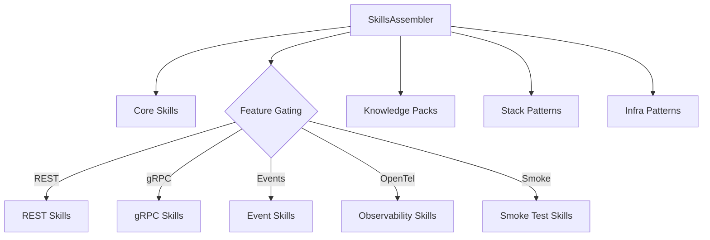

# História: SkillsAssembler

**ID:** STORY-010

## 1. Dependências

| Blocked By | Blocks |
| :--- | :--- |
| STORY-006, STORY-007, STORY-008 | STORY-016 |

## 2. Regras Transversais Aplicáveis

| ID | Título |
| :--- | :--- |
| RULE-001 | Compatibilidade de output |
| RULE-006 | Feature gating |
| RULE-009 | Knowledge pack detection |

## 3. Descrição

Como **desenvolvedor do ia-dev-environment**, eu quero ter o SkillsAssembler migrado para TypeScript, garantindo que a seleção e geração de skills no diretório `.claude/skills/` seja idêntica ao Python.

O SkillsAssembler (285 linhas) seleciona skills condicionalmente baseado em interface types, infrastructure config, testing config, security frameworks, e stack-specific patterns. A detecção de knowledge packs (leitura de SKILL.md) é crítica.

### 3.1 Módulo Python de Origem

- `src/ia_dev_env/assembler/skills.py` (285 linhas)

### 3.2 Módulo TypeScript de Destino

- `src/assembler/skills-assembler.ts`

### 3.3 Seleção de Skills

**Core skills:** Scan recursivo de `skills-templates/core/`

**Conditional skills (feature-gated):**
- Interface-based: REST, gRPC, GraphQL, event handling
- Infrastructure: OpenTel, orchestrator, API gateway
- Testing: Smoke tests, E2E, perf tests, contract tests
- Security: Review skills se security frameworks configurados

**Knowledge packs:** Core list (11 packs via CORE_KNOWLEDGE_PACKS) + data packs (se database/cache != "none")

**Stack patterns:** Framework-specific via `getStackPackName()`

**Infra patterns:** K8s, containers, IaC via `buildInfraPackRules()`

### 3.4 Knowledge Pack Detection

- Lê `SKILL.md` de cada skill
- Busca `user-invocable: false` ou `# Knowledge Pack`
- Classifica como KP se encontrado

## 4. Definições de Qualidade Locais

### DoR Local (Definition of Ready)

- [ ] Módulo Python `skills.py` lido integralmente
- [ ] Domain mappings e skill registry disponíveis
- [ ] Assembler helpers disponíveis

### DoD Local (Definition of Done)

- [ ] Core skills copiados recursivamente
- [ ] Conditional skills selecionados com mesma lógica
- [ ] Knowledge packs incluídos conforme config
- [ ] Detecção de KP via SKILL.md implementada
- [ ] Output idêntico ao Python

### Global Definition of Done (DoD)

- **Cobertura:** ≥ 95% Line Coverage, ≥ 90% Branch Coverage
- **Testes Automatizados:** Unitários + paridade
- **Relatório de Cobertura:** vitest coverage lcov + text
- **Documentação:** JSDoc
- **Persistência:** N/A
- **Performance:** N/A

## 5. Contratos de Dados (Data Contract)

**SkillsAssembler.assemble:**

| Parâmetro | Tipo | Obrigatório | Descrição |
| :--- | :--- | :--- | :--- |
| `config` | `ProjectConfig` | M | Configuração do projeto |
| `outputDir` | `string` | M | Diretório de saída |
| `resourcesDir` | `string` | M | Diretório de resources |
| `engine` | `TemplateEngine` | M | Template engine |
| retorno | `{ files: string[]; warnings: string[] }` | M | Arquivos gerados e avisos |

## 6. Diagramas

### 6.1 Fluxo de Seleção de Skills



## 7. Critérios de Aceite (Gherkin)

```gherkin
Cenario: Core skills sempre incluídos
  DADO que tenho qualquer config válido
  QUANDO executo SkillsAssembler.assemble
  ENTÃO todos os arquivos de skills-templates/core/ estão no output

Cenario: REST skills incluídos quando interface REST presente
  DADO que config tem interfaces [{type: "rest"}]
  QUANDO executo SkillsAssembler.assemble
  ENTÃO skills específicos de REST estão no output

Cenario: Knowledge packs incluídos conforme registry
  DADO que tenho um config válido
  QUANDO executo SkillsAssembler.assemble
  ENTÃO os 11 core knowledge packs estão no output

Cenario: Data packs incluídos quando database configurado
  DADO que config tem database.name "postgresql"
  QUANDO executo SkillsAssembler.assemble
  ENTÃO knowledge packs de dados estão no output

Cenario: Detecção de knowledge pack via SKILL.md
  DADO que um SKILL.md contém "user-invocable: false"
  QUANDO classifico o skill
  ENTÃO é identificado como knowledge pack
```

## 8. Sub-tarefas

- [ ] [Dev] Implementar `SkillsAssembler` classe
- [ ] [Dev] Implementar seleção de core skills (scan recursivo)
- [ ] [Dev] Implementar seleção condicional (interface, infra, testing, security)
- [ ] [Dev] Implementar inclusão de knowledge packs
- [ ] [Dev] Implementar stack patterns e infra patterns
- [ ] [Dev] Implementar detecção de KP via SKILL.md
- [ ] [Test] Unitário: core skills sempre incluídos
- [ ] [Test] Unitário: cada condição de feature gating
- [ ] [Test] Unitário: detecção de knowledge pack
- [ ] [Test] Paridade: comparar output com Python
