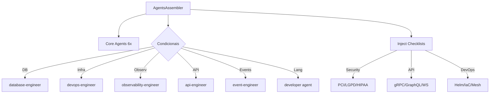

# História: AgentsAssembler

**ID:** STORY-011

## 1. Dependências

| Blocked By | Blocks |
| :--- | :--- |
| STORY-006, STORY-007, STORY-008 | STORY-016 |

## 2. Regras Transversais Aplicáveis

| ID | Título |
| :--- | :--- |
| RULE-001 | Compatibilidade de output |
| RULE-006 | Feature gating |

## 3. Descrição

Como **desenvolvedor do ia-dev-environment**, eu quero ter o AgentsAssembler migrado para TypeScript, garantindo que a geração de agents no diretório `.claude/agents/` seja idêntica ao Python, incluindo a injeção condicional de checklists.

O AgentsAssembler (262 linhas) é notável por sua lógica de injeção de checklists: após copiar os templates base de agents, injeta blocos condicionais de texto em markers específicos baseado em security, API, e DevOps config.

### 3.1 Módulo Python de Origem

- `src/ia_dev_env/assembler/agents.py` (262 linhas)

### 3.2 Módulo TypeScript de Destino

- `src/assembler/agents-assembler.ts`

### 3.3 Seleção de Agents

- **Core agents:** Todos `.md` de `agents-templates/core/` (6 agents)
- **Conditional agents:**
  - Database: `database-engineer` se database != "none"
  - Infra: `devops-engineer` se container/orchestrator/IaC != "none"
  - Observability: `observability-engineer` se observability tool != "none"
  - API: `api-engineer` se REST/gRPC/GraphQL
  - Events: `event-engineer` se event-driven
  - Developer: Agent language-specific (ex: `java-developer`)

### 3.4 Injeção de Checklists

Após copiar templates, injeta checklists condicionais via `injectSection()`:
- **Security:** PCI-DSS, privacy (LGPD/GDPR), HIPAA, SOX — baseado em `security.frameworks`
- **API:** gRPC, GraphQL, WebSocket specifics — baseado em `interfaces`
- **DevOps:** Helm, IaC, service mesh, registry — baseado em `infrastructure`

## 4. Definições de Qualidade Locais

### DoR Local (Definition of Ready)

- [ ] Módulo Python `agents.py` lido integralmente
- [ ] Assembler helpers (STORY-008) com injectSection disponível
- [ ] Domain mappings (STORY-006) disponíveis

### DoD Local (Definition of Done)

- [ ] Core agents copiados
- [ ] Conditional agents selecionados conforme config
- [ ] Checklists injetados nos markers corretos
- [ ] Output idêntico ao Python

### Global Definition of Done (DoD)

- **Cobertura:** ≥ 95% Line Coverage, ≥ 90% Branch Coverage
- **Testes Automatizados:** Unitários + paridade
- **Relatório de Cobertura:** vitest coverage lcov + text
- **Documentação:** JSDoc
- **Persistência:** N/A
- **Performance:** N/A

## 5. Contratos de Dados (Data Contract)

**AgentsAssembler.assemble:**

| Parâmetro | Tipo | Obrigatório | Descrição |
| :--- | :--- | :--- | :--- |
| `config` | `ProjectConfig` | M | Configuração do projeto |
| `outputDir` | `string` | M | Diretório de saída |
| `resourcesDir` | `string` | M | Diretório de resources |
| `engine` | `TemplateEngine` | M | Template engine |
| retorno | `{ files: string[]; warnings: string[] }` | M | Resultados |

## 6. Diagramas

### 6.1 Fluxo de Geração de Agents



## 7. Critérios de Aceite (Gherkin)

```gherkin
Cenario: Core agents sempre incluídos
  DADO que tenho qualquer config válido
  QUANDO executo AgentsAssembler.assemble
  ENTÃO os 6 core agents estão no output

Cenario: Database engineer incluído quando DB configurado
  DADO que config tem database.name "postgresql"
  QUANDO executo AgentsAssembler.assemble
  ENTÃO database-engineer agent está no output

Cenario: Checklist de security injetado
  DADO que config tem security.frameworks ["pci-dss", "lgpd"]
  QUANDO executo AgentsAssembler.assemble
  ENTÃO os agents relevantes contêm checklists de PCI-DSS e LGPD

Cenario: Developer agent language-specific
  DADO que config tem language.name "java"
  QUANDO executo AgentsAssembler.assemble
  ENTÃO existe um java-developer agent no output

Cenario: Event engineer incluído quando event-driven
  DADO que config tem architecture.event_driven true
  QUANDO executo AgentsAssembler.assemble
  ENTÃO event-engineer agent está no output
```

## 8. Sub-tarefas

- [ ] [Dev] Implementar `AgentsAssembler` classe
- [ ] [Dev] Implementar seleção de core agents
- [ ] [Dev] Implementar seleção condicional (database, infra, API, events, developer)
- [ ] [Dev] Implementar injeção de checklists (security, API, DevOps)
- [ ] [Test] Unitário: core agents sempre presentes
- [ ] [Test] Unitário: cada condição de seleção
- [ ] [Test] Unitário: injeção de checklists em markers
- [ ] [Test] Paridade: comparar output com Python
