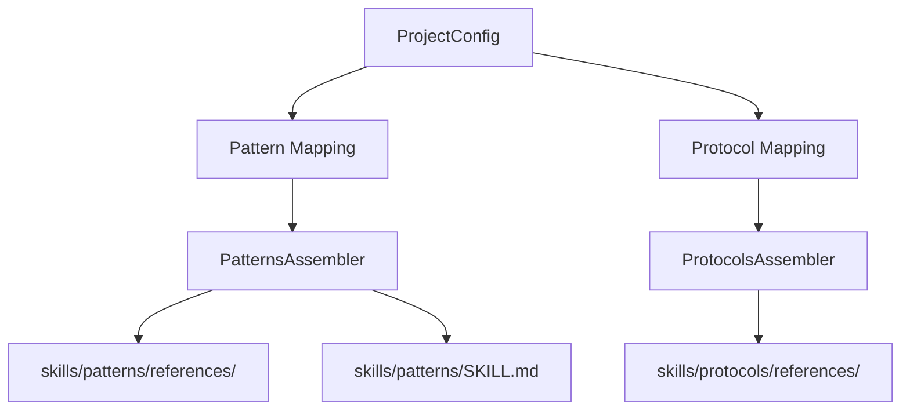

# História: PatternsAssembler + ProtocolsAssembler

**ID:** STORY-012

## 1. Dependências

| Blocked By | Blocks |
| :--- | :--- |
| STORY-006, STORY-008 | STORY-016 |

## 2. Regras Transversais Aplicáveis

| ID | Título |
| :--- | :--- |
| RULE-001 | Compatibilidade de output |
| RULE-006 | Feature gating |
| RULE-013 | Consolidator logic |

## 3. Descrição

Como **desenvolvedor do ia-dev-environment**, eu quero ter os PatternsAssembler e ProtocolsAssembler migrados para TypeScript, garantindo que a seleção de design patterns e protocols produza output idêntico ao Python.

Estes dois assemblers são relativamente menores (116 + 83 linhas) e compartilham padrões similares: seleção baseada em config → cópia de arquivos → consolidação em SKILL.md. Foram agrupados em uma história por afinidade.

### 3.1 Módulos Python de Origem

- `src/ia_dev_env/assembler/patterns_assembler.py` (116 linhas)
- `src/ia_dev_env/assembler/protocols_assembler.py` (83 linhas)

### 3.2 Módulos TypeScript de Destino

- `src/assembler/patterns-assembler.ts`
- `src/assembler/protocols-assembler.ts`

### 3.3 PatternsAssembler

- Seleciona patterns via `selectPatterns()` baseado em architecture style e event_driven
- Copia arquivos .md para `skills/patterns/references/{category}/`
- Consolida todos em `skills/patterns/SKILL.md`

### 3.4 ProtocolsAssembler

- Deriva protocols via `deriveProtocols()` de interface types
- Concatena arquivos de cada protocolo com `---` separator
- Output em `skills/protocols/references/{protocol}-conventions.md`
- Filtragem broker-specific para messaging

## 4. Definições de Qualidade Locais

### DoR Local (Definition of Ready)

- [ ] Módulos Python lidos
- [ ] Pattern mapping e protocol mapping (STORY-006) disponíveis
- [ ] Assembler helpers com consolidator (STORY-008) disponíveis

### DoD Local (Definition of Done)

- [ ] PatternsAssembler seleciona e consolida patterns corretamente
- [ ] ProtocolsAssembler deriva e concatena protocols corretamente
- [ ] Broker-specific filtering funcional
- [ ] Output idêntico ao Python

### Global Definition of Done (DoD)

- **Cobertura:** ≥ 95% Line Coverage, ≥ 90% Branch Coverage
- **Testes Automatizados:** Unitários + paridade
- **Relatório de Cobertura:** vitest coverage lcov + text
- **Documentação:** JSDoc
- **Persistência:** N/A
- **Performance:** N/A

## 5. Contratos de Dados (Data Contract)

**PatternsAssembler.assemble / ProtocolsAssembler.assemble:**

| Parâmetro | Tipo | Obrigatório | Descrição |
| :--- | :--- | :--- | :--- |
| `config` | `ProjectConfig` | M | Configuração do projeto |
| `outputDir` | `string` | M | Diretório de saída |
| `resourcesDir` | `string` | M | Diretório de resources |
| `engine` | `TemplateEngine` | M | Template engine |
| retorno | `{ files: string[]; warnings: string[] }` | M | Resultados |

## 6. Diagramas

### 6.1 Fluxo de Patterns e Protocols



## 7. Critérios de Aceite (Gherkin)

```gherkin
Cenario: Patterns para microservice incluem resilience
  DADO que config tem architecture.style "microservice"
  QUANDO executo PatternsAssembler.assemble
  ENTÃO patterns de resilience estão no output
  E SKILL.md consolidado contém referências a todos os patterns

Cenario: Event-driven patterns adicionados quando event_driven
  DADO que config tem architecture.event_driven true
  QUANDO executo PatternsAssembler.assemble
  ENTÃO patterns de saga, outbox e event sourcing estão presentes

Cenario: Protocols derivados de interfaces
  DADO que config tem interfaces [rest, grpc]
  QUANDO executo ProtocolsAssembler.assemble
  ENTÃO rest-conventions.md e grpc-conventions.md são gerados

Cenario: Broker-specific filtering para messaging
  DADO que config tem interface event-consumer com broker "kafka"
  QUANDO executo ProtocolsAssembler.assemble
  ENTÃO apenas messaging files específicos de kafka são incluídos

Cenario: Universal patterns sempre presentes
  DADO que tenho qualquer config válido
  QUANDO executo PatternsAssembler.assemble
  ENTÃO architectural e data patterns estão no output
```

## 8. Sub-tarefas

- [ ] [Dev] Implementar `PatternsAssembler` com seleção e consolidação
- [ ] [Dev] Implementar `ProtocolsAssembler` com derivação e concatenação
- [ ] [Dev] Implementar filtragem broker-specific
- [ ] [Test] Unitário: patterns por architecture style
- [ ] [Test] Unitário: event-driven patterns
- [ ] [Test] Unitário: protocols por interface type
- [ ] [Test] Unitário: broker-specific filtering
- [ ] [Test] Paridade: comparar output com Python
