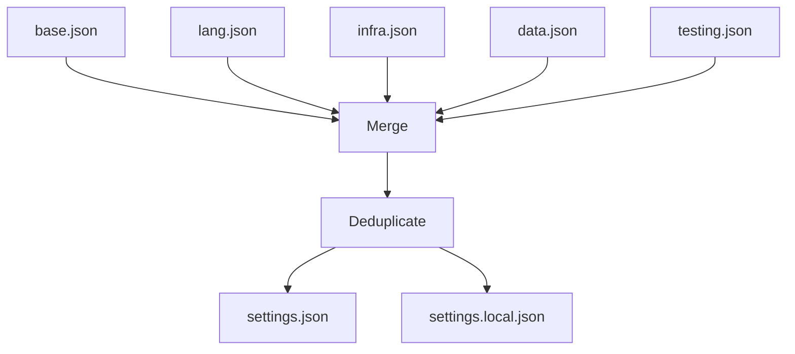

# História: HooksAssembler + SettingsAssembler

**ID:** STORY-013

## 1. Dependências

| Blocked By | Blocks |
| :--- | :--- |
| STORY-006, STORY-008 | STORY-016 |

## 2. Regras Transversais Aplicáveis

| ID | Título |
| :--- | :--- |
| RULE-001 | Compatibilidade de output |
| RULE-006 | Feature gating |

## 3. Descrição

Como **desenvolvedor do ia-dev-environment**, eu quero ter os HooksAssembler e SettingsAssembler migrados para TypeScript, garantindo que hooks de compilação e configurações de permissão sejam geradas identicamente ao Python.

Estes dois assemblers são agrupados por serem complementares: HooksAssembler gera scripts de hook para compiled languages, e SettingsAssembler gera `settings.json` com permissions que incluem referências a esses hooks.

### 3.1 Módulos Python de Origem

- `src/ia_dev_env/assembler/hooks_assembler.py` (48 linhas)
- `src/ia_dev_env/assembler/settings_assembler.py` (175 linhas)

### 3.2 Módulos TypeScript de Destino

- `src/assembler/hooks-assembler.ts`
- `src/assembler/settings-assembler.ts`

### 3.3 HooksAssembler

- Maps (language, build_tool) → hook template directory via `getHookTemplateKey()`
- Apenas compiled languages (Java, Kotlin, C#, Rust) geram hooks
- Copia `post-compile-check.sh` para `.claude/hooks/`
- Marca como executável (chmod +x equivalente via `fs.chmod`)

### 3.4 SettingsAssembler

**Coleta de permissions de múltiplas fontes JSON:**
1. Base: `settings-templates/base.json`
2. Language-specific: via `getSettingsLangKey()` → JSON correspondente
3. Infrastructure: Docker/Podman, Kubernetes, Docker Compose
4. Data: Database e cache specific via `getDatabaseSettingsKey()`, `getCacheSettingsKey()`
5. Testing: Newman testing se smoke_tests habilitado

**Output:**
- `settings.json` — Merged + deduplicated permissions + hooks section (compiled languages)
- `settings.local.json` — Template vazio para overrides locais

## 4. Definições de Qualidade Locais

### DoR Local (Definition of Ready)

- [ ] Módulos Python lidos
- [ ] Stack mapping helpers (STORY-006) disponíveis
- [ ] Assembler helpers (STORY-008) disponíveis

### DoD Local (Definition of Done)

- [ ] HooksAssembler copia hooks para compiled languages apenas
- [ ] Arquivo hook marcado como executável
- [ ] SettingsAssembler coleta e merge permissions de todas as fontes
- [ ] Deduplicação de permissions funcional
- [ ] settings.json e settings.local.json gerados corretamente

### Global Definition of Done (DoD)

- **Cobertura:** ≥ 95% Line Coverage, ≥ 90% Branch Coverage
- **Testes Automatizados:** Unitários + paridade
- **Relatório de Cobertura:** vitest coverage lcov + text
- **Documentação:** JSDoc
- **Persistência:** N/A
- **Performance:** N/A

## 5. Contratos de Dados (Data Contract)

**settings.json (output):**

| Campo | Tipo | Descrição |
| :--- | :--- | :--- |
| `permissions` | `string[]` | Lista deduplicated de permissions |
| `hooks` | `object \| undefined` | Seção hooks para compiled languages |

## 6. Diagramas

### 6.1 Fluxo de Settings Assembly



## 7. Critérios de Aceite (Gherkin)

```gherkin
Cenario: Hook gerado para Java com Maven
  DADO que config tem language "java" e build_tool "maven"
  QUANDO executo HooksAssembler.assemble
  ENTÃO post-compile-check.sh é copiado para hooks/
  E o arquivo tem permissão de execução

Cenario: Nenhum hook para Python
  DADO que config tem language "python"
  QUANDO executo HooksAssembler.assemble
  ENTÃO nenhum arquivo é gerado em hooks/

Cenario: Settings merge de múltiplas fontes
  DADO que config tem language "java", container "docker", database "postgresql"
  QUANDO executo SettingsAssembler.assemble
  ENTÃO settings.json contém permissions de base + java + docker + postgresql
  E não há duplicatas

Cenario: Settings local template gerado
  DADO que tenho qualquer config válido
  QUANDO executo SettingsAssembler.assemble
  ENTÃO settings.local.json é gerado como template vazio

Cenario: Hooks section em settings para compiled languages
  DADO que config tem language "java"
  QUANDO executo SettingsAssembler.assemble
  ENTÃO settings.json contém seção "hooks"
```

## 8. Sub-tarefas

- [ ] [Dev] Implementar `HooksAssembler` com hook template mapping
- [ ] [Dev] Implementar chmod +x via fs.chmod
- [ ] [Dev] Implementar `SettingsAssembler` com coleta de permissions
- [ ] [Dev] Implementar merge e deduplicação de permissions
- [ ] [Dev] Gerar settings.json e settings.local.json
- [ ] [Test] Unitário: hooks para cada compiled language
- [ ] [Test] Unitário: sem hooks para interpreted languages
- [ ] [Test] Unitário: settings merge com cada fonte
- [ ] [Test] Paridade: comparar output com Python
