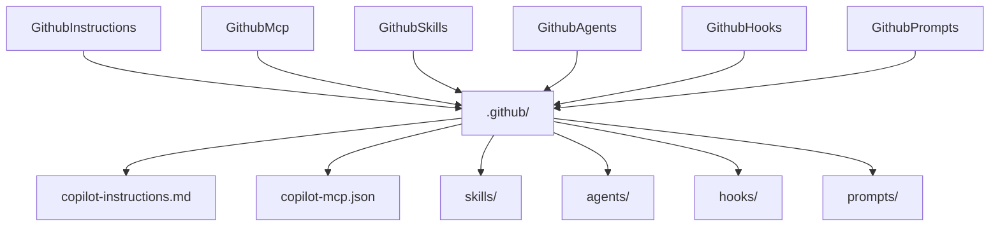

# História: GitHub Assemblers (Instructions, MCP, Skills, Agents, Hooks, Prompts)

**ID:** STORY-014

## 1. Dependências

| Blocked By | Blocks |
| :--- | :--- |
| STORY-005, STORY-006, STORY-008 | STORY-016 |

## 2. Regras Transversais Aplicáveis

| ID | Título |
| :--- | :--- |
| RULE-001 | Compatibilidade de output |
| RULE-005 | Placeholder replacement |
| RULE-006 | Feature gating |
| RULE-007 | Template engine config |

## 3. Descrição

Como **desenvolvedor do ia-dev-environment**, eu quero ter os 6 GitHub Assemblers migrados para TypeScript, garantindo que a geração de artefatos `.github/` para GitHub Copilot seja idêntica ao Python.

Estes 6 assemblers geram artefatos para integração com GitHub Copilot: instructions, MCP config, skills, agents, hooks e prompts. São agrupados em uma única história por compartilharem o mesmo diretório de output e padrões similares.

### 3.1 Módulos Python de Origem

| Módulo | Linhas | Output |
| :--- | :--- | :--- |
| `github_instructions_assembler.py` | 156 | `.github/copilot-instructions.md` + contextuais |
| `github_mcp_assembler.py` | 64 | `.github/copilot-mcp.json` |
| `github_skills_assembler.py` | 163 | `.github/skills/*.md` |
| `github_agents_assembler.py` | 200 | `.github/agents/*.agent.md` |
| `github_hooks_assembler.py` | 57 | `.github/hooks/*.json` |
| `github_prompts_assembler.py` | 61 | `.github/prompts/*.prompt.md` |

### 3.2 Módulos TypeScript de Destino

- `src/assembler/github-instructions-assembler.ts`
- `src/assembler/github-mcp-assembler.ts`
- `src/assembler/github-skills-assembler.ts`
- `src/assembler/github-agents-assembler.ts`
- `src/assembler/github-hooks-assembler.ts`
- `src/assembler/github-prompts-assembler.ts`

### 3.3 GithubInstructionsAssembler

- Global `copilot-instructions.md` com project identity + constraints
- Contextuais: domain, coding-standards, architecture, quality-gates
- Usa Nunjucks para renderização de templates

### 3.4 GithubMcpAssembler

- Gera `copilot-mcp.json` somente se `config.mcp.servers` não vazio
- Valida que env vars usam formato `$VARIABLE` (warns on literals)
- Output: `{mcpServers: {id: {url, capabilities, env}}}`

### 3.5 GithubSkillsAssembler

- 7 grupos: story, dev, review, testing, infrastructure, knowledge-packs, git-troubleshooting
- Filtragem condicional de infra skills por config

### 3.6 GithubAgentsAssembler

- Core + conditional (DevOps, API, Events, Developer)
- Mesma lógica do AgentsAssembler mas para formato GitHub

### 3.7 GithubHooksAssembler

- 3 templates: post-compile-check.json, pre-commit-lint.json, session-context-loader.json

### 3.8 GithubPromptsAssembler

- 4 prompts Jinja2: new-feature, decompose-spec, code-review, troubleshoot
- Renderizados com contexto do projeto

## 4. Definições de Qualidade Locais

### DoR Local (Definition of Ready)

- [ ] Todos os 6 módulos Python lidos
- [ ] Template engine (STORY-005) disponível
- [ ] Domain mappings (STORY-006) disponíveis
- [ ] Assembler helpers (STORY-008) disponíveis

### DoD Local (Definition of Done)

- [ ] Todos os 6 assemblers implementados
- [ ] GithubMcpAssembler valida formato $VARIABLE
- [ ] GithubSkillsAssembler filtra infra skills condicionalmente
- [ ] GithubPromptsAssembler renderiza templates com Nunjucks
- [ ] Output idêntico ao Python

### Global Definition of Done (DoD)

- **Cobertura:** ≥ 95% Line Coverage, ≥ 90% Branch Coverage
- **Testes Automatizados:** Unitários + paridade
- **Relatório de Cobertura:** vitest coverage lcov + text
- **Documentação:** JSDoc
- **Persistência:** N/A
- **Performance:** N/A

## 5. Contratos de Dados (Data Contract)

**copilot-mcp.json:**

| Campo | Tipo | Descrição |
| :--- | :--- | :--- |
| `mcpServers` | `Record<string, McpServerEntry>` | Map de server id → config |
| `McpServerEntry.url` | `string` | URL do MCP server |
| `McpServerEntry.capabilities` | `string[]` | Lista de capabilities |
| `McpServerEntry.env` | `Record<string, string>` | Env vars (devem usar $VAR) |

## 6. Diagramas

### 6.1 Organização dos GitHub Assemblers



## 7. Critérios de Aceite (Gherkin)

```gherkin
Cenario: Copilot instructions geradas com stack info
  DADO que tenho um config com project_name e stack completo
  QUANDO executo GithubInstructionsAssembler.assemble
  ENTÃO copilot-instructions.md contém tabela de stack
  E instructions contextuais são geradas

Cenario: MCP config gerado quando servers configurados
  DADO que config tem mcp.servers com 2 entries
  QUANDO executo GithubMcpAssembler.assemble
  ENTÃO copilot-mcp.json é gerado com 2 servers

Cenario: MCP warning para env var literal
  DADO que config tem mcp server com env "API_KEY": "literal-value"
  QUANDO executo GithubMcpAssembler.assemble
  ENTÃO um warning é emitido sobre usar $VARIABLE format

Cenario: GitHub skills filtram infra por config
  DADO que config tem orchestrator "none"
  QUANDO executo GithubSkillsAssembler.assemble
  ENTÃO skills de K8s deployment NÃO estão no output

Cenario: GitHub prompts renderizados com Nunjucks
  DADO que tenho um config válido
  QUANDO executo GithubPromptsAssembler.assemble
  ENTÃO 4 prompt files são gerados em prompts/
  E contêm valores do projeto (não placeholders crus)

Cenario: GitHub hooks templates copiados
  DADO que tenho qualquer config válido
  QUANDO executo GithubHooksAssembler.assemble
  ENTÃO 3 arquivos JSON são copiados para hooks/
```

## 8. Sub-tarefas

- [ ] [Dev] Implementar `GithubInstructionsAssembler`
- [ ] [Dev] Implementar `GithubMcpAssembler` com validação de $VARIABLE
- [ ] [Dev] Implementar `GithubSkillsAssembler` com filtragem condicional
- [ ] [Dev] Implementar `GithubAgentsAssembler` com seleção condicional
- [ ] [Dev] Implementar `GithubHooksAssembler`
- [ ] [Dev] Implementar `GithubPromptsAssembler` com renderização Nunjucks
- [ ] [Test] Unitário: cada assembler individualmente
- [ ] [Test] Unitário: MCP env var validation
- [ ] [Test] Unitário: skills filtering por config
- [ ] [Test] Paridade: comparar output de cada assembler com Python
