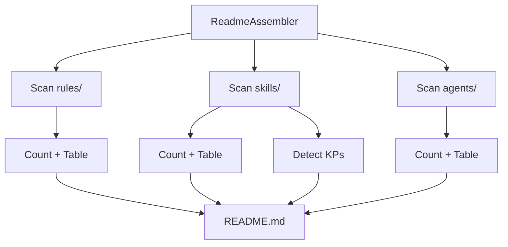

# História: ReadmeAssembler

**ID:** STORY-015

## 1. Dependências

| Blocked By | Blocks |
| :--- | :--- |
| STORY-005, STORY-008 | STORY-016 |

## 2. Regras Transversais Aplicáveis

| ID | Título |
| :--- | :--- |
| RULE-001 | Compatibilidade de output |
| RULE-005 | Placeholder replacement |
| RULE-009 | Knowledge pack detection |

## 3. Descrição

Como **desenvolvedor do ia-dev-environment**, eu quero ter o ReadmeAssembler migrado para TypeScript, garantindo que a geração do README.md com contagens, tabelas de mapping e estrutura de documentação seja idêntica ao Python.

O ReadmeAssembler (431 linhas) é o segundo maior assembler. Ele analisa os arquivos gerados pelos outros 13 assemblers para produzir um README completo com contagens, tabelas de rules/skills/agents/knowledge-packs, e uma estrutura de documentação formatada.

### 3.1 Módulo Python de Origem

- `src/ia_dev_env/assembler/readme_assembler.py` (431 linhas)

### 3.2 Módulo TypeScript de Destino

- `src/assembler/readme-assembler.ts`

### 3.3 Funcionalidades

**Modos de output:**
- **Full README:** Se template existe, constrói a partir de template com placeholders
- **Minimal README:** Fallback com estrutura básica e tips

**Geração dinâmica de conteúdo:**
- Contagem de rules, skills, agents, knowledge packs
- Tabelas de mapping (nome → descrição)
- Extração de numeração de arquivos (ex: `01-project-identity.md` → `01`)
- Seção de hooks
- Seção de settings
- Resumo de geração com breakdown por componente

**Knowledge pack detection:** Lê `SKILL.md` buscando `user-invocable: false` ou `# Knowledge Pack`

## 4. Definições de Qualidade Locais

### DoR Local (Definition of Ready)

- [ ] Módulo Python `readme_assembler.py` lido integralmente (431 linhas)
- [ ] Template engine (STORY-005) disponível
- [ ] Assembler helpers (STORY-008) disponíveis

### DoD Local (Definition of Done)

- [ ] Full e minimal README modes implementados
- [ ] Contagens de rules/skills/agents/KPs corretas
- [ ] Tabelas de mapping geradas corretamente
- [ ] Knowledge pack detection via SKILL.md funcional
- [ ] Output idêntico ao Python

### Global Definition of Done (DoD)

- **Cobertura:** ≥ 95% Line Coverage, ≥ 90% Branch Coverage
- **Testes Automatizados:** Unitários + paridade
- **Relatório de Cobertura:** vitest coverage lcov + text
- **Documentação:** JSDoc
- **Persistência:** N/A
- **Performance:** N/A

## 5. Contratos de Dados (Data Contract)

**ReadmeAssembler.assemble:**

| Parâmetro | Tipo | Obrigatório | Descrição |
| :--- | :--- | :--- | :--- |
| `config` | `ProjectConfig` | M | Configuração do projeto |
| `outputDir` | `string` | M | Diretório onde outros assemblers já geraram |
| `resourcesDir` | `string` | M | Diretório de resources |
| `engine` | `TemplateEngine` | M | Template engine |
| retorno | `{ files: string[]; warnings: string[] }` | M | Resultados |

## 6. Diagramas

### 6.1 Fluxo de Geração de README



## 7. Critérios de Aceite (Gherkin)

```gherkin
Cenario: README com contagens corretas
  DADO que os assemblers anteriores geraram 8 rules, 15 skills, 6 agents
  QUANDO executo ReadmeAssembler.assemble
  ENTÃO README.md contém "8 rules", "15 skills", "6 agents"

Cenario: Tabela de rules no README
  DADO que existem rules em rules/ com nomes formatados
  QUANDO executo ReadmeAssembler.assemble
  ENTÃO README.md contém tabela com nome e descrição de cada rule

Cenario: Detecção de knowledge packs no README
  DADO que existem skills com SKILL.md contendo "user-invocable: false"
  QUANDO executo ReadmeAssembler.assemble
  ENTÃO README.md lista esses skills como knowledge packs

Cenario: Minimal README quando template não existe
  DADO que o template de README não existe no resources
  QUANDO executo ReadmeAssembler.assemble
  ENTÃO um README minimal é gerado com estrutura básica

Cenario: Resumo de geração no README
  DADO que todos os assemblers geraram seus artefatos
  QUANDO executo ReadmeAssembler.assemble
  ENTÃO README.md contém seção de resumo com breakdown por componente
```

## 8. Sub-tarefas

- [ ] [Dev] Implementar `ReadmeAssembler` classe
- [ ] [Dev] Implementar scan e contagem de rules/skills/agents
- [ ] [Dev] Implementar geração de tabelas de mapping
- [ ] [Dev] Implementar knowledge pack detection via SKILL.md
- [ ] [Dev] Implementar full README mode com template
- [ ] [Dev] Implementar minimal README fallback
- [ ] [Dev] Implementar resumo de geração
- [ ] [Test] Unitário: contagens corretas
- [ ] [Test] Unitário: KP detection
- [ ] [Test] Unitário: full vs minimal mode
- [ ] [Test] Paridade: comparar README com Python
