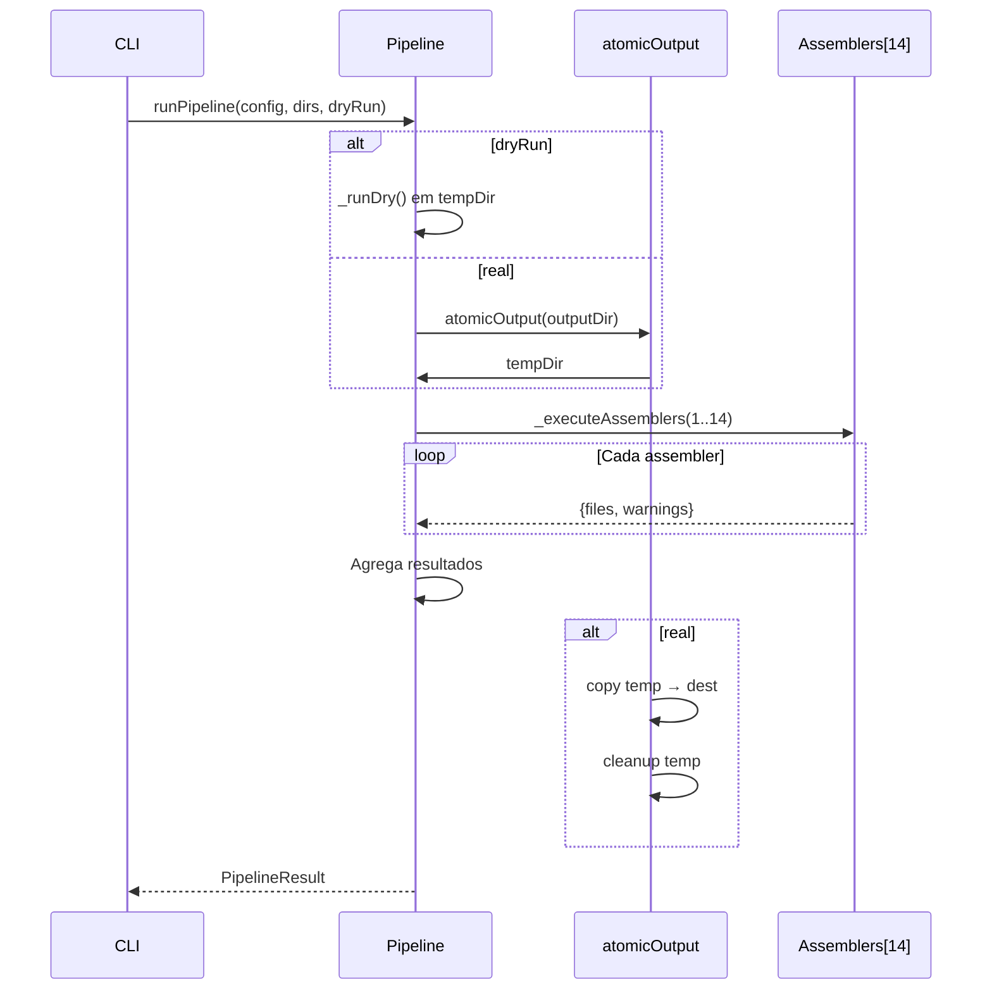

# História: Pipeline Orchestrator

**ID:** STORY-016

## 1. Dependências

| Blocked By | Blocks |
| :--- | :--- |
| STORY-002, STORY-009, STORY-010, STORY-011, STORY-012, STORY-013, STORY-014, STORY-015 | STORY-018 |

## 2. Regras Transversais Aplicáveis

| ID | Título |
| :--- | :--- |
| RULE-001 | Compatibilidade de output |
| RULE-004 | Atomic output |
| RULE-008 | Assembler ordering |

## 3. Descrição

Como **desenvolvedor do ia-dev-environment**, eu quero ter o pipeline orchestrator migrado para TypeScript, garantindo que a execução sequencial dos 14 assemblers, escrita atômica e dry-run funcionem identicamente ao Python.

O pipeline orchestrator é o módulo que integra todos os assemblers. Ele define a ordem de execução (14 assemblers fixos), gerencia atomic output, implementa dry-run, mede tempo de execução, e coleta resultados agregados.

### 3.1 Módulo Python de Origem

- `src/ia_dev_env/assembler/__init__.py`

### 3.2 Módulo TypeScript de Destino

- `src/assembler/index.ts`

### 3.3 Funções

- `runPipeline(config, resourcesDir, outputDir, dryRun)` → `PipelineResult`
- `_runReal(config, resourcesDir, outputDir)` → executa com `atomicOutput()`
- `_runDry(config, resourcesDir)` → executa em temp dir, descarta
- `_buildAssemblers(resourcesDir)` → cria lista ordenada de 14 assemblers
- `_executeAssemblers(assemblers, config, outputDir, resourcesDir, engine)` → executa sequencialmente

### 3.4 Ordem dos 14 Assemblers (RULE-008)

1. RulesAssembler
2. SkillsAssembler
3. AgentsAssembler
4. PatternsAssembler
5. ProtocolsAssembler
6. HooksAssembler
7. SettingsAssembler
8. GithubInstructionsAssembler
9. GithubMcpAssembler
10. GithubSkillsAssembler
11. GithubAgentsAssembler
12. GithubHooksAssembler
13. GithubPromptsAssembler
14. ReadmeAssembler

### 3.5 Assinaturas Especiais

- SkillsAssembler e AgentsAssembler recebem `resourcesDir` como parâmetro adicional
- Todos retornam `{ files: string[]; warnings: string[] }`

### 3.6 Medição de Tempo

- `performance.now()` ou `Date.now()` para medir `duration_ms`

## 4. Definições de Qualidade Locais

### DoR Local (Definition of Ready)

- [ ] Todos os 14 assemblers (STORY-009 a STORY-015) implementados
- [ ] Utils com atomicOutput (STORY-002) disponível
- [ ] PipelineResult model (STORY-003) disponível

### DoD Local (Definition of Done)

- [ ] runPipeline executa 14 assemblers na ordem correta
- [ ] Atomic output via temp dir funcional
- [ ] Dry-run executa sem efeitos colaterais
- [ ] PipelineResult com files agregados, warnings e duration_ms
- [ ] Output idêntico ao Python

### Global Definition of Done (DoD)

- **Cobertura:** ≥ 95% Line Coverage, ≥ 90% Branch Coverage
- **Testes Automatizados:** Unitários + integração
- **Relatório de Cobertura:** vitest coverage lcov + text
- **Documentação:** JSDoc
- **Persistência:** N/A
- **Performance:** ≤ 2× tempo do Python

## 5. Contratos de Dados (Data Contract)

**runPipeline:**

| Parâmetro | Tipo | Obrigatório | Descrição |
| :--- | :--- | :--- | :--- |
| `config` | `ProjectConfig` | M | Configuração do projeto |
| `resourcesDir` | `string` | M | Diretório de resources |
| `outputDir` | `string` | M | Diretório de saída |
| `dryRun` | `boolean` | M | Modo dry-run |
| retorno | `PipelineResult` | M | Resultado agregado |

**PipelineResult:**

| Campo | Tipo | Descrição |
| :--- | :--- | :--- |
| `success` | `boolean` | Pipeline executou sem erros |
| `outputDir` | `string` | Diretório de saída |
| `filesGenerated` | `string[]` | Lista de todos os arquivos gerados |
| `warnings` | `string[]` | Avisos agregados de todos os assemblers |
| `durationMs` | `number` | Tempo de execução em ms |

## 6. Diagramas

### 6.1 Fluxo do Pipeline



## 7. Critérios de Aceite (Gherkin)

```gherkin
Cenario: Pipeline executa 14 assemblers na ordem correta
  DADO que tenho um config válido e resourcesDir
  QUANDO executo runPipeline em modo real
  ENTÃO os 14 assemblers são executados na ordem definida
  E PipelineResult.success é true
  E filesGenerated contém arquivos de todos os assemblers

Cenario: Dry-run não altera filesystem
  DADO que tenho um config válido
  QUANDO executo runPipeline com dryRun=true
  ENTÃO nenhum arquivo é criado no outputDir
  E PipelineResult contém lista de arquivos que seriam gerados
  E warnings contém indicação de dry-run

Cenario: Atomic output protege contra falha parcial
  DADO que um assembler falha durante execução
  QUANDO o pipeline é abortado
  ENTÃO o outputDir não contém arquivos parciais
  E o temp dir é limpo

Cenario: Duration medida corretamente
  DADO que tenho um config válido
  QUANDO executo runPipeline
  ENTÃO PipelineResult.durationMs é um número positivo

Cenario: Warnings agregados de múltiplos assemblers
  DADO que 2 assemblers emitem warnings
  QUANDO o pipeline completa
  ENTÃO PipelineResult.warnings contém warnings de ambos
```

## 8. Sub-tarefas

- [ ] [Dev] Implementar `runPipeline` com lógica de real vs dry-run
- [ ] [Dev] Implementar `_buildAssemblers` com lista ordenada de 14
- [ ] [Dev] Implementar `_executeAssemblers` com execução sequencial
- [ ] [Dev] Integrar `atomicOutput` para modo real
- [ ] [Dev] Implementar medição de `durationMs`
- [ ] [Dev] Agregar files e warnings de todos os assemblers
- [ ] [Test] Unitário: ordem de execução dos assemblers
- [ ] [Test] Unitário: dry-run não altera filesystem
- [ ] [Test] Unitário: atomic output com falha simulada
- [ ] [Test] Integração: pipeline completo com config real
