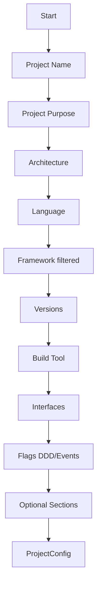

# História: Interactive Mode

**ID:** STORY-017

## 1. Dependências

| Blocked By | Blocks |
| :--- | :--- |
| STORY-003, STORY-004 | STORY-018 |

## 2. Regras Transversais Aplicáveis

| ID | Título |
| :--- | :--- |
| RULE-010 | Interactive mode choices |

## 3. Descrição

Como **desenvolvedor do ia-dev-environment**, eu quero ter o modo interativo migrado para TypeScript usando `inquirer`, garantindo que os mesmos prompts, choices e ordem de coleta de dados sejam preservados.

O interactive mode (Python usa `click.prompt` e `click.confirm`) coleta todas as informações de configuração via CLI interativa quando o usuário não fornece um arquivo YAML. A migração deve usar `inquirer` (ou lib similar) para o mesmo fluxo.

### 3.1 Módulo Python de Origem

- `src/ia_dev_env/interactive.py`

### 3.2 Módulo TypeScript de Destino

- `src/interactive.ts`
- Dependência npm: `inquirer` (ou `@inquirer/prompts`)

### 3.3 Choices Hardcoded (RULE-010)

**Architecture:** library, microservice, monolith

**Language:** python, java, go, kotlin, typescript, rust

**Interface:** rest, grpc, cli, event-consumer, event-producer

**Build tool:** pip, maven, gradle, go, cargo, npm

**Framework (por linguagem):**
- python → [fastapi, click, django, flask]
- java → [quarkus, spring-boot]
- go → [gin]
- kotlin → [ktor]
- typescript → [nestjs]
- rust → [axum]

### 3.4 Fluxo de Coleta

1. Project name (text input)
2. Project purpose (text input)
3. Architecture style (select)
4. Language (select)
5. Framework (select, filtrado por language)
6. Language version (text input)
7. Framework version (text input)
8. Build tool (select)
9. Interfaces (multi-select)
10. Domain-driven? (confirm, default false)
11. Event-driven? (confirm, default false)
12. Seções opcionais: data, infrastructure, security, testing

### 3.5 Output

- `runInteractive()` retorna `ProjectConfig` construído a partir dos inputs

## 4. Definições de Qualidade Locais

### DoR Local (Definition of Ready)

- [ ] Módulo Python `interactive.py` lido
- [ ] Models (STORY-003) disponíveis
- [ ] Config loader (STORY-004) disponível para referência de structure

### DoD Local (Definition of Done)

- [ ] Todos os prompts implementados com mesmos choices
- [ ] Mesma ordem de coleta
- [ ] Framework filtrado por language
- [ ] ProjectConfig construído corretamente a partir dos inputs
- [ ] Testes com mocks de input

### Global Definition of Done (DoD)

- **Cobertura:** ≥ 95% Line Coverage, ≥ 90% Branch Coverage
- **Testes Automatizados:** Unitários com mocks de stdin
- **Relatório de Cobertura:** vitest coverage lcov + text
- **Documentação:** JSDoc
- **Persistência:** N/A
- **Performance:** N/A

## 5. Contratos de Dados (Data Contract)

**runInteractive:**

| Parâmetro | Tipo | Obrigatório | Descrição |
| :--- | :--- | :--- | :--- |
| retorno | `ProjectConfig` | M | Config construído via prompts |

## 6. Diagramas

### 6.1 Fluxo Interativo



## 7. Critérios de Aceite (Gherkin)

```gherkin
Cenario: Fluxo interativo completo produz ProjectConfig
  DADO que o usuário fornece inputs válidos para todos os prompts
  QUANDO executo runInteractive()
  ENTÃO um ProjectConfig é retornado com todos os campos preenchidos

Cenario: Framework filtrado por language
  DADO que o usuário selecionou language "python"
  QUANDO o prompt de framework é exibido
  ENTÃO apenas [fastapi, click, django, flask] são oferecidos

Cenario: Choices de architecture são exatos
  DADO que o prompt de architecture é exibido
  QUANDO verifico as opções
  ENTÃO são exatamente [library, microservice, monolith]

Cenario: Seções opcionais com defaults
  DADO que o usuário não configura seções opcionais
  QUANDO o ProjectConfig é construído
  ENTÃO data, infrastructure, security e testing usam defaults

Cenario: Event-driven flag com default false
  DADO que o prompt de event_driven é exibido
  QUANDO o usuário aceita o default
  ENTÃO event_driven é false
```

## 8. Sub-tarefas

- [ ] [Dev] Implementar `runInteractive()` com inquirer
- [ ] [Dev] Implementar todos os prompts com choices hardcoded
- [ ] [Dev] Implementar filtragem de framework por language
- [ ] [Dev] Construir ProjectConfig a partir dos inputs coletados
- [ ] [Test] Unitário: cada prompt retorna valores esperados (mock stdin)
- [ ] [Test] Unitário: filtragem de framework por language
- [ ] [Test] Unitário: ProjectConfig construído com todos os campos
