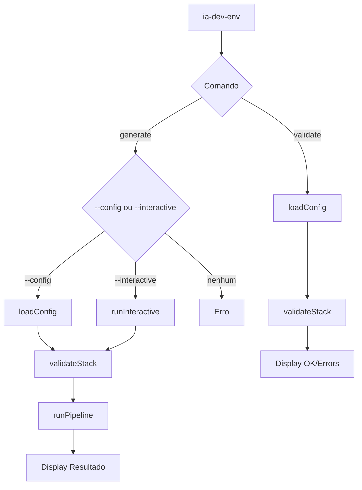

# História: CLI Entry Point

**ID:** STORY-018

## 1. Dependências

| Blocked By | Blocks |
| :--- | :--- |
| STORY-004, STORY-016, STORY-017 | STORY-019 |

## 2. Regras Transversais Aplicáveis

| ID | Título |
| :--- | :--- |
| RULE-015 | CLI interface idêntica |
| RULE-003 | Validação de paths |

## 3. Descrição

Como **desenvolvedor do ia-dev-environment**, eu quero ter o CLI entry point migrado para TypeScript usando `commander`, garantindo que os mesmos comandos, opções, flags e comportamento de output sejam preservados.

O CLI é a interface pública do projeto. Deve manter compatibilidade exata com a versão Python: mesmos nomes de comando, mesmas flags, mesma tabela de resultado, mesma exclusão mútua entre `--config` e `--interactive`.

### 3.1 Módulo Python de Origem

- `src/ia_dev_env/__main__.py` (209 linhas)

### 3.2 Módulos TypeScript de Destino

- `src/cli.ts` — definição de comandos e opções
- `src/index.ts` — entry point com shebang

### 3.3 Comandos

**`ia-dev-env generate`:**
- `--config / -c` (string, file must exist) — Caminho para YAML
- `--interactive / -i` (flag) — Modo interativo
- `--output-dir / -o` (string, default ".") — Diretório de saída
- `--resources-dir / -s` (string, dir must exist) — Diretório de resources
- `--verbose / -v` (flag) — Logging verbose
- `--dry-run` (flag) — Preview sem escrita
- `--config` e `--interactive` mutuamente exclusivos
- Sem nenhum: erro

**`ia-dev-env validate`:**
- `--config / -c` (string, required, file must exist) — Caminho para YAML
- `--verbose / -v` (flag)

### 3.4 Display de Resultado

- Tabela de contagem por componente: Rules, Skills, Knowledge Packs, Agents, Hooks, Settings, README, GitHub
- `_classifyFiles()` — analisa partes do path e nome para categorizar
- Knowledge pack detection: lê SKILL.md procurando `user-invocable: false` ou `# Knowledge Pack`

### 3.5 Error Handling

- `ConfigValidationError` → mensagem amigável + exit code 1
- `PipelineError` → mensagem amigável + exit code 1
- Exceções genéricas → stack trace se verbose

## 4. Definições de Qualidade Locais

### DoR Local (Definition of Ready)

- [ ] Módulo Python `__main__.py` lido integralmente
- [ ] Config loader (STORY-004), pipeline (STORY-016), interactive (STORY-017) disponíveis
- [ ] Commander configurado no package.json

### DoD Local (Definition of Done)

- [ ] `ia-dev-env generate` funciona com --config
- [ ] `ia-dev-env generate` funciona com --interactive
- [ ] `ia-dev-env validate` funciona com --config
- [ ] Exclusão mútua --config/--interactive implementada
- [ ] Tabela de resultado com mesmas categorias e formato
- [ ] Exit codes corretos (0 sucesso, 1 erro)
- [ ] --help exibe mesma informação

### Global Definition of Done (DoD)

- **Cobertura:** ≥ 95% Line Coverage, ≥ 90% Branch Coverage
- **Testes Automatizados:** Unitários + integração (CLI real)
- **Relatório de Cobertura:** vitest coverage lcov + text
- **Documentação:** JSDoc + help text
- **Persistência:** N/A
- **Performance:** N/A

## 5. Contratos de Dados (Data Contract)

**CLI Generate Options:**

| Opção | Short | Tipo | Default | Descrição |
| :--- | :--- | :--- | :--- | :--- |
| `--config` | `-c` | string | — | Path para YAML |
| `--interactive` | `-i` | flag | false | Modo interativo |
| `--output-dir` | `-o` | string | `.` | Diretório de saída |
| `--resources-dir` | `-s` | string | auto | Diretório de resources |
| `--verbose` | `-v` | flag | false | Logging verbose |
| `--dry-run` | — | flag | false | Preview mode |

**Tabela de Resultado:**

| Componente | Contagem |
| :--- | :--- |
| Rules | N |
| Skills | N |
| Knowledge Packs | N |
| Agents | N |
| Hooks | N |
| Settings | N |
| README | N |
| GitHub | N |

## 6. Diagramas

### 6.1 Fluxo do CLI



## 7. Critérios de Aceite (Gherkin)

```gherkin
Cenario: Generate com --config produz output
  DADO que tenho um YAML válido em /path/config.yaml
  QUANDO executo ia-dev-env generate --config /path/config.yaml
  ENTÃO o diretório de saída contém os artefatos gerados
  E a tabela de resultado é exibida com contagens

Cenario: Generate sem --config e sem --interactive dá erro
  DADO que não forneço --config nem --interactive
  QUANDO executo ia-dev-env generate
  ENTÃO um erro é exibido indicando que um dos dois é necessário
  E o exit code é 1

Cenario: Validate com config válido exibe OK
  DADO que tenho um YAML válido
  QUANDO executo ia-dev-env validate --config /path/config.yaml
  ENTÃO uma mensagem de sucesso é exibida

Cenario: Validate com config inválido exibe erros
  DADO que tenho um YAML sem seção "language"
  QUANDO executo ia-dev-env validate --config /path/config.yaml
  ENTÃO uma mensagem de erro é exibida com "language"
  E o exit code é 1

Cenario: Dry-run não altera filesystem
  DADO que tenho um YAML válido
  QUANDO executo ia-dev-env generate --config /path/config.yaml --dry-run
  ENTÃO a tabela de resultado é exibida
  E nenhum arquivo é criado no output-dir

Cenario: Classify files categoriza corretamente
  DADO que o pipeline gerou arquivos em rules/, skills/, agents/
  QUANDO o resultado é exibido
  ENTÃO cada arquivo é contado na categoria correta
```

## 8. Sub-tarefas

- [ ] [Dev] Implementar CLI com commander: comandos generate e validate
- [ ] [Dev] Implementar opções com validação (file exists, exclusão mútua)
- [ ] [Dev] Implementar `_classifyFiles()` para tabela de resultado
- [ ] [Dev] Implementar knowledge pack detection para contagem
- [ ] [Dev] Implementar error handling com exit codes
- [ ] [Dev] Implementar entry point `src/index.ts` com shebang
- [ ] [Test] Integração: CLI generate com --config
- [ ] [Test] Integração: CLI validate
- [ ] [Test] Unitário: exclusão mútua --config/--interactive
- [ ] [Test] Unitário: classifyFiles com diferentes paths
