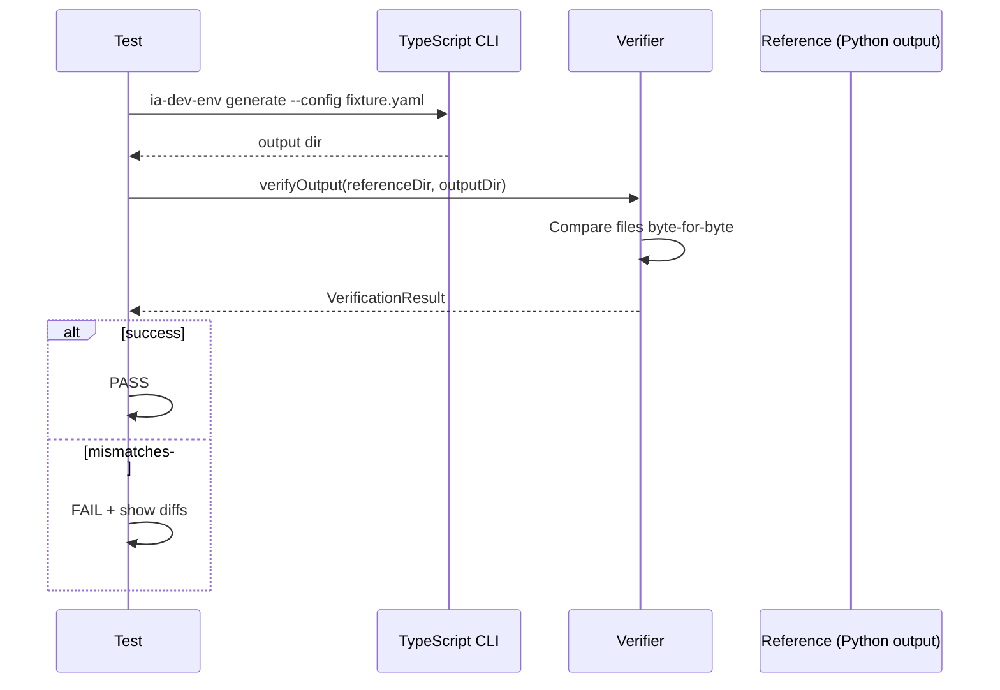

# História: Testes de Integração + Verificação de Paridade

**ID:** STORY-019

## 1. Dependências

| Blocked By | Blocks |
| :--- | :--- |
| STORY-018 | STORY-020 |

## 2. Regras Transversais Aplicáveis

| ID | Título |
| :--- | :--- |
| RULE-001 | Compatibilidade de output |
| RULE-002 | Migração v2→v3 |
| RULE-008 | Assembler ordering |
| RULE-011 | Resources inalterados |

## 3. Descrição

Como **desenvolvedor do ia-dev-environment**, eu quero ter uma suite de testes de integração que verifica a paridade byte-for-byte entre o output Python e TypeScript, garantindo que a migração não introduziu regressões.

Esta história é o "gate de qualidade" final da migração. Ela cria testes end-to-end que executam ambas as versões (Python e TypeScript) com os mesmos inputs YAML e comparam os outputs byte-for-byte.

### 3.1 Verifier (migrado do Python)

- **Módulo Python de origem:** `src/ia_dev_env/verifier.py`
- **Módulo TypeScript de destino:** `src/verifier.ts` (ou `tests/helpers/verifier.ts`)
- `verifyOutput(referenceDir, actualDir)` → `VerificationResult`
- Compara byte-for-byte todos os arquivos
- Reporta: mismatches, missing files, extra files
- Gera unified diffs para arquivos de texto

### 3.2 Fixtures de Teste

Criar configs YAML representativos cobrindo:
1. **Minimal config** — apenas campos obrigatórios
2. **Full config** — todos os campos preenchidos
3. **Java Spring REST** — microservice com REST, PostgreSQL, Redis, K8s
4. **Python FastAPI** — microservice com REST, MongoDB
5. **Go Gin gRPC** — microservice com gRPC
6. **Kotlin Ktor events** — event-driven com Kafka
7. **TypeScript NestJS fullstack** — monolith com REST + GraphQL
8. **Rust Axum library** — library sem interfaces
9. **Config v2** — formato legado para testar migração
10. **Config com MCP** — MCP servers configurados

### 3.3 Testes de Integração

- Para cada fixture: executar CLI Node/TS → capturar output dir
- Gerar reference output com Python (snapshot)
- Comparar byte-for-byte via verifier
- Testar dry-run mode
- Testar validate command
- Testar error handling (config inválido, path inválido)

### 3.4 Coverage Geral

- Verificar que a suite de testes completa (unitários + integração) atinge ≥ 95% line, ≥ 90% branch

## 4. Definições de Qualidade Locais

### DoR Local (Definition of Ready)

- [ ] CLI completa (STORY-018) funcional
- [ ] Python version funcional para gerar reference outputs
- [ ] Fixtures YAML criadas e validadas

### DoD Local (Definition of Done)

- [ ] 10+ fixtures de teste criadas
- [ ] Reference outputs gerados com Python e commitados
- [ ] Verifier implementado e testado
- [ ] Todos os testes de paridade passando (byte-for-byte match)
- [ ] Coverage total ≥ 95% line, ≥ 90% branch
- [ ] Testes de dry-run e error handling

### Global Definition of Done (DoD)

- **Cobertura:** ≥ 95% Line Coverage, ≥ 90% Branch Coverage (total)
- **Testes Automatizados:** Unitários + integração + paridade
- **Relatório de Cobertura:** vitest coverage lcov + text
- **Documentação:** Documentação de como gerar novos reference outputs
- **Persistência:** N/A
- **Performance:** Suite de integração < 60s

## 5. Contratos de Dados (Data Contract)

**VerificationResult:**

| Campo | Tipo | Descrição |
| :--- | :--- | :--- |
| `success` | `boolean` | Todos os arquivos match |
| `totalFiles` | `number` | Total de arquivos comparados |
| `mismatches` | `FileDiff[]` | Arquivos com diferenças |
| `missingFiles` | `string[]` | Arquivos no reference mas não no actual |
| `extraFiles` | `string[]` | Arquivos no actual mas não no reference |

## 6. Diagramas

### 6.1 Fluxo de Verificação de Paridade



## 7. Critérios de Aceite (Gherkin)

```gherkin
Cenario: Output idêntico para Java Spring REST config
  DADO que tenho a fixture "java-spring-rest.yaml"
  QUANDO gero output com TypeScript CLI
  E comparo com reference output do Python
  ENTÃO todos os arquivos são byte-for-byte idênticos
  E nenhum arquivo está faltando ou sobrando

Cenario: Output idêntico para config v2 (migração)
  DADO que tenho a fixture "v2-legacy.yaml"
  QUANDO gero output com TypeScript CLI
  E comparo com reference output do Python
  ENTÃO o output é idêntico após migração v2→v3

Cenario: Dry-run não gera arquivos
  DADO que tenho uma fixture válida
  QUANDO executo com --dry-run
  ENTÃO o output dir está vazio
  E o stdout contém a tabela de resultado

Cenario: Validate rejeita config inválido
  DADO que tenho uma fixture com seção faltante
  QUANDO executo validate
  ENTÃO exit code é 1
  E a mensagem de erro contém o nome da seção

Cenario: Coverage total atinge metas
  DADO que todos os testes unitários e de integração foram executados
  QUANDO verifico o relatório de cobertura
  ENTÃO line coverage é ≥ 95%
  E branch coverage é ≥ 90%
```

## 8. Sub-tarefas

- [ ] [Dev] Implementar verifier em TypeScript
- [ ] [Dev] Criar 10+ fixtures YAML representativas
- [ ] [Dev] Gerar reference outputs com Python CLI
- [ ] [Test] Integração: paridade para cada fixture
- [ ] [Test] Integração: dry-run mode
- [ ] [Test] Integração: validate command (sucesso e erro)
- [ ] [Test] Integração: error handling (config inválido, path inválido)
- [ ] [Test] Validar coverage total ≥ 95% line, ≥ 90% branch
- [ ] [Doc] Documentar como regenerar reference outputs
