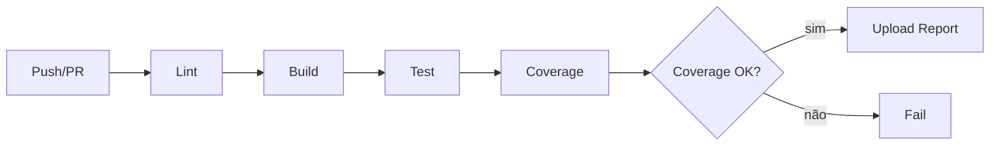

# História: CI/CD, Packaging e Documentação

**ID:** STORY-020

## 1. Dependências

| Blocked By | Blocks |
| :--- | :--- |
| STORY-019 | — |

## 2. Regras Transversais Aplicáveis

| ID | Título |
| :--- | :--- |
| RULE-011 | Resources inalterados |

## 3. Descrição

Como **desenvolvedor do ia-dev-environment**, eu quero ter o CI/CD configurado para o projeto Node.js/TypeScript, o packaging pronto para distribuição via npm, e a documentação atualizada, garantindo que o projeto migrado esteja pronto para produção.

Esta é a história final do épico. Ela configura a infraestrutura de CI/CD, prepara o projeto para publicação npm, remove o código Python (ou marca como deprecated), e atualiza toda a documentação.

### 3.1 CI/CD (GitHub Actions)

- Workflow de CI: lint, build, test, coverage
- Node.js matrix: 18, 20, 22
- Upload de coverage report
- Cache de node_modules

### 3.2 Packaging (npm)

- `package.json` com `files` field definindo o que incluir no package
- `prepublishOnly` script para build + test
- `.npmignore` ou `files` whitelist
- Verificar que `npx ia-dev-env` funciona após `npm pack`

### 3.3 Remoção/Deprecation do Python

- Remover `src/ia_dev_env/` (código Python)
- Remover `pyproject.toml`
- Remover `tests/` Python
- Manter `resources/` intocado (RULE-011)

### 3.4 Documentação

- Atualizar `README.md` do projeto raiz
- Documentar instalação via npm
- Documentar uso do CLI
- Documentar desenvolvimento (setup, build, test)

## 4. Definições de Qualidade Locais

### DoR Local (Definition of Ready)

- [ ] Testes de integração e paridade passando (STORY-019)
- [ ] Coverage ≥ 95% line, ≥ 90% branch confirmado
- [ ] Todas as stories anteriores concluídas

### DoD Local (Definition of Done)

- [ ] CI/CD pipeline funcional no GitHub Actions
- [ ] npm pack gera pacote válido
- [ ] `npx ia-dev-env` funciona a partir do pacote
- [ ] Código Python removido
- [ ] README atualizado com instruções Node.js/TypeScript
- [ ] Todos os testes passando no CI

### Global Definition of Done (DoD)

- **Cobertura:** ≥ 95% Line Coverage, ≥ 90% Branch Coverage
- **Testes Automatizados:** Executados no CI
- **Relatório de Cobertura:** Upload no CI
- **Documentação:** README completo e atualizado
- **Persistência:** N/A
- **Performance:** CI < 5 minutos

## 5. Contratos de Dados (Data Contract)

**package.json (final):**

| Campo | Valor | Descrição |
| :--- | :--- | :--- |
| `name` | `ia-dev-environment` | Nome do pacote |
| `version` | `1.0.0` | Primeira release Node.js |
| `bin.ia-dev-env` | `./dist/index.js` | CLI entry point |
| `files` | `["dist", "resources"]` | Whitelist de publicação |
| `engines.node` | `>=18` | Versão mínima de Node.js |

## 6. Diagramas

### 6.1 Pipeline de CI/CD



## 7. Critérios de Aceite (Gherkin)

```gherkin
Cenario: CI executa com sucesso em Node 18, 20, 22
  DADO que faço push para o repositório
  QUANDO o CI é executado
  ENTÃO lint, build e test passam em Node 18, 20 e 22

Cenario: npm pack gera pacote funcional
  DADO que o projeto está buildado
  QUANDO executo npm pack
  ENTÃO um arquivo .tgz é gerado
  E npx ia-dev-env --help funciona a partir do pacote

Cenario: Resources inalterados após remoção do Python
  DADO que o código Python foi removido
  QUANDO verifico o diretório resources/
  ENTÃO nenhum arquivo foi modificado, adicionado ou removido

Cenario: README documenta instalação npm
  DADO que o README foi atualizado
  QUANDO leio o README
  ENTÃO contém instruções de instalação via npm
  E contém exemplos de uso do CLI

Cenario: Coverage report no CI
  DADO que os testes foram executados no CI
  QUANDO verifico os artefatos
  ENTÃO o coverage report está disponível
  E line coverage ≥ 95%
```

## 8. Sub-tarefas

- [ ] [Dev] Criar workflow GitHub Actions (CI)
- [ ] [Dev] Configurar matrix Node.js 18/20/22
- [ ] [Dev] Configurar npm packaging (files, prepublishOnly)
- [ ] [Dev] Remover código Python e pyproject.toml
- [ ] [Dev] Atualizar .gitignore
- [ ] [Doc] Atualizar README com instruções Node.js/TypeScript
- [ ] [Doc] Documentar instalação, uso e desenvolvimento
- [ ] [Test] Validar CI pipeline funcional
- [ ] [Test] Validar npm pack + npx funcional
