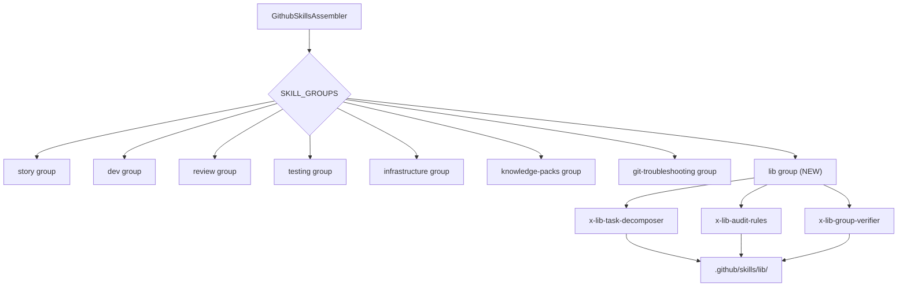

# História: Lib Skills — Suporte a Skills Internas no GitHub Skills Assembler

**ID:** STORY-021

## 1. Dependências

| Blocked By | Blocks |
| :--- | :--- |
| STORY-014 | STORY-016 |

## 2. Regras Transversais Aplicáveis

| ID | Título |
| :--- | :--- |
| RULE-006 | Feature gating |
| RULE-009 | Knowledge pack detection |

## 3. Descrição

Como **desenvolvedor do ia-dev-environment**, eu quero que as lib skills (`x-lib-task-decomposer`, `x-lib-audit-rules`, `x-lib-group-verifier`) sejam geradas no diretório `.github/skills/lib/` pelo GithubSkillsAssembler, para que sejam utilizáveis no GitHub Copilot.

Atualmente, o `GithubSkillsAssembler` (Python: `src/ia_dev_env/assembler/github_skills_assembler.py`) define 7 grupos em `SKILL_GROUPS` (story, dev, review, testing, infrastructure, knowledge-packs, git-troubleshooting), mas **não inclui o grupo "lib"**. As lib skills existem como templates em `resources/skills-templates/core/lib/` e são corretamente geradas para `.claude/skills/lib/` pelo `SkillsAssembler`, porém o `GithubSkillsAssembler` as ignora completamente.

### 3.1 Gap Identificado

- **Python `SKILL_GROUPS`** (github_skills_assembler.py, linha 13-25): Não contém grupo `"lib"`.
- **Templates GitHub para lib:** Não existem em `resources/github-skills-templates/`.
- **Resultado:** Lib skills não são geradas para `.github/skills/lib/`, causando "Skill not found" no GitHub Copilot.

### 3.2 Escopo da Correção

1. **Criar templates GitHub para lib skills** em `resources/github-skills-templates/lib/`:
   - `x-lib-task-decomposer.md`
   - `x-lib-audit-rules.md`
   - `x-lib-group-verifier.md`

2. **Adicionar grupo "lib" ao `SKILL_GROUPS`** no TypeScript `GithubSkillsAssembler`:
   ```typescript
   "lib": ["x-lib-task-decomposer", "x-lib-audit-rules", "x-lib-group-verifier"]
   ```

3. **Tratar nesting de subdiretório** `lib/` no output path do assembler.

4. **(Opcional) Backport para Python** — Mesma correção em `github_skills_assembler.py`.

### 3.3 Módulos Afetados

| Módulo | Ação |
| :--- | :--- |
| `resources/github-skills-templates/lib/x-lib-task-decomposer.md` | Criar |
| `resources/github-skills-templates/lib/x-lib-audit-rules.md` | Criar |
| `resources/github-skills-templates/lib/x-lib-group-verifier.md` | Criar |
| `src/assembler/github-skills-assembler.ts` | Editar — adicionar grupo "lib" |
| `src/ia_dev_env/assembler/github_skills_assembler.py` | Editar (opcional backport) |

## 4. Definições de Qualidade Locais

### DoR Local (Definition of Ready)

- [ ] GithubSkillsAssembler (Python) lido e gap confirmado
- [ ] Templates de lib skills em `resources/skills-templates/core/lib/` analisados
- [ ] Formato de templates GitHub skills existentes compreendido
- [ ] STORY-014 (GitHub Assemblers) concluída

### DoD Local (Definition of Done)

- [ ] 3 templates GitHub para lib skills criados em `resources/github-skills-templates/lib/`
- [ ] Grupo "lib" adicionado ao `SKILL_GROUPS` no TypeScript
- [ ] Lib skills geradas corretamente em `.github/skills/lib/`
- [ ] Nesting de subdiretório `lib/` tratado no output path
- [ ] Output compatível com formato esperado pelo GitHub Copilot

### Global Definition of Done (DoD)

- **Cobertura:** ≥ 95% Line Coverage, ≥ 90% Branch Coverage
- **Testes Automatizados:** Unitários + paridade
- **Relatório de Cobertura:** vitest coverage lcov + text
- **Documentação:** JSDoc
- **Persistência:** N/A
- **Performance:** N/A

## 5. Contratos de Dados (Data Contract)

**GithubSkillsAssembler.assemble (extensão):**

| Parâmetro | Tipo | Obrigatório | Descrição |
| :--- | :--- | :--- | :--- |
| `config` | `ProjectConfig` | M | Configuração do projeto |
| `outputDir` | `string` | M | Diretório de saída |
| `resourcesDir` | `string` | M | Diretório de resources |
| `engine` | `TemplateEngine` | M | Template engine |
| retorno | `{ files: string[]; warnings: string[] }` | M | Arquivos gerados (inclui lib/) e avisos |

**Novo grupo em SKILL_GROUPS:**

```typescript
{
  // ... grupos existentes ...
  "lib": ["x-lib-task-decomposer", "x-lib-audit-rules", "x-lib-group-verifier"]
}
```

## 6. Diagramas

### 6.1 Fluxo de Geração de Lib Skills para GitHub



## 7. Critérios de Aceite (Gherkin)

```gherkin
Cenario: Lib skills geradas no diretório GitHub
  DADO que tenho qualquer config válido
  QUANDO executo GithubSkillsAssembler.assemble
  ENTÃO os 3 lib skills estão em .github/skills/lib/

Cenario: Templates GitHub para lib skills existem
  DADO que o diretório resources/github-skills-templates/lib/ existe
  QUANDO listo os arquivos
  ENTÃO encontro x-lib-task-decomposer.md, x-lib-audit-rules.md, x-lib-group-verifier.md

Cenario: Grupo lib presente em SKILL_GROUPS
  DADO que o GithubSkillsAssembler é instanciado
  QUANDO verifico SKILL_GROUPS
  ENTÃO o grupo "lib" contém as 3 lib skills

Cenario: Nesting de subdiretório preservado
  DADO que as lib skills são geradas
  QUANDO verifico o output path
  ENTÃO os arquivos estão em .github/skills/lib/ (não em .github/skills/)

Cenario: Lib skills acessíveis no GitHub Copilot
  DADO que as lib skills foram geradas em .github/skills/lib/
  QUANDO um usuário invoca x-lib-task-decomposer no Copilot
  ENTÃO o skill é encontrado e executado
```

## 8. Sub-tarefas

- [ ] [Dev] Criar template `resources/github-skills-templates/lib/x-lib-task-decomposer.md`
- [ ] [Dev] Criar template `resources/github-skills-templates/lib/x-lib-audit-rules.md`
- [ ] [Dev] Criar template `resources/github-skills-templates/lib/x-lib-group-verifier.md`
- [ ] [Dev] Adicionar grupo "lib" ao `SKILL_GROUPS` em `github-skills-assembler.ts`
- [ ] [Dev] Tratar nesting de subdiretório `lib/` no output path
- [ ] [Dev] (Opcional) Backport para Python `github_skills_assembler.py`
- [ ] [Test] Unitário: lib skills incluídas no output
- [ ] [Test] Unitário: nesting de subdiretório correto
- [ ] [Test] Paridade: comparar output com expectativa
