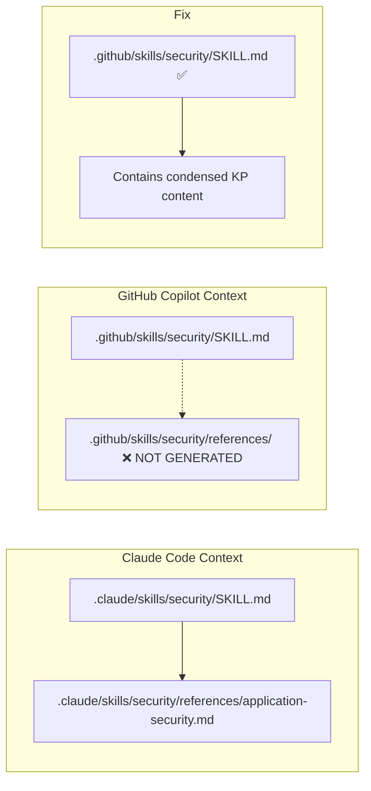
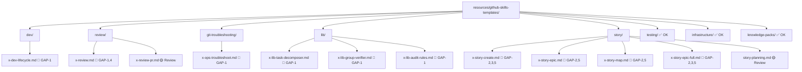

# Story: GitHub Skills — Copilot Compatibility Audit & Fix

**ID:** STORY-022

## 1. Dependencies

| Blocked By | Blocks |
| :--- | :--- |
| STORY-021 | — |

## 2. Applicable Cross-Cutting Rules

| ID | Title |
| :--- | :--- |
| RULE-006 | Feature gating |
| RULE-009 | Knowledge pack detection |
| RULE-011 | Resources inaltered (templates ARE resources, but content fixes are allowed when the content is broken) |

## 3. Description

As a **developer using GitHub Copilot**, I want all generated `.github/skills/` to work correctly in the Copilot context, so that skills can discover their dependencies and execute their full workflow without "file not found" errors or broken references.

### 3.1 Problem Statement

An audit of all GitHub skill templates (`resources/github-skills-templates/`) revealed **5 categories of compatibility issues** that prevent GitHub Copilot from correctly executing skills. Unlike Claude Code (which reads `.claude/skills/`), GitHub Copilot reads `.github/skills/`. The generated GitHub skills contain hardcoded `.claude/` path references, missing cross-references, Portuguese-only content, and broken template paths.

### 3.2 Gap Analysis

#### GAP-1: Wrong Path Prefix (`.claude/` → `.github/`)

**14 occurrences across 7 templates.** GitHub skill templates instruct the AI to read files at `.claude/skills/...`, but in the Copilot context, skills are at `.github/skills/...`.

| Template | Lines | Broken Reference |
| :--- | :--- | :--- |
| `dev/x-dev-lifecycle.md` | 53, 54, 85, 94, 95, 109, 110, 111, 112, 180-183 | `.claude/skills/architecture/...`, `.claude/skills/coding-standards/...`, `.claude/skills/layer-templates/...`, `.claude/skills/protocols/...`, `.claude/skills/security/...`, `.claude/skills/compliance/...` |
| `review/x-review.md` | 95-102, 166-169 | `.claude/skills/security/...`, `.claude/skills/testing/...`, `.claude/skills/database-patterns/...`, `.claude/skills/infrastructure/...`, `.claude/skills/api-design/...`, `.claude/skills/protocols/...`, `.claude/skills/observability/...`, `.claude/skills/resilience/...` |
| `git-troubleshooting/x-ops-troubleshoot.md` | 8, 132 | `../../.claude/skills/x-ops-troubleshoot/...` |
| `lib/x-lib-task-decomposer.md` | 7, 31, 32, 100 | `../../.claude/skills/lib/x-lib-task-decomposer/...`, `.claude/skills/architecture/...`, `.claude/skills/layer-templates/...` |
| `lib/x-lib-group-verifier.md` | 7, 93 | `../../.claude/skills/lib/x-lib-group-verifier/...` |
| `lib/x-lib-audit-rules.md` | 8, 36, 40, 83 | `../../.claude/skills/lib/x-lib-audit-rules/...`, `.claude/rules/...`, `.claude/skills/*/references/...` |
| `story/x-story-create.md` | 111-112 | `.claude/skills/x-story-create/...`, `.claude/skills/x-story-epic-full/...` |

#### GAP-2: Portuguese-Only Templates (4 Story Skills)

All 4 story-related GitHub skill templates are entirely in Portuguese, violating the project's English-only output policy and making them unusable for non-Portuguese-speaking Copilot users.

| Template | Lines | Content Language |
| :--- | :--- | :--- |
| `story/x-story-create.md` | 1-113 | Portuguese (pt-BR) |
| `story/x-story-epic.md` | 1-103 | Portuguese (pt-BR) |
| `story/x-story-map.md` | 1-101 | Portuguese (pt-BR) |
| `story/x-story-epic-full.md` | 1-118 | Portuguese (pt-BR) |

**Note:** The Claude Code counterparts (`resources/skills-templates/core/x-story-*/SKILL.md`) enforce `## Global Output Policy — Language: English ONLY`, but the GitHub templates were written in Portuguese.

#### GAP-3: Broken Template Path References

Story skills reference `.claude/templates/_TEMPLATE-*.md` which does not exist. The actual templates are at `resources/templates/_TEMPLATE-*.md`.

| Template | Line | Broken Reference | Correct Location |
| :--- | :--- | :--- | :--- |
| `story/x-story-epic-full.md` | 31 | `.claude/templates/_TEMPLATE-EPIC.md` | `resources/templates/_TEMPLATE-EPIC.md` |
| `story/x-story-epic-full.md` | 32 | `.claude/templates/_TEMPLATE-STORY.md` | `resources/templates/_TEMPLATE-STORY.md` |
| `story/x-story-epic-full.md` | 33 | `.claude/templates/_TEMPLATE-IMPLEMENTATION-MAP.md` | `resources/templates/_TEMPLATE-IMPLEMENTATION-MAP.md` |
| `story/x-story-create.md` | 29 | `.claude/templates/_TEMPLATE-STORY.md` | `resources/templates/_TEMPLATE-STORY.md` |

#### GAP-4: Knowledge Pack References to Non-Existent Files

The `x-review.md` template references knowledge pack files that do not exist in the generated `.github/skills/` output. The GithubSkillsAssembler only generates `SKILL.md` per skill — it does NOT copy `references/` subdirectories.

| Referenced Path | Exists in `.claude/`? | Exists in `.github/`? | Impact |
| :--- | :--- | :--- | :--- |
| `security/references/application-security.md` | NO | NO | Security review incomplete |
| `security/references/cryptography.md` | NO | NO | Security review incomplete |
| `database-patterns/SKILL.md` → `references/` | Conditional | NO | Database review fails |
| `testing/references/testing-philosophy.md` | YES (runtime) | NO | QA review incomplete |
| `testing/references/testing-conventions.md` | YES (runtime) | NO | QA review incomplete |

#### GAP-5: Skill YAML Frontmatter in Portuguese

The `description` field in the YAML frontmatter of the 4 story skills is in Portuguese. GitHub Copilot uses this field for skill discovery and description display.

### 3.3 Fix Strategy

The fix must convert all `.claude/skills/` references to `.github/skills/` in GitHub templates, while accounting for the fact that GitHub skills do NOT have `references/` subdirectories. Two approaches:

**Approach A (Recommended): Inline KP guidance into GitHub skill template.**
Since `.github/skills/` only has `SKILL.md` (no `references/`), the GitHub template should reference the GitHub SKILL.md directly — which already contains a condensed summary of the knowledge pack.

**Approach B: Reference `.github/skills/{pack}/SKILL.md` directly.**
Instead of pointing to `references/architecture-principles.md`, point to `.github/skills/architecture/SKILL.md` which contains the same knowledge in summarized form.

For this story, **Approach B** is chosen — simpler, less duplication, and the GitHub SKILL.md files already contain useful content.

### 3.4 Modules Affected

| Module | Action | GAP |
| :--- | :--- | :--- |
| `resources/github-skills-templates/dev/x-dev-lifecycle.md` | Edit — replace `.claude/` → `.github/` paths | GAP-1 |
| `resources/github-skills-templates/review/x-review.md` | Edit — replace `.claude/` → `.github/` paths, fix KP mapping | GAP-1, GAP-4 |
| `resources/github-skills-templates/git-troubleshooting/x-ops-troubleshoot.md` | Edit — replace `../../.claude/` → `.github/` paths | GAP-1 |
| `resources/github-skills-templates/lib/x-lib-task-decomposer.md` | Edit — replace `.claude/` → `.github/` paths | GAP-1 |
| `resources/github-skills-templates/lib/x-lib-group-verifier.md` | Edit — replace `.claude/` → `.github/` paths | GAP-1 |
| `resources/github-skills-templates/lib/x-lib-audit-rules.md` | Edit — replace `.claude/` → `.github/` paths | GAP-1 |
| `resources/github-skills-templates/story/x-story-create.md` | Rewrite — translate to English, fix paths | GAP-2, GAP-3, GAP-5 |
| `resources/github-skills-templates/story/x-story-epic.md` | Rewrite — translate to English, fix paths | GAP-2, GAP-5 |
| `resources/github-skills-templates/story/x-story-map.md` | Rewrite — translate to English, fix paths | GAP-2, GAP-5 |
| `resources/github-skills-templates/story/x-story-epic-full.md` | Rewrite — translate to English, fix paths | GAP-2, GAP-3, GAP-5 |
| `resources/github-skills-templates/story/story-planning.md` | Review — check for Portuguese or broken refs | GAP-2 |
| `resources/github-skills-templates/review/x-review-pr.md` | Review — check for `.claude/` references | GAP-1 |
| `tests/golden/*/github/skills/` | Update — regenerate golden files for all 8 profiles | — |
| `tests/node/assembler/github-skills-assembler.test.ts` | No change expected (template content is not tested) | — |

### 3.5 Scope Exclusions

- **No assembler code changes** — the assembler correctly generates from templates; the templates themselves are broken.
- **No Python backport** — Python assembler was removed in STORY-020.
- **No new skills creation** — all GitHub skills already exist; this story fixes their content.

## 4. Quality Definitions

### DoR (Definition of Ready)

- [x] Full audit completed — 5 GAP categories identified with exact line numbers
- [x] All affected templates read and analyzed
- [x] Claude Code counterparts (English versions) available for translation reference
- [x] STORY-021 (lib skills) completed — lib templates exist

### DoD (Definition of Done)

- [ ] All `.claude/skills/` references replaced with `.github/skills/` in GitHub templates
- [ ] All `../../.claude/skills/` relative references replaced with `.github/skills/`
- [ ] All `.claude/templates/` references replaced with correct paths
- [ ] 4 story skill templates translated from Portuguese to English
- [ ] 4 story skill YAML frontmatter `description` fields translated to English
- [ ] KP mapping in `x-review.md` updated to reference `.github/skills/{pack}/SKILL.md`
- [ ] All 8 golden file profiles regenerated and passing
- [ ] Zero grep results for `\.claude/skills/` in `resources/github-skills-templates/`
- [ ] Zero grep results for `\.claude/templates/` in `resources/github-skills-templates/`

### Global Definition of Done (DoD)

- **Coverage:** ≥ 95% Line Coverage, ≥ 90% Branch Coverage
- **Automated Tests:** Parity tests (golden files)
- **Coverage Report:** vitest coverage lcov + text
- **Documentation:** N/A (template content only)
- **Persistence:** N/A
- **Performance:** N/A

## 5. Data Contracts

**No API or assembler changes.** This story modifies template content only.

### Path Replacement Contract

| Old Pattern | New Pattern | Context |
| :--- | :--- | :--- |
| `.claude/skills/{pack}/references/{file}.md` | `.github/skills/{pack}/SKILL.md` | KP references in subagent prompts |
| `.claude/skills/{pack}/SKILL.md` | `.github/skills/{pack}/SKILL.md` | Direct skill references |
| `../../.claude/skills/{name}/SKILL.md` | `.github/skills/{name}/SKILL.md` | Relative lib/troubleshoot refs |
| `.claude/skills/{name}/references/` | `.github/skills/{name}/SKILL.md` | Reference directory pointers |
| `.claude/templates/_TEMPLATE-*.md` | `docs/templates/_TEMPLATE-*.md` | Story template file refs |
| `.claude/rules/*.md` | `.github/instructions/*.instructions.md` | Rule file references |

### KP Mapping Contract (x-review.md)

| Engineer | Old KP Paths | New KP Paths |
| :--- | :--- | :--- |
| Security | `.claude/skills/security/SKILL.md` → `references/application-security.md`, `references/cryptography.md` | `.github/skills/security/SKILL.md` |
| QA | `.claude/skills/testing/references/testing-philosophy.md`, `...testing-conventions.md` | `.github/skills/testing/SKILL.md` |
| Performance | `.claude/skills/resilience/references/resilience-principles.md` | `.github/skills/resilience/SKILL.md` |
| Database | `.claude/skills/database-patterns/SKILL.md` → `references/` | `.github/skills/database-patterns/SKILL.md` |
| Observability | `.claude/skills/observability/references/observability-principles.md` | `.github/skills/observability/SKILL.md` |
| DevOps | `.claude/skills/infrastructure/references/infrastructure-principles.md` | `.github/skills/infrastructure/SKILL.md` |
| API | `.claude/skills/api-design/references/...` + `.claude/skills/protocols/references/` | `.github/skills/api-design/SKILL.md`, `.github/skills/protocols/SKILL.md` |
| Event | `.claude/skills/protocols/references/event-driven-conventions.md` | `.github/skills/protocols/SKILL.md` |

## 6. Diagrams

### 6.1 Path Resolution Difference: Claude Code vs GitHub Copilot



### 6.2 Template Fix Scope



## 7. Acceptance Criteria (Gherkin)

```gherkin
Scenario: No .claude/ path references in GitHub templates
  GIVEN the directory resources/github-skills-templates/
  WHEN I grep recursively for "\.claude/skills/"
  THEN zero matches are found

Scenario: No .claude/templates/ references in GitHub templates
  GIVEN the directory resources/github-skills-templates/
  WHEN I grep recursively for "\.claude/templates/"
  THEN zero matches are found

Scenario: Story skills in English
  GIVEN the file resources/github-skills-templates/story/x-story-create.md
  WHEN I read its content
  THEN all content is in English
  AND the YAML frontmatter description is in English
  AND the section headers follow the Claude Code counterpart structure

Scenario: Story skills in English (epic)
  GIVEN the file resources/github-skills-templates/story/x-story-epic.md
  WHEN I read its content
  THEN all content is in English
  AND the YAML frontmatter description is in English

Scenario: Story skills in English (map)
  GIVEN the file resources/github-skills-templates/story/x-story-map.md
  WHEN I read its content
  THEN all content is in English
  AND the YAML frontmatter description is in English

Scenario: Story skills in English (epic-full)
  GIVEN the file resources/github-skills-templates/story/x-story-epic-full.md
  WHEN I read its content
  THEN all content is in English
  AND the YAML frontmatter description is in English

Scenario: KP mapping uses GitHub paths in x-review
  GIVEN the file resources/github-skills-templates/review/x-review.md
  WHEN I read the Engineer -> Knowledge Pack Mapping table
  THEN all paths start with ".github/skills/"
  AND no path references a "references/" subdirectory

Scenario: x-dev-lifecycle references GitHub paths
  GIVEN the file resources/github-skills-templates/dev/x-dev-lifecycle.md
  WHEN I read its subagent prompt sections
  THEN all file read instructions use ".github/skills/" prefix
  AND no path uses ".claude/" prefix

Scenario: Lib skill templates reference GitHub paths
  GIVEN the 3 lib templates in resources/github-skills-templates/lib/
  WHEN I read each file
  THEN all Reference: fields use ".github/skills/" prefix
  AND STEP 0 architecture references use ".github/skills/" prefix

Scenario: Golden files regenerated and passing
  GIVEN all template fixes are applied
  WHEN I run the full test suite
  THEN all parity/golden tests pass
  AND coverage remains >= 95% line, >= 90% branch

Scenario: x-ops-troubleshoot uses GitHub paths
  GIVEN the file resources/github-skills-templates/git-troubleshooting/x-ops-troubleshoot.md
  WHEN I read the YAML frontmatter and Integration Notes
  THEN the Reference field uses ".github/skills/" prefix
  AND no "../../.claude/" paths remain
```

## 8. Sub-tasks

### GAP-1: Path Prefix Fix (`.claude/` → `.github/`)

- [ ] [Dev] Fix `dev/x-dev-lifecycle.md` — replace all `.claude/skills/` with `.github/skills/`, update `references/*.md` to point to `SKILL.md`
- [ ] [Dev] Fix `review/x-review.md` — replace all `.claude/skills/` paths, rewrite KP mapping table
- [ ] [Dev] Fix `git-troubleshooting/x-ops-troubleshoot.md` — replace `../../.claude/` references
- [ ] [Dev] Fix `lib/x-lib-task-decomposer.md` — replace `.claude/` references, update STEP 0 paths
- [ ] [Dev] Fix `lib/x-lib-group-verifier.md` — replace `.claude/` references
- [ ] [Dev] Fix `lib/x-lib-audit-rules.md` — replace `.claude/` references, update Phase 1 discovery paths
- [ ] [Dev] Review `review/x-review-pr.md` — check and fix any `.claude/` references
- [ ] [Dev] Review `story/story-planning.md` — check and fix any `.claude/` references

### GAP-2 + GAP-5: Portuguese → English Translation

- [ ] [Dev] Translate `story/x-story-create.md` to English (use `resources/skills-templates/core/x-story-create/SKILL.md` as reference)
- [ ] [Dev] Translate `story/x-story-epic.md` to English (use `resources/skills-templates/core/x-story-epic/SKILL.md` as reference)
- [ ] [Dev] Translate `story/x-story-map.md` to English (use `resources/skills-templates/core/x-story-map/SKILL.md` as reference)
- [ ] [Dev] Translate `story/x-story-epic-full.md` to English (use `resources/skills-templates/core/x-story-epic-full/SKILL.md` as reference)
- [ ] [Dev] Translate YAML `description` field in all 4 story templates to English

### GAP-3: Template Path References

- [ ] [Dev] Fix `story/x-story-epic-full.md` — replace `.claude/templates/` with correct path
- [ ] [Dev] Fix `story/x-story-create.md` — replace `.claude/templates/` with correct path

### GAP-4: KP Reference Simplification

- [ ] [Dev] Rewrite `x-review.md` KP mapping table — point each engineer to `.github/skills/{pack}/SKILL.md` instead of `references/*.md`

### Validation

- [ ] [Test] Run `grep -r '\.claude/skills/' resources/github-skills-templates/` — must return 0 results
- [ ] [Test] Run `grep -r '\.claude/templates/' resources/github-skills-templates/` — must return 0 results
- [ ] [Test] Regenerate golden files for all 8 profiles
- [ ] [Test] Run full test suite — all tests passing, coverage ≥ 95%/90%

### Documentation

- [ ] [Doc] Update IMPLEMENTATION-MAP if needed
