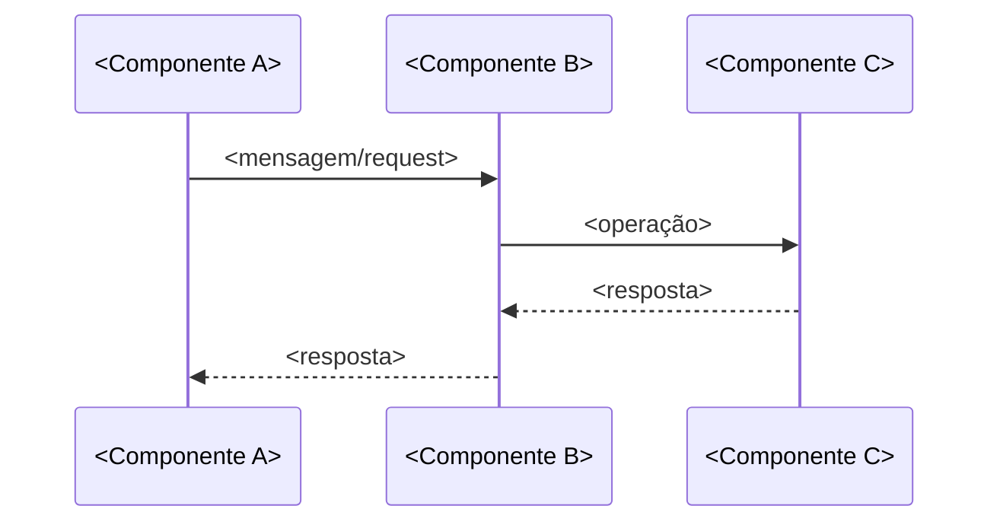

# História: <Título da História>

**ID:** <story-XXXX-YYYY>
**Chave Jira:** <CHAVE-JIRA>
**Status:** Pendente

## 1. Dependências

| Blocked By | Blocks |
| :--- | :--- |
| <story-XXXX-YYYY ou -> | <story-XXXX-YYYY ou -> |

## 2. Regras Transversais Aplicáveis

> Referência às regras definidas no Épico (seção 4). Listar apenas as regras que impactam esta história.

| ID | Título |
| :--- | :--- |
| <RULE-NNN> | <Título da regra> |

## 3. Descrição

Como **<Persona>**, eu quero <ação/capacidade>, garantindo que <benefício/resultado esperado>.

<Contexto adicional (2-3 parágrafos) explicando o porquê desta história, como ela se encaixa no épico, e quaisquer decisões de design relevantes.>

### 3.1 <Requisito Técnico/Funcional A>

- <Especificação técnica detalhada>
- <Protocolo/formato/constraint>
- <Comportamento esperado>

### 3.N <Requisito Técnico/Funcional N>

- <Especificação>

## 3.5 Entrega de Valor

> O que esta história entrega de valor mensurável para o negócio?

- **Valor Principal:** <Descrição do valor de negócio mensurável — ex: "Endpoint de pagamento com crédito disponível em Java, permitindo desligamento do serviço legado .NET">
- **Métrica de Sucesso:** <Como medir que o valor foi entregue — ex: "Endpoint /payments/credit retorna 200 com payload correto em < 200ms">
- **Impacto no Negócio:** <Impacto direto para o usuário/stakeholder — ex: "Equipe de produto pode iniciar migração de clientes do serviço legado">

## 4. Definições de Qualidade Locais

### DoR Local (Definition of Ready)

- [ ] <Pré-condição específica desta história>
- [ ] <Decisão técnica que precisa estar tomada>
- [ ] <Artefato/schema/config que precisa existir>

### DoD Local (Definition of Done)

- [ ] <Critério de aceite implementado e validado>
- [ ] <Componente/handler/endpoint funcional>
- [ ] <Teste específico passando>
- [ ] Pelo menos 1 teste automatizado (unitário, integração ou E2E) validando o critério de aceite principal
- [ ] Smoke test passando (quando testing.smoke_tests == true no projeto)

### Global Definition of Done (DoD)

> Copiar do Épico. Mantido aqui para referência rápida durante code review.

- **Cobertura:** <Meta de cobertura>
- **Testes Automatizados:** <Tipos de testes exigidos>
- **Relatório de Cobertura:** <Formato>
- **Documentação:** <Artefatos>
- **Persistência:** <Critério>
- **Performance:** <SLO>

## 5. Contratos de Dados (Data Contract)

<Definição dos payloads, schemas, mapas de bits ou contratos relevantes para esta história.>

### 5.1 Request

| Campo | Tipo | M/O | Validações | Exemplo |
| :--- | :--- | :--- | :--- | :--- |
| `<campo>` | `<UUID/BigDecimal/String(255)/Integer/List<String>>` | `<M ou O>` | `<min/max, regex, enum values>` | `<valor concreto>` |

> Para protocolos binários usar formato: Campo | Formato | Request | Response | Origem/Regra.

### 5.2 Response

| Campo | Tipo | Sempre presente | Descrição |
| :--- | :--- | :--- | :--- |
| `<campo>` | `<UUID/String/BigDecimal>` | `<Sim ou Não>` | `<descrição do campo>` |

### 5.3 Error Codes Mapeados

| HTTP Status | Error Code | Condição | Mensagem (RFC 7807) |
| :--- | :--- | :--- | :--- |
| `<status>` | `<code>` | `<condição que dispara>` | `<mensagem padrão RFC 7807>` |

> Error codes seguem formato RFC 7807 (Problem Details for HTTP APIs) com campos `type`, `title`, `status`, `detail` e `instance`.

### 5.4 Event Schema (para event-driven)

> Incluir apenas quando `eventDriven: true`.

| Campo | Tipo | Obrigatório | Descrição |
| :--- | :--- | :--- | :--- |
| `eventType` | `String` | Sim | Tipo do evento |
| `eventVersion` | `String` | Sim | Versão do schema do evento |
| `timestamp` | `Instant` | Sim | Momento da emissão do evento (ISO-8601 UTC) |
| `correlationId` | `UUID` | Sim | ID de correlação para rastreamento |
| `payload` | `Object` | Sim | Payload do evento |

> **Versionamento:** backward compatibility obrigatória; breaking changes requerem novo event type; versões deprecadas suportadas por pelo menos 2 ciclos de release.

## 6. Diagramas

### 6.1 <Nome do Diagrama>



## 7. Critérios de Aceite (Gherkin)

```gherkin
Cenario: <Nome do cenário de sucesso>
  DADO que <pré-condição>
  QUANDO <ação>
  E <condição adicional>
  ENTÃO <resultado esperado>
  E <validação adicional>

Cenario: <Nome do cenário de erro>
  DADO que <pré-condição>
  QUANDO <ação com dados inválidos>
  ENTÃO <comportamento de erro esperado>
  E <validação de integridade>

Cenario: <Nome do cenário de edge case>
  DADO que <condição de borda>
  QUANDO <ação>
  ENTÃO <comportamento esperado>
```

### 7.1 Scenario Ordering (TPP)

> Scenarios MUST follow the Transformation Priority Premise (TPP) order, from simplest to most
> complex: degenerate → unconditional → conditions → iterations → edge cases.
> This ordering ensures incremental complexity in both tests and implementation.

### 7.2 Mandatory Scenario Categories

Every story MUST include scenarios covering all of the following categories:

- [ ] Degenerate cases (null, empty, zero)
- [ ] Happy path (basic success)
- [ ] Error paths (each error type)
- [ ] Boundary values (at-min, at-max, past-max)

### 7.3 TDD Implementation Notes

- **Double-Loop TDD**: The primeiro cenário Gherkin becomes the acceptance test (outer loop).
  Subsequent scenarios guide unit tests (inner loop).
- The first scenario defines the walking skeleton — the simplest end-to-end path.
- Unit tests are driven by TPP: start with the simplest transformation and progress to more
  complex ones.

## 8. Sub-tarefas

- [ ] [Dev] <Implementação do componente principal>
- [ ] [Dev] <Implementação de componente secundário>
- [ ] [Test] Unitário: <Escopo do teste unitário>
- [ ] [Test] Integração: <Escopo do teste de integração>
- [ ] [Test] Smoke/E2E: <Teste automatizado validando critério de aceite principal de ponta a ponta>
- [ ] [Doc] <Documentação a ser atualizada>
