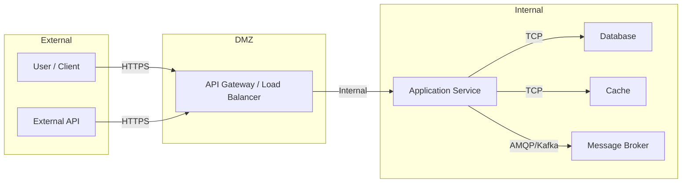

# Threat Model -- {{SERVICE_NAME}}

## Trust Boundaries

> **Instructions:** Update this diagram to reflect the actual trust boundaries of your service. Add or remove components as needed. Each boundary crossing is a potential attack surface.

## STRIDE Analysis

### Spoofing

Threats related to identity impersonation and authentication bypass.

| Threat | Severity | Mitigation | Status | Story Ref |
| :--- | :--- | :--- | :--- | :--- |
| _Example: Unauthenticated access to protected endpoint_ | _High_ | _Implement JWT validation on all protected routes_ | _Open_ | _STORY-XXXX_ |

### Tampering

Threats related to unauthorized data modification.

| Threat | Severity | Mitigation | Status | Story Ref |
| :--- | :--- | :--- | :--- | :--- |
| _Example: Request body manipulation in transit_ | _Medium_ | _Enforce HTTPS, validate input schemas_ | _Under Review_ | _STORY-XXXX_ |

### Repudiation

Threats related to actions that cannot be traced back to the actor.

| Threat | Severity | Mitigation | Status | Story Ref |
| :--- | :--- | :--- | :--- | :--- |
| _Example: Missing audit trail for sensitive operations_ | _Medium_ | _Implement structured audit logging for all state changes_ | _Under Review_ | _STORY-XXXX_ |

### Information Disclosure

Threats related to unauthorized access to sensitive data.

| Threat | Severity | Mitigation | Status | Story Ref |
| :--- | :--- | :--- | :--- | :--- |
| _Example: Stack traces exposed in error responses_ | _High_ | _Sanitize error responses, use RFC 7807 format_ | _Open_ | _STORY-XXXX_ |

### Denial of Service

Threats related to service availability disruption.

| Threat | Severity | Mitigation | Status | Story Ref |
| :--- | :--- | :--- | :--- | :--- |
| _Example: Unbounded query results causing memory exhaustion_ | _Critical_ | _Enforce pagination limits, set query timeouts_ | _Open_ | _STORY-XXXX_ |

### Elevation of Privilege

Threats related to unauthorized access escalation.

| Threat | Severity | Mitigation | Status | Story Ref |
| :--- | :--- | :--- | :--- | :--- |
| _Example: Horizontal privilege escalation via IDOR_ | _Critical_ | _Implement resource-level authorization checks_ | _Open_ | _STORY-XXXX_ |

## Risk Summary

| Severity | Count |
| :--- | :--- |
| Critical | 0 |
| High | 0 |
| Medium | 0 |
| Low | 0 |
| **Total** | **0** |

> **Instructions:** Update counts after each threat model revision. Counts should reflect the number of **Open** and **Under Review** threats per severity level.

## Change History

| Date | Story | Threats Added/Updated |
| :--- | :--- | :--- |
| _YYYY-MM-DD_ | _STORY-XXXX_ | _Initial threat model creation_ |

> **Severity values:** `Critical`, `High`, `Medium`, `Low`
>
> **Status values:** `Open`, `Mitigated`, `Accepted`, `Under Review`
