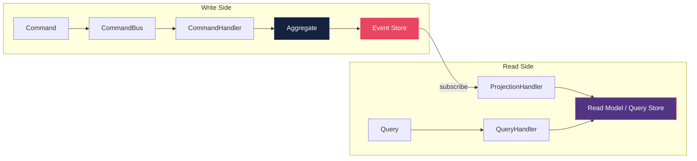

# Knowledge Pack: CQRS / Event Sourcing

## Purpose

Provides comprehensive CQRS/Event Sourcing reference for projects using `architecture.style=cqrs`. Contains 7 specialized sections covering the complete CQRS/ES lifecycle with compilable code examples. Included when `architecture.style` is `cqrs`; complements the core architecture knowledge pack.

---

## Section 1 -- Write/Read Model Separation

### Overview

CQRS separates the write model (commands that change state) from the read model (queries that return data). These are independent pipelines with eventual consistency between them.



### Key Principles

- Write model optimized for consistency and business rule enforcement
- Read model optimized for query performance (denormalized, precomputed)
- Eventual consistency between write and read sides
- Write side produces domain events; read side consumes them
- Each side can scale independently

---

## Section 2 -- Command Bus

### Interface

```java
public interface CommandBus {

    <R> R dispatch(Command<R> command);
}
```

### Command Marker

```java
public interface Command<R> {
}
```

### Command Handler

```java
public interface CommandHandler<C extends Command<R>, R> {

    R handle(C command);
}
```

### Routing Implementation

```java
public final class SimpleCommandBus implements CommandBus {

    private final Map<Class<?>, CommandHandler<?, ?>>
            handlers;

    public SimpleCommandBus(
            Map<Class<?>, CommandHandler<?, ?>> handlers) {
        this.handlers = Map.copyOf(handlers);
    }

    @Override
    @SuppressWarnings("unchecked")
    public <R> R dispatch(Command<R> command) {
        CommandHandler<Command<R>, R> handler =
                (CommandHandler<Command<R>, R>)
                        handlers.get(command.getClass());
        if (handler == null) {
            throw new IllegalArgumentException(
                    "No handler for command: %s"
                            .formatted(
                                    command.getClass()
                                            .getSimpleName()));
        }
        return handler.handle(command);
    }
}
```

---

## Section 3 -- Event Store Interface

### Port Interface (Domain Layer)

```java
public interface EventStore {

    void append(
            String aggregateId,
            List<DomainEvent> events,
            long expectedVersion);

    List<DomainEvent> load(String aggregateId);

    List<DomainEvent> loadFromVersion(
            String aggregateId,
            long fromVersion);
}
```

### Domain Event Base

```java
public interface DomainEvent {

    String aggregateId();

    Instant occurredAt();

    long sequenceNumber();
}
```

### Optimistic Concurrency

The `expectedVersion` parameter in `append` enables optimistic concurrency control. If the current version in the store does not match `expectedVersion`, the store must reject the append with a `ConcurrencyException`.

```java
public final class ConcurrencyException
        extends RuntimeException {

    private final String aggregateId;
    private final long expectedVersion;
    private final long actualVersion;

    public ConcurrencyException(
            String aggregateId,
            long expectedVersion,
            long actualVersion) {
        super("Concurrency conflict for aggregate %s:"
                + " expected version %d but found %d"
                .formatted(aggregateId, expectedVersion,
                        actualVersion));
        this.aggregateId = aggregateId;
        this.expectedVersion = expectedVersion;
        this.actualVersion = actualVersion;
    }

    public String aggregateId() {
        return aggregateId;
    }

    public long expectedVersion() {
        return expectedVersion;
    }

    public long actualVersion() {
        return actualVersion;
    }
}
```

---

## Section 4 -- Aggregate with Event Sourcing

### Abstract Base

```java
public abstract class EventSourcedAggregate {

    private final List<DomainEvent> uncommittedEvents =
            new ArrayList<>();
    private long version;

    protected EventSourcedAggregate() {
        this.version = 0;
    }

    public long version() {
        return version;
    }

    public List<DomainEvent> uncommittedEvents() {
        return List.copyOf(uncommittedEvents);
    }

    public void clearUncommittedEvents() {
        uncommittedEvents.clear();
    }

    public void rehydrate(List<DomainEvent> events) {
        for (DomainEvent event : events) {
            applyEvent(event);
            version = event.sequenceNumber();
        }
    }

    protected void raise(DomainEvent event) {
        uncommittedEvents.add(event);
        applyEvent(event);
    }

    protected abstract void applyEvent(
            DomainEvent event);
}
```

### Concrete Example: OrderAggregate

```java
public final class OrderAggregate
        extends EventSourcedAggregate {

    private String orderId;
    private OrderStatus status;
    private List<OrderItem> items;

    public OrderAggregate() {
        this.items = new ArrayList<>();
        this.status = OrderStatus.DRAFT;
    }

    public void createOrder(
            String orderId,
            List<OrderItem> items) {
        if (items.isEmpty()) {
            throw new IllegalArgumentException(
                    "Order must have at least one item");
        }
        raise(new OrderCreatedEvent(
                orderId, items, Instant.now(),
                version() + 1));
    }

    public void confirmOrder() {
        if (status != OrderStatus.DRAFT) {
            throw new IllegalStateException(
                    "Only draft orders can be confirmed");
        }
        raise(new OrderConfirmedEvent(
                orderId, Instant.now(),
                version() + 1));
    }

    @Override
    protected void applyEvent(DomainEvent event) {
        switch (event) {
            case OrderCreatedEvent e -> {
                this.orderId = e.aggregateId();
                this.items = new ArrayList<>(e.items());
                this.status = OrderStatus.DRAFT;
            }
            case OrderConfirmedEvent e ->
                this.status = OrderStatus.CONFIRMED;
            default -> throw new IllegalArgumentException(
                    "Unknown event type: %s"
                            .formatted(
                                    event.getClass()
                                            .getSimpleName()));
        }
    }
}
```

---

## Section 5 -- Projections and Rebuild

### Projection Interface

```java
public interface Projection {

    String projectionName();

    void handle(DomainEvent event);

    void reset();
}
```

### Projection Handler

```java
public final class ProjectionHandler {

    private final List<Projection> projections;
    private final EventStore eventStore;

    public ProjectionHandler(
            List<Projection> projections,
            EventStore eventStore) {
        this.projections = List.copyOf(projections);
        this.eventStore = eventStore;
    }

    public void process(DomainEvent event) {
        for (Projection projection : projections) {
            projection.handle(event);
        }
    }

    public void rebuild(String aggregateId) {
        List<DomainEvent> events =
                eventStore.load(aggregateId);
        for (Projection projection : projections) {
            projection.reset();
            for (DomainEvent event : events) {
                projection.handle(event);
            }
        }
    }
}
```

### Example: OrderSummaryProjection

```java
public final class OrderSummaryProjection
        implements Projection {

    private final Map<String, OrderSummary> summaries =
            new ConcurrentHashMap<>();

    @Override
    public String projectionName() {
        return "order-summary";
    }

    @Override
    public void handle(DomainEvent event) {
        switch (event) {
            case OrderCreatedEvent e ->
                summaries.put(e.aggregateId(),
                        new OrderSummary(
                                e.aggregateId(),
                                e.items().size(),
                                "DRAFT"));
            case OrderConfirmedEvent e ->
                summaries.computeIfPresent(
                        e.aggregateId(),
                        (id, s) -> s.withStatus(
                                "CONFIRMED"));
            default -> { }
        }
    }

    @Override
    public void reset() {
        summaries.clear();
    }

    public Optional<OrderSummary> findById(String id) {
        return Optional.ofNullable(summaries.get(id));
    }
}
```

---

## Section 6 -- Snapshot Policy

### Snapshot Store Interface

```java
public interface SnapshotStore {

    Optional<AggregateSnapshot> load(String aggregateId);

    void save(AggregateSnapshot snapshot);
}
```

### Aggregate Snapshot

```java
public record AggregateSnapshot(
        String aggregateId,
        long version,
        byte[] state,
        Instant createdAt) {
}
```

### Snapshot-Aware Aggregate Loading

Snapshot frequency is configured via `architecture.snapshotPolicy.eventsPerSnapshot` (default: {{ events_per_snapshot }}).

```java
public final class SnapshotAwareRepository {

    private static final int EVENTS_PER_SNAPSHOT =
            {{ events_per_snapshot }};

    private final EventStore eventStore;
    private final SnapshotStore snapshotStore;

    public SnapshotAwareRepository(
            EventStore eventStore,
            SnapshotStore snapshotStore) {
        this.eventStore = eventStore;
        this.snapshotStore = snapshotStore;
    }

    public EventSourcedAggregate load(
            String aggregateId,
            java.util.function.Supplier<
                    EventSourcedAggregate> factory) {
        EventSourcedAggregate aggregate = factory.get();
        Optional<AggregateSnapshot> snapshot =
                snapshotStore.load(aggregateId);
        if (snapshot.isPresent()) {
            restoreFromSnapshot(aggregate, snapshot.get());
            List<DomainEvent> events =
                    eventStore.loadFromVersion(
                            aggregateId,
                            snapshot.get().version() + 1);
            aggregate.rehydrate(events);
        } else {
            List<DomainEvent> events =
                    eventStore.load(aggregateId);
            aggregate.rehydrate(events);
        }
        return aggregate;
    }

    public void save(EventSourcedAggregate aggregate) {
        List<DomainEvent> uncommitted =
                aggregate.uncommittedEvents();
        eventStore.append(
                extractId(uncommitted),
                uncommitted,
                aggregate.version());
        aggregate.clearUncommittedEvents();
        if (shouldSnapshot(aggregate.version())) {
            createSnapshot(aggregate);
        }
    }

    private boolean shouldSnapshot(long version) {
        return version > 0
                && version % EVENTS_PER_SNAPSHOT == 0;
    }

    private void restoreFromSnapshot(
            EventSourcedAggregate aggregate,
            AggregateSnapshot snapshot) {
        // Deserialize snapshot.state() into aggregate
    }

    private void createSnapshot(
            EventSourcedAggregate aggregate) {
        // Serialize aggregate state and save to snapshot store
    }

    private String extractId(List<DomainEvent> events) {
        return events.getFirst().aggregateId();
    }
}
```

---

## Section 7 -- Dead Letter and Error Handling

### Dead Letter Strategy

Events that fail during projection processing must be routed to a dead letter queue for later analysis and reprocessing.

```java
public interface DeadLetterQueue {

    void enqueue(DeadLetterEntry entry);

    List<DeadLetterEntry> pending();

    void markProcessed(String entryId);
}
```

### Dead Letter Entry

```java
public record DeadLetterEntry(
        String id,
        DomainEvent event,
        String projectionName,
        String errorMessage,
        int retryCount,
        Instant failedAt) {
}
```

### Retry Policy

```java
public final class RetryableProjectionHandler {

    private static final int MAX_RETRIES = 3;

    private final ProjectionHandler delegate;
    private final DeadLetterQueue deadLetterQueue;

    public RetryableProjectionHandler(
            ProjectionHandler delegate,
            DeadLetterQueue deadLetterQueue) {
        this.delegate = delegate;
        this.deadLetterQueue = deadLetterQueue;
    }

    public void process(DomainEvent event) {
        try {
            delegate.process(event);
        } catch (Exception e) {
            handleFailure(event, e);
        }
    }

    private void handleFailure(
            DomainEvent event,
            Exception error) {
        DeadLetterEntry entry = new DeadLetterEntry(
                java.util.UUID.randomUUID().toString(),
                event,
                "projection-handler",
                error.getMessage(),
                0,
                Instant.now());
        deadLetterQueue.enqueue(entry);
    }

    public void retryPending() {
        for (DeadLetterEntry entry :
                deadLetterQueue.pending()) {
            if (entry.retryCount() >= MAX_RETRIES) {
                continue;
            }
            try {
                delegate.process(entry.event());
                deadLetterQueue.markProcessed(entry.id());
            } catch (Exception e) {
                // Re-enqueue with incremented retry count
                deadLetterQueue.enqueue(
                        new DeadLetterEntry(
                                entry.id(),
                                entry.event(),
                                entry.projectionName(),
                                e.getMessage(),
                                entry.retryCount() + 1,
                                Instant.now()));
            }
        }
    }
}
```

### Idempotency for Reprocessing

Events must be processed idempotently. Projections should track the last processed sequence number to avoid duplicate processing:

```java
public abstract class IdempotentProjection
        implements Projection {

    private long lastProcessedSequence;

    @Override
    public final void handle(DomainEvent event) {
        if (event.sequenceNumber()
                <= lastProcessedSequence) {
            return;
        }
        doHandle(event);
        lastProcessedSequence = event.sequenceNumber();
    }

    protected abstract void doHandle(DomainEvent event);
}
```

---

## Related Knowledge Packs

| Pack | Relationship |
|------|-------------|
| `architecture` | Core architecture principles |
| `architecture-patterns` | CQRS and event sourcing pattern references |
| `resilience` | Circuit breaker, retry, dead letter patterns |
| `testing` | Aggregate and projection test patterns |
