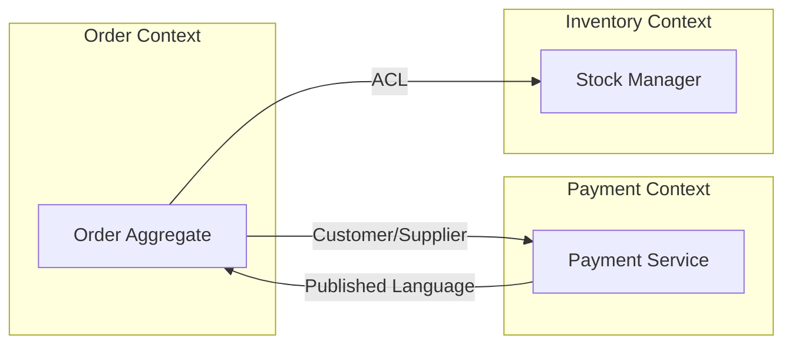

# Knowledge Pack: DDD Strategic Design

## Purpose

Provides strategic Domain-Driven Design guidance for {{language_name}} {{language_version}} projects using {{architecture_style}} architecture. Covers bounded context identification, context mapping with integration patterns, Anti-Corruption Layer implementation, and automated context map generation via Mermaid diagrams. Included when `architecture.style` is `hexagonal`/`ddd` or `ddd.enabled` is `true`.

---

## Section 1 — Bounded Context: Definition and Identification

### What is a Bounded Context

A Bounded Context is a semantic boundary within which a domain model is consistent and unambiguous. Each bounded context has its own Ubiquitous Language — the same term (e.g., "Order") can mean different things in different contexts.

### Identification Criteria

| Criterion | Description | Example |
|-----------|-------------|---------|
| Distinct Ubiquitous Language | Same term has different meaning across teams | "Account" in Billing vs. Identity |
| Own Data Model | Each context owns its persistence schema | Order context owns `orders` table |
| Independent Lifecycle | Can be deployed and versioned independently | Payment service releases independently |
| Team Ownership | One team owns one or more contexts | Checkout team owns Order + Cart contexts |

### Decomposition Heuristics

1. **Pivot Events**: Identify domain events that trigger cross-boundary workflows. Each event producer and consumer likely belongs to a different bounded context.
2. **Deploy Autonomy**: If two modules must always deploy together, they belong to the same context. If they can deploy independently, consider separating them.
3. **Team Ownership**: Follow Conway's Law — align bounded contexts with team boundaries. A context should be owned by exactly one team.
4. **Data Ownership**: If two modules share the same database table, they are likely in the same context. Cross-context data sharing requires explicit integration patterns.

### Anti-Pattern: Shared Database

Never share a database schema between bounded contexts. Each context owns its data store. Cross-context data access must go through published interfaces (APIs, events, or ACLs).

---

## Section 2 — Context Map with Integration Patterns

A Context Map documents the relationships between bounded contexts. Each relationship uses one of six integration patterns.

### Integration Patterns Reference

| Pattern | Direction | Description | When to Use |
|---------|-----------|-------------|-------------|
| Shared Kernel | Bidirectional | Two contexts share a small, explicitly defined subset of the domain model | Tightly coupled teams that co-own a small shared module |
| Customer/Supplier | Upstream/Downstream | Upstream context provides data; downstream consumes it | Clear producer-consumer relationship with negotiated contracts |
| Conformist | Upstream/Downstream | Downstream accepts the upstream model without translation | Downstream team has no leverage to influence upstream API |
| Anti-Corruption Layer | Downstream | Downstream translates upstream model into its own domain language | Protecting domain purity from external or legacy systems |
| Open Host Service | Upstream | Upstream exposes a stable, versioned API for multiple consumers | Multiple consumers need the same data with a stable contract |
| Published Language | Bidirectional | Shared schema (e.g., Protobuf, Avro, JSON Schema) as the integration contract | Event-driven systems with schema registry |

### Pattern Selection Decision Tree

```
Is the integration between teams you control?
├── YES: Do both teams co-own the shared model?
│   ├── YES → Shared Kernel
│   └── NO: Can downstream influence the upstream API?
│       ├── YES → Customer/Supplier
│       └── NO → Conformist
└── NO (external/legacy system):
    ├── Is the external model stable and well-documented?
    │   ├── YES → Open Host Service (upstream) or Conformist (downstream)
    │   └── NO → Anti-Corruption Layer
    └── Is schema evolution required?
        └── YES → Published Language
```

### Code Example: Customer/Supplier Pattern

```{{language_name}}
/**
 * Upstream: Order context publishes OrderPlaced events.
 * Downstream: Inventory context consumes them.
 */
public interface OrderEventPublisher {

    void publish(OrderPlacedEvent event);
}

public record OrderPlacedEvent(
        String orderId,
        String productId,
        int quantity) {
}
```

---

## Section 3 — Template ACL with Compilable Code

### Anti-Corruption Layer Interface

The ACL pattern protects a bounded context from external model pollution by providing an explicit translation layer between the external model and the internal domain model.

```{{language_name}}
/**
 * Anti-Corruption Layer interface for translating external
 * models into domain models.
 *
 * @param <E> the external model type
 * @param <D> the domain model type
 */
public interface AntiCorruptionLayer<E, D> {

    /**
     * Translates an external model into a domain model.
     *
     * @param external the external model instance
     * @return the translated domain model
     */
    D translate(E external);
}
```

### Concrete Implementation Example

```{{language_name}}
/**
 * External payment gateway response model.
 * This is the upstream model we do NOT control.
 */
public record PaymentGatewayResponse(
        String txnId,
        String statusCode,
        long amountCents,
        String currencyIso) {
}

/**
 * Internal domain model for payment confirmation.
 * This is our bounded context's own model.
 */
public record PaymentConfirmation(
        String transactionId,
        PaymentStatus status,
        Money amount) {
}

public enum PaymentStatus {
    APPROVED, DECLINED, PENDING
}

public record Money(long amountInCents, String currency) {
}
```

```{{language_name}}
/**
 * ACL implementation translating PaymentGatewayResponse
 * into PaymentConfirmation domain model.
 */
public final class PaymentGatewayAcl
        implements AntiCorruptionLayer<
                PaymentGatewayResponse,
                PaymentConfirmation> {

    private static final String APPROVED_CODE = "00";
    private static final String PENDING_CODE = "01";

    @Override
    public PaymentConfirmation translate(
            PaymentGatewayResponse external) {
        return new PaymentConfirmation(
                external.txnId(),
                mapStatus(external.statusCode()),
                new Money(
                        external.amountCents(),
                        external.currencyIso()));
    }

    private PaymentStatus mapStatus(String code) {
        if (APPROVED_CODE.equals(code)) {
            return PaymentStatus.APPROVED;
        }
        if (PENDING_CODE.equals(code)) {
            return PaymentStatus.PENDING;
        }
        return PaymentStatus.DECLINED;
    }
}
```

### Integration with Hexagonal Ports

In a hexagonal architecture, the ACL sits in the **outbound adapter** layer and implements a **domain port**:

```
domain/
├── port/
│   └── PaymentGatewayPort.java      ← domain port interface
└── model/
    └── PaymentConfirmation.java      ← domain model

adapter/
└── outbound/
    ├── PaymentGatewayAcl.java        ← ACL (implements port)
    └── PaymentGatewayResponse.java   ← external model
```

```{{language_name}}
/**
 * Domain port for payment gateway integration.
 * Defined in domain layer — no external dependencies.
 */
public interface PaymentGatewayPort {

    PaymentConfirmation processPayment(
            String orderId, Money amount);
}
```

### Test Example for ACL

```{{language_name}}
class PaymentGatewayAclTest {

    private final PaymentGatewayAcl acl =
            new PaymentGatewayAcl();

    void translate_approvedResponse_returnsApproved() {
        var external = new PaymentGatewayResponse(
                "txn-001", "00", 5000L, "USD");

        var result = acl.translate(external);

        // Verify translation correctness
        assert "txn-001".equals(result.transactionId());
        assert PaymentStatus.APPROVED == result.status();
        assert 5000L == result.amount().amountInCents();
        assert "USD".equals(result.amount().currency());
    }

    void translate_unknownCode_returnsDeclined() {
        var external = new PaymentGatewayResponse(
                "txn-002", "99", 1000L, "EUR");

        var result = acl.translate(external);

        assert PaymentStatus.DECLINED == result.status();
    }
}
```

---

## Section 4 — Skill /x-ddd-context-map (Conditional)

### Purpose

The `/x-ddd-context-map` skill auto-discovers bounded contexts from the project's package structure and generates a Mermaid context map diagram showing contexts and their integration patterns.

### Activation

This skill is available only when the `ddd-strategic` knowledge pack is present (i.e., when `architecture.style` is `hexagonal`/`ddd` or `ddd.enabled` is `true`).

### Usage

```
/x-ddd-context-map
```

### Algorithm

1. **Scan** the source tree for top-level packages under `domain/` or `src/`
2. **Identify** each package with its own `model/`, `port/`, or `service/` subpackage as a bounded context
3. **Detect** cross-context references by analyzing import statements
4. **Classify** each relationship using the integration pattern heuristics:
   - Imports of ACL classes → Anti-Corruption Layer
   - Shared interfaces/DTOs → Shared Kernel or Published Language
   - Event classes → Customer/Supplier
   - Direct model imports → Conformist (warning: potential violation)
5. **Generate** Mermaid flowchart with contexts as subgraphs and relationships as labeled edges

### Output Format

The skill produces a Mermaid `flowchart LR` diagram:



### Relationship Labels

| Label | Meaning |
|-------|---------|
| SK | Shared Kernel |
| C/S | Customer/Supplier |
| CF | Conformist |
| ACL | Anti-Corruption Layer |
| OHS | Open Host Service |
| PL | Published Language |

## Related Knowledge Packs

| Pack | Relationship |
|------|-------------|
| `architecture` | Hexagonal architecture principles and package structure |
| `layer-templates` | Code templates per architecture layer |
| `architecture-patterns` | Detailed pattern implementations |
