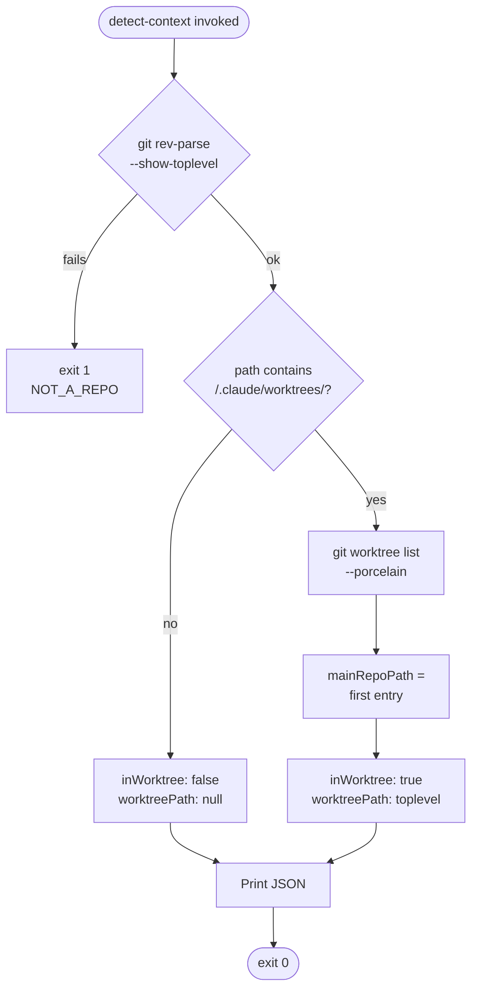

## Global Output Policy

- **Language**: English ONLY.
- **Tone**: Technical, Direct, and Concise.
- **Efficiency**: Remove all conversational fillers and greetings to save tokens.

# Skill: Git Worktree Management

## Purpose

Centralizes all git worktree operations for {{PROJECT_NAME}}. Provides isolated working directories for parallel task and story execution without conflicts, with automatic cleanup of stale or merged worktrees.

## When to Use

- Creating isolated working directories for parallel story/task implementation
- Listing active worktrees and their status
- Removing specific worktrees after completion
- Cleaning up obsolete worktrees (merged, stale, orphan)
- Any workflow requiring parallel execution in isolated directories

## Triggers

- `/x-git-worktree create --branch <name>` -- create a new worktree
- `/x-git-worktree list` -- list all active worktrees with status
- `/x-git-worktree remove --id <identifier>` -- remove a specific worktree
- `/x-git-worktree cleanup` -- remove obsolete worktrees
- `/x-git-worktree cleanup --dry-run` -- preview cleanup without removing

## Worktree Base Directory

All worktrees are created under `.claude/worktrees/` relative to the repository root.

```
.claude/
  worktrees/
    task-0029-0001-001/       # Worktree for a task
    story-0029-0002/          # Worktree for a story
    hotfix-auth/              # Custom worktree
```

## Naming Convention

> **See:** [Rule 14 — Worktree Lifecycle](../../rules/14-worktree-lifecycle.md) for the naming convention, protected branches, non-nesting invariant, lifecycle, and creator-owns-removal matrix.

When `--id` is not provided, the identifier is derived from the branch name by stripping common prefixes (`feat/`, `feature/`, `fix/`, `hotfix/`, `refactor/`).

## Operations

### Operation 1: create

Creates a new git worktree in `.claude/worktrees/{identifier}/`.

#### Parameters

| Parameter | Type | Required | Default | Description |
|-----------|------|----------|---------|-------------|
| `--branch` | string | **Yes** | -- | Branch name for the worktree |
| `--base` | string | No | `develop` | Base branch to create the new branch from |
| `--id` | string | No | derived from branch | Worktree directory identifier |

#### Workflow

```
1. VALIDATE    -> Check branch is not protected (main, develop)
2. VALIDATE    -> Check branch is not already an active worktree
3. FETCH       -> git fetch origin to ensure up-to-date refs
4. BRANCH      -> Create branch from --base if it does not exist
5. WORKTREE    -> git worktree add .claude/worktrees/{id}/ {branch}
6. VERIFY      -> Confirm worktree was created successfully
7. OUTPUT      -> Return absolute path of the worktree
```

#### Step 1 -- Validate Protected Branches

Never create a worktree directly on `main` or `develop`. These are protected branches.

```bash
# Check for protected branches
BRANCH_NAME="$1"
if [ "$BRANCH_NAME" = "main" ] || [ "$BRANCH_NAME" = "develop" ]; then
  echo "ERROR: Cannot create worktree on protected branch ($BRANCH_NAME)"
  exit 1
fi
```

#### Step 2 -- Check Active Worktrees

```bash
# Verify the branch is not already checked out in a worktree
git worktree list --porcelain | grep -q "branch refs/heads/$BRANCH_NAME"
if [ $? -eq 0 ]; then
  echo "ERROR: Branch '$BRANCH_NAME' is already an active worktree"
  exit 1
fi
```

#### Step 3 -- Fetch Remote

```bash
git fetch origin
```

#### Step 4 -- Create Branch (if needed)

```bash
# Only create if branch does not exist locally or remotely
if ! git rev-parse --verify "$BRANCH_NAME" >/dev/null 2>&1; then
  git branch "$BRANCH_NAME" "$BASE_BRANCH"
fi
```

#### Step 5 -- Create Worktree

```bash
WORKTREE_DIR=".claude/worktrees/$IDENTIFIER"
git worktree add "$WORKTREE_DIR" "$BRANCH_NAME"
```

#### Step 6 -- Verify

```bash
if [ -d "$WORKTREE_DIR" ] && [ -f "$WORKTREE_DIR/.git" ]; then
  echo "Worktree created at: $(cd "$WORKTREE_DIR" && pwd)"
else
  echo "ERROR: Worktree creation failed"
  exit 1
fi
```

#### Derive Identifier from Branch Name

When `--id` is not specified, derive the identifier by stripping known prefixes:

```bash
derive_id() {
  local branch="$1"
  # Strip common branch prefixes
  local id="${branch#feat/}"
  id="${id#feature/}"
  id="${id#fix/}"
  id="${id#hotfix/}"
  id="${id#refactor/}"
  echo "$id"
}
```

### Operation 2: list

Lists all active worktrees with status information.

#### Output Format

```
| ID                    | Branch                              | Status   | Last Commit       | Age    |
| :---                  | :---                                | :---     | :---              | :---   |
| task-0029-0001-001    | feat/task-0029-0001-001-domain      | ACTIVE   | 2026-04-07 10:30  | 2h     |
| story-0029-0002       | feat/story-0029-0002-task-model     | ACTIVE   | 2026-04-07 08:00  | 4h30m  |
| task-0029-0003-002    | feat/task-0029-0003-002-lint        | STALE    | 2026-03-31 15:00  | 7d+    |
| hotfix-auth           | hotfix/auth-fix                     | MERGED   | 2026-04-06 12:00  | 1d     |
```

#### Status Classification

| Status | Condition |
|--------|-----------|
| `ACTIVE` | Branch exists, last commit within 7 days, not merged |
| `STALE` | Branch exists, last commit older than 7 days |
| `MERGED` | Branch has been merged into target (develop or main) |
| `ORPHAN` | Branch no longer exists locally or on remote |

#### Implementation

```bash
# List worktrees under .claude/worktrees/
WORKTREE_BASE=".claude/worktrees"
for dir in "$WORKTREE_BASE"/*/; do
  [ -d "$dir" ] || continue
  ID=$(basename "$dir")
  BRANCH=$(git -C "$dir" rev-parse --abbrev-ref HEAD 2>/dev/null)
  LAST_COMMIT=$(git -C "$dir" log -1 --format="%ci" 2>/dev/null)
  STATUS=$(classify_status "$BRANCH" "$LAST_COMMIT")
  echo "| $ID | $BRANCH | $STATUS | $LAST_COMMIT | $(age "$LAST_COMMIT") |"
done
```

### Operation 3: remove

Removes a specific worktree by identifier.

#### Parameters

| Parameter | Type | Required | Description |
|-----------|------|----------|-------------|
| `--id` | string | **Yes** | Worktree identifier to remove |

#### Workflow

```bash
WORKTREE_DIR=".claude/worktrees/$IDENTIFIER"

# 1. Verify worktree exists
if [ ! -d "$WORKTREE_DIR" ]; then
  echo "ERROR: Worktree '$IDENTIFIER' not found"
  exit 1
fi

# 2. Remove via git worktree
git worktree remove "$WORKTREE_DIR" --force

# 3. Prune stale worktree references
git worktree prune

# 4. Verify removal
if [ ! -d "$WORKTREE_DIR" ]; then
  echo "Worktree '$IDENTIFIER' removed successfully"
else
  echo "ERROR: Failed to remove worktree '$IDENTIFIER'"
  exit 1
fi
```

### Operation 4: cleanup

Removes obsolete worktrees based on three criteria.

#### Parameters

| Parameter | Type | Required | Default | Description |
|-----------|------|----------|---------|-------------|
| `--dry-run` | boolean | No | `false` | List candidates without removing |

#### Cleanup Criteria

| Criterion | Condition | Action |
|-----------|-----------|--------|
| `MERGED` | Branch merged into target (develop or main) | Remove worktree + delete local branch |
| `STALE` | Last commit older than 7 days | Remove worktree (preserve branch) |
| `ORPHAN` | Branch does not exist locally or on remote | Remove worktree |

#### Workflow

```
1. LIST        -> Enumerate all worktrees in .claude/worktrees/
2. CLASSIFY    -> Determine status of each worktree
3. FILTER      -> Select worktrees matching cleanup criteria
4. DRY-RUN     -> If --dry-run, report and stop
5. REMOVE      -> Execute git worktree remove for each candidate
6. CLEAN       -> Delete local branches for MERGED worktrees
7. PRUNE       -> git worktree prune
8. REPORT      -> Summary of removed worktrees
```

#### Branch Merged Detection

```bash
is_merged() {
  local branch="$1"
  local target="${2:-develop}"
  # Check if branch is fully merged into target
  git branch --merged "$target" | grep -q "$branch"
}
```

#### Stale Detection (>7 days)

```bash
is_stale() {
  local branch="$1"
  local last_epoch=$(git log -1 --format="%ct" "$branch" 2>/dev/null)
  local now_epoch=$(date +%s)
  local seven_days=$((7 * 24 * 3600))
  [ $((now_epoch - last_epoch)) -gt $seven_days ]
}
```

#### Orphan Detection

```bash
is_orphan() {
  local branch="$1"
  # Check local
  if git rev-parse --verify "$branch" >/dev/null 2>&1; then
    return 1
  fi
  # Check remote
  if git ls-remote --heads origin "$branch" | grep -q "$branch"; then
    return 1
  fi
  return 0
}
```

#### Dry-Run Output

```
Cleanup candidates:
| ID                    | Status   | Reason                          |
| :---                  | :---     | :---                            |
| task-0029-0001-001    | MERGED   | Branch merged into develop      |
| task-0029-0003-002    | STALE    | No commits for 12 days          |
| story-0029-0005       | ORPHAN   | Branch does not exist           |

Total: 3 worktrees would be removed (use without --dry-run to execute)
```

#### Execution Output

```
Cleanup results:
| ID                    | Status   | Action                                |
| :---                  | :---     | :---                                  |
| task-0029-0001-001    | MERGED   | Removed worktree + deleted branch     |
| task-0029-0003-002    | STALE    | Removed worktree (branch preserved)   |
| story-0029-0005       | ORPHAN   | Removed worktree                      |

3 worktrees removed (1 MERGED, 1 STALE, 1 ORPHAN)
```

### Operation 5: detect-context

Read-only operation that returns the current worktree context. Used by skills that need to decide whether to create a new worktree or reuse the existing one (Rule 14 — Worktree Lifecycle, Section 3 — Non-Nesting Invariant).

> **See:** [Rule 14 — Worktree Lifecycle](../../rules/14-worktree-lifecycle.md), Section 3 (Non-Nesting Invariant), for the normative rule this operation implements.

#### Parameters

(none)

#### Output

JSON to stdout:

```json
{
  "inWorktree": true,
  "worktreePath": "/abs/path/to/.claude/worktrees/story-0037-0003",
  "mainRepoPath": "/abs/path/to/repo"
}
```

#### Workflow

```
1. RESOLVE     -> git rev-parse --show-toplevel (current cwd top)
2. CLASSIFY    -> If toplevel path contains /.claude/worktrees/, set
                  inWorktree=true and worktreePath=toplevel; otherwise
                  inWorktree=false and worktreePath=null.
3. RESOLVE MAIN -> If inWorktree=true, use `git worktree list --porcelain`
                  to resolve the main repo path (first `worktree` entry).
                  Otherwise, mainRepoPath=toplevel.
4. EMIT        -> Print JSON to stdout, exit 0.
```

> **Design note:** The classification is intentionally a simple substring check on `/.claude/worktrees/` because the project convention (Rule 14) anchors all managed worktrees under that path. We do NOT cross-check `git worktree list` for the classification itself — `list` is used only to resolve `mainRepoPath` when inside a worktree.

#### Detection Flow



#### Bash Snippet (canonical, copy-pasteable)

```bash
detect_worktree_context() {
  local toplevel main_repo wt_path in_wt="false"
  toplevel=$(git rev-parse --show-toplevel 2>/dev/null) || {
    echo '{"error":"NOT_A_REPO"}' >&2
    return 1
  }

  # Harden against JSON injection (CWE-116): escape backslash and double-quote
  # in any path string that will be interpolated into the JSON output.
  json_escape() {
    printf '%s' "$1" | sed -e 's/\\/\\\\/g' -e 's/"/\\"/g'
  }

  if printf '%s' "$toplevel" | grep -q "/\.claude/worktrees/"; then
    in_wt="true"
    wt_path=$(json_escape "$toplevel")
    # Fallback: if `git worktree list` fails or returns no entry, trust
    # $toplevel so mainRepoPath remains a valid non-empty string per contract.
    if ! main_repo=$(git worktree list --porcelain 2>/dev/null \
                | awk '/^worktree/{print $2; exit}') || [ -z "$main_repo" ]; then
      main_repo="$toplevel"
    fi
    main_repo=$(json_escape "$main_repo")
    printf '{"inWorktree":%s,"worktreePath":"%s","mainRepoPath":"%s"}\n' \
      "$in_wt" "$wt_path" "$main_repo"
  else
    main_repo=$(json_escape "$toplevel")
    printf '{"inWorktree":%s,"worktreePath":null,"mainRepoPath":"%s"}\n' \
      "$in_wt" "$main_repo"
  fi
}
```

#### Sample Outputs

**Case 1 — Main repo:**

```json
{"inWorktree":false,"worktreePath":null,"mainRepoPath":"/Users/dev/repo"}
```

**Case 2 — Inside a worktree:**

```json
{"inWorktree":true,"worktreePath":"/Users/dev/repo/.claude/worktrees/story-0037-0003","mainRepoPath":"/Users/dev/repo"}
```

**Case 3 — Detached HEAD inside main repo:**

```json
{"inWorktree":false,"worktreePath":null,"mainRepoPath":"/Users/dev/repo"}
```

#### Error Handling

| Scenario | Behavior |
| :--- | :--- |
| Not a git repo | exit 1, JSON `{"error":"NOT_A_REPO"}` to stderr |
| `git worktree list` fails | fallback: trust `git rev-parse --show-toplevel` only |
| Path contains `"` or `\` | hardened via `json_escape()` (CWE-116) |

#### Prerequisites

- `git` (any version supporting `worktree list --porcelain`, i.e. >= 2.7)
- `jq` is recommended for consumers parsing the output (not required by the snippet itself)
- `awk`, `sed`, `grep`, `printf` — all POSIX standard

#### Security Considerations

- **CWE-209 (Information Exposure through Error Messages):** The JSON output includes absolute paths (`worktreePath`, `mainRepoPath`). Consumers that persist or transmit this JSON to shared logs MUST redact home-directory prefixes (e.g., replace `/Users/{name}` or `/home/{name}` with `~` or `<HOME>`) before logging, to avoid leaking usernames.
- **CWE-116 (Improper Encoding or Escaping of Output):** The snippet uses `json_escape()` to escape backslashes and double-quotes in path strings before interpolating them into the JSON envelope. A path containing a literal `"` or `\` without escaping would break the JSON structure and could be exploited to inject fields.
- **Symlink handling:** `git rev-parse --show-toplevel` returns the canonical (resolved) path. If a worktree is accessed via a symlink, the canonical path is what is classified — this is deterministic and matches the `/.claude/worktrees/` convention in Rule 14.

#### Inline Use Pattern

Consumer skills (e.g., `x-git-push`, `x-story-implement`) SHOULD inline the `detect_worktree_context()` snippet at the start of their workflow when they need to decide whether to create a new worktree or reuse the current one. Rationale: avoids an extra shell-out to `/x-git-worktree detect-context` (unnecessary cost in skills that run frequently). The snippet above is the canonical source of truth — any divergence is treated as a bug.

Example use in `x-git-push`:

```bash
# Step 1.3 — Detect worktree context
detect_worktree_context() {
  local toplevel main_repo wt_path in_wt="false"
  toplevel=$(git rev-parse --show-toplevel 2>/dev/null) || {
    echo '{"error":"NOT_A_REPO"}' >&2
    return 1
  }
  json_escape() {
    printf '%s' "$1" | sed -e 's/\\/\\\\/g' -e 's/"/\\"/g'
  }
  if printf '%s' "$toplevel" | grep -q "/\.claude/worktrees/"; then
    in_wt="true"
    wt_path=$(json_escape "$toplevel")
    # Fallback: if `git worktree list` fails or returns no entry, trust
    # $toplevel so mainRepoPath remains a valid non-empty string per contract.
    if ! main_repo=$(git worktree list --porcelain 2>/dev/null \
                | awk '/^worktree/{print $2; exit}') || [ -z "$main_repo" ]; then
      main_repo="$toplevel"
    fi
    main_repo=$(json_escape "$main_repo")
    printf '{"inWorktree":%s,"worktreePath":"%s","mainRepoPath":"%s"}\n' \
      "$in_wt" "$wt_path" "$main_repo"
  else
    main_repo=$(json_escape "$toplevel")
    printf '{"inWorktree":%s,"worktreePath":null,"mainRepoPath":"%s"}\n' \
      "$in_wt" "$main_repo"
  fi
}

CONTEXT_JSON=$(detect_worktree_context)
IN_WT=$(printf '%s' "$CONTEXT_JSON" | jq -r '.inWorktree')

if [ "$IN_WT" = "true" ]; then
  echo "Already in worktree, reusing"
else
  # Create worktree via /x-git-worktree create
  :
fi
```

> **Heredoc safety:** When embedding the snippet inside an outer heredoc, use a quoted terminator (`<<'BASH'` rather than `<<BASH`) to prevent the outer shell from expanding `$toplevel`, `$main_repo`, etc. before the snippet runs.

## Git Flow Integration (RULE-005)

| Context | Base Branch | Branch Prefix |
|---------|-------------|---------------|
| Task (from develop) | `develop` | `feat/task-XXXX-YYYY-NNN-description` |
| Story (from develop) | `develop` | `feat/story-XXXX-YYYY-description` |
| Hotfix | `main` | `hotfix/description` |
| Custom | User-specified | User-specified |

### Protected Branches

Worktrees MUST NOT be created for protected branches:
- `main` -- production branch
- `develop` -- integration branch

Attempting to create a worktree for `main` or `develop` results in an immediate error.

### Post-Merge Lifecycle

After a branch is merged via PR:
1. The worktree becomes a cleanup candidate (status: `MERGED`)
2. `/x-git-worktree cleanup` removes the worktree and deletes the local branch
3. The remote branch is deleted by GitHub after PR merge (if configured)

<!--
  NOTE: The "Integration with Epic Execution" section was removed in EPIC-0037 / STORY-0037-0001.
  It documented a delegation flow between x-epic-implement and x-git-worktree that does NOT
  currently exist (x-epic-implement still uses the deprecated Agent(isolation:"worktree")).
  STORY-0037-0003 will rewrite this section with an accurate diagram once the real migration
  of x-epic-implement to /x-git-worktree is implemented.
-->

## Error Handling

| Scenario | Action |
|----------|--------|
| `--branch` not provided for create | Abort with usage message |
| Branch is protected (main/develop) | Abort with error code `PROTECTED_BRANCH` (Rule 14 §2) and exit 1 |
| Branch already an active worktree | Abort with conflict error |
| Worktree directory already exists | Abort with existence error |
| `--id` not found for remove | Abort with not-found error |
| `git worktree add` fails | Report git error, suggest manual cleanup |
| `git worktree remove` fails | Try `--force`, report if still failing |
| No worktrees to cleanup | Report "No obsolete worktrees found" |

## Integration Notes

> **Note on current vs future state:** The `x-epic-implement` → `x-git-worktree` and `x-story-implement` → `x-git-worktree` delegations listed below describe the **target integration** introduced by EPIC-0037. Today, those orchestrators still use the deprecated `Agent(isolation:"worktree")` mechanism (see ADR-0003). The migration lands story-by-story: `x-story-implement` via `story-0037-0003`, `x-epic-implement` via `story-0037-0007`.

| Skill | Relationship | Status | Context |
|-------|-------------|--------|---------|
| `x-epic-implement` | target caller | Pending (`story-0037-0007`) | Will replace `Agent(isolation:"worktree")` with explicit `/x-git-worktree create` before dispatching story subagents |
| `x-story-implement` | target caller | Pending (`story-0037-0003`) | Will create the story worktree via this skill in Phase 0 |
| `x-git-push` | related | Current | Branch creation and push from within a worktree directory |
