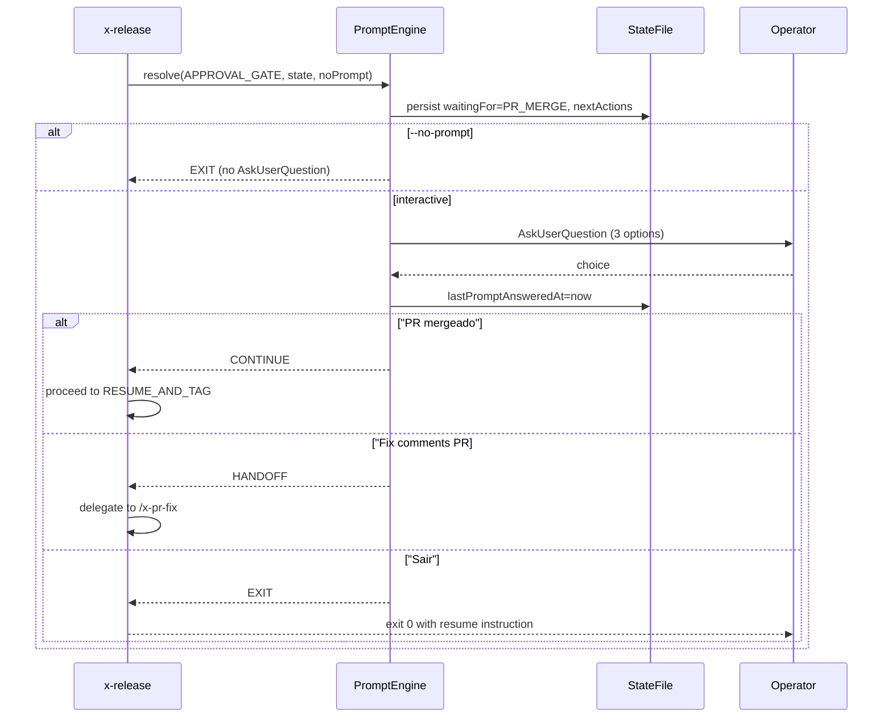

# Interactive Prompt Flow (story-0039-0007)

> Reference document for the `PromptEngine` integration in `x-release`.
> Covers the 3 halt points, their options, state persistence, and
> non-interactive fallback (`--no-prompt`).

## Overview

The `PromptEngine` (`dev.iadev.release.prompt.PromptEngine`) resolves
halt points in the `x-release` flow by presenting the operator with
`AskUserQuestion` prompts. Each prompt offers a fixed set of options
specific to the halt point.

## Halt Points

| Halt Point | Phase | `waitingFor` | Options |
|:---|:---|:---|:---|
| `APPROVAL_GATE` | Phase 8 | `PR_MERGE` | "PR mergeado — continuar", "Rodar /x-pr-fix PR#", "Sair e retomar depois" |
| `BACKMERGE_MERGE` | Phase 10 | `BACKMERGE_MERGE` | "PR mergeado — continuar", "Rodar /x-pr-fix PR#", "Sair e retomar depois" |
| `RECOVERABLE_FAILURE` | Any | `USER_CONFIRMATION` | "Tentar novamente", "Pular esta etapa", "Abortar" |

## State Persistence

At every halt point, `PromptEngine` persists the following fields to the
state file before prompting:

| Field | Value | Purpose |
|:---|:---|:---|
| `waitingFor` | Halt-point-specific enum | Indicates what event is being awaited |
| `nextActions` | List of `{label, command}` | Available options for the next prompt |
| `lastPromptAnsweredAt` | ISO-8601 UTC timestamp | Recorded after each operator response |

### waitingFor → nextActions Mapping

| `waitingFor` | `nextActions` (labels) |
|:---|:---|
| `PR_MERGE` | "PR mergeado — continuar", "Rodar /x-pr-fix PR#", "Sair e retomar depois" |
| `BACKMERGE_MERGE` | "PR mergeado — continuar", "Rodar /x-pr-fix PR#", "Sair e retomar depois" |
| `USER_CONFIRMATION` | "Tentar novamente", "Pular esta etapa", "Abortar" |

## Option Dispatch

### APPROVAL_GATE / BACKMERGE_MERGE

| Option | Action | Result |
|:---|:---|:---|
| "PR mergeado — continuar" | `CONTINUE` | Proceeds to next phase (RESUME_AND_TAG or cleanup) |
| "Rodar /x-pr-fix PR#" | `HANDOFF` | Delegates to `/x-pr-fix` (story-0039-0011) |
| "Sair e retomar depois" | `EXIT` | Exits with state preserved; resume via `--continue-after-merge` |

### RECOVERABLE_FAILURE

| Option | Action | Exit Code | Error Code |
|:---|:---|:---|:---|
| "Tentar novamente" | `RETRY` | 0 | — |
| "Pular esta etapa" | `SKIP` | 0 | — |
| "Abortar" | `ABORT` | 2 | `PROMPT_USER_ABORT` |

## Non-Interactive Mode (`--no-prompt`)

When `--no-prompt` is set (RULE-004):

1. `PromptEngine.resolve(haltPoint, state, noPrompt=true)` is called
2. State is persisted with `waitingFor` and `nextActions` (same as interactive)
3. `AskUserQuestion` is **never** invoked
4. Returns `EXIT` immediately
5. Textual resume instructions are printed (existing behavior)

The `--continue-after-merge` flag remains the primary non-interactive
resume mechanism and has precedence over `--no-prompt`.

## Sequence Diagram (APPROVAL_GATE)



## Error Codes

| Exit | Code | Condition |
|:---|:---|:---|
| 1 | `PROMPT_INVALID_RESPONSE` | Unexpected input (should not occur with AskUserQuestion fixed options) |
| 2 | `PROMPT_USER_ABORT` | Operator chose "Abortar" at a recoverable failure halt |

## Java API

```java
// Constructor injection (ports)
var engine = new PromptEngine(statePort, clockPort, askPort);

// Resolve a halt point
PromptResult result = engine.resolve(
    HaltPoint.APPROVAL_GATE,
    currentState,
    noPrompt);  // true = skip AskUserQuestion

// Dispatch on result
switch (result.action()) {
    case CONTINUE -> proceedToNextPhase();
    case EXIT     -> exitWithResumeInstructions();
    case RETRY    -> retryFailedOperation();
    case SKIP     -> skipCurrentStep();
    case ABORT    -> exitWithError(result.exitCode());
    case HANDOFF  -> delegateToFixComments();
}
```
