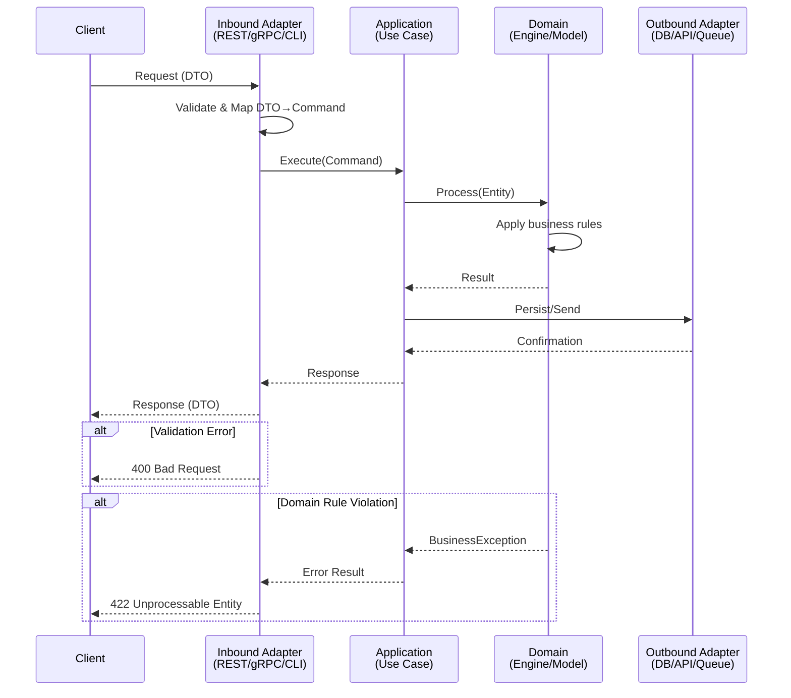

## Output Policy

- **Language**: Portuguese (pt-BR) for all content. English for technical terms (cache, timeout, handler, endpoint) and code identifiers.
- **Tone**: Technical, Direct, and Concise.
- **Efficiency**: Remove all conversational fillers and greetings to save tokens.

# Skill: Story Creator

## Purpose

Generate individual story files from an Epic and system specification. Each story is self-contained: a developer can implement it without going back to the original spec. Stories include data contracts, Gherkin acceptance criteria, Mermaid sequence diagrams, dependency declarations, tagged sub-tasks, and quality gate validation.

## Triggers

- `/x-story-create <spec_file> <epic_file>` — generate all stories from the epic index
- User asks to create stories, generate user stories from an epic, or break an epic into implementable stories
- User mentions writing acceptance criteria, detailing technical stories, or creating story files with contracts and diagrams

## Parameters

| Parameter | Type | Required | Default | Description |
|-----------|------|----------|---------|-------------|
| `<SPEC_FILE>` | Path | Yes | — | Path to the system specification file |
| `<EPIC_FILE>` | Path | Yes | — | Path to the Epic file (with story index and rules table) |
| `--quality-threshold` | int | No | 70 | Minimum score (0-100) required for a story to be saved |

## Prerequisites

Read the following files before starting:

**Template (output structure):**
- `.claude/templates/_TEMPLATE-STORY.md` — The exact structure to follow

**Decomposition philosophy (sizing and boundary heuristics):**
- `.claude/skills/x-epic-decompose/references/decomposition-guide.md`

**Gherkin completeness requirements:**
- `.claude/skills/story-planning/references/story-decomposition.md` — Rule 13, section SD-02 (mandatory scenario categories and TPP ordering)

**Required inputs from the user:**
- The system specification file (original spec)
- The Epic file (with story index and rules table) — generated by `x-epic-create` skill

## Workflow

### Step 1 — Read the Epic and Spec

Read both files completely. From the Epic, extract:
- The story index (IDs, titles, dependencies)
- The rules table (RULE-001..N) — stories reference these by ID
- The DoD (copied into each story for quick reference)

From the spec, understand the full technical context: journeys, data contracts, protocol
mappings, state machines, error codes, metrics.

### Step 2 — Generate Each Story

For each story in the Epic's index, create a file following `_TEMPLATE-STORY.md`. Process
stories in dependency order (foundations first, then core, then extensions).

#### 2.1 — Dependencias

| Blocked By | Blocks |
| :--- | :--- |
| Stories this one depends on | Stories that depend on this one |

Must be consistent with the Epic's index. Cross-check: if story-0001-0003 lists story-0001-0002 as
blocker, then story-0001-0002 must list story-0001-0003 in its Blocks column.

#### 2.2 — Regras Transversais Aplicaveis

Reference only the rules from the Epic that impact this specific story. Omit rules
irrelevant to this story's scope.

#### 2.3 — Descricao

Start with user story format: "Como **<Persona>**, eu quero <capability>, garantindo que <outcome>."

Follow with 2-3 paragraphs of technical context: why this story exists, how it fits in the
epic, what architectural patterns it establishes or reuses. Include specific protocol details,
component names, and design decisions from the spec.

Add numbered subsections (3.1, 3.2, ...) for each distinct technical requirement. Be specific:
protocol details, framing formats, concurrency requirements, timeout values — everything a
developer needs.

#### 2.4 — Entrega de Valor (Section 3.5 — Mandatory)

Every story MUST contain a Section 3.5 with exactly 3 bullets articulating measurable business
value. This is the most important section for stakeholder communication. It answers: "What does
the business gain when this story is done?"

**Structure (exactly 3 bullets, all mandatory):**
- **Valor Principal:** A single sentence — the measurable business outcome
- **Metrica de Sucesso:** How to verify value was delivered (quantitative when possible)
- **Impacto no Negocio:** Direct impact on users/stakeholders

**Rules (Non-Negotiable):**
- Value MUST be from the business/user perspective, NOT technical
- FORBIDDEN: "Migrar classes A, B, C para Java" (technical task, no business value)
- CORRECT: "Endpoint de pagamento com credito disponivel em Java, permitindo desligamento do servico legado .NET"
- FORBIDDEN: "Implementar repositorio de dados" (infrastructure detail)
- CORRECT: "Persistencia de transacoes garantida com integridade referencial, habilitando auditoria"
- FORBIDDEN: "Codigo funciona" (non-measurable)
- CORRECT: "100% dos endpoints respondem em < 200ms p95, validado por teste de carga"
- FORBIDDEN: "Melhorar o sistema" (vague)
- CORRECT: "Reducao de 30% no tempo de onboarding de novos desenvolvedores"
- Layer 0 (Foundation) stories express enablement value: "Infraestrutura de banco pronta, desbloqueando N historias de dominio"
- Layer 4 (Cross-cutting) stories express risk reduction: "Cobertura de testes >= 95%, reduzindo risco de regressao em deploys futuros"

**Anti-Patterns for Value Articulation:**

| Anti-Pattern | Example | Why It Fails |
|:---|:---|:---|
| Technical-only language | "Implementar repositorio" | No business value expressed |
| Non-measurable metric | "Codigo funciona" | Cannot be objectively verified |
| Vague impact | "Melhorar o sistema" | No quantifiable improvement |

A story missing Section 3.5 or with any bullet containing purely technical language without
business value MUST be rejected by the quality gate and refined before saving.

#### 2.5 — Definicoes de Qualidade Locais

**DoR Local**: Specific preconditions for this story. Use checkboxes `- [ ]`.
Examples: "Porta TCP definida", "Schema da tabela X criado", "Decisao sobre Y tomada".

**DoD Local**: Specific acceptance criteria for this story. Use checkboxes.
Examples: "Servidor TCP aceitando conexoes", "Handler X funcional", "Teste de carga validado".

**DoD Global**: Copy from the Epic verbatim. This is for quick reference during code review.

#### 2.6 — Contratos de Dados (Data Contract)

This is the most critical section. Data contracts must be copy-paste precise.
Rich data contracts eliminate ambiguity by providing explicit types, validations,
examples, and error codes for every endpoint.

##### 2.6.1 — Request Table

For REST-based stories, use the expanded Request format:

| Campo | Tipo | M/O | Validacoes | Exemplo |
| :--- | :--- | :--- | :--- | :--- |
| `field_name` | `UUID` / `BigDecimal` / `String(255)` / `Integer` / `List<String>` | M ou O | min/max, regex, enum values | valor concreto |

For protocol-based stories (binary protocols, gRPC, etc.), use the format:

| Campo | Formato | Request | Response | Origem / Regra |
| :--- | :--- | :--- | :--- | :--- |
| `field_name` | type format | M/O/- | M/O/- | Generate/Echo/Derive — description |

##### 2.6.2 — Response Table

| Campo | Tipo | Sempre presente | Descricao |
| :--- | :--- | :--- | :--- |
| `field_name` | `UUID` / `String` / `BigDecimal` | Sim ou Nao | descricao do campo |

##### 2.6.3 — Error Codes Mapeados

Every endpoint MUST declare its error codes following RFC 7807 (RULE-006 — Problem Details for HTTP APIs):

| HTTP Status | Error Code | Condicao | Mensagem (RFC 7807) |
| :--- | :--- | :--- | :--- |
| `400` | `INVALID_FIELD` | Campo obrigatorio ausente ou formato invalido | `{"type":"...","title":"Bad Request","status":400,"detail":"..."}` |
| `404` | `NOT_FOUND` | Recurso nao encontrado | `{"type":"...","title":"Not Found","status":404,"detail":"..."}` |
| `409` | `CONFLICT` | Violacao de regra de negocio | `{"type":"...","title":"Conflict","status":409,"detail":"..."}` |
| `422` | `UNPROCESSABLE` | Validacao de dominio falhou | `{"type":"...","title":"Unprocessable Entity","status":422,"detail":"..."}` |

Error codes follow RFC 7807 format with fields: `type`, `title`, `status`, `detail`, and `instance`.

##### 2.6.4 — Event Schema (event-driven stories)

For stories with `eventDriven: true`, include the Event Schema section:

| Campo | Tipo | Obrigatorio | Descricao |
| :--- | :--- | :--- | :--- |
| `eventType` | `String` | Sim | Tipo do evento (e.g., `OrderCreated`, `PaymentProcessed`) |
| `eventVersion` | `String` | Sim | Versao do schema do evento (e.g., `1.0.0`) |
| `timestamp` | `Instant` | Sim | Momento da emissao do evento (ISO-8601 UTC) |
| `correlationId` | `UUID` | Sim | ID de correlacao para rastreamento |
| `payload` | `Object` | Sim | Payload do evento (schema especifico do dominio) |

**Event versioning notes:**
- **Backward compatibility:** New fields MUST be optional; existing fields MUST NOT change type
- **Schema evolution strategy:** Use additive-only changes; breaking changes require new event type
- **Deprecation policy:** Deprecated event versions MUST be supported for at least 2 release cycles

##### Data Contract Precision Rules

- Field names must match the spec exactly (same casing, same naming)
- Types must be explicit with format: `UUID`, `BigDecimal`, `String(255)`, `Integer`, `List<String>`, etc.
- M/O flags must reflect the actual contract, not guesses
- Derivation rules must explain exactly how values are computed
- Fields without a declared type MUST emit a warning: "field type is required for rich contracts"
- Stories without endpoints MUST include a note: "Nenhum endpoint declarado nesta story"

#### 2.7 — Diagramas

Create Mermaid sequence diagrams showing the complete flow for this story's main operation.
Use the actual component names from the spec (not generic "Service A", "Service B").

Include:
- The trigger (client request, Kafka event, timer)
- Validation steps
- Business logic (decision engine, routing)
- Persistence (DB writes, cache updates)
- Async operations (Kafka publish, logging)
- Response construction
- Error paths (at least one error scenario)

##### Diagram Requirement Matrix

| Story Type | Sequence Diagram | Deployment Diagram | Activity Diagram |
|:---|:---|:---|:---|
| Request-Response flow (REST, gRPC, TCP) | **MANDATORY** | — | Recommended if 3+ branches |
| Event-driven flow (producer-broker-consumer) | **MANDATORY** | — | Recommended if 3+ branches |
| Infrastructure / deployment change | — | **MANDATORY** | — |
| Complex business logic (3+ decision branches) | Recommended | — | **MANDATORY** |
| Documentation / configuration only | Not required | Not required | Not required |
| Refactoring (no behavior change) | Recommended | — | — |

Rules:
- A story involving data flow between 2+ components MUST include a sequence diagram.
- A story altering infrastructure MUST include a deployment diagram.
- A story with no data flow and no infrastructure change MAY omit diagrams but should note "Diagram not required for this story type."

##### Inter-Layer Sequence Diagram Template

Use this template as the starting point for stories involving request-response flows:



Participant naming rules:
- Use actual component names from the spec (not generic "Service A").
- Must show at least: trigger - validation - business logic - persistence - response.
- Must include at least 1 error scenario with `alt` block.

##### Diagram Validation Checklist

- [ ] Participants use real component names (not "Service A", "Service B")
- [ ] Diagram shows at least 3 architecture layers (e.g., Inbound - Application - Domain)
- [ ] At least 1 error path is shown using `alt` block
- [ ] All data transformations are visible (DTO-Command, Entity-Domain)
- [ ] Async operations (if any) are distinguished from sync calls
- [ ] Response construction path is complete (from domain result back to client)

#### 2.8 — Criterios de Aceite (Gherkin)

Write Gherkin scenarios in Portuguese (DADO/QUANDO/ENTAO/E/MAS).

**Mandatory scenario categories (TPP order):**
1. **Degenerate cases** (first): null input, empty collection, zero value, missing required field — at least 1 scenario
2. **Happy path**: Main success flow with concrete values — at least 1 scenario
3. **Error paths**: Each documented error type must have a corresponding scenario with expected error code/message — at least 1 per error type
4. **Boundary values**: Triplet pattern for each bounded input — (at-minimum, at-maximum, past-maximum) — at least 1 triplet
5. **Complex edge cases** (if applicable): Combinations, race conditions, state transitions

**Minimum floor:** 4 scenarios per story (degenerate + happy + error + boundary/edge). If fewer than 4, add scenarios from under-represented categories or emit a warning.

**TPP ordering rationale:** Scenarios ordered from simplest (degenerate/null guards) to most complex (edge cases) to match the natural TDD red-green-refactor cycle. Degenerate cases MUST appear before happy paths.

**Boundary value triplet pattern:**
When a story involves bounded inputs (numeric ranges, string lengths, collection sizes), generate three scenarios per bound:
- At-minimum (e.g., value = 1 for range [1, 100])
- At-maximum (e.g., value = 100)
- Past-maximum (e.g., value = 101)
If the story has no naturally bounded inputs, boundary scenarios may be omitted but the 4-scenario minimum must still be met.

**Quality rules for Gherkin:**
- Use concrete values, not abstractions ("valor de R$ 100,50" not "um valor qualquer")
- Each scenario should be independently testable
- Avoid overlapping scenarios — each tests a distinct behavior
- Include field-level assertions ("o campo DE 39 deve ser '00'")

#### 2.9 — Formal Task Decomposition (Section 8)

Section 8 decomposes each story into formal, testable tasks with unique IDs, testability
patterns, and size constraints. Each task is the atomic unit of delivery — one PR per task.

##### 2.9.1 — Task ID Format

Every task receives a unique ID in the format `TASK-XXXX-YYYY-NNN`:
- `XXXX` — Epic number (4 digits, zero-padded)
- `YYYY` — Story number (4 digits, zero-padded)
- `NNN` — Sequential task number within the story (3 digits, starting at 001)

Example: `TASK-0029-0013-001`, `TASK-0029-0013-002`, ...

##### 2.9.2 — Task Table Format

Section 8 MUST contain a table with these columns:

| ID | Descricao | Camada | Dependencias | Tag | Padrao de Testabilidade | Estimativa LOC |
| :--- | :--- | :--- | :--- | :--- | :--- | :--- |
| `TASK-XXXX-YYYY-001` | Concise task description | domain | — | [Dev] | Domain+UnitTest | 80 |
| `TASK-XXXX-YYYY-002` | Concise task description | port | TASK-XXXX-YYYY-001 | [Dev] | Port+Adapter+IT | 60 |
| `TASK-XXXX-YYYY-003` | Concise task description | test | TASK-XXXX-YYYY-002 | [Test] | — | 100 |

Each row represents one atomic task. Use checkboxes `- [ ]` for tracking after the table.

##### 2.9.3 — Valid Testability Patterns

Every `[Dev]` task MUST follow one of these 6 valid testability patterns:

| Pattern | Component | Expected Test |
| :--- | :--- | :--- |
| Domain+UnitTest | Entity, Value Object, Engine | Unit test of business logic |
| Port+Adapter+IT | Interface + Implementation | Integration test with real dependency |
| UseCase+AT | Application use case | Acceptance test end-to-end |
| Endpoint+APITest | Controller/Resource | HTTP test with status/body/errors |
| Migration+Smoke | Schema migration | Smoke test of connectivity |
| Config+VerificationTest | Configuration | Verification test of loading |

`[Test]` tasks in Layer 4 (cross-cutting) are exempt from this requirement.
`[Doc]` tasks do not require a testability pattern.

##### 2.9.4 — Anti-Patterns (Rejected)

The following task decomposition patterns are anti-patterns and MUST be detected and
rejected during generation. When detected, merge or reformulate the task.

| Anti-Pattern | Detection Rule | Remediation |
| :--- | :--- | :--- |
| Interface-only | Task creates a port/interface without adapter | Merge with adapter task to form Port+Adapter+IT |
| DTO-only | Task creates DTO without endpoint or service usage | Merge with endpoint/service task |
| Test-only (outside Layer 4) | Task creates test without production code | Merge with corresponding [Dev] task (TDD pair) |
| Config-only without test | Task creates configuration without verification | Add Config+VerificationTest pattern |

When an anti-pattern is detected, log: `"Anti-pattern detected: <type> task reformulated"`

##### 2.9.5 — Sizing Constraints

| Constraint | Value | Action When Violated |
| :--- | :--- | :--- |
| Minimum tasks per story | 3 | Decompose existing tasks further |
| Maximum tasks per story | 8 | Merge related tasks |
| Minimum LOC per task | 20 | Merge with adjacent task in same layer |
| Maximum LOC per task | 300 | Split into 2+ tasks |
| Recommended LOC per task | 50-150 | Ideal range, no action needed |

**Merge rules:**
- Tasks below 20 LOC MUST be merged with an adjacent task in the same layer
- After merging, the resulting task MUST still follow a valid testability pattern
- If merging would exceed 300 LOC, split differently

**Split rules:**
- Tasks above 300 LOC MUST be split into 2 or more tasks
- Each resulting task MUST follow a valid testability pattern
- Each resulting task MUST have 20-300 LOC

**Story rejection:**
- A story with fewer than 3 tasks after all merge/split operations MUST be rejected
  with message: `"Minimum 3 tasks required, found N"`
- A story with more than 8 tasks after all merge/split operations MUST have tasks
  merged until the count is within range

##### 2.9.6 — Mandatory Test Task

Every story MUST include at least one of these test-tagged tasks:
- `[Test] Smoke/E2E: <teste automatizado validando criterio de aceite principal de ponta a ponta>`
- `[Test] Integracao: <teste de integracao validando fluxo completo>`

A story without ANY automated end-to-end validation task is INCOMPLETE and must not be saved.

##### 2.9.7 — Task Tags

- `[Dev]` — Implementation tasks (handler, service, repository, migration)
- `[Test]` — Test tasks (unit, integration, E2E, performance)
- `[Doc]` — Documentation tasks (diagrams, wiki, API docs)

### Step 3 — Optional Jira Integration (per story)

After generating each story's markdown content but before saving, optionally create the
story in Jira.

#### 3.1 — Cascaded from Orchestrator

If a `jiraContext` was provided by the orchestrator (`x-epic-decompose`) with
`jiraContext.enabled == true` and `jiraContext.cascadeToStories == true`:

For each story (no additional user prompting needed):
1. Call `mcp__atlassian__createJiraIssue` to create a Story issue:
   - `cloudId`: `jiraContext.cloudId`
   - `projectKey`: `jiraContext.projectKey`
   - `issueTypeName`: "Story"
   - `summary`: the story title
   - `description`: the user story text from Section 3 (the "Como **Persona**..." paragraph)
   - `contentFormat`: "markdown"
   - `parent` (optional): `jiraContext.epicIssueKey` — include only if `jiraContext.epicIssueKey` is present; omit entirely when absent (e.g., epic creation failed in Phase B) to avoid MCP errors and maintain non-blocking behavior
   - `additional_fields`: `{ "labels": [{ "name": "generated-by-ia-dev-env" }, { "name": "story-XXXX-YYYY" }] }` (where `story-XXXX-YYYY` is the local story ID for bidirectional sync)
2. Capture the returned Jira issue key
3. Replace `<CHAVE-JIRA>` in the story markdown with the actual key
4. Store the mapping `{ storyId -> jiraKey }` for later dependency linking

If creation fails for a story: log a warning, set `<CHAVE-JIRA>` to `—`, continue
with remaining stories.

#### 3.2 — Standalone Invocation

If no `jiraContext` was provided (skill invoked directly, not via orchestrator):

1. Check if `mcp__atlassian__createJiraIssue` is available. If not available, skip Jira
   integration entirely — replace all `<CHAVE-JIRA>` with `—`.

2. Use `AskUserQuestion`:
   ```
   question: "Deseja criar as historias no Jira?"
   header: "Jira"
   options:
     - label: "Sim, criar no Jira"
       description: "Criar cada historia como issue no Jira via MCP"
     - label: "Nao, apenas markdown"
       description: "Gerar apenas os arquivos markdown sem integracao com Jira"
   multiSelect: false
   ```

3. If "Sim":
   a. Ask for the Jira project key
   b. Discover the `cloudId` by calling `mcp__atlassian__getAccessibleAtlassianResources`.
      Use the first available site's `id` as the `cloudId`. If the call fails or returns
      no sites, warn the user and skip Jira integration (replace all `<CHAVE-JIRA>` with `—`).
   c. Ask if there is a parent epic in Jira:
      ```
      question: "Existe um epico pai no Jira para vincular as historias? Se sim, informe a chave (ex: PROJ-123). Caso nao exista, deixe em branco ou responda 'Nao'."
      header: "Epic Link"
      ```
      If the user informs a non-empty value different from "Nao", use it as the `parent`.
      If the answer is empty or "Nao", create the stories without a parent link.
   d. For each story, call `mcp__atlassian__createJiraIssue`:
      - `cloudId`: the discovered `cloudId`
      - `projectKey`: the user-provided project key
      - `issueTypeName`: "Story"
      - `summary`: the story title
      - `description`: the user story text from Section 3
      - `contentFormat`: "markdown"
      - `parent` (optional): the epic key from step c, if provided
      - `additional_fields`: `{ "labels": [{ "name": "generated-by-ia-dev-env" }, { "name": "story-XXXX-YYYY" }] }` (where `story-XXXX-YYYY` is the local story ID for bidirectional sync)

4. If "Nao": replace all `<CHAVE-JIRA>` with `—` and continue

#### 3.3 — Jira Dependency Linking (second pass)

After ALL stories are created and have Jira keys, perform a second pass to create
dependency links in Jira:

For each story's "Blocked By" list:
- If the blocking story has a Jira key, call `mcp__atlassian__createIssueLink`:
  - `cloudId`: the discovered `cloudId` (or `jiraContext.cloudId`)
  - `type`: "Blocks"
  - `inwardIssue`: the blocker's Jira key (the issue that blocks)
  - `outwardIssue`: the current story's Jira key (the issue that is blocked)
- If linking fails: log a warning, continue

This step is best-effort. Report: "N dependency links criados no Jira"

### Step 4 — Quality Gate Validation (pre-write check)

Before writing any story file to disk, run a quality gate evaluation on the generated
markdown content. This step ensures that low-quality stories do not reach the backlog
without refinement.

#### 4.1 — Quality Gate Flag

| Flag | Type | Default | Range | Description |
|:---|:---|:---|:---|:---|
| `--quality-threshold` | int | 70 | 0-100 | Minimum score required for a story to be saved |

- Value `0` disables the quality gate entirely (all stories pass)
- Value `100` requires a perfect score

#### 4.2 — Scoring Dimensions

Evaluate each story against these dimensions (each scored 0-100, then weighted):

| Dimension | Weight | What to Check |
|:---|:---|:---|
| Gherkin completeness | 20% | Minimum 4 scenarios, TPP ordering, degenerate cases present, concrete values (not abstractions) |
| Data contract precision | 20% | All fields typed, M/O flags present, validation rules declared, error codes mapped (RFC 7807) |
| Task testability | 20% | All [Dev] tasks follow one of 6 valid testability patterns; no anti-patterns (interface-only, DTO-only, test-only outside Layer 4, config-only without test) |
| Task independence | 10% | Tasks can be implemented and tested independently; circular dependencies between tasks are forbidden; each task produces a verifiable artifact |
| Dependency consistency | 10% | Blocked By/Blocks cross-references match the Epic index bidirectionally |
| Diagram coverage | 10% | Sequence diagram present for data-flow stories, deployment diagram for infra stories |
| Value articulation | 5% | Section 3.5 present with exactly 3 bullets (Valor Principal, Metrica de Sucesso, Impacto no Negocio) using business-perspective language (not technical tasks) |
| Sub-task completeness | 5% | At least one `[Test]` task, task count between 3-8, all tasks within 20-300 LOC range |

#### 4.3 — Evaluation Flow

For each generated story (after content generation, before file write):

1. Compute the weighted score across all dimensions
2. Compare against the `--quality-threshold` (default: 70)
3. If `score >= threshold`: proceed to file write
4. If `score < threshold`: enter refinement loop

#### 4.4 — Automatic Refinement Loop

When a story fails the quality gate:

1. Display the full quality report with score breakdown and specific action items per dimension
2. Display: `"Score N/100 below threshold T. Refining scenarios before proceeding."`
3. Attempt automatic refinement based on the action items:
   - Add missing degenerate Gherkin scenarios if absent
   - Add field types to data contract entries missing types
   - Add boundary value triplets for bounded inputs
   - Add missing error code mappings
   - Fix dependency cross-references
   - Reformulate tasks with anti-patterns (merge interface-only with adapter, etc.)
   - Merge tasks below 20 LOC with adjacent tasks in same layer
   - Split tasks above 300 LOC into smaller tasks
   - Add Section 3.5 if missing, replace technical language with business value
4. Re-evaluate the refined story
5. If `score >= threshold`: save the file and report `"Story refined: oldScore -> newScore (attempt N)"`
6. If still below threshold after attempt 1: repeat refinement (attempt 2)
7. If still below after 2 attempts: display `"Score still N/100 after 2 refinements. Manual intervention needed."` and do NOT save the file

Maximum automatic refinement attempts: **2**

#### 4.5 — Quality Report Format

When displaying a quality gate report (on rejection or after refinement), use this format:

```
Quality Gate Report — story-XXXX-YYYY
Score: N/100 (threshold: T)

  Gherkin completeness:     NN/100 (weight 20%)
    - [ACTION] Add degenerate scenario for null input
    - [ACTION] Reorder scenarios: degenerate before happy path
  Data contract precision:  NN/100 (weight 20%)
    - [ACTION] Field 'amount' missing type declaration
    - [OK] Error codes mapped for all endpoints
  Task testability:         NN/100 (weight 20%)
    - [ACTION] TASK-0029-0013-002 uses anti-pattern: interface-only
    - [OK] 5 of 6 tasks follow valid testability patterns
  Task independence:        NN/100 (weight 10%)
    - [OK] No circular dependencies between tasks
    - [ACTION] TASK-0029-0013-003 cannot be tested without TASK-0029-0013-005
  Dependency consistency:   NN/100 (weight 10%)
    - [OK] All cross-references valid
  Diagram coverage:         NN/100 (weight 10%)
    - [ACTION] Missing sequence diagram for REST flow
  Value articulation:       NN/100 (weight 5%)
    - [OK] Section 3.5 present with 3 business-value bullets
  Sub-task completeness:    NN/100 (weight 5%)
    - [OK] 5 tasks within 3-8 range, all within 20-300 LOC

Action items: K issue(s) to resolve
```

### Step 5 — Save and Report

Save each story as `story-XXXX-YYYY.md` in the same directory as the Epic (inside `plans/epic-XXXX/`).
The XXXX is the epic number (extracted from the Epic file) and YYYY is the story sequence (from the Epic's index).
Report: total stories generated, dependency graph summary, any inconsistencies found.

If Jira integration was active, also report:
- Stories created in Jira: N of M
- Dependency links created: K
- Failures: list any failed items

## Sizing Heuristics

**Too big** (split it):
- More than 2 endpoints in one story
- More than 1 protocol flow (e.g., X200 + X420)
- More than 8 Gherkin scenarios
- More than 10 sub-tasks

**Too small** (merge it):
- No testable endpoint or flow
- Less than 4 Gherkin scenarios
- Could be a sub-task of another story

**Just right**:
- 1 clear capability, 4-8 Gherkin scenarios, 4-8 sub-tasks
- Produces testable artifacts (endpoint, handler, migration)

## Error Handling

| Scenario | Action |
|----------|--------|
| Template file missing | Abort with message: "Template _TEMPLATE-STORY.md not found" |
| Epic file missing or unparseable | Abort with message: "Epic file not found or invalid format" |
| Spec file missing | Abort with message: "Specification file not found" |
| Circular dependency detected | Warn and list the cycle; proceed with best-effort ordering |
| Quality gate failure after 2 retries | Skip story, report: "Manual intervention needed" |
| Jira MCP unavailable | Replace `<CHAVE-JIRA>` with `—`, continue without Jira |
| Jira issue creation fails | Log warning, set `<CHAVE-JIRA>` to `—`, continue with next story |

## Common Mistakes

- **Vague data contracts**: "Enviar dados do cartao" is useless. The contract must list every field with type, format, and mandatory flag
- **Abstract Gherkin**: "DADO que o sistema esta funcionando" tests nothing. Use concrete preconditions
- **Missing error scenarios**: Every story should have at least 2 error Gherkin scenarios
- **Inconsistent dependencies**: If story-0001-0003 says "Blocked By: story-0001-0002" but story-0001-0002 does not list story-0001-0003 in Blocks, there is a bug
- **Copy-paste from spec without adaptation**: The spec describes the system. The story describes the work. Reframe from "the system does X" to "implement X so that Y"
- **Missing degenerate cases**: Every story must test null/empty/zero inputs. If the story has parameters, there must be at least one degenerate scenario
- **Boundary values without triplet**: A single "big number" test is insufficient. Use the triplet pattern: at-min, at-max, past-max
- **Happy-path-first ordering**: Degenerate cases must appear before happy paths (TPP ordering). Reorder if needed
- **Under-counting scenarios**: The minimum is 4 scenarios per story. If only happy + 1 error exist, add degenerate and boundary scenarios

## Integration Notes

| Skill | Relationship | Context |
|-------|-------------|---------|
| x-epic-create | produces | Produces the Epic file read by this skill |
| x-epic-decompose | called-by | Orchestrator invokes x-story-create in Phase C |
| x-epic-map | reads | Implementation Map reads generated story files |
| x-jira-create-stories | calls | Creates Jira issues from generated story files |
| story-planning | reads | Reads decomposition guide and Gherkin rules |

## Knowledge Pack References

| Knowledge Pack | Usage |
|----------------|-------|
| story-planning | Decomposition philosophy, sizing heuristics, TPP ordering |
