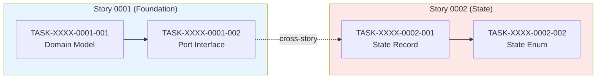

# Create Implementation Map from Epic and Stories

This skill takes the Epic and all Story files and computes the implementation plan: which
stories can run in parallel, what the minimum implementation time is, where the bottlenecks
are, and how to optimize team allocation.

## Why This Matters

Without a dependency graph, teams either serialize everything (wasting parallelism) or
start stories out of order (hitting blockers mid-sprint). The implementation map makes
the dependency structure explicit and computable — phases, critical path, and strategic
observations that inform sprint planning.

## Prerequisites

Read the following files before starting:

**Template (output structure):**
- `resources/templates/_TEMPLATE-IMPLEMENTATION-MAP.md` — The exact structure to follow

**Required inputs:**
- The Epic file (with story index and dependency declarations)
- All Story files (with their Blocked By / Blocks tables)

## Workflow

### Step 1: Build the Dependency Matrix

Read every story's Section 1 (Dependencies) and the Epic's story index. Also read each
story's `**Chave Jira:**` field (if present). Build a complete matrix:

| Story | Title | Chave Jira | Blocked By | Blocks | Status |
| :--- | :--- | :--- | :--- | :--- | :--- |

The `Chave Jira` column is placed between `Title` and `Blocked By`. If a story does not
have a Jira key (field is `—` or `<CHAVE-JIRA>`), set the column value to `—`.

**Validation checks:**
- Every story in the Epic's index must appear in the matrix
- Dependencies must be symmetric: if A blocks B, then B must list A as blocker
- No circular dependencies (A->B->C->A is invalid)
- Root stories (no blockers) must exist — if every story has a blocker, something is wrong

If inconsistencies are found, fix them and note the corrections.

Add a `> **Note:**` block for any implicit dependencies not declared in the stories but
functionally required (e.g., "story-0001-0009 provides configuration data that story-0001-0002 needs even
though story-0001-0002 doesn't explicitly declare it").

### Step 2: Compute Phases

Group stories into phases using the dependency DAG:

1. **Phase 0**: All stories with no dependencies (roots)
2. **Phase 1**: Stories whose dependencies are all in Phase 0
3. **Phase N**: Stories whose dependencies are all in Phase 0..N-1

Within each phase, all stories can run in parallel.

Create the ASCII phase diagram using box-drawing characters. Follow the exact style from
the template — `|=|`, `|`, `|=|` for phase boxes, `|-|`, `|`, `|-|` for story boxes,
`|-->`, `v` for arrows.

Each story box shows: ID + short scope description (max ~20 chars).
Each phase box shows: phase number + name + "(parallel)" if multiple stories.

### Step 3: Identify the Critical Path

The critical path is the longest chain of dependencies from any root to any leaf.
Count phases, not individual stories.

Render as a simple ASCII diagram:
```
story-0001-0001 -|
            |---> story-0001-0002 -> story-0001-0003 --|
story-0001-0009 -|                               |---> story-0001-0011
                  story-0001-0002 -> story-0001-0010 --|
   Phase 0           Phase 1       Phase 2            Phase 3
```

State: **N phases in the critical path, M stories in the longest chain**.
Explain the impact: any delay in a critical path story directly delays the final delivery.

### Step 4: Generate the Mermaid Dependency Graph

Create a full `graph TD` with all stories and their dependency edges.

**Naming convention**: `SXXXX_YYYY["story-XXXX-YYYY<br/>Short Title"]`

If Jira keys are available, include them in node labels:
`SXXXX_YYYY["story-XXXX-YYYY (PROJ-123)<br/>Short Title"]`

**Phase coloring** (use these exact classDef values for consistency):
```
classDef fase0 fill:#1a1a2e,stroke:#e94560,color:#fff
classDef fase1 fill:#16213e,stroke:#0f3460,color:#fff
classDef fase2 fill:#533483,stroke:#e94560,color:#fff
classDef fase3 fill:#e94560,stroke:#fff,color:#fff
classDef faseQE fill:#0d7377,stroke:#14ffec,color:#fff
classDef faseTD fill:#2d3436,stroke:#fdcb6e,color:#fff
classDef faseCR fill:#6c5ce7,stroke:#a29bfe,color:#fff
```

Assign classDef by phase. Group edges by phase transition (comment with `%% Phase N -> N+1`).

### Step 5: Create the Phase Summary Table

| Phase | Stories | Layer | Parallelism | Prerequisite |
| :--- | :--- | :--- | :--- | :--- |
| 0 | story-0001-0001, story-0001-0009 | Infra + API | 2 parallel | — |

Include total count: **N stories in M phases**.

Add notes about cross-cutting phases (QE, Tech Debt) that can execute independently of
business phases.

### Step 6: Detail Each Phase

For each phase, create a subsection with:

**Table**: Story | Main Scope | Key Artifacts

**Phase N Deliverables** (bullet list of concrete deliverables — what exists after this
phase that didn't exist before).

Be specific about artifacts: class names, table names, endpoints, configurations, test
infrastructure.

### Step 7: Write Strategic Observations

These are the highest-value part of the map. Analyze:

**Main Bottleneck**: Which story blocks the most others? Why investing extra time in
it pays off. This is usually the Layer 1 core story.

**Leaf Stories (no dependents)**: Stories that don't block anything. They can absorb
delays without impacting the critical path. Good candidates for junior developers or
parallel streams.

**Time Optimization**: Where is parallelism maximized? Which stories can start immediately?
How should teams be allocated across phases?

**Cross Dependencies**: Stories in later phases that depend on stories from different
branches of the dependency tree. Identify convergence points.

**Architectural Validation Milestone**: Which story should serve as the architectural
checkpoint before expanding scope? What does it validate (patterns, pipeline, integration)?

### Step 8: Task-Level Dependency Graph

If stories contain a **Section 8 (Sub-tasks / Tasks)** with formal task IDs
(`TASK-XXXX-YYYY-NNN`), build a task-level dependency graph across all stories.

#### 8A: Extract Cross-Story Task Dependencies

For each story, read the task list (Section 8) and their `depends on` declarations.
Identify cross-story task dependencies — tasks in one story that depend on tasks from
a different story. Build a table:

| Task | Depends On | Story Source | Story Target | Type |
| :--- | :--- | :--- | :--- | :--- |
| TASK-XXXX-YYYY-NNN | TASK-XXXX-ZZZZ-MMM | story-XXXX-YYYY | story-XXXX-ZZZZ | data/interface/schema/config |

**Type** indicates the nature of the dependency:
- `data` — depends on data model or entity from another story
- `interface` — depends on a port/interface defined in another story
- `schema` — depends on a DB schema or migration from another story
- `config` — depends on configuration or infrastructure from another story

#### 8B: Validate RULE-012 (Cross-Story Consistency)

For every cross-story task dependency, validate that the corresponding story-level
dependency exists:

| Validation | Action |
| :--- | :--- |
| Cross-story task dep without story-level dep | **ERROR**: "TASK-X depends on TASK-Y but story-A does not depend on story-B" |
| Cycle detected in task graph | **ERROR**: "Cycle detected: TASK-A -> TASK-B -> TASK-C -> TASK-A" |
| Story-level dep without cross-story task dep | **WARNING**: "story-A depends on story-B but no cross-story task dependencies found" |

If an ERROR is detected, **abort** generation and report the inconsistency.
If only WARNINGs exist, proceed but include them in the output.

#### 8C: Compute Merge Order via Topological Sort

Apply topological sort to the full task dependency graph (intra-story + cross-story):

1. Build the directed graph of all tasks across all stories
2. Detect cycles — if found, abort with cycle description
3. Compute topological order (deterministic: break ties by task ID)
4. Group tasks into execution phases (phase N = tasks whose dependencies are all in phases 0..N-1)
5. Tasks in the same phase with no dependencies between them are **parallelizable**

Produce a merge order table:

| Order | Task ID | Story | Parallelizable With | Phase |
| :--- | :--- | :--- | :--- | :--- |
| 1 | TASK-XXXX-YYYY-NNN | story-XXXX-YYYY | TASK-XXXX-ZZZZ-MMM | 0 |

#### 8D: Generate Mermaid Task Dependency Graph

Create a `graph LR` with tasks as nodes, colored by story:

- **Subgraphs** group tasks by story, each with a distinct fill color
- **Intra-story edges** use solid arrows (`-->`)
- **Cross-story edges** use dashed arrows (`-.->`) with `|cross-story|` label
- **Node labels** include task ID and short description

Use these story colors (cycle through for more stories):
```
style story-1 fill:#e8f4fd
style story-2 fill:#fde8e8
style story-3 fill:#e8fde8
style story-4 fill:#fdf8e8
style story-5 fill:#f0e8fd
style story-6 fill:#e8fdfa
```

Example:


If stories do not contain formal task IDs, **skip this step entirely** and note:
"Task-level dependency graph skipped — stories do not contain formal task definitions (TASK-XXXX-YYYY-NNN)."

### Step 9: Save and Report

Save as `implementation-map-XXXX.md` in the same directory as the Epic and Stories (inside `plans/epic-XXXX/`).
The XXXX is the epic number extracted from the Epic file.
Report: total stories, phases, critical path length, maximum parallelism, main bottleneck.
If task-level dependencies were computed, also report: total tasks, task phases, cross-story dependencies count.

## Language Rules

- All generated content must be in **Brazilian Portuguese (pt-BR)**
- Mermaid node IDs and classDef names stay in English
- Phase names in Portuguese (e.g., "Fase 0 — Fundação")
- Technical terms: "critical path" -> "caminho critico", "bottleneck" -> "gargalo"
- Story IDs: `story-XXXX-YYYY` (composite format)
- Epic IDs: `epic-XXXX` (kebab-case)

## Common Mistakes

- **Phase computation error**: Forgetting that a story can only enter a phase when ALL its
  dependencies (not just some) are in earlier phases
- **Missing convergence analysis**: When story-0001-0011 depends on story-0001-0003 AND story-0001-0010 from
  different branches, this creates a convergence point that deserves a callout
- **Generic observations**: "story-0001-0002 is important" says nothing. "story-0001-0002 blocks 6 stories
  and establishes the decision engine pattern that all Phase 2 handlers reuse — investing
  extra design time here prevents refactoring 6 handlers later" is useful
- **Inconsistent status**: If a story is marked Done in the matrix but Pending in the phase
  diagram, that's a bug
- **Missing leaf analysis**: Leaf stories (no dependents) are strategically important because
  they can absorb schedule variance. Always identify them

## Detailed References

For in-depth guidance, see:
- `.github/skills/x-epic-map/SKILL.md`
- `.github/skills/x-epic-decompose/SKILL.md`
