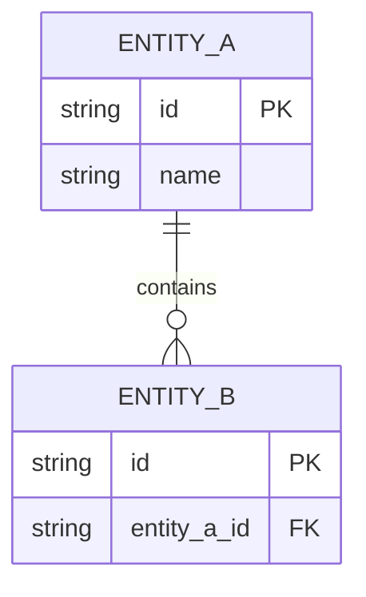
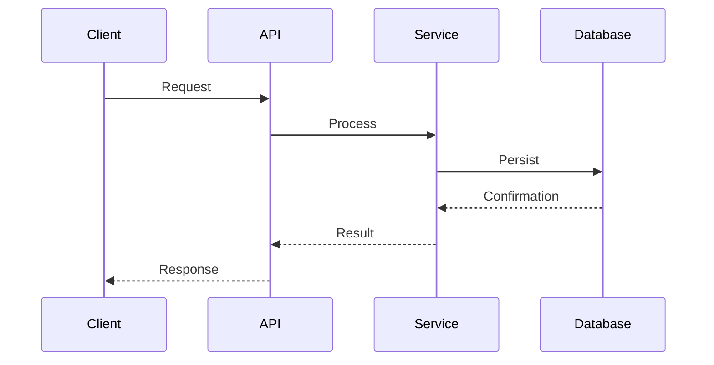

# Service Architecture — {{ project_name }}

## 1. Overview

**Service:** {{ project_name }}
**Architecture:** {{ architecture_style }}
**Language:** {{ language_name }}
**Framework:** {{ framework_name }}
**Interfaces:** {{ interfaces_list }}

> Describe the service purpose, its role in the ecosystem, and the technology stack.
> This section should answer: What does this service do? Why does it exist?

## 2. C4 Diagrams

### Context Diagram

```mermaid
graph TD
    U[User / External System] -->|Request| S[{{ project_name }}]
    S -->|Response| U
    S -->|Data| DB[(Database)]
    S -->|Events| MQ[Message Broker]
```

### Container Diagram

```mermaid
graph TD
    subgraph {{ project_name }}
        API[API Layer]
        APP[Application Layer]
        DOM[Domain Layer]
        ADAPT[Adapter Layer]
    end
    API --> APP
    APP --> DOM
    ADAPT --> DOM
    ADAPT -->|Persistence| DB[(Database)]
    ADAPT -->|Cache| CACHE[(Cache)]
```

## 3. Integrations

| System | Protocol | Purpose | SLO |
| :--- | :--- | :--- | :--- |
| _Example: Auth Service_ | _REST/gRPC_ | _Token validation_ | _p99 < 50ms_ |

> List all external systems this service integrates with.

## 4. Data Model

> Document the main entities and their relationships.
> Include an ER diagram if applicable.



## 5. Critical Flows

> Document the top-3 most important operations as sequence diagrams.

### Flow 1: Main Operation



### Flow 2: Secondary Operation

> Add sequence diagram for the second critical flow.

### Flow 3: Background Process

> Add sequence diagram for the third critical flow.

## 6. NFRs

| Metric | Target | Measurement |
| :--- | :--- | :--- |
| Latency (p95) | < 200ms | APM / Prometheus histogram |
| Throughput | > 1000 req/s | Load test / Grafana |
| Availability | 99.9% | Uptime monitoring |
| Error rate | < 0.1% | Error tracking / Alertmanager |

## 7. Architectural Decisions

> Link to relevant ADRs in `docs/adr/`.

| ADR | Title | Status |
| :--- | :--- | :--- |
| _ADR-001_ | _Example: Choice of framework_ | _Accepted_ |

## 8. Observability

### Key Metrics

- Request rate (req/s)
- Error rate (errors/s)
- Latency percentiles (p50, p95, p99)
- Resource utilization (CPU, memory)

### Alerts

| Alert | Condition | Severity |
| :--- | :--- | :--- |
| _High latency_ | _p95 > 500ms for 5min_ | _Warning_ |
| _Error spike_ | _Error rate > 1% for 2min_ | _Critical_ |

### Dashboards

- Service overview dashboard
- SLO tracking dashboard
- Infrastructure metrics dashboard

## 9. Resilience

### Circuit Breakers

> Document circuit breaker configurations for external dependencies.

| Dependency | Failure Threshold | Timeout | Half-Open After |
| :--- | :--- | :--- | :--- |
| _Example: Auth Service_ | _5 failures_ | _3s_ | _30s_ |

### Retries

> Document retry policies for transient failures.

### Fallbacks

> Document fallback strategies when dependencies are unavailable.

### Graceful Degradation

> Document how the service degrades when non-critical dependencies fail.

## 10. Change History

| Date | Author | Description |
| :--- | :--- | :--- |
| _YYYY-MM-DD_ | _Author_ | _Initial architecture document_ |
