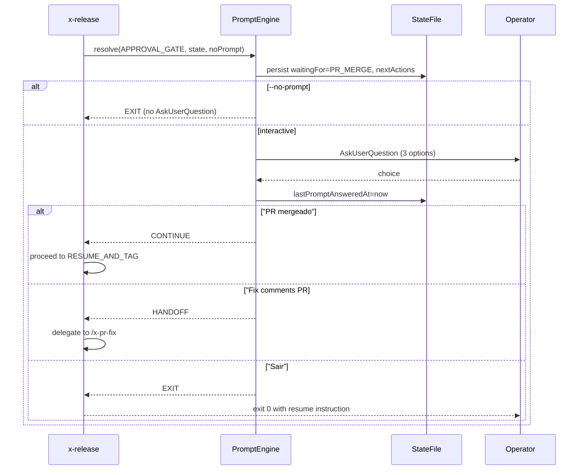

# Interactive Prompt Flow (story-0039-0007)

> Reference document for the `PromptEngine` integration in `x-release`.
> Covers the 3 halt points, their options, state persistence, and
> non-interactive fallback (`--no-prompt`).

## Overview

The `PromptEngine` (`dev.iadev.release.prompt.PromptEngine`) resolves
halt points in the `x-release` flow by presenting the operator with
`AskUserQuestion` prompts. Each prompt offers a fixed set of options
specific to the halt point.

## Halt Points

| Halt Point | Phase | `waitingFor` | Options |
|:---|:---|:---|:---|
| `APPROVAL_GATE` | Phase 8 | `PR_MERGE` | "PR mergeado — continuar", "Rodar /x-pr-fix PR#", "Sair e retomar depois" |
| `BACKMERGE_MERGE` | Phase 10 | `BACKMERGE_MERGE` | "PR mergeado — continuar", "Rodar /x-pr-fix PR#", "Sair e retomar depois" |
| `RECOVERABLE_FAILURE` | Any | `USER_CONFIRMATION` | "Tentar novamente", "Pular esta etapa", "Abortar" |

## State Persistence

At every halt point, `PromptEngine` persists the following fields to the
state file before prompting:

| Field | Value | Purpose |
|:---|:---|:---|
| `waitingFor` | Halt-point-specific enum | Indicates what event is being awaited |
| `nextActions` | List of `{label, command}` | Available options for the next prompt |
| `lastPromptAnsweredAt` | ISO-8601 UTC timestamp | Recorded after each operator response |

### waitingFor → nextActions Mapping

| `waitingFor` | `nextActions` (labels) |
|:---|:---|
| `PR_MERGE` | "PR mergeado — continuar", "Rodar /x-pr-fix PR#", "Sair e retomar depois" |
| `BACKMERGE_MERGE` | "PR mergeado — continuar", "Rodar /x-pr-fix PR#", "Sair e retomar depois" |
| `USER_CONFIRMATION` | "Tentar novamente", "Pular esta etapa", "Abortar" |

## Option Dispatch

### APPROVAL_GATE / BACKMERGE_MERGE

| Option | Action | Result |
|:---|:---|:---|
| "PR mergeado — continuar" | `CONTINUE` | Proceeds to next phase (RESUME_AND_TAG or cleanup) |
| "Rodar /x-pr-fix PR#" | `HANDOFF` | Delegates to `/x-pr-fix` (story-0039-0011) |
| "Sair e retomar depois" | `EXIT` | Exits with state preserved; resume via `--continue-after-merge` |

### RECOVERABLE_FAILURE

| Option | Action | Exit Code | Error Code |
|:---|:---|:---|:---|
| "Tentar novamente" | `RETRY` | 0 | — |
| "Pular esta etapa" | `SKIP` | 0 | — |
| "Abortar" | `ABORT` | 2 | `PROMPT_USER_ABORT` |

## Non-Interactive Mode (`--no-prompt`)

When `--no-prompt` is set (RULE-004):

1. `PromptEngine.resolve(haltPoint, state, noPrompt=true)` is called
2. State is persisted with `waitingFor` and `nextActions` (same as interactive)
3. `AskUserQuestion` is **never** invoked
4. Returns `EXIT` immediately
5. Textual resume instructions are printed (existing behavior)

The `--continue-after-merge` flag remains the primary non-interactive
resume mechanism and has precedence over `--no-prompt`.

## Sequence Diagram (APPROVAL_GATE)



## Error Codes

| Exit | Code | Condition |
|:---|:---|:---|
| 1 | `PROMPT_INVALID_RESPONSE` | Unexpected input (should not occur with AskUserQuestion fixed options) |
| 2 | `PROMPT_USER_ABORT` | Operator chose "Abortar" at a recoverable failure halt |
| 0 | `HANDOFF_SKILL_FAILED` | `/x-pr-fix` invocation failed (warn-only; retry offered) |
| 1 | `HANDOFF_PR_NOT_FOUND` | PR deleted during handoff (`gh pr view` 404) |

## Handoff Contract (story-0039-0011)

When the operator chooses "Rodar /x-pr-fix PR#" at `APPROVAL_GATE` or
`BACKMERGE_MERGE`, the `PromptEngine` returns `HANDOFF` and delegates to
`HandoffOrchestrator` (`dev.iadev.release.handoff.HandoffOrchestrator`),
which owns the handoff loop to the `/x-pr-fix` sibling skill (renamed from
`/x-pr-fix-comments` per EPIC-0036).

### Input (Skill tool invocation)

```json
{
  "skill": "x-pr-fix",
  "args": "297"
}
```

`args` is the PR number as a decimal string. The orchestrator validates
`prNumber > 0` and rejects non-positive values with `IllegalArgumentException`
before any side effect (Rule 06 — input hardening, no path/stack-trace leak).

### Post-handoff PR re-check (gh pr view)

After the skill returns, `GhCliPort#viewPr` runs
`gh pr view <PR#> --json state,mergedAt,reviewDecision` and maps the
response to `PrState`:

| Field | Type | Mapped To |
|:---|:---|:---|
| `state` | enum OPEN / CLOSED / MERGED | `PrReviewState` |
| `mergedAt` | ISO-8601 timestamp or null | `Optional<Instant>` |
| `reviewDecision` | APPROVED / CHANGES_REQUESTED / REVIEW_REQUIRED / null | `PrReviewDecision` |

### Re-prompt decision table (§5.3)

`HandoffOrchestrator.resolveOptions(PrState)` returns the next option set
based on the refreshed PR state:

| `state` | `reviewDecision` | Main option (index 0) | Remaining options |
|:---|:---|:---|:---|
| OPEN | REVIEW_REQUIRED or CHANGES_REQUESTED | "Rodar fix-comments novamente" | "Sair e retomar depois", "Abortar" |
| OPEN | APPROVED | "Mergear no GitHub e voltar" | "Sair e retomar depois", "Abortar" |
| MERGED | (any) | "Continuar release" | "Sair e retomar depois", "Abortar" |
| CLOSED | (any) | "Reabrir PR" | "Iniciar novo release", "Abortar" |

### Error paths

| Condition | Error | Exit | Option set offered |
|:---|:---|:---|:---|
| `SkillInvokerPort#invoke` throws | `HANDOFF_SKILL_FAILED` | 0 (warn-only) | "Tentar novamente", "Continuar mesmo assim", "Abortar" |
| `GhCliPort#viewPr` throws `PrNotFoundException` | `HANDOFF_PR_NOT_FOUND` | 1 | (empty — skill exits) |

### Handoff sequence (per story §3.1)

1. Operator chooses "Rodar /x-pr-fix PR#" at the halt point
2. `PromptEngine` returns `PromptAction.HANDOFF`
3. Caller delegates to `HandoffOrchestrator.handoff(prNumber)`
4. `HandoffOrchestrator` invokes `Skill(skill: "x-pr-fix", args: "<PR#>")` via `SkillInvokerPort`
5. After the skill returns, `HandoffOrchestrator` calls `gh pr view <PR#> --json state,mergedAt,reviewDecision` via `GhCliPort`
6. `resolveOptions(PrState)` yields the new option list
7. Caller re-invokes `PromptEngine.resolve(...)` with the refreshed state and option list

### Non-interactive behavior

The handoff loop only runs when `--interactive` is set AND `--no-prompt` is
absent. In `--no-prompt` mode, `PromptEngine.resolve(...)` returns `EXIT`
before reaching the `HANDOFF` dispatch branch, preserving RULE-004
(prompts have non-interactive equivalents). Operators in CI resume via
`/x-release --continue-after-merge`.

### Security hardening (Rule 06)

- `prNumber` is validated as a positive integer before any I/O.
- `GhCliPort` implementations MUST invoke `gh` via `ProcessBuilder` with
  separate argv entries (no shell concatenation — CWE-78).
- A configurable timeout (default 30s) MUST be applied to the `gh` call to
  prevent resource exhaustion.
- `stderr` MUST be sanitized before logging (no token leak; no PR body).
- `SkillInvocationException` messages MUST NOT expose internal paths or
  stack traces (OWASP A04 / A09).

## Java API

```java
// Constructor injection (ports)
var engine = new PromptEngine(statePort, clockPort, askPort);

// Resolve a halt point
PromptResult result = engine.resolve(
    HaltPoint.APPROVAL_GATE,
    currentState,
    noPrompt);  // true = skip AskUserQuestion

// Dispatch on result
switch (result.action()) {
    case CONTINUE -> proceedToNextPhase();
    case EXIT     -> exitWithResumeInstructions();
    case RETRY    -> retryFailedOperation();
    case SKIP     -> skipCurrentStep();
    case ABORT    -> exitWithError(result.exitCode());
    case HANDOFF  -> handoffOrchestrator.handoff(prNum);
}
```
