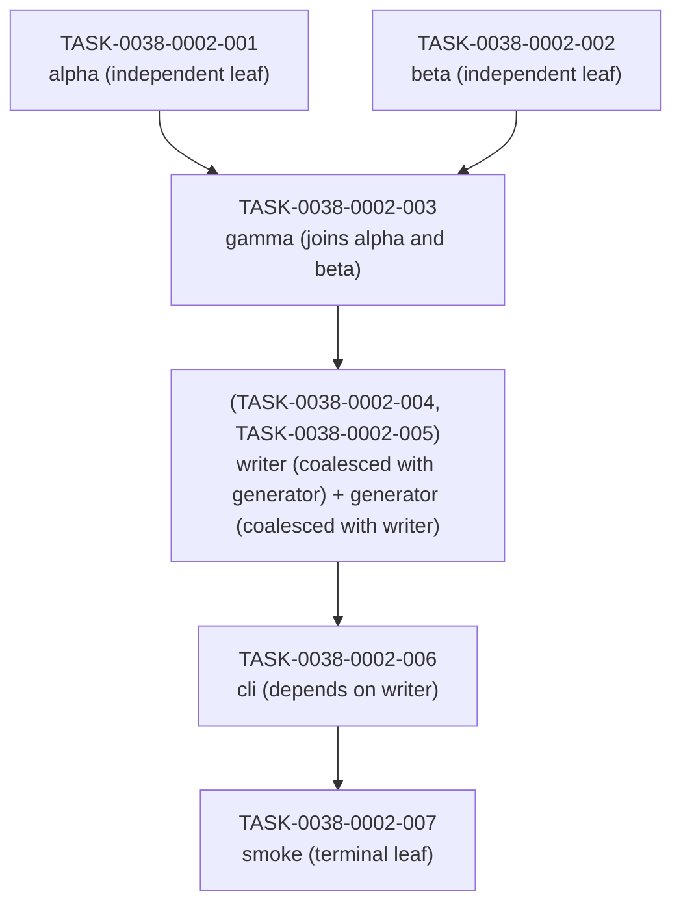

# Task Implementation Map — story-0038-0002

## Dependency Graph

## Execution Order

| Wave | Tasks (parallelisable) | Blocks |
| :--- | :--- | :--- |
| 1 | TASK-0038-0002-001, TASK-0038-0002-002 | TASK-0038-0002-003 |
| 2 | TASK-0038-0002-003 | (TASK-0038-0002-004, TASK-0038-0002-005) |
| 3 | (TASK-0038-0002-004, TASK-0038-0002-005) | TASK-0038-0002-006 |
| 4 | TASK-0038-0002-006 | TASK-0038-0002-007 |
| 5 | TASK-0038-0002-007 | — |

## Coalesced Groups

- (TASK-0038-0002-004 + TASK-0038-0002-005) — coalesced per RULE-TF-04 (mutual COALESCED declaration)

## Parallelism Analysis

- Total tasks: 7
- Number of waves: 5
- Largest wave size: 2
- Estimated speedup vs sequential: 1.40
