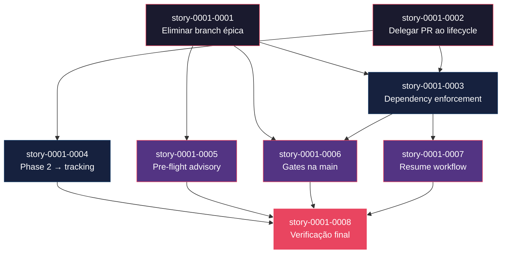

# Mapa de Implementação — PR por Story no Orquestrador de Épicos

**Gerado a partir das dependências BlockedBy/Blocks de cada história do epic-0001.**

---

## 1. Matriz de Dependências

| Story | Título | Chave Jira | Blocked By | Blocks | Status |
| :--- | :--- | :--- | :--- | :--- | :--- |
| story-0001-0001 | Eliminar branch épica e adotar branching por story | — | — | story-0001-0003, story-0001-0005, story-0001-0006 | Pendente |
| story-0001-0002 | Delegar criação de PR e review ao x-dev-lifecycle | — | — | story-0001-0003, story-0001-0004 | Pendente |
| story-0001-0003 | Enforcement de dependências via PR merge status | — | story-0001-0001, story-0001-0002 | story-0001-0006, story-0001-0007 | Pendente |
| story-0001-0004 | Substituir Phase 2 consolidada por tracking incremental | — | story-0001-0002 | story-0001-0008 | Pendente |
| story-0001-0005 | Pre-flight analysis em modo advisory | — | story-0001-0001 | story-0001-0008 | Pendente |
| story-0001-0006 | Integrity e consistency gates na main | — | story-0001-0001, story-0001-0003 | story-0001-0008 | Pendente |
| story-0001-0007 | Resume workflow para modelo per-story PR | — | story-0001-0003 | story-0001-0008 | Pendente |
| story-0001-0008 | Verificação final e documentação de integração | — | story-0001-0004, story-0001-0005, story-0001-0006, story-0001-0007 | — | Pendente |

> **Nota:** story-0001-0004 depende apenas de story-0001-0002 (não de story-0001-0001), pois a substituição da Phase 2 requer apenas o SubagentResult com campos de PR, não a eliminação da branch épica. A Phase 2 atualizada coexiste com o modelo per-story sem conflito.

---

## 2. Fases de Implementação

> As histórias são agrupadas em fases. Dentro de cada fase, as histórias podem ser implementadas **em paralelo**. Uma fase só pode iniciar quando todas as dependências das fases anteriores estiverem concluídas.

```
╔══════════════════════════════════════════════════════════════════════════╗
║                   FASE 0 — Fundação (paralelo)                         ║
║                                                                        ║
║   ┌─────────────────────────┐   ┌───────────────���─────────┐           ║
║   │  story-0001-0001        │   │  story-0001-0002        │           ║
║   │  Eliminar branch épica  │   │  Delegar PR ao lifecycle │           ║
║   └────────────┬────────────┘   └────────────┬────────────┘           ║
╚════════════════╪════════════════════════════╪══════════════════════════╝
                 │                            │
                 ▼                            ▼
╔══════════════════════════════════════════════════════════════════════════╗
║                   FASE 1 — Core (paralelo)                             ║
║                                                                        ║
║   ┌─────────────────────────┐   ┌─────────────────────────┐           ║
║   │  story-0001-0003        │   │  story-0001-0004        │           ║
║   │  Dependency enforcement │   │  Phase 2 → tracking     │           ║
║   │  (← 0001, 0002)        │   │  (← 0002)               │           ║
║   └────────────┬────────────┘   └────────────┬────────────┘           ║
╚════════════════╪════════════════════════════╪══════════════════════════╝
                 │                            │
                 ▼                            ▼
╔══════════════════════════════════════════════════════════════════════════╗
║                   FASE 2 — Extensões (paralelo)                        ║
║                                                                        ║
║   ┌───────────────────┐  ┌───────────────────┐  ┌───────────────────┐ ║
║   │  story-0001-0005  │  │  story-0001-0006  │  │  story-0001-0007  │ ║
║   │  Pre-flight advsr │  │  Gates na main    │  │  Resume workflow  │ ║
║   │  (← 0001)        │  │  (← 0001, 0003)   │  │  (← 0003)        │ ║
║   └────────┬──────────┘  └────────┬──────────┘  └────────┬──────────┘ ║
╚════════════╪══════════════════════╪══════════════════════╪════════════╝
             │                      │                      │
             ▼                      ▼                      ▼
╔══════════════════════════════════════════════════════════════════════════╗
║                   FASE 3 — Finalização                                 ║
║                                                                        ║
║   ┌──────────────────────────────────────────────────────────┐        ║
║   │  story-0001-0008                                         │        ║
║   │  Verificação final e documentação de integração          │        ║
║   │  (← 0004, 0005, 0006, 0007)                             │        ║
║   └──────────────────────────────────────────────────────────┘        ║
╚══════════════════════════════════════════════════════════════════════════╝
```

---

## 3. Caminho Crítico

> O caminho crítico (a sequência mais longa de dependências) determina o tempo mínimo de implementação do projeto.

```
story-0001-0001 ─┐
                  ├──→ story-0001-0003 ──→ story-0001-0006 ──┐
story-0001-0002 ─┘                                           ├──→ story-0001-0008
                                          story-0001-0007 ───┘
   Fase 0              Fase 1              Fase 2               Fase 3
```

**4 fases no caminho crítico, 4 histórias na cadeia mais longa (story-0001-0001 → story-0001-0003 → story-0001-0006 → story-0001-0008).**

Qualquer atraso em story-0001-0001 (eliminação da branch épica) ou story-0001-0003 (dependency enforcement) impacta diretamente a entrega final. Essas são as stories de maior risco e devem receber atenção prioritária no design e revisão.

---

## 4. Grafo de Dependências (Mermaid)



---

## 5. Resumo por Fase

| Fase | Histórias | Camada | Paralelismo | Pré-requisito |
| :--- | :--- | :--- | :--- | :--- |
| 0 | story-0001-0001, story-0001-0002 | Fundação | 2 paralelas | — |
| 1 | story-0001-0003, story-0001-0004 | Core | 2 paralelas | Fase 0 concluída |
| 2 | story-0001-0005, story-0001-0006, story-0001-0007 | Extensões | 3 paralelas | Fase 1 concluída (parcial: cada story tem deps específicas) |
| 3 | story-0001-0008 | Finalização | 1 | Fase 2 concluída |

**Total: 8 histórias em 4 fases.**

> **Nota:** Na Fase 2, story-0001-0005 depende apenas de story-0001-0001 (Fase 0) e pode iniciar assim que a Fase 0 concluir. No entanto, stories 0001-0006 e 0001-0007 dependem de story-0001-0003 (Fase 1), portanto a Fase 2 completa só inicia após a Fase 1. Story-0001-0005 é a mais flexível para antecipação.

---

## 6. Detalhamento por Fase

### Fase 0 — Fundação

| Story | Escopo Principal | Artefatos Chave |
| :--- | :--- | :--- |
| story-0001-0001 | Eliminar branch épica, remover rebase-before-merge e conflict resolution, adicionar --single-pr | Sections 1.2, 1.4a, 1.4b, 1.4c modificadas/removidas; flag --single-pr |
| story-0001-0002 | Delegar PR ao lifecycle, estender SubagentResult com prUrl/prNumber | Sections 1.4, 1.4a, 1.5 modificadas; SubagentResult schema atualizado |

**Entregas da Fase 0:**

- Branch épica eliminada do fluxo padrão (preservada sob --single-pr)
- Sections 1.4b e 1.4c removidas
- Status REBASING, REBASE_SUCCESS, REBASE_FAILED removidos
- SubagentResult estendido com prUrl e prNumber
- Prompt template instrui lifecycle a criar PR targeting main com referência ao épico

### Fase 1 — Core

| Story | Escopo Principal | Artefatos Chave |
| :--- | :--- | :--- |
| story-0001-0003 | Dependency enforcement via PR merge status, flag --auto-merge, polling/wait | Section 1.3 (getExecutableStories), schema execution-state.json, flag --auto-merge |
| story-0001-0004 | Substituir Phase 2 por tracking incremental, atualizar template de report | Phase 2 reescrita, template com {{PR_LINKS_TABLE}} |

**Entregas da Fase 1:**

- `getExecutableStories()` verifica `prMergeStatus == "MERGED"` para todas as dependências
- Mecanismo de polling/wait para PRs pendentes de merge
- Flag --auto-merge com merge via `gh pr merge`
- Phase 2 gera relatório de progresso com tabela de PRs (não mega-PR)
- Template de execution report atualizado com `{{PR_LINKS_TABLE}}`

### Fase 2 — Extensões

| Story | Escopo Principal | Artefatos Chave |
| :--- | :--- | :--- |
| story-0001-0005 | Pre-flight analysis em modo advisory (warnings, não blocking) | Sections 0.5.4, 0.5.5 modificadas |
| story-0001-0006 | Integrity/consistency gates rodando na main após PRs merged | Sections 1.7, 1.8 modificadas; mainShaBeforePhase no checkpoint |
| story-0001-0007 | Resume workflow com novos status de PR (PR_CREATED, PR_PENDING_REVIEW, PR_MERGED) | Resume Steps 1-4 atualizados; failure handling fecha PR |

**Entregas da Fase 2:**

- Pre-flight analysis emite warnings sem bloquear paralelismo
- Integrity gates rodam na `main` com diff pré/pós-fase
- Resume workflow lida corretamente com estados de PR
- Failure handling fecha PR de stories que falharam
- Schema completo com todos os novos status e campos

### Fase 3 — Finalização

| Story | Escopo Principal | Artefatos Chave |
| :--- | :--- | :--- |
| story-0001-0008 | Verificação final, consistência interna, --dry-run, argument-hint | Phase 3, --dry-run, frontmatter atualizados |

**Entregas da Fase 3:**

- Phase 3 (Verification) completamente alinhada com modelo per-story PR
- --dry-run mostra plano per-story PR
- Zero referências órfãs fora do guard --single-pr
- Argument-hint atualizado com todas as novas flags
- SKILL.md auto-consistente e pronto para uso

---

## 7. Observações Estratégicas

### Gargalo Principal

**story-0001-0001 (Eliminar branch épica)** é o maior gargalo — bloqueia 3 stories diretamente (0003, 0005, 0006) e indiretamente toda a cadeia até story-0001-0008. Investir tempo extra no design da flag `--single-pr` e na remoção limpa das Sections 1.4b/1.4c previne retrabalho nas 6 stories downstream que dependem da eliminação da branch épica.

**story-0001-0003 (Dependency enforcement)** é o segundo gargalo — bloqueia 2 stories (0006, 0007). O design do mecanismo de polling/wait e da flag --auto-merge é crítico para a usabilidade do orquestrador.

### Histórias Folha (sem dependentes)

**story-0001-0008** é a única história folha. Como story de finalização e verificação, ela pode absorver atrasos nas Fases 0-2 sem impacto externo, mas é bloqueada por 4 stories — qualquer atraso em qualquer uma das stories de Fase 1 ou 2 impacta diretamente o fechamento do épico.

### Otimização de Tempo

- **Fase 0**: Máximo paralelismo com 2 stories independentes. Podem começar imediatamente.
- **Fase 1**: 2 stories paralelas. story-0001-0004 depende apenas de story-0001-0002 — pode iniciar assim que story-0001-0002 concluir, mesmo que story-0001-0001 ainda esteja em andamento.
- **Fase 2**: 3 stories paralelas. story-0001-0005 pode ser antecipada (depende apenas de Fase 0). Stories 0001-0006 e 0001-0007 precisam de Fase 1.
- **Alocação ideal**: 2 engenheiros em paralelo nas Fases 0-2, convergindo para 1 na Fase 3.

### Dependências Cruzadas

story-0001-0008 é o ponto de convergência principal — depende de 4 stories de 2 fases diferentes (Fase 1: 0004; Fase 2: 0005, 0006, 0007). Isso significa que a Fase 3 só inicia quando TODA a Fase 2 (e toda a Fase 1 por transitividade) está completa.

story-0001-0006 (gates na main) depende de 2 ramos do DAG: story-0001-0001 (Fase 0, ramo de branch elimination) e story-0001-0003 (Fase 1, ramo de dependency enforcement). Ambos os ramos devem convergir antes que os gates possam ser redesenhados.

### Marco de Validação Arquitetural

**story-0001-0003 (Dependency enforcement via PR merge status)** é o marco de validação. Ela estabelece o padrão central de todo o novo modelo: verificar PRs merged como condição de execução. Se esse padrão funcionar corretamente — stories esperando PRs merged, auto-merge funcional, polling robusto — todas as stories de Fase 2 e 3 são extensões seguras desse padrão. Se falhar, o modelo per-story PR não é viável.
