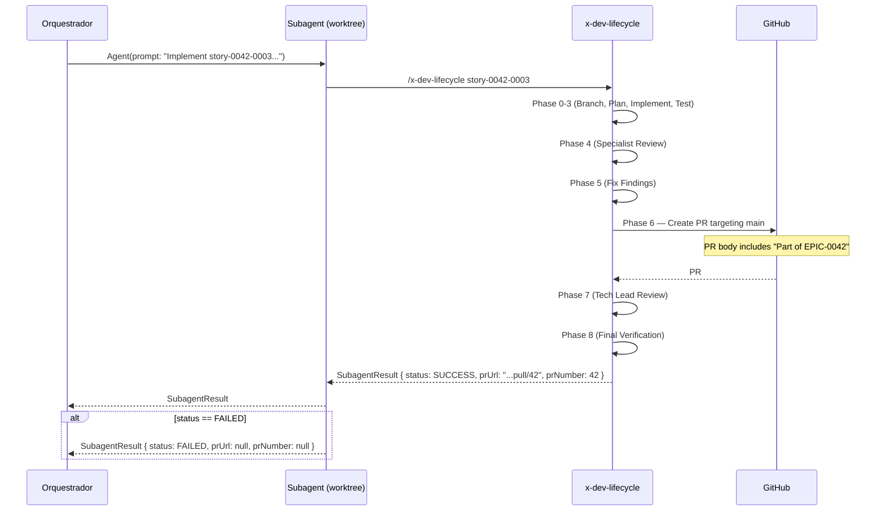

# História: Delegar criação de PR e review ao x-dev-lifecycle

**ID:** story-0001-0002
**Chave Jira:** —
**Status:** Pendente

## 1. Dependências

| Blocked By | Blocks |
| :--- | :--- |
| — | story-0001-0003, story-0001-0004 |

## 2. Regras Transversais Aplicáveis

| ID | Título |
| :--- | :--- |
| RULE-001 | Isolamento de Contexto de Subagents |
| RULE-008 | Rastreabilidade Epic-PR |

## 3. Descrição

Como **engenheiro de plataforma**, eu quero que o `x-dev-lifecycle` execute seu ciclo completo de 9 fases incluindo criação de PR (Phase 6) e reviews (Phases 4, 7) quando invocado pelo orquestrador de épicos, garantindo que cada story tenha revisão especializada independente.

Atualmente, quando o `x-dev-lifecycle` é invocado pelo orquestrador de épicos, o prompt template (Sections 1.4 e 1.4a) instrui o subagent a executar todas as 9 fases, mas o PR é criado targeting a branch épica (não `main`). Com a eliminação da branch épica (story-0001-0001), o lifecycle naturalmente criará PRs targeting `main`. Esta story ajusta o prompt template e o contrato `SubagentResult` para capturar informações do PR criado.

### 3.1 Atualização do prompt template (Section 1.4)

- O prompt template do subagent (sequential mode) deve instruir o lifecycle a criar PR targeting `main`
- Adicionar instrução: "O PR body DEVE incluir 'Part of EPIC-{epicId}' para rastreabilidade (RULE-008)"
- Remover qualquer instrução que suprimisse Phase 6 ou Phase 7

### 3.2 Atualização do prompt template (Section 1.4a)

- Mesma atualização para o prompt de parallel worktree dispatch
- Cada worktree cria seu próprio PR via lifecycle Phase 6

### 3.3 Extensão do SubagentResult

- Adicionar campos `prUrl` (String) e `prNumber` (Integer) ao contrato `SubagentResult`
- Esses campos são preenchidos pelo lifecycle após Phase 6
- Validar que `prUrl` e `prNumber` estão presentes quando status é SUCCESS

### 3.4 Ajuste no x-dev-lifecycle (Phase 6)

- Adicionar suporte a parâmetro `epicId` no prompt do lifecycle
- Quando `epicId` está presente, incluir "Part of EPIC-{epicId}" no PR body
- Nenhuma outra mudança estrutural no lifecycle

## 3.5 Entrega de Valor

- **Valor Principal:** Cada story passa por ciclo completo de review (especialistas + tech lead) com PR próprio, permitindo revisão humana granular e feedback direcionado
- **Métrica de Sucesso:** Cada story despachada pelo orquestrador resulta em um PR independente no GitHub com reviews executadas (ou skipped quando --skip-review)
- **Impacto no Negócio:** Revisores podem focar em uma story por vez, reduzindo o tempo de revisão e aumentando a profundidade da análise de qualidade

## 4. Definições de Qualidade Locais

### DoR Local (Definition of Ready)

- [ ] Prompt template atual (Sections 1.4 e 1.4a) lido e compreendido
- [ ] Schema do SubagentResult atual documentado
- [ ] x-dev-lifecycle Phase 6 (PR creation) compreendida

### DoD Local (Definition of Done)

- [ ] Prompt template (Section 1.4) atualizado com instrução de PR targeting main
- [ ] Prompt template (Section 1.4a) atualizado igualmente
- [ ] SubagentResult inclui campos `prUrl` e `prNumber`
- [ ] Section 1.5 (Result Validation) valida presença de `prUrl`/`prNumber` quando status=SUCCESS
- [ ] x-dev-lifecycle Phase 6 inclui "Part of EPIC-{epicId}" no PR body quando epicId é fornecido
- [ ] Pelo menos 1 teste automatizado validando o contrato SubagentResult
- [ ] Smoke test passando

### Global Definition of Done (DoD)

- **Cobertura:** N/A
- **Testes Automatizados:** Validação de consistência do SKILL.md
- **Documentação:** SKILL.md auto-consistente
- **Persistência:** SubagentResult documentado
- **Performance:** N/A

## 5. Contratos de Dados (Data Contract)

### 5.1 SubagentResult — Campos Adicionados

| Campo | Tipo | M/O | Validações | Exemplo |
| :--- | :--- | :--- | :--- | :--- |
| `prUrl` | `String` | M (quando status=SUCCESS) | URL válida do GitHub PR | `https://github.com/org/repo/pull/42` |
| `prNumber` | `Integer` | M (quando status=SUCCESS) | Inteiro positivo | `42` |

### 5.2 SubagentResult — Schema Completo (após mudança)

| Campo | Tipo | M/O | Descrição |
| :--- | :--- | :--- | :--- |
| `status` | `String` | M | `SUCCESS`, `FAILED`, `PARTIAL` |
| `commitSha` | `String` | M (SUCCESS) | SHA do último commit |
| `findingsCount` | `Integer` | M | Número de findings de review |
| `summary` | `String` | M | Descrição breve do que foi feito |
| `reviewsExecuted` | `Object` | M | `{ specialist: boolean, techLead: boolean }` |
| `reviewScores` | `Object` | M | `{ specialist: "N/M", techLead: "N/M" }` |
| `coverageLine` | `Number` | M | Cobertura de linha (%) |
| `coverageBranch` | `Number` | M | Cobertura de branch (%) |
| `tddCycles` | `Integer` | M | Número de ciclos Red-Green-Refactor |
| `prUrl` | `String` | M (SUCCESS) | URL do PR criado |
| `prNumber` | `Integer` | M (SUCCESS) | Número do PR criado |

### 5.3 Prompt Template — Adições

Nenhum endpoint declarado nesta story. O contrato é o prompt template textual passado ao subagent.

Adição ao template:

```
The PR created by /x-dev-lifecycle Phase 6 MUST:
- Target `main` branch
- Include "Part of EPIC-{epicId}" in the PR body for traceability (RULE-008)

Include prUrl and prNumber in your SubagentResult JSON.
```

## 6. Diagramas

### 6.1 Fluxo de dispatch e coleta de PR



## 7. Critérios de Aceite (Gherkin)

```gherkin
Cenario: Subagent sem epicId não inclui referência ao épico no PR
  DADO que o x-dev-lifecycle é invocado sem parâmetro epicId
  QUANDO Phase 6 cria o PR
  ENTÃO o PR body NÃO contém "Part of EPIC-"

Cenario: Subagent com epicId inclui referência ao épico no PR
  DADO que o x-dev-lifecycle é invocado com epicId "0042"
  QUANDO Phase 6 cria o PR
  ENTÃO o PR body contém "Part of EPIC-0042"

Cenario: SubagentResult com status SUCCESS inclui prUrl e prNumber
  DADO que o lifecycle completou Phase 6 com PR #42
  QUANDO o SubagentResult é retornado
  ENTÃO o campo "prUrl" contém "https://github.com/org/repo/pull/42"
  E o campo "prNumber" contém 42

Cenario: SubagentResult com status FAILED não requer prUrl
  DADO que o lifecycle falhou antes de Phase 6
  QUANDO o SubagentResult é retornado com status FAILED
  ENTÃO os campos "prUrl" e "prNumber" podem ser null
  E a validação do resultado NÃO falha por campos de PR ausentes

Cenario: Prompt template instrui lifecycle a criar PR targeting main
  DADO que o prompt template (Section 1.4) é lido
  QUANDO o prompt é analisado
  ENTÃO contém instrução "Target main branch"
  E contém instrução "Include Part of EPIC-{epicId}"
  E NÃO contém instrução de suprimir Phase 6 ou Phase 7

Cenario: Validação rejeita SubagentResult SUCCESS sem prUrl
  DADO que um subagent retorna status SUCCESS
  E o campo prUrl está ausente
  QUANDO Section 1.5 (Result Validation) é executada
  ENTÃO a validação falha com mensagem indicando campo obrigatório
```

## 8. Sub-tarefas

- [ ] [Dev] Atualizar prompt template em Section 1.4 (sequential dispatch)
- [ ] [Dev] Atualizar prompt template em Section 1.4a (parallel worktree dispatch)
- [ ] [Dev] Adicionar campos prUrl e prNumber ao SubagentResult
- [ ] [Dev] Atualizar Section 1.5 (Result Validation) para validar prUrl/prNumber
- [ ] [Dev] Ajustar x-dev-lifecycle Phase 6 para incluir "Part of EPIC-{epicId}"
- [ ] [Test] Smoke/E2E: Validar que SubagentResult schema está consistente entre Sections 1.4, 1.4a e 1.5
- [ ] [Doc] Documentar o contrato SubagentResult atualizado no SKILL.md
