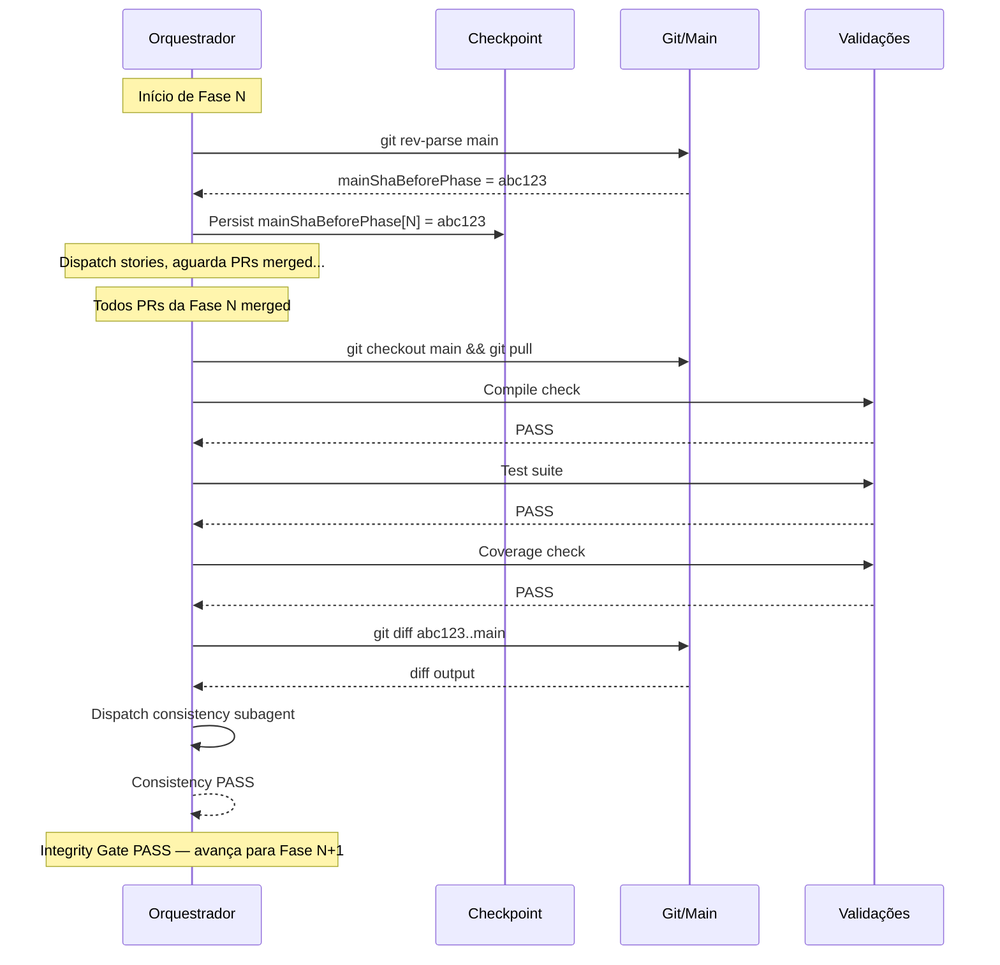

# História: Integrity e consistency gates na main

**ID:** story-0001-0006
**Chave Jira:** —
**Status:** Pendente

## 1. Dependências

| Blocked By | Blocks |
| :--- | :--- |
| story-0001-0001, story-0001-0003 | story-0001-0008 |

## 2. Regras Transversais Aplicáveis

| ID | Título |
| :--- | :--- |
| RULE-006 | Integridade na Main |
| RULE-003 | Ordem de Dependências via PR Merge |

## 3. Descrição

Como **engenheiro de plataforma**, eu quero que os integrity gates e consistency gates rodem contra a `main` após merge dos PRs de cada fase, garantindo que a integração cross-story é validada no código efetivamente merged.

Atualmente, os gates (Sections 1.7 e 1.8) rodam na branch épica que acumula todos os commits das stories. Com a eliminação da branch épica, os gates precisam rodar na `main` — que agora contém os PRs merged de cada story. Isso é mais representativo pois valida o estado real do código que vai para produção.

### 3.1 Modificação de Section 1.7 (Integrity Gate)

- O gate roda após TODOS os PRs da fase atual serem merged na `main`
- Capturar SHA da `main` ANTES da fase iniciar: `mainShaBeforePhase = git rev-parse main`
- Após todos PRs da fase merged: `git checkout main && git pull origin main`
- Executar validações: compile, test, coverage, CC validation, smoke tests
- Se validação falhar: logar falha e não avançar para próxima fase

### 3.2 Modificação de Section 1.8 (Cross-Story Consistency Gate)

- O consistency gate analisa diff da `main` antes/depois da fase: `git diff {mainShaBeforePhase}..main`
- O subagent de consistência recebe o diff para análise cross-story
- Verifica: error handling uniforme, constructor patterns, return types consistentes

### 3.3 Captura de SHA pré-fase

- No início de cada fase, antes de despachar stories: capturar `mainShaBeforePhase`
- Persistir no checkpoint para uso após merge dos PRs
- Se `--resume` é usado: recuperar `mainShaBeforePhase` do checkpoint

## 3.5 Entrega de Valor

- **Valor Principal:** Validação de integração cross-story roda no código real da `main`, detectando problemas que só aparecem quando múltiplos PRs estão merged juntos
- **Métrica de Sucesso:** Integrity gate passa em `main` com todos os PRs da fase merged, com compile + test + coverage validados
- **Impacto no Negócio:** Detecção precoce de incompatibilidades entre stories, evitando rollbacks custosos em produção

## 4. Definições de Qualidade Locais

### DoR Local (Definition of Ready)

- [ ] story-0001-0001 concluída (branch épica eliminada)
- [ ] story-0001-0003 concluída (dependency enforcement via PR merge)
- [ ] Sections 1.7 e 1.8 do SKILL.md original lidas e compreendidas

### DoD Local (Definition of Done)

- [ ] Section 1.7 atualizada para rodar na `main` após PRs merged
- [ ] Section 1.8 atualizada para diff `mainShaBeforePhase..main`
- [ ] SHA pré-fase capturado e persistido no checkpoint
- [ ] Resume workflow recupera `mainShaBeforePhase` do checkpoint
- [ ] Pelo menos 1 teste automatizado validando o fluxo de integrity gate
- [ ] Smoke test passando

### Global Definition of Done (DoD)

- **Cobertura:** N/A
- **Testes Automatizados:** Validação de consistência do SKILL.md
- **Documentação:** SKILL.md auto-consistente
- **Persistência:** mainShaBeforePhase no checkpoint
- **Performance:** N/A

## 5. Contratos de Dados (Data Contract)

### 5.1 execution-state.json — Campos Adicionados

| Campo | Tipo | M/O | Validações | Exemplo |
| :--- | :--- | :--- | :--- | :--- |
| `mainShaBeforePhase` | `Map<Integer, String>` | O | SHA-1 hex (40 chars) por fase | `{ "0": "abc123...", "1": "def456..." }` |

### 5.2 Integrity Gate — Pseudocódigo Atualizado

```
function runIntegrityGate(phase, epicDir):
  // Ensure all PRs from this phase are merged
  for each story in phase:
    assert story.prMergeStatus == "MERGED"

  // Checkout main with latest merges
  git checkout main && git pull origin main

  // Run validations
  compile = run("npx tsc --noEmit")    // or equivalent
  tests = run("npm test")              // or equivalent
  coverage = run("coverage check")     // or equivalent

  if any validation fails:
    log("Integrity gate FAILED for phase {phase}")
    return FAILED

  // Cross-story consistency (Section 1.8)
  diff = run("git diff {mainShaBeforePhase[phase]}..main")
  consistencyResult = dispatchConsistencySubagent(diff)

  return consistencyResult
```

## 6. Diagramas

### 6.1 Fluxo de integrity gate na main



## 7. Critérios de Aceite (Gherkin)

```gherkin
Cenario: SHA da main capturado antes de iniciar fase
  DADO que a fase 1 está prestes a iniciar
  QUANDO o orquestrador prepara a fase
  ENTÃO captura o SHA da main via "git rev-parse main"
  E persiste como mainShaBeforePhase[1] no checkpoint

Cenario: Integrity gate roda na main após PRs merged
  DADO que todos os PRs da fase 1 estão merged na main
  QUANDO o integrity gate é executado
  ENTÃO o orquestrador executa "git checkout main && git pull origin main"
  E roda compile, tests e coverage na main atualizada

Cenario: Consistency gate usa diff da main
  DADO que mainShaBeforePhase[1] = "abc123"
  E todos os PRs da fase 1 estão merged
  QUANDO o consistency gate é executado
  ENTÃO calcula diff via "git diff abc123..main"
  E o subagent de consistência recebe o diff para análise

Cenario: Integrity gate falha bloqueia próxima fase
  DADO que o integrity gate da fase 1 executou
  E a compilação falhou na main
  QUANDO o resultado é avaliado
  ENTÃO a fase 2 NÃO é iniciada
  E o relatório indica "Integrity gate FAILED for phase 1"

Cenario: Resume recupera mainShaBeforePhase do checkpoint
  DADO que o orquestrador foi interrompido durante a fase 2
  E mainShaBeforePhase[2] = "def456" está no checkpoint
  QUANDO --resume é usado
  ENTÃO o orquestrador recupera mainShaBeforePhase[2] do checkpoint
  E NÃO recalcula o SHA (pois stories da fase podem já ter sido merged)
```

## 8. Sub-tarefas

- [ ] [Dev] Modificar Section 1.7 para rodar na main após PRs merged
- [ ] [Dev] Modificar Section 1.8 para diff mainShaBeforePhase..main
- [ ] [Dev] Implementar captura de SHA pré-fase e persistência no checkpoint
- [ ] [Dev] Atualizar schema execution-state.json com mainShaBeforePhase
- [ ] [Dev] Garantir resume workflow recupera mainShaBeforePhase
- [ ] [Test] Smoke/E2E: Validar consistência do fluxo de integrity gate no SKILL.md
- [ ] [Doc] Documentar o fluxo de integrity gate na main
