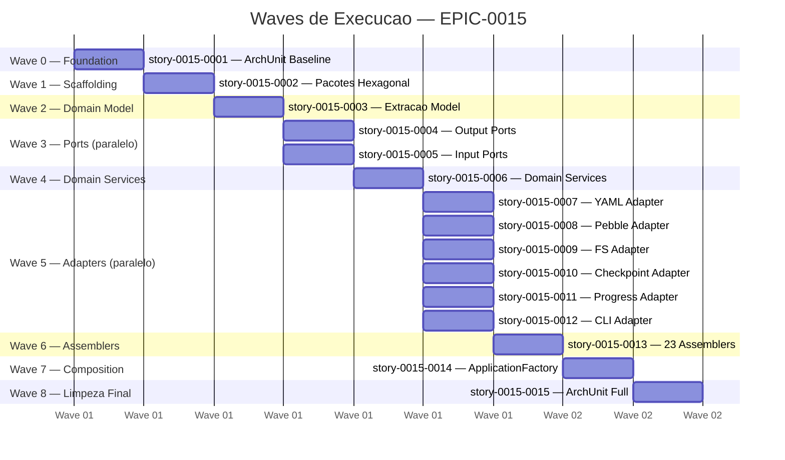
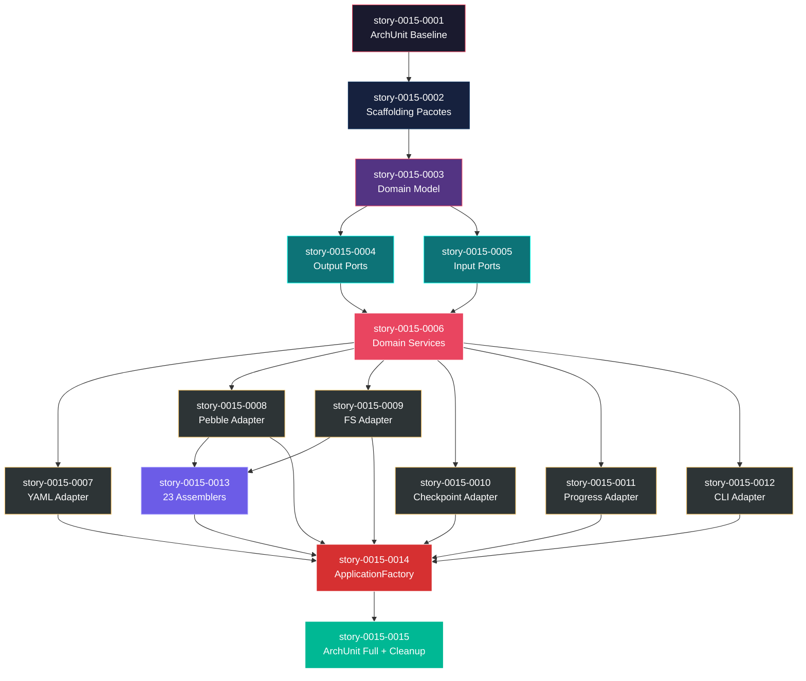

# Mapa de Implementacao — EPIC-0015 (Migracao para Arquitetura Hexagonal)

**Autor:** Architect Agent / Claude
**Data:** 2026-04-03
**Gerado a partir das dependencias BlockedBy/Blocks de cada historia do EPIC-0015.**

---

## 1. Dependency Matrix

| ID | Titulo | Blocked By | Blocks | Wave | Test Plan Status | Status |
| :--- | :--- | :--- | :--- | :--- | :--- | :--- |
| story-0015-0001 | Configuracao de ArchUnit e Baseline | — | story-0015-0002 | 0 | Pending | Concluída |
| story-0015-0002 | Scaffolding de Pacotes Hexagonal | story-0015-0001 | story-0015-0003 | 1 | Pending | Concluída |
| story-0015-0003 | Extracao do Domain Model | story-0015-0002 | story-0015-0004, story-0015-0005 | 2 | Pending | Concluída |
| story-0015-0004 | Definicao dos Output Ports | story-0015-0003 | story-0015-0006 | 3 | Pending | Concluída |
| story-0015-0005 | Definicao dos Input Ports | story-0015-0003 | story-0015-0006 | 3 | Pending | Concluída |
| story-0015-0006 | Implementacao dos Domain Services | story-0015-0004, story-0015-0005 | story-0015-0007, story-0015-0008, story-0015-0009, story-0015-0010, story-0015-0011, story-0015-0012, story-0015-0013 | 4 | Pending | Concluída |
| story-0015-0007 | Adapter: YamlStackProfileRepository | story-0015-0006 | story-0015-0014 | 5 | Pending | Concluída |
| story-0015-0008 | Adapter: PebbleTemplateRenderer | story-0015-0006 | story-0015-0013, story-0015-0014 | 5 | Pending | Concluída |
| story-0015-0009 | Adapter: FileSystemWriterAdapter | story-0015-0006 | story-0015-0013, story-0015-0014 | 5 | Pending | Concluída |
| story-0015-0010 | Adapter: FileCheckpointStore | story-0015-0006 | story-0015-0014 | 5 | Pending | Concluída |
| story-0015-0011 | Adapter: ConsoleProgressReporter | story-0015-0006 | story-0015-0014 | 5 | Pending | Concluída |
| story-0015-0012 | Adapter: CLI Input Adapter | story-0015-0006 | story-0015-0014 | 5 | Pending | Concluída |
| story-0015-0013 | Migracao dos 23 Assemblers | story-0015-0008, story-0015-0009 | story-0015-0014 | 6 | Pending | Concluída |
| story-0015-0014 | Composition Root: ApplicationFactory | story-0015-0007, story-0015-0008, story-0015-0009, story-0015-0010, story-0015-0011, story-0015-0012, story-0015-0013 | story-0015-0015 | 7 | Pending | Concluída |
| story-0015-0015 | Ativacao ArchUnit e Limpeza Final | story-0015-0014 | — | 8 | Pending | Concluída |

> **Nota:** story-0015-0004 e story-0015-0005 sao paralelas na Wave 3 — ambas dependem apenas de story-0015-0003 e sao bloqueadores de story-0015-0006. story-0015-0013 depende especificamente de story-0015-0008 e story-0015-0009 (adapters de template e filesystem usados pelos assemblers), nao de todos os adapters.

---

## 2. Wave Diagram



---

## 3. Fases de Implementacao

> As historias sao agrupadas em fases (waves). Dentro de cada fase, as historias podem ser implementadas **em paralelo**. Uma fase so pode iniciar quando todas as dependencias das fases anteriores estiverem concluidas.

```
+========================================================================+
|          FASE 0 -- Foundation                                          |
|                                                                        |
|  +--------------------+                                                |
|  | story-0015-0001    |                                                |
|  | ArchUnit Baseline  |                                                |
|  +--------+-----------+                                                |
+===========|========================================================+===+
            v
+========================================================================+
|          FASE 1 -- Scaffolding                                         |
|                                                                        |
|  +--------------------+                                                |
|  | story-0015-0002    |                                                |
|  | Pacotes Hexagonal  |                                                |
|  +--------+-----------+                                                |
+===========|========================================================+===+
            v
+========================================================================+
|          FASE 2 -- Domain Model                                        |
|                                                                        |
|  +--------------------+                                                |
|  | story-0015-0003    |                                                |
|  | Extracao Model     |                                                |
|  +--------+-----------+                                                |
+===========|========================================================+===+
            |
            +-------------------+
            v                   v
+========================================================================+
|          FASE 3 -- Ports (paralelo)                                    |
|                                                                        |
|  +--------------------+  +--------------------+                        |
|  | story-0015-0004    |  | story-0015-0005    |                        |
|  | Output Ports       |  | Input Ports        |                        |
|  +--------+-----------+  +--------+-----------+                        |
+===========|===================+===|================================+===+
            |                   |
            v                   v
+========================================================================+
|          FASE 4 -- Domain Services (bottleneck)                        |
|                                                                        |
|  +----------------------------------------+                            |
|  | story-0015-0006                        |                            |
|  | Domain Services (MAIOR RISCO TECNICO)  |                            |
|  +--------+-------------------------------+                            |
+===========|========================================================+===+
            |
    +-------+-------+-------+-------+-------+-------+
    v       v       v       v       v       v       v
+========================================================================+
|          FASE 5 -- Adapters (paralelo, max 6 stories)                  |
|                                                                        |
|  +----------+  +----------+  +----------+  +----------+               |
|  | s-0007   |  | s-0008   |  | s-0009   |  | s-0010   |               |
|  | YAML     |  | Pebble   |  | FS       |  | Chkpoint |               |
|  +----+-----+  +----+-----+  +----+-----+  +----+-----+               |
|       |              |             |              |                     |
|  +----------+  +----------+                                            |
|  | s-0011   |  | s-0012   |                                            |
|  | Progress |  | CLI      |                                            |
|  +----+-----+  +----+-----+                                            |
+========================================================================+
            |              |
            v              v
+========================================================================+
|          FASE 6 -- Assemblers                                          |
|                                                                        |
|  +-----------------------------+                                       |
|  | story-0015-0013             |                                       |
|  | 23 Assemblers -> app/       |                                       |
|  +--------+--------------------+                                       |
+===========|========================================================+===+
            v
+========================================================================+
|          FASE 7 -- Composition Root                                    |
|                                                                        |
|  +-----------------------------+                                       |
|  | story-0015-0014             |                                       |
|  | ApplicationFactory          |                                       |
|  +--------+--------------------+                                       |
+===========|========================================================+===+
            v
+========================================================================+
|          FASE 8 -- Limpeza Final                                       |
|                                                                        |
|  +-----------------------------+                                       |
|  | story-0015-0015             |                                       |
|  | ArchUnit Full + Cleanup     |                                       |
|  +-----------------------------+                                       |
+========================================================================+
```

---

## 4. Caminho Critico

> O caminho critico (a sequencia mais longa de dependencias) determina o tempo minimo de implementacao do projeto.

```
story-0015-0001 --> story-0015-0002 --> story-0015-0003 --> story-0015-0004 --> story-0015-0006 --> story-0015-0008 --> story-0015-0013 --> story-0015-0014 --> story-0015-0015
   Wave 0              Wave 1              Wave 2              Wave 3              Wave 4              Wave 5              Wave 6              Wave 7              Wave 8
```

**9 fases no caminho critico, 9 historias na cadeia mais longa.**

O caminho critico atravessa todas as camadas da arquitetura hexagonal: Foundation (ArchUnit) → Scaffolding → Domain Model → Output Ports → Domain Services → Template Adapter → Assemblers → Composition Root → Cleanup. A cadeia passa por story-0015-0008 (PebbleTemplateRenderer) e nao por outros adapters porque os assemblers (story-0015-0013) dependem especificamente do adapter de templates e filesystem.

**Impacto:** Qualquer atraso em story-0015-0006 (Domain Services) — a historia de maior risco tecnico — impacta diretamente a data de conclusao do epico. Recomenda-se alocar o desenvolvedor mais experiente e iniciar a redistribuicao de logica de negocio o mais cedo possivel.

---

## 5. Grafo de Dependencias (Mermaid)



---

## 6. Resumo por Fase

| Fase | Historias | Camada | Paralelismo | Pre-requisito |
| :--- | :--- | :--- | :--- | :--- |
| 0 | story-0015-0001 | Foundation | 1 historia | — |
| 1 | story-0015-0002 | Foundation | 1 historia | Fase 0 concluida |
| 2 | story-0015-0003 | Core Domain | 1 historia | Fase 1 concluida |
| 3 | story-0015-0004, story-0015-0005 | Core Domain | 2 paralelas | Fase 2 concluida |
| 4 | story-0015-0006 | Core Domain | 1 historia (bottleneck) | Fase 3 concluida |
| 5 | story-0015-0007 a story-0015-0012 | Extensions | **6 paralelas** (max) | Fase 4 concluida |
| 6 | story-0015-0013 | Compositions | 1 historia | story-0015-0008, story-0015-0009 (Fase 5 parcial) |
| 7 | story-0015-0014 | Compositions | 1 historia | Fases 5 e 6 concluidas |
| 8 | story-0015-0015 | Cross-Cutting | 1 historia | Fase 7 concluida |

**Total: 15 historias em 9 fases.**

> **Nota:** A Fase 6 (Assemblers) pode iniciar assim que story-0015-0008 e story-0015-0009 completam na Fase 5, sem precisar aguardar os demais adapters. Isso permite overlap parcial entre Fases 5 e 6.

---

## 7. Detalhamento por Fase

### Fase 0 — Foundation

| Story | Escopo Principal | Artefatos Chave |
| :--- | :--- | :--- |
| story-0015-0001 | ArchUnit no pom.xml + baseline de testes | `pom.xml` (dependencia), `HexagonalArchitectureTest.java`, `archunit-baseline-report.md` |

**Entregas da Fase 0:**

- ArchUnit 1.3.0 adicionado como dependencia de teste
- 7 regras ArchUnit criadas em modo `@Disabled`
- Relatorio de violacoes AS-IS documentado como baseline

### Fase 1 — Scaffolding

| Story | Escopo Principal | Artefatos Chave |
| :--- | :--- | :--- |
| story-0015-0002 | Diretorios hexagonais + package-info.java | 16 diretorios com `package-info.java` |

**Entregas da Fase 1:**

- Estrutura de pacotes TO-BE completa fisicamente criada
- Cada pacote documentado com Javadoc de responsabilidade

### Fase 2 — Domain Model

| Story | Escopo Principal | Artefatos Chave |
| :--- | :--- | :--- |
| story-0015-0003 | Migracao de 23 records para domain/model/ | 23 classes em `domain/model/`, regra ArchUnit RULE-004 ativa |

**Entregas da Fase 2:**

- 23 Java Records puros (zero anotacoes de framework) em `domain/model/`
- Pacote `model/` original esvaziado
- Todos os imports atualizados (blast radius: 170+ arquivos)

### Fase 3 — Ports (paralelo)

| Story | Escopo Principal | Artefatos Chave |
| :--- | :--- | :--- |
| story-0015-0004 | 5 interfaces Output Port | `StackProfileRepository`, `TemplateRenderer`, `FileSystemWriter`, `CheckpointStore`, `ProgressReporter` |
| story-0015-0005 | 3 interfaces Input Port | `GenerateEnvironmentUseCase`, `ValidateConfigUseCase`, `ListStackProfilesUseCase` |

**Entregas da Fase 3:**

- 8 interfaces de porta definidas com Javadoc completo
- Regras ArchUnit para interfaces de port ativas
- Contratos estabilizados para implementacao paralela

### Fase 4 — Domain Services (bottleneck)

| Story | Escopo Principal | Artefatos Chave |
| :--- | :--- | :--- |
| story-0015-0006 | 3 Domain Services + redistribuicao de logica | `GenerateEnvironmentService`, `ValidateConfigService`, `ListStackProfilesService` |

**Entregas da Fase 4:**

- Hexagono de dominio completo e auto-contido
- Logica de `domain/stack/` e `domain/implementationmap/` redistribuida
- Testes unitarios com mocks de todos os Output Ports
- **MAIOR RISCO TECNICO** — redistribuicao de logica de negocio

### Fase 5 — Adapters (paralelo, max 6)

| Story | Escopo Principal | Artefatos Chave |
| :--- | :--- | :--- |
| story-0015-0007 | YAML profile loading | `YamlStackProfileRepository` em `infrastructure/adapter/output/config/` |
| story-0015-0008 | Pebble template rendering | `PebbleTemplateRenderer` + `PythonBoolExtension` em `infrastructure/adapter/output/template/` |
| story-0015-0009 | Filesystem I/O + path safety | `FileSystemWriterAdapter` em `infrastructure/adapter/output/filesystem/` |
| story-0015-0010 | Checkpoint persistence | `FileCheckpointStore` em `infrastructure/adapter/output/checkpoint/` |
| story-0015-0011 | Progress reporting | `ConsoleProgressReporter` + `SilentProgressReporter` em `infrastructure/adapter/output/progress/` |
| story-0015-0012 | CLI commands via Input Ports | 14 classes em `infrastructure/adapter/input/cli/` |

**Entregas da Fase 5:**

- 5 Output Adapters implementando suas respectivas interfaces
- 1 Input Adapter (CLI) usando exclusivamente Input Ports
- Pacotes legados mantidos como facades temporarios
- **Maximo paralelismo do epico** — 6 stories podem ser executadas simultaneamente

### Fase 6 — Assemblers

| Story | Escopo Principal | Artefatos Chave |
| :--- | :--- | :--- |
| story-0015-0013 | Migracao de 83+ classes de assembler | `application/assembler/` com todos os sub-pacotes preservados |

**Entregas da Fase 6:**

- 83+ classes migradas usando Output Ports via constructor injection
- Zero chamadas diretas a PebbleEngine ou Files.write
- Golden file parity mantida para todos os 8 perfis

### Fase 7 — Composition Root

| Story | Escopo Principal | Artefatos Chave |
| :--- | :--- | :--- |
| story-0015-0014 | Wiring manual de dependencias | `ApplicationFactory.java` em `infrastructure/config/` |

**Entregas da Fase 7:**

- Unico ponto de instanciacao de todos os adapters
- Grafo de dependencias explicito e rastreavel
- Integracao com Picocli IFactory

### Fase 8 — Limpeza Final

| Story | Escopo Principal | Artefatos Chave |
| :--- | :--- | :--- |
| story-0015-0015 | ArchUnit completo + remocao legados + docs | 7 regras ArchUnit ativas, ADR, `service-architecture.md` atualizado |

**Entregas da Fase 8:**

- Zero `@Disabled` em regras ArchUnit
- Pacotes legados removidos completamente
- Documentacao de arquitetura atualizada
- ADR de migracao hexagonal gerado
- Relatorio comparativo AS-IS vs TO-BE

---

## 8. Observacoes Estrategicas

### Gargalo Principal

**story-0015-0006 (Domain Services)** e o maior gargalo do epico. Ela:
- Bloqueia **7 stories** diretamente (0007-0013)
- E a historia de maior risco tecnico (redistribuicao de logica de negocio)
- Esta na Wave 4, sozinha — nao pode ser paralelizada
- Contem a logica mais complexa (resolucao de stack, DAG de dependencias)

**Recomendacao:** Alocar o desenvolvedor mais experiente da equipe. Investir tempo extra em testes unitarios com mocks antes de mover para a proxima fase. Considerar pair programming para reducao de risco.

### Historias Folha (sem dependentes)

**story-0015-0015** (Ativacao ArchUnit e Limpeza Final) e a unica historia folha — nao bloqueia nenhuma outra.

Esta historia pode absorver atrasos sem impacto no prazo de outras entregas. E ideal para execucao no final do epico, quando o risco de descobertas tardias e maior. Pode ser atribuida a um desenvolvedor junior sob supervisao.

### Otimizacao de Tempo

**Paralelismo maximo na Fase 5:** Com 6 stories paralelas, esta e a fase com maior oportunidade de aceleracao. Em uma equipe de 3+ desenvolvedores:
- Dev 1: story-0015-0008 (Pebble — **caminho critico**, prioridade maxima)
- Dev 2: story-0015-0009 (FileSystem — **caminho critico**, bloqueia assemblers)
- Dev 3: story-0015-0007, 0010, 0011, 0012 (adapters menores, menor risco)

**Inicio antecipado da Fase 6:** story-0015-0013 (Assemblers) pode iniciar assim que story-0015-0008 e story-0015-0009 completam, sem aguardar os demais adapters da Fase 5. Isso permite overlap entre Fases 5 e 6.

**Fases 0-2 (sequenciais):** Nao ha paralelismo possivel. Um unico desenvolvedor pode executar as tres em sequencia como ramp-up do epico.

### Dependencias Cruzadas

**Ponto de convergencia principal:** story-0015-0014 (ApplicationFactory) — converge TODAS as stories de adapter (0007-0012) e assemblers (0013). Qualquer atraso em qualquer adapter impacta diretamente a Fase 7.

**Convergencia parcial:** story-0015-0013 (Assemblers) converge apenas story-0015-0008 e story-0015-0009. Os demais adapters (0007, 0010, 0011, 0012) convergem diretamente na Fase 7.

**Bifurcacao:** story-0015-0003 (Domain Model) bifurca em duas branches paralelas (0004 e 0005) que reconvergem em story-0015-0006. Atraso em qualquer uma das branches impacta a reconvergencia.

### Marco de Validacao Arquitetural

**story-0015-0006 (Domain Services)** serve como **checkpoint arquitetural** do epico. Quando esta historia e concluida:
- O hexagono de dominio esta completo (model + ports + services)
- O padrao hexagonal esta validado end-to-end com testes unitarios usando mocks
- As interfaces de port estao estabilizadas e nao devem mudar
- A decisao de design (quais responsabilidades ficam no dominio vs application) esta cristalizada

**Se algo fundamental estiver errado na decomposicao do dominio, sera descoberto nesta historia.** Apos a Fase 4, mudancas na definicao de ports causam cascata em todas as stories de adapter. Recomenda-se revisao arquitetural formal antes de prosseguir para a Fase 5.

---

## Execution Order

1. **Wave 0** (sequencial): story-0015-0001
2. **Wave 1** (apos Wave 0): story-0015-0002
3. **Wave 2** (apos Wave 1): story-0015-0003
4. **Wave 3** (paralelo, apos Wave 2): story-0015-0004, story-0015-0005
5. **Wave 4** (apos Wave 3): story-0015-0006
6. **Wave 5** (paralelo, apos Wave 4): story-0015-0007, story-0015-0008, story-0015-0009, story-0015-0010, story-0015-0011, story-0015-0012
7. **Wave 6** (apos story-0015-0008 + story-0015-0009): story-0015-0013
8. **Wave 7** (apos Waves 5 + 6): story-0015-0014
9. **Wave 8** (apos Wave 7): story-0015-0015
