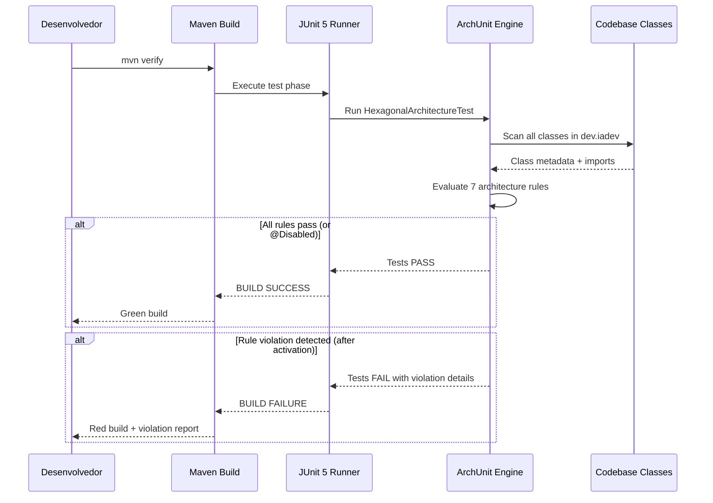

# Historia: Configuracao de ArchUnit e Baseline de Testes de Arquitetura

**ID:** story-0015-0001
**Chave Jira:** —
**Status:** Concluída

## 1. Dependencias

| Blocked By | Blocks |
| :--- | :--- |
| — | story-0015-0002 |

## 2. Regras Transversais Aplicaveis

| ID | Titulo |
| :--- | :--- |
| RULE-006 | ArchUnit como Guardiao |
| RULE-008 | Migracao Incremental sem Big Bang |
| RULE-009 | Cobertura de Testes Mantida |

## 3. Descricao

Como **Arquiteto de Software**, eu quero configurar o ArchUnit no projeto e criar uma classe base de testes de arquitetura com regras que serao progressivamente ativadas, para que as fronteiras hexagonais sejam verificadas automaticamente em cada build e violacoes sejam detectadas antes de atingir a branch principal.

### Contexto

O projeto `ia-dev-environment` atualmente nao possui testes de arquitetura. O ArchUnit nao esta no `pom.xml`. Esta historia estabelece a infraestrutura de verificacao que todas as historias subsequentes dependem para validar que a migracao hexagonal mantem as fronteiras corretas.

### 3.1 Adicao do ArchUnit ao pom.xml

Adicionar `com.tngtech.archunit:archunit-junit5:1.3.0` como dependencia de teste no `java/pom.xml`. Garantir compatibilidade com JUnit 5.11.4 existente.

### 3.2 Classe Base HexagonalArchitectureTest

Criar `java/src/test/java/dev/iadev/architecture/HexagonalArchitectureTest.java` com regras ArchUnit que:
- Inicialmente documentam violacoes do estado AS-IS (modo audit/report, nao falham o build)
- Sao progressivamente ativadas (de `@Disabled` para ativas) conforme historias de migracao completam
- Cobrem todas as RULE-001 a RULE-006

### 3.3 Regras ArchUnit Planejadas

Cada regra deve ter um metodo de teste dedicado:
- `domainShouldNotDependOnInfrastructure()` — RULE-001
- `domainShouldNotDependOnApplication()` — RULE-001
- `domainModelShouldNotHaveFrameworkAnnotations()` — RULE-004
- `outputPortsShouldBeInterfaces()` — RULE-002
- `inputPortsShouldBeInterfaces()` — RULE-003
- `cliShouldOnlyAccessInputPorts()` — RULE-003
- `compositionRootShouldBeUnique()` — RULE-005

### 3.4 Relatorio de Violacoes AS-IS

Executar as regras em modo audit contra o codigo atual e documentar todas as violacoes encontradas em um arquivo `docs/architecture/archunit-baseline-report.md`. Este relatorio serve como baseline para medir progresso da migracao.

## 3.5 Entrega de Valor

- **Valor Principal:** Guardioes arquiteturais automatizados que previnem regressoes de fronteira em cada build
- **Metrica de Sucesso:** 7 regras ArchUnit criadas, executando em `mvn verify`, com relatorio de violacoes AS-IS documentado
- **Impacto no Negocio:** Reduz risco de regressao arquitetural durante a migracao, garantindo que cada historia mantem as fronteiras hexagonais — desbloqueia todas as historias subsequentes

## 4. Definicoes de Qualidade Locais

### DoR Local

- [ ] JUnit 5.11.4 e JaCoCo 0.8.12 ja configurados no `pom.xml`
- [ ] Branch `feat/epic-0015-hexagonal-architecture` criada
- [ ] Todos os 1961 testes passando em `main`

### DoD Local

- [ ] ArchUnit 1.3.0 adicionado como dependencia de teste
- [ ] `HexagonalArchitectureTest.java` criada com 7 metodos de teste
- [ ] Regras executam em modo `@Disabled` ou audit (nao falham o build)
- [ ] Relatorio de violacoes AS-IS gerado em `docs/architecture/archunit-baseline-report.md`
- [ ] `mvn verify` passa com zero falhas
- [ ] Test plan gerado via `/x-test-plan` antes do inicio da implementacao
- [ ] Todo @GK-N da secao 7 mapeado para >= 1 AT-N na secao 8
- [ ] Cenarios Gherkin ordenados por TPP (degenerate -> happy -> error -> boundary -> edge)
- [ ] Todo AT-N com status GREEN antes de marcar DoD como concluido
- [ ] Commits seguem padrao test-first (teste precede ou acompanha implementacao no git log)

### Global DoD

- **Cobertura:** >= 95% Line, >= 90% Branch
- **Testes Automatizados:** Testes ArchUnit integrados ao ciclo `mvn verify`
- **TDD Compliance:** Commits test-first, refactoring explicito
- **Backward Compatibility:** Todos os 1961 testes existentes continuam passando
- **Double-Loop TDD:** Acceptance tests derivados dos cenarios Gherkin (outer loop), unit tests guiados por TPP (inner loop)
- **Rastreabilidade:** Todo @GK-N mapeia para >= 1 AT-N, todo AT-N referencia um @GK-N valido

## 5. Contratos de Dados

| Campo | Tipo | Obrigatorio | Descricao |
| :--- | :--- | :--- | :--- |
| `archunit-junit5` | Maven dependency | Sim | `com.tngtech.archunit:archunit-junit5:1.3.0` scope test |
| `HexagonalArchitectureTest` | Java class | Sim | Classe de teste em `src/test/java/dev/iadev/architecture/` |
| `archunit-baseline-report.md` | Markdown file | Sim | Relatorio de violacoes AS-IS em `docs/architecture/` |

## 6. Diagramas

### 6.1 Fluxo de Verificacao ArchUnit no Build



### 6.2 Regras ArchUnit e Camadas Alvo

```mermaid
graph TD
    HexTest["HexagonalArchitectureTest"]

    R1["domainShouldNotDependOnInfrastructure<br/>RULE-001"]
    R2["domainShouldNotDependOnApplication<br/>RULE-001"]
    R3["domainModelShouldNotHaveFrameworkAnnotations<br/>RULE-004"]
    R4["outputPortsShouldBeInterfaces<br/>RULE-002"]
    R5["inputPortsShouldBeInterfaces<br/>RULE-003"]
    R6["cliShouldOnlyAccessInputPorts<br/>RULE-003"]
    R7["compositionRootShouldBeUnique<br/>RULE-005"]

    HexTest --> R1
    HexTest --> R2
    HexTest --> R3
    HexTest --> R4
    HexTest --> R5
    HexTest --> R6
    HexTest --> R7

    classDef test fill:#1a1a2e,stroke:#e94560,color:#fff
    classDef rule fill:#16213e,stroke:#0f3460,color:#fff
    class HexTest test
    class R1,R2,R3,R4,R5,R6,R7 rule
```



## 7. Criterios de Aceite (Gherkin)

```gherkin
@GK-1
Cenario: Build sem ArchUnit configurado (estado degenerado)
  DADO que o projeto nao possui ArchUnit no pom.xml
  QUANDO o desenvolvedor executa "mvn verify"
  ENTAO o build completa com sucesso
  E nenhum teste de arquitetura e executado

@GK-2
Cenario: ArchUnit configurado com regras desabilitadas (happy path)
  DADO que ArchUnit 1.3.0 esta adicionado ao pom.xml como dependencia de teste
  E a classe HexagonalArchitectureTest possui 7 metodos de teste com @Disabled
  QUANDO o desenvolvedor executa "mvn verify"
  ENTAO o build completa com sucesso
  E os 7 testes de arquitetura sao reportados como skipped
  E os 1961 testes existentes continuam passando

@GK-3
Cenario: Regra ArchUnit ativada detecta violacao no codigo AS-IS (error path)
  DADO que a regra "domainShouldNotDependOnInfrastructure" esta ativada (sem @Disabled)
  E o codigo atual em domain/ importa classes de template/ diretamente
  QUANDO o desenvolvedor executa "mvn verify"
  ENTAO o ArchUnit reporta violacao com detalhes da classe e import violador
  E o build falha na fase de teste

@GK-4
Cenario: Relatorio de baseline documenta todas as violacoes AS-IS (boundary)
  DADO que todas as 7 regras ArchUnit sao executadas em modo audit
  QUANDO o relatorio de baseline e gerado
  ENTAO o arquivo archunit-baseline-report.md e criado em docs/architecture/
  E o relatorio lista cada violacao com: classe origem, classe destino, regra violada
  E o numero total de violacoes e registrado como baseline mensuravel

@GK-5
Cenario: Cobertura de testes nao e impactada pela adicao do ArchUnit (edge case)
  DADO que ArchUnit e HexagonalArchitectureTest estao configurados
  QUANDO o JaCoCo calcula cobertura
  ENTAO Line Coverage permanece >= 95%
  E Branch Coverage permanece >= 90%
  E classes de teste de arquitetura nao contam para cobertura de producao
```

## 8. Sub-tarefas

### Ciclos TDD

> Sub-tarefas TDD serao populadas apos geracao do test plan via `/x-test-plan`.
> Cada AT-N e UT-N do test plan gerara entradas [TDD] com ciclos RED/GREEN/REFACTOR.

### Tarefas nao-TDD

- [ ] [Doc] Gerar relatorio de violacoes AS-IS em `docs/architecture/archunit-baseline-report.md`
- [ ] [Doc] Documentar decisao de uso do ArchUnit como ADR-001 (se aplicavel)
- [ ] [Arch] Validar compatibilidade ArchUnit 1.3.0 com JUnit 5.11.4 e Java 21

### Avaliacao de Risco

- **Risco de Regressao:** Baixo — apenas adiciona dependencia de teste e cria testes desabilitados
- **Estrategia de Rollback:** Remover dependencia do pom.xml e deletar classe de teste
- **Acoplamento Critico:** Nenhum — esta historia nao modifica codigo de producao

### ArchUnit Snippet (Referencia)

```java
@AnalyzeClasses(packages = "dev.iadev")
class HexagonalArchitectureTest {

    @Disabled("Ativar apos story-0015-0003")
    @ArchTest
    static final ArchRule domainShouldNotDependOnInfrastructure =
        noClasses().that().resideInAPackage("..domain..")
            .should().dependOnClassesThat()
            .resideInAPackage("..infrastructure..");

    @Disabled("Ativar apos story-0015-0003")
    @ArchTest
    static final ArchRule domainShouldNotDependOnApplication =
        noClasses().that().resideInAPackage("..domain..")
            .should().dependOnClassesThat()
            .resideInAPackage("..application..");
}
```

### Migration Checklist

- [ ] Pacotes legados mantidos como facade: N/A (nenhum codigo movido nesta historia)
- [ ] Zero imports proibidos apos migracao parcial: N/A
- [ ] Build passa com `mvn verify`
- [ ] Golden file tests passam
- [ ] Coverage thresholds mantidos
