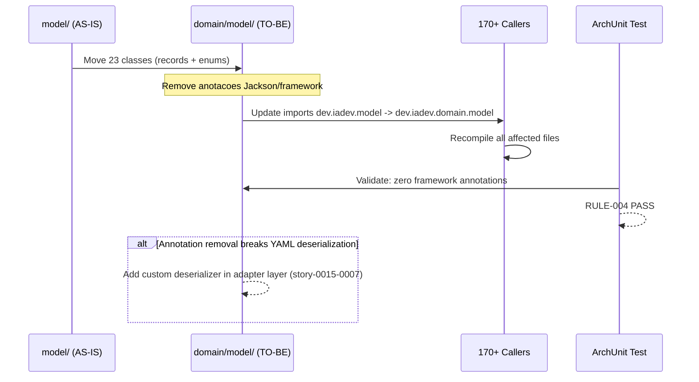

# Historia: Extracao do Domain Model para domain/model/

**ID:** story-0015-0003
**Chave Jira:** —
**Status:** Concluída

## 1. Dependencias

| Blocked By | Blocks |
| :--- | :--- |
| story-0015-0002 | story-0015-0004, story-0015-0005 |

## 2. Regras Transversais Aplicaveis

| ID | Titulo |
| :--- | :--- |
| RULE-001 | Dependency Rule Estrita |
| RULE-004 | Records Imutaveis no Dominio |
| RULE-007 | Paridade Funcional Total |
| RULE-008 | Migracao Incremental sem Big Bang |
| RULE-009 | Cobertura de Testes Mantida |
| RULE-010 | Preservacao de Contratos de Template |

## 3. Descricao

Como **Arquiteto de Software**, eu quero mover os 17+ Java Records imutaveis do pacote `model/` para `domain/model/`, garantindo que nenhum record contenha anotacoes de framework, para que o nucleo de dominio tenha seus modelos puros e desacoplados como primeiro passo da migracao hexagonal.

### Contexto

O pacote `model/` atual contem 23 classes (records e enums) que representam a configuracao de projeto, perfis de stack, contexto de geracao, e resultados. Estes sao os blocos fundamentais do dominio e devem residir em `domain/model/` sem nenhuma dependencia de framework.

Alguns records podem conter anotacoes Jackson (`@JsonProperty`, `@JsonIgnoreProperties`) que precisam ser removidas, movendo a serializacao para os adapters.

### 3.1 Classes a Migrar

As 23 classes em `java/src/main/java/dev/iadev/model/` incluem:
- `ProjectConfig.java` — Configuracao principal do projeto
- `StackProfile.java` — Perfil de stack tecnologico
- `GenerationContext.java` — Contexto de geracao (se existir)
- Demais records e enums do pacote model/

### 3.2 Limpeza de Anotacoes de Framework

Todos os records em `domain/model/` devem ser puramente Java Records sem:
- Anotacoes Jackson (`@JsonProperty`, `@JsonIgnoreProperties`, `@JsonCreator`)
- Anotacoes Picocli
- Qualquer import de `com.fasterxml.jackson`, `io.micronaut`, `org.springframework`, etc.

Se a remocao de anotacoes Jackson quebrar a desserializacao YAML, mover a logica de desserializacao para o adapter `YamlStackProfileRepository` (story-0015-0007).

### 3.3 Atualizacao de Imports

Todos os arquivos que importam `dev.iadev.model.X` devem ser atualizados para `dev.iadev.domain.model.X`. Esta e a mudanca de maior blast radius da migracao.

### 3.4 Ativacao da Regra ArchUnit

Ativar (remover `@Disabled`) da regra `domainModelShouldNotHaveFrameworkAnnotations()` na classe `HexagonalArchitectureTest`.

## 3.5 Entrega de Valor

- **Valor Principal:** Modelos de dominio puros sem acoplamento a frameworks, habilitando testabilidade isolada
- **Metrica de Sucesso:** 23 classes migradas para domain/model/, zero anotacoes de framework, regra ArchUnit ativa e passando
- **Impacto no Negocio:** Estabelece o nucleo imutavel do hexagono, desbloqueando definicao de ports (story-0015-0004, story-0015-0005)

## 4. Definicoes de Qualidade Locais

### DoR Local

- [ ] story-0015-0002 concluida (scaffolding criado)
- [ ] Lista completa de classes em `model/` documentada
- [ ] Auditoria de anotacoes de framework concluida

### DoD Local

- [ ] Todas as 23 classes movidas para `domain/model/`
- [ ] Zero anotacoes de framework em `domain/model/`
- [ ] Todos os imports atualizados no codebase inteiro
- [ ] Regra ArchUnit `domainModelShouldNotHaveFrameworkAnnotations` ativa e passando
- [ ] Pacote `model/` original removido (sem classes restantes)
- [ ] `mvn verify` passa com todos os 1961 testes
- [ ] Test plan gerado via `/x-test-plan` antes do inicio da implementacao
- [ ] Todo @GK-N da secao 7 mapeado para >= 1 AT-N na secao 8
- [ ] Cenarios Gherkin ordenados por TPP (degenerate -> happy -> error -> boundary -> edge)
- [ ] Todo AT-N com status GREEN antes de marcar DoD como concluido
- [ ] Commits seguem padrao test-first (teste precede ou acompanha implementacao no git log)

### Global DoD

- **Cobertura:** >= 95% Line, >= 90% Branch
- **Testes Automatizados:** Testes de modelo + ArchUnit ativada
- **TDD Compliance:** Commits test-first, refactoring explicito
- **Backward Compatibility:** Todos os 1961 testes existentes continuam passando
- **Double-Loop TDD:** Acceptance tests derivados dos cenarios Gherkin (outer loop), unit tests guiados por TPP (inner loop)
- **Rastreabilidade:** Todo @GK-N mapeia para >= 1 AT-N, todo AT-N referencia um @GK-N valido

## 5. Contratos de Dados

| Campo | Tipo | Obrigatorio | Descricao |
| :--- | :--- | :--- | :--- |
| `dev.iadev.domain.model.ProjectConfig` | Java Record | Sim | Configuracao principal do projeto — imutavel, zero anotacoes |
| `dev.iadev.domain.model.StackProfile` | Java Record | Sim | Perfil de stack tecnologico — imutavel, zero anotacoes |
| `dev.iadev.domain.model.*` | Java Records/Enums | Sim | Todas as 23 classes migradas, mantendo mesma API publica |

## 6. Diagramas

### 6.1 Fluxo de Migracao de Records



## 7. Criterios de Aceite (Gherkin)

```gherkin
@GK-1
Cenario: Pacote domain/model/ vazio antes da migracao (estado degenerado)
  DADO que apenas o package-info.java existe em domain/model/
  QUANDO o desenvolvedor lista o conteudo do pacote
  ENTAO apenas package-info.java esta presente
  E nenhuma classe de modelo existe em domain/model/

@GK-2
Cenario: Migracao completa dos 23 records para domain/model/ (happy path)
  DADO que as 23 classes de model/ foram movidas para domain/model/
  E todos os imports foram atualizados no codebase
  QUANDO o desenvolvedor executa "mvn verify"
  ENTAO o build compila com sucesso
  E todos os 1961 testes passam
  E o pacote model/ original nao contem mais classes Java

@GK-3
Cenario: Record com anotacao Jackson detectado como violacao (error path)
  DADO que um record em domain/model/ contem @JsonProperty
  QUANDO a regra ArchUnit domainModelShouldNotHaveFrameworkAnnotations executa
  ENTAO o teste falha indicando a classe e a anotacao violadora
  E o build falha na fase de teste

@GK-4
Cenario: Golden file parity apos migracao (boundary)
  DADO que todos os 23 records foram migrados para domain/model/
  E todas as anotacoes de framework foram removidas
  QUANDO os testes de golden file sao executados
  ENTAO todos os golden files gerados sao identicos aos esperados
  E nenhuma diferenca byte-a-byte e detectada

@GK-5
Cenario: Cobertura de testes mantida apos mudanca massiva de imports (edge case)
  DADO que 170+ arquivos tiveram seus imports atualizados
  QUANDO o JaCoCo calcula cobertura
  ENTAO Line Coverage permanece >= 95%
  E Branch Coverage permanece >= 90%
```

## 8. Sub-tarefas

### Ciclos TDD

> Sub-tarefas TDD serao populadas apos geracao do test plan via `/x-test-plan`.
> Cada AT-N e UT-N do test plan gerara entradas [TDD] com ciclos RED/GREEN/REFACTOR.

### Tarefas nao-TDD

- [ ] [Doc] Documentar lista completa de classes migradas e anotacoes removidas
- [ ] [Arch] Ativar regra ArchUnit domainModelShouldNotHaveFrameworkAnnotations
- [ ] [Arch] Auditar records para anotacoes Jackson antes da migracao

### Avaliacao de Risco

- **Risco de Regressao:** Alto — maior blast radius da migracao (170+ arquivos afetados por mudanca de imports)
- **Estrategia de Rollback:** `git revert` do commit de migracao; IDE refactoring "Move Package" e reversivel
- **Acoplamento Critico:** Pacote `model/` e importado por praticamente todas as outras classes. Especial atencao a: assemblers (23 classes), config (4 classes), domain services, CLI commands

### ArchUnit Snippet (Referencia)

```java
// Ativar apos migracao (remover @Disabled)
@ArchTest
static final ArchRule domainModelShouldNotHaveFrameworkAnnotations =
    classes().that().resideInAPackage("..domain.model..")
        .should().notBeAnnotatedWith("com.fasterxml.jackson.annotation.JsonProperty")
        .andShould().notBeAnnotatedWith("com.fasterxml.jackson.annotation.JsonIgnoreProperties")
        .andShould().notBeAnnotatedWith("com.fasterxml.jackson.annotation.JsonCreator");
```

### Migration Checklist

- [ ] Pacotes legados mantidos como facade: Nao — model/ e completamente esvaziado
- [ ] Zero imports proibidos apos migracao parcial
- [ ] Build passa com `mvn verify`
- [ ] Golden file tests passam
- [ ] Coverage thresholds mantidos
