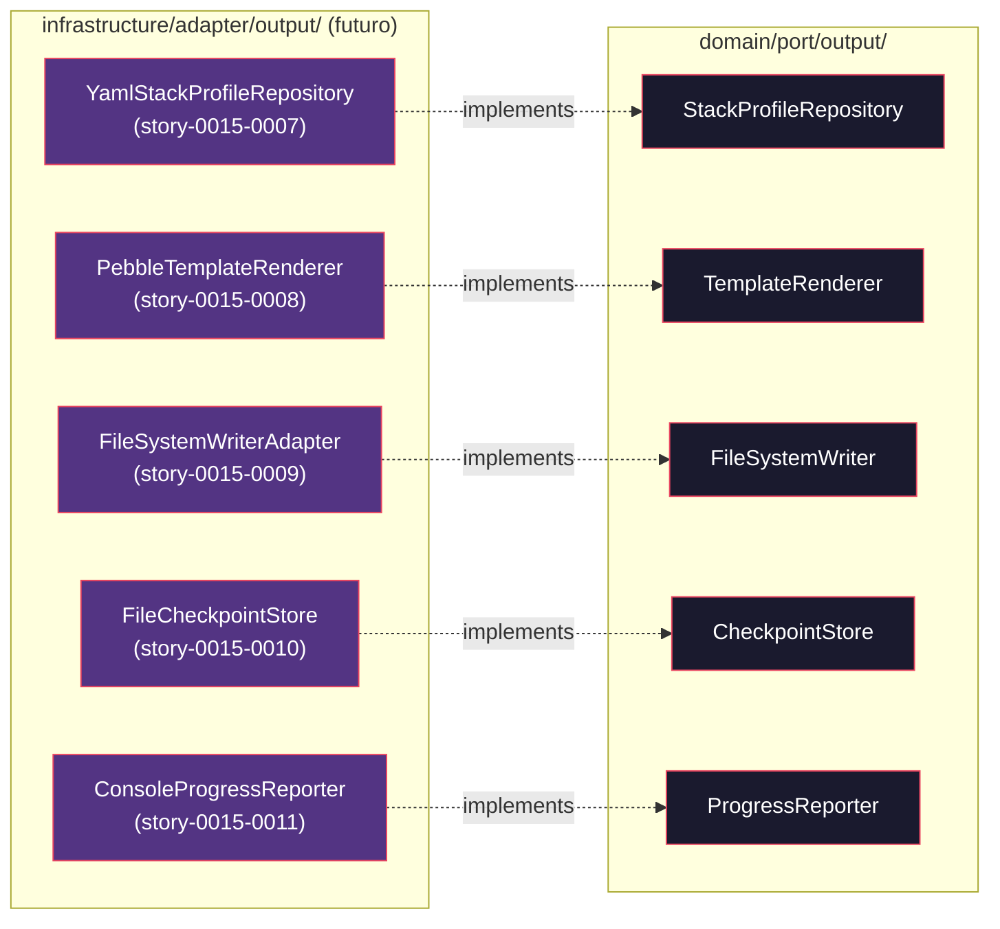

# Historia: Definicao dos Output Ports em domain/port/output/

**ID:** story-0015-0004
**Chave Jira:** —
**Status:** Concluída

## 1. Dependencias

| Blocked By | Blocks |
| :--- | :--- |
| story-0015-0003 | story-0015-0006 |

## 2. Regras Transversais Aplicaveis

| ID | Titulo |
| :--- | :--- |
| RULE-001 | Dependency Rule Estrita |
| RULE-002 | Ports como Contratos |
| RULE-008 | Migracao Incremental sem Big Bang |

## 3. Descricao

Como **Arquiteto de Software**, eu quero definir as 5 interfaces de Output Port que abstraem todos os acessos a recursos externos, para que o dominio dependa exclusivamente de contratos e nunca de implementacoes concretas de infraestrutura.

### Contexto

Os Output Ports sao interfaces que o dominio declara como suas necessidades de infraestrutura. Cada interface sera derivada da analise dos contratos implicitos nos adapters atuais (`template/`, `config/`, `util/`, `checkpoint/`, `progress/`). O dominio conhecera apenas essas interfaces — as implementacoes concretas residirao nos adapters (stories 0007-0011).

### 3.1 StackProfileRepository

Interface para carregar perfis de stack tecnologico. Derivada do comportamento atual em `config/`.

```java
package dev.iadev.domain.port.output;

import dev.iadev.domain.model.StackProfile;
import java.util.List;
import java.util.Optional;

public interface StackProfileRepository {
    List<StackProfile> findAll();
    Optional<StackProfile> findByName(String profileName);
    boolean exists(String profileName);
}
```

### 3.2 TemplateRenderer

Interface para renderizacao de templates. Derivada do comportamento atual em `template/`.

```java
package dev.iadev.domain.port.output;

import java.util.Map;

public interface TemplateRenderer {
    String render(String templatePath, Map<String, Object> context);
    boolean templateExists(String templatePath);
}
```

### 3.3 FileSystemWriter

Interface para operacoes de escrita no filesystem. Derivada do comportamento atual em `util/`.

```java
package dev.iadev.domain.port.output;

import java.nio.file.Path;

public interface FileSystemWriter {
    void writeFile(Path path, String content);
    void createDirectory(Path path);
    boolean exists(Path path);
    void copyResource(String resourcePath, Path destination);
}
```

### 3.4 CheckpointStore

Interface para gerenciamento de estado de execucao. Derivada do comportamento atual em `checkpoint/`.

```java
package dev.iadev.domain.port.output;

import dev.iadev.domain.model.CheckpointState;
import java.util.Optional;

public interface CheckpointStore {
    void save(CheckpointState state);
    Optional<CheckpointState> load(String executionId);
    void clear(String executionId);
}
```

### 3.5 ProgressReporter

Interface para reporte de progresso. Derivada do comportamento atual em `progress/`.

```java
package dev.iadev.domain.port.output;

public interface ProgressReporter {
    void reportStart(String taskName, int totalSteps);
    void reportProgress(String taskName, int currentStep, String message);
    void reportComplete(String taskName);
    void reportError(String taskName, String errorMessage);
}
```

### 3.6 Ativacao de Regra ArchUnit

Ativar a regra `outputPortsShouldBeInterfaces()` em `HexagonalArchitectureTest`.

## 3.5 Entrega de Valor

- **Valor Principal:** Contratos de infraestrutura estabilizados, permitindo implementacao paralela de 6 adapters por equipes diferentes
- **Metrica de Sucesso:** 5 interfaces Output Port definidas em domain/port/output/, regra ArchUnit ativa
- **Impacto no Negocio:** Desacopla o dominio de implementacoes concretas de I/O, templates, e persistencia — possibilita troca de tecnologias (ex: Pebble por FreeMarker) sem alterar logica de negocio

## 4. Definicoes de Qualidade Locais

### DoR Local

- [ ] story-0015-0003 concluida (domain model migrado)
- [ ] Analise dos contratos implicitos nos adapters atuais concluida
- [ ] Assinaturas de metodos revisadas e aprovadas

### DoD Local

- [ ] 5 interfaces Output Port criadas em domain/port/output/
- [ ] Cada interface documentada com Javadoc (contrato, pre/pos-condicoes, excecoes)
- [ ] Regra ArchUnit outputPortsShouldBeInterfaces ativa e passando
- [ ] Interfaces usam apenas tipos de domain/model/ ou standard library
- [ ] `mvn verify` passa com todos os testes
- [ ] Test plan gerado via `/x-test-plan` antes do inicio da implementacao
- [ ] Todo @GK-N da secao 7 mapeado para >= 1 AT-N na secao 8
- [ ] Cenarios Gherkin ordenados por TPP (degenerate -> happy -> error -> boundary -> edge)
- [ ] Todo AT-N com status GREEN antes de marcar DoD como concluido
- [ ] Commits seguem padrao test-first (teste precede ou acompanha implementacao no git log)

### Global DoD

- **Cobertura:** >= 95% Line, >= 90% Branch
- **Testes Automatizados:** Testes ArchUnit para validacao de interfaces
- **TDD Compliance:** Commits test-first, refactoring explicito
- **Backward Compatibility:** Todos os 1961 testes existentes continuam passando
- **Double-Loop TDD:** Acceptance tests derivados dos cenarios Gherkin (outer loop), unit tests guiados por TPP (inner loop)
- **Rastreabilidade:** Todo @GK-N mapeia para >= 1 AT-N, todo AT-N referencia um @GK-N valido

## 5. Contratos de Dados

| Campo | Tipo | Obrigatorio | Descricao |
| :--- | :--- | :--- | :--- |
| `StackProfileRepository` | Interface | Sim | `findAll()`, `findByName(String)`, `exists(String)` |
| `TemplateRenderer` | Interface | Sim | `render(String, Map)`, `templateExists(String)` |
| `FileSystemWriter` | Interface | Sim | `writeFile(Path, String)`, `createDirectory(Path)`, `exists(Path)`, `copyResource(String, Path)` |
| `CheckpointStore` | Interface | Sim | `save(CheckpointState)`, `load(String)`, `clear(String)` |
| `ProgressReporter` | Interface | Sim | `reportStart(String, int)`, `reportProgress(String, int, String)`, `reportComplete(String)`, `reportError(String, String)` |

## 6. Diagramas

### 6.1 Output Ports e seus Adapters Futuros



## 7. Criterios de Aceite (Gherkin)

```gherkin
@GK-1
Cenario: Pacote output ports vazio antes da definicao (estado degenerado)
  DADO que apenas package-info.java existe em domain/port/output/
  QUANDO o desenvolvedor lista o conteudo do pacote
  ENTAO nenhuma interface de Output Port existe

@GK-2
Cenario: Cinco Output Ports definidos com sucesso (happy path)
  DADO que as 5 interfaces foram criadas em domain/port/output/
  E cada interface usa apenas tipos de domain/model/ ou java.* standard library
  QUANDO o desenvolvedor executa "mvn compile"
  ENTAO o build compila com sucesso
  E cada interface possui Javadoc com contrato documentado

@GK-3
Cenario: Output Port com dependencia de framework detectado (error path)
  DADO que uma interface em domain/port/output/ importa com.fasterxml.jackson
  QUANDO a regra ArchUnit outputPortsShouldBeInterfaces executa
  ENTAO o teste falha indicando a interface violadora e o import proibido

@GK-4
Cenario: Output Port declarado como classe concreta em vez de interface (boundary)
  DADO que StackProfileRepository e declarado como "class" em vez de "interface"
  QUANDO a regra ArchUnit outputPortsShouldBeInterfaces executa
  ENTAO o teste falha indicando que Output Ports devem ser interfaces

@GK-5
Cenario: Assinaturas de metodos cobrem todos os contratos implicitos (edge case)
  DADO que as 5 interfaces Output Port estao definidas
  QUANDO cada metodo e comparado com o uso atual no codigo
  ENTAO StackProfileRepository cobre findAll, findByName, exists
  E TemplateRenderer cobre render e templateExists
  E FileSystemWriter cobre writeFile, createDirectory, exists, copyResource
  E CheckpointStore cobre save, load, clear
  E ProgressReporter cobre reportStart, reportProgress, reportComplete, reportError
```

## 8. Sub-tarefas

### Ciclos TDD

> Sub-tarefas TDD serao populadas apos geracao do test plan via `/x-test-plan`.

### Tarefas nao-TDD

- [ ] [Doc] Documentar Javadoc com pre/pos-condicoes para cada interface
- [ ] [Arch] Ativar regra ArchUnit outputPortsShouldBeInterfaces
- [ ] [Arch] Auditar contratos implicitos nos adapters atuais antes de definir interfaces

### Avaliacao de Risco

- **Risco de Regressao:** Baixo — apenas adiciona interfaces novas sem alterar codigo existente
- **Estrategia de Rollback:** Deletar as 5 interfaces criadas
- **Acoplamento Critico:** As assinaturas dos metodos devem ser cuidadosamente derivadas dos contratos atuais para evitar redesign nas stories 0007-0011

### ArchUnit Snippet (Referencia)

```java
@ArchTest
static final ArchRule outputPortsShouldBeInterfaces =
    classes().that().resideInAPackage("..domain.port.output..")
        .should().beInterfaces()
        .because("Output Ports sao contratos — devem ser interfaces puras (RULE-002)");
```

### Migration Checklist

- [ ] Pacotes legados mantidos como facade: N/A (nenhum codigo movido, apenas interfaces novas)
- [ ] Zero imports proibidos apos migracao parcial
- [ ] Build passa com `mvn verify`
- [ ] Golden file tests passam
- [ ] Coverage thresholds mantidos
