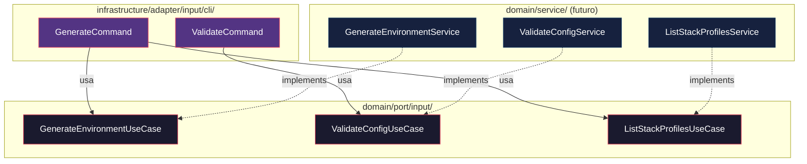

# Historia: Definicao dos Input Ports (Use Cases) em domain/port/input/

**ID:** story-0015-0005
**Chave Jira:** —
**Status:** Concluída

## 1. Dependencias

| Blocked By | Blocks |
| :--- | :--- |
| story-0015-0003 | story-0015-0006 |

## 2. Regras Transversais Aplicaveis

| ID | Titulo |
| :--- | :--- |
| RULE-001 | Dependency Rule Estrita |
| RULE-003 | Use Cases como Ponto de Entrada |
| RULE-008 | Migracao Incremental sem Big Bang |

## 3. Descricao

Como **Arquiteto de Software**, eu quero definir as 3 interfaces de Input Port que representam os casos de uso do sistema, para que a CLI e futuros clientes interajam com o dominio atraves de contratos estabilizados e nao de implementacoes internas.

### Contexto

Os Input Ports sao interfaces que definem o que o sistema pode fazer. Cada interface corresponde a um comando CLI existente ou funcionalidade principal. Os Domain Services (story-0015-0006) implementarao estas interfaces.

### 3.1 GenerateEnvironmentUseCase

Caso de uso principal: gerar ambiente de desenvolvimento completo.

```java
package dev.iadev.domain.port.input;

import dev.iadev.domain.model.GenerationContext;
import dev.iadev.domain.model.GenerationResult;

public interface GenerateEnvironmentUseCase {
    GenerationResult generate(GenerationContext context);
}
```

### 3.2 ValidateConfigUseCase

Caso de uso de validacao de configuracao.

```java
package dev.iadev.domain.port.input;

import dev.iadev.domain.model.ProjectConfig;
import dev.iadev.domain.model.ValidationResult;

public interface ValidateConfigUseCase {
    ValidationResult validate(ProjectConfig config);
}
```

### 3.3 ListStackProfilesUseCase

Caso de uso para listar perfis de stack disponiveis.

```java
package dev.iadev.domain.port.input;

import dev.iadev.domain.model.StackProfile;
import java.util.List;

public interface ListStackProfilesUseCase {
    List<StackProfile> listProfiles();
}
```

### 3.4 Ativacao de Regra ArchUnit

Ativar a regra `inputPortsShouldBeInterfaces()` em `HexagonalArchitectureTest`.

## 3.5 Entrega de Valor

- **Valor Principal:** API de dominio estabilizada, permitindo desenvolvimento independente de CLI e servicos
- **Metrica de Sucesso:** 3 interfaces Input Port definidas, regra ArchUnit ativa
- **Impacto no Negocio:** Estabiliza o contrato entre CLI e dominio, habilitando futura exposicao dos mesmos use cases via REST API ou SDK sem alterar logica de negocio

## 4. Definicoes de Qualidade Locais

### DoR Local

- [ ] story-0015-0003 concluida (domain model migrado)
- [ ] Mapeamento de comandos CLI para use cases documentado

### DoD Local

- [ ] 3 interfaces Input Port criadas em domain/port/input/
- [ ] Cada interface documentada com Javadoc (contrato, excecoes declaradas)
- [ ] Regra ArchUnit inputPortsShouldBeInterfaces ativa e passando
- [ ] Interfaces usam apenas tipos de domain/model/ ou standard library
- [ ] `mvn verify` passa com todos os testes
- [ ] Test plan gerado via `/x-test-plan` antes do inicio da implementacao
- [ ] Todo @GK-N da secao 7 mapeado para >= 1 AT-N na secao 8
- [ ] Cenarios Gherkin ordenados por TPP (degenerate -> happy -> error -> boundary -> edge)
- [ ] Todo AT-N com status GREEN antes de marcar DoD como concluido
- [ ] Commits seguem padrao test-first (teste precede ou acompanha implementacao no git log)

### Global DoD

- **Cobertura:** >= 95% Line, >= 90% Branch
- **Testes Automatizados:** Testes ArchUnit para validacao de interfaces
- **TDD Compliance:** Commits test-first, refactoring explicito
- **Backward Compatibility:** Todos os 1961 testes existentes continuam passando
- **Double-Loop TDD:** Acceptance tests derivados dos cenarios Gherkin (outer loop), unit tests guiados por TPP (inner loop)
- **Rastreabilidade:** Todo @GK-N mapeia para >= 1 AT-N, todo AT-N referencia um @GK-N valido

## 5. Contratos de Dados

| Campo | Tipo | Obrigatorio | Descricao |
| :--- | :--- | :--- | :--- |
| `GenerateEnvironmentUseCase` | Interface | Sim | `generate(GenerationContext): GenerationResult` |
| `ValidateConfigUseCase` | Interface | Sim | `validate(ProjectConfig): ValidationResult` |
| `ListStackProfilesUseCase` | Interface | Sim | `listProfiles(): List<StackProfile>` |

## 6. Diagramas

### 6.1 Input Ports e Fluxo de Dependencia



## 7. Criterios de Aceite (Gherkin)

```gherkin
@GK-1
Cenario: Pacote input ports vazio antes da definicao (estado degenerado)
  DADO que apenas package-info.java existe em domain/port/input/
  QUANDO o desenvolvedor lista o conteudo do pacote
  ENTAO nenhuma interface de Input Port existe

@GK-2
Cenario: Tres Input Ports definidos com sucesso (happy path)
  DADO que as 3 interfaces foram criadas em domain/port/input/
  E cada interface usa apenas tipos de domain/model/ ou java.* standard library
  QUANDO o desenvolvedor executa "mvn compile"
  ENTAO o build compila com sucesso
  E GenerateEnvironmentUseCase declara metodo generate(GenerationContext)
  E ValidateConfigUseCase declara metodo validate(ProjectConfig)
  E ListStackProfilesUseCase declara metodo listProfiles()

@GK-3
Cenario: Input Port com dependencia de infrastructure detectado (error path)
  DADO que uma interface em domain/port/input/ importa de infrastructure/
  QUANDO a regra ArchUnit inputPortsShouldBeInterfaces executa
  ENTAO o teste falha indicando a interface e o import violador

@GK-4
Cenario: Input Port como classe concreta em vez de interface (boundary)
  DADO que GenerateEnvironmentUseCase e declarado como "class"
  QUANDO a regra ArchUnit inputPortsShouldBeInterfaces executa
  ENTAO o teste falha indicando que Input Ports devem ser interfaces

@GK-5
Cenario: Cobertura de cada comando CLI por um Input Port (edge case)
  DADO que os 3 Input Ports estao definidos
  QUANDO comparados com os comandos CLI existentes
  ENTAO GenerateCommand mapeia para GenerateEnvironmentUseCase
  E ValidateCommand mapeia para ValidateConfigUseCase
  E comandos de listagem mapeiam para ListStackProfilesUseCase
```

## 8. Sub-tarefas

### Ciclos TDD

> Sub-tarefas TDD serao populadas apos geracao do test plan via `/x-test-plan`.

### Tarefas nao-TDD

- [ ] [Doc] Documentar Javadoc com contrato e excecoes declaradas para cada interface
- [ ] [Arch] Ativar regra ArchUnit inputPortsShouldBeInterfaces
- [ ] [Arch] Mapear comandos CLI para use cases correspondentes

### Avaliacao de Risco

- **Risco de Regressao:** Baixo — apenas adiciona interfaces novas
- **Estrategia de Rollback:** Deletar as 3 interfaces criadas
- **Acoplamento Critico:** Os tipos de retorno (GenerationResult, ValidationResult) devem existir em domain/model/ (garantido por story-0015-0003)

### ArchUnit Snippet (Referencia)

```java
@ArchTest
static final ArchRule inputPortsShouldBeInterfaces =
    classes().that().resideInAPackage("..domain.port.input..")
        .should().beInterfaces()
        .because("Input Ports sao contratos de Use Case — devem ser interfaces (RULE-003)");
```

### Migration Checklist

- [ ] Pacotes legados mantidos como facade: N/A (apenas interfaces novas)
- [ ] Zero imports proibidos apos migracao parcial
- [ ] Build passa com `mvn verify`
- [ ] Golden file tests passam
- [ ] Coverage thresholds mantidos
