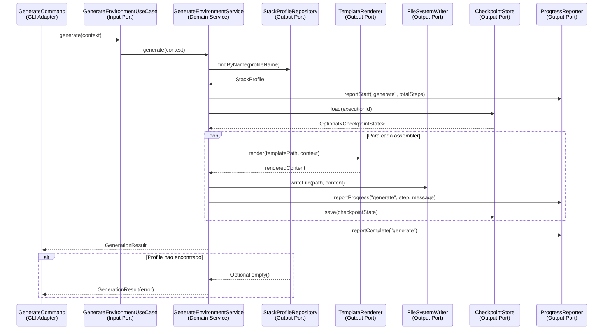

# Historia: Implementacao dos Domain Services em domain/service/

**ID:** story-0015-0006
**Chave Jira:** —
**Status:** Concluída

## 1. Dependencias

| Blocked By | Blocks |
| :--- | :--- |
| story-0015-0004, story-0015-0005 | story-0015-0007, story-0015-0008, story-0015-0009, story-0015-0010, story-0015-0011, story-0015-0012 |

## 2. Regras Transversais Aplicaveis

| ID | Titulo |
| :--- | :--- |
| RULE-001 | Dependency Rule Estrita |
| RULE-002 | Ports como Contratos |
| RULE-003 | Use Cases como Ponto de Entrada |
| RULE-007 | Paridade Funcional Total |
| RULE-008 | Migracao Incremental sem Big Bang |
| RULE-009 | Cobertura de Testes Mantida |

## 3. Descricao

Como **Arquiteto de Software**, eu quero implementar os Domain Services que conectam Input Ports a Output Ports, encapsulando a logica de negocio central, para que o hexagono de dominio esteja completo e validado antes de iniciar a implementacao dos adapters de infraestrutura.

### Contexto

Esta e a historia de **maior risco tecnico** do epico. Os Domain Services implementam os Input Ports e dependem exclusivamente de Output Ports — nunca de implementacoes concretas. A logica de negocio atual em `domain/` (resolucao de stack, DAG de dependencias) e o comportamento de orquestracao nos commands CLI devem ser redistribuidos nos 3 services.

### 3.1 GenerateEnvironmentService

Implementa `GenerateEnvironmentUseCase`. Orquestra o fluxo completo de geracao:
1. Resolve stack profile via `StackProfileRepository`
2. Constroi contexto de geracao
3. Delega rendering aos assemblers (via application layer)
4. Reporta progresso via `ProgressReporter`
5. Salva checkpoints via `CheckpointStore`
6. Escreve arquivos via `FileSystemWriter`

```java
package dev.iadev.domain.service;

import dev.iadev.domain.port.input.GenerateEnvironmentUseCase;
import dev.iadev.domain.port.output.*;
import dev.iadev.domain.model.*;

public class GenerateEnvironmentService implements GenerateEnvironmentUseCase {
    private final StackProfileRepository profileRepository;
    private final TemplateRenderer templateRenderer;
    private final FileSystemWriter fileSystemWriter;
    private final CheckpointStore checkpointStore;
    private final ProgressReporter progressReporter;

    // Constructor injection — all dependencies are Output Ports
    public GenerateEnvironmentService(
            StackProfileRepository profileRepository,
            TemplateRenderer templateRenderer,
            FileSystemWriter fileSystemWriter,
            CheckpointStore checkpointStore,
            ProgressReporter progressReporter) {
        this.profileRepository = profileRepository;
        this.templateRenderer = templateRenderer;
        this.fileSystemWriter = fileSystemWriter;
        this.checkpointStore = checkpointStore;
        this.progressReporter = progressReporter;
    }

    @Override
    public GenerationResult generate(GenerationContext context) {
        // Business logic migrated from domain/ and cli/
    }
}
```

### 3.2 ValidateConfigService

Implementa `ValidateConfigUseCase`. Valida configuracao do projeto usando regras de dominio.

### 3.3 ListStackProfilesService

Implementa `ListStackProfilesUseCase`. Delega ao `StackProfileRepository`.

### 3.4 Migracao da Logica de domain/

Mover logica de resolucao de stack de `domain/stack/` para os services apropriados. A logica de DAG em `domain/implementationmap/` pode permanecer como engine auxiliar dentro de `domain/` ou ser incorporada nos services.

### 3.5 Testes Unitarios com Mocks de Output Ports

Cada service deve ter testes unitarios extensivos usando Mockito para mockar todos os Output Ports. Isso valida que a logica de negocio funciona corretamente independente da infraestrutura.

## 3.5 Entrega de Valor

- **Valor Principal:** Logica de negocio central isolada e testavel com mocks de infraestrutura, validando que o padrao hexagonal funciona end-to-end
- **Metrica de Sucesso:** 3 Domain Services implementados, 100% testados com mocks de Output Ports, zero dependencias concretas de infraestrutura
- **Impacto no Negocio:** Completa o hexagono de dominio — apos esta historia, o nucleo de negocio e auto-contido e pode ser testado sem filesystem, templates, ou YAML. Desbloqueia 7 stories de adapters em paralelo

## 4. Definicoes de Qualidade Locais

### DoR Local

- [ ] story-0015-0004 e story-0015-0005 concluidas (todos os ports definidos)
- [ ] Logica de negocio atual em domain/ mapeada para services
- [ ] Estrategia de redistribuicao de codigo aprovada

### DoD Local

- [ ] 3 Domain Services criados em domain/service/
- [ ] Cada service implementa seu Input Port correspondente
- [ ] Dependencias exclusivamente via Output Ports (constructor injection)
- [ ] Testes unitarios com mocks de Output Ports para todos os metodos
- [ ] Logica de domain/stack/ e domain/implementationmap/ redistribuida
- [ ] Regras ArchUnit RULE-001, RULE-002, RULE-003 ativas e passando para domain/service/
- [ ] `mvn verify` passa com todos os testes
- [ ] Test plan gerado via `/x-test-plan` antes do inicio da implementacao
- [ ] Todo @GK-N da secao 7 mapeado para >= 1 AT-N na secao 8
- [ ] Cenarios Gherkin ordenados por TPP (degenerate -> happy -> error -> boundary -> edge)
- [ ] Todo AT-N com status GREEN antes de marcar DoD como concluido
- [ ] Commits seguem padrao test-first (teste precede ou acompanha implementacao no git log)

### Global DoD

- **Cobertura:** >= 95% Line, >= 90% Branch
- **Testes Automatizados:** Unit tests com mocks + ArchUnit
- **TDD Compliance:** Commits test-first, refactoring explicito
- **Backward Compatibility:** Todos os 1961 testes existentes continuam passando
- **Double-Loop TDD:** Acceptance tests derivados dos cenarios Gherkin (outer loop), unit tests guiados por TPP (inner loop)
- **Rastreabilidade:** Todo @GK-N mapeia para >= 1 AT-N, todo AT-N referencia um @GK-N valido

## 5. Contratos de Dados

| Campo | Tipo | Obrigatorio | Descricao |
| :--- | :--- | :--- | :--- |
| `GenerateEnvironmentService` | Class | Sim | Implements `GenerateEnvironmentUseCase`, depends on 5 Output Ports via constructor |
| `ValidateConfigService` | Class | Sim | Implements `ValidateConfigUseCase`, depends on `StackProfileRepository` |
| `ListStackProfilesService` | Class | Sim | Implements `ListStackProfilesUseCase`, depends on `StackProfileRepository` |

## 6. Diagramas

### 6.1 Fluxo de Geracao via Domain Service



## 7. Criterios de Aceite (Gherkin)

```gherkin
@GK-1
Cenario: Domain Service sem Output Ports injetados (estado degenerado)
  DADO que GenerateEnvironmentService e instanciado com Output Ports nulos
  QUANDO o metodo generate() e chamado
  ENTAO uma NullPointerException ou excecao de validacao e lancada
  E nenhuma operacao de I/O e realizada

@GK-2
Cenario: Geracao completa com mocks de Output Ports (happy path)
  DADO que GenerateEnvironmentService recebe mocks de todos os 5 Output Ports
  E StackProfileRepository.findByName retorna um StackProfile valido
  E TemplateRenderer.render retorna conteudo renderizado
  QUANDO generate() e chamado com um GenerationContext valido
  ENTAO GenerationResult indica sucesso
  E ProgressReporter.reportComplete foi invocado
  E CheckpointStore.save foi invocado pelo menos uma vez
  E FileSystemWriter.writeFile foi invocado para cada arquivo gerado

@GK-3
Cenario: Profile inexistente retorna resultado de erro (error path)
  DADO que GenerateEnvironmentService recebe mocks de todos os Output Ports
  E StackProfileRepository.findByName retorna Optional.empty()
  QUANDO generate() e chamado com profileName "nonexistent"
  ENTAO GenerationResult indica erro com mensagem descritiva
  E nenhum arquivo e escrito via FileSystemWriter

@GK-4
Cenario: Domain Service nao importa classes de infrastructure (boundary — ArchUnit)
  DADO que GenerateEnvironmentService esta em domain/service/
  QUANDO a regra ArchUnit domainShouldNotDependOnInfrastructure executa
  ENTAO o teste passa
  E nenhum import de infrastructure/ e detectado

@GK-5
Cenario: Todos os 1961 testes continuam passando apos redistribuicao de logica (edge case)
  DADO que a logica de domain/stack/ foi redistribuida nos services
  E a logica de domain/implementationmap/ foi incorporada
  QUANDO "mvn verify" e executado
  ENTAO todos os 1961 testes passam
  E Line Coverage >= 95%
  E Branch Coverage >= 90%

@GK-6
Cenario: ValidateConfigService retorna resultado de validacao (happy path - validate)
  DADO que ValidateConfigService recebe mock de StackProfileRepository
  E a configuracao ProjectConfig e valida
  QUANDO validate() e chamado
  ENTAO ValidationResult indica sucesso com zero erros

@GK-7
Cenario: ListStackProfilesService delega ao repository (happy path - list)
  DADO que ListStackProfilesService recebe mock de StackProfileRepository
  E StackProfileRepository.findAll retorna 8 perfis
  QUANDO listProfiles() e chamado
  ENTAO a lista retornada contem exatamente 8 StackProfile
```

## 8. Sub-tarefas

### Ciclos TDD

> Sub-tarefas TDD serao populadas apos geracao do test plan via `/x-test-plan`.

### Tarefas nao-TDD

- [ ] [Doc] Documentar decisao de redistribuicao de logica domain/ para services
- [ ] [Arch] Ativar regras ArchUnit para domain/service/ (RULE-001, RULE-002, RULE-003)
- [ ] [Arch] Mapear logica existente em domain/stack/ e domain/implementationmap/ para services

### Avaliacao de Risco

- **Risco de Regressao:** Alto — esta e a historia de maior risco tecnico. Redistribuicao de logica de negocio pode introduzir bugs sutis
- **Estrategia de Rollback:** `git revert` do commit; manter classes originais em domain/ como fallback ate services estarem validados
- **Acoplamento Critico:**
  - `domain/stack/` (11 classes) — StackResolver, StackProfileLoader, e dependencias
  - `domain/implementationmap/` (13 classes) — DependencyGraph, PhaseComputer
  - CLI commands que orquestram logica de negocio diretamente

### Migration Checklist

- [ ] Pacotes legados mantidos como facade: Sim — domain/stack/ e domain/implementationmap/ mantidos temporariamente como delegates
- [ ] Zero imports proibidos apos migracao parcial
- [ ] Build passa com `mvn verify`
- [ ] Golden file tests passam
- [ ] Coverage thresholds mantidos
