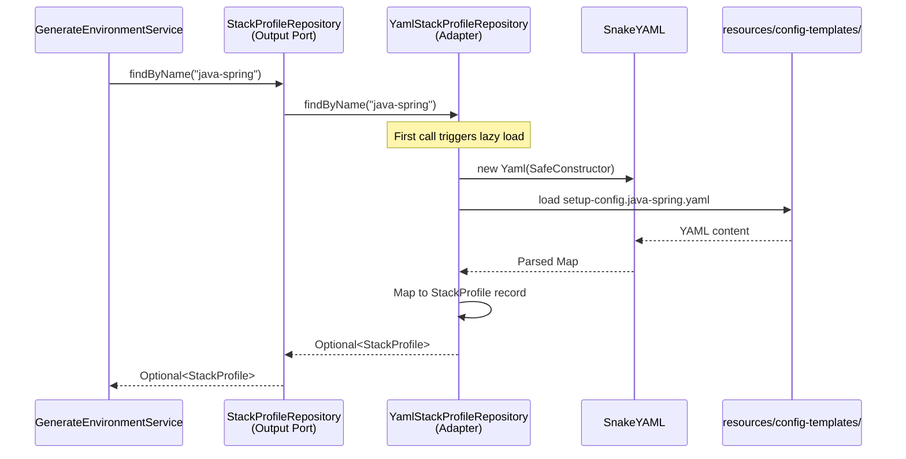

# Historia: Adapter — YamlStackProfileRepository

**ID:** story-0015-0007
**Chave Jira:** —
**Status:** Concluída

## 1. Dependencias

| Blocked By | Blocks |
| :--- | :--- |
| story-0015-0006 | story-0015-0014 |

## 2. Regras Transversais Aplicaveis

| ID | Titulo |
| :--- | :--- |
| RULE-001 | Dependency Rule Estrita |
| RULE-002 | Ports como Contratos |
| RULE-007 | Paridade Funcional Total |
| RULE-008 | Migracao Incremental sem Big Bang |
| RULE-009 | Cobertura de Testes Mantida |

## 3. Descricao

Como **Arquiteto de Software**, eu quero extrair o parsing YAML de perfis de stack do pacote `config/` para um Output Adapter `YamlStackProfileRepository` que implementa `StackProfileRepository`, para que o dominio nao conheca mais detalhes de SnakeYAML e o formato de armazenamento de perfis possa ser trocado sem alterar logica de negocio.

### Contexto

O pacote `config/` atual mistura parsing de YAML (infraestrutura) com montagem de contexto de dominio. Esta historia extrai a parte de parsing YAML para o adapter, implementando a interface `StackProfileRepository` definida na story-0015-0004. Os perfis bundled (8 perfis: go-gin, java-quarkus, java-spring, kotlin-ktor, python-click-cli, python-fastapi, rust-axum, typescript-nestjs) sao carregados de `src/main/resources/config-templates/`.

### 3.1 YamlStackProfileRepository

```java
package dev.iadev.infrastructure.adapter.output.config;

import dev.iadev.domain.model.StackProfile;
import dev.iadev.domain.port.output.StackProfileRepository;
import org.yaml.snakeyaml.Yaml;
import java.util.*;

public class YamlStackProfileRepository implements StackProfileRepository {
    private final Map<String, StackProfile> profiles;

    public YamlStackProfileRepository() {
        this.profiles = loadBundledProfiles();
    }

    @Override
    public List<StackProfile> findAll() { return List.copyOf(profiles.values()); }

    @Override
    public Optional<StackProfile> findByName(String profileName) {
        return Optional.ofNullable(profiles.get(profileName));
    }

    @Override
    public boolean exists(String profileName) { return profiles.containsKey(profileName); }

    private Map<String, StackProfile> loadBundledProfiles() {
        // Migrate YAML loading logic from config/
    }
}
```

### 3.2 Manter config/ como Facade Temporario

Manter `config/` temporariamente como facade que delega ao novo adapter. Isso permite migracao incremental dos callers. O facade sera removido na story-0015-0015.

### 3.3 Testes de Integracao

Testes de integracao que verificam o carregamento real dos 8 perfis bundled de YAML. Nao usar mocks para os perfis reais — testar com os arquivos YAML reais em resources.

## 3.5 Entrega de Valor

- **Valor Principal:** Carregamento de perfis de stack desacoplado do dominio, permitindo troca futura de formato (YAML/JSON/TOML) sem alterar logica de negocio
- **Metrica de Sucesso:** 8 perfis bundled carregados pelo adapter, config/ funciona como facade, zero mudancas de comportamento
- **Impacto no Negocio:** Elimina acoplamento SnakeYAML no dominio — desbloqueia story-0015-0014 (Composition Root)

## 4. Definicoes de Qualidade Locais

### DoR Local

- [ ] story-0015-0006 concluida (Domain Services implementados)
- [ ] Interface StackProfileRepository definida (story-0015-0004)
- [ ] Logica de parsing YAML em config/ mapeada

### DoD Local

- [ ] YamlStackProfileRepository criado em infrastructure/adapter/output/config/
- [ ] Implementa StackProfileRepository corretamente
- [ ] 8 perfis bundled carregados com sucesso
- [ ] config/ mantido como facade temporario
- [ ] Testes de integracao com perfis YAML reais
- [ ] `mvn verify` passa com todos os testes
- [ ] Test plan gerado via `/x-test-plan` antes do inicio da implementacao
- [ ] Todo @GK-N da secao 7 mapeado para >= 1 AT-N na secao 8
- [ ] Cenarios Gherkin ordenados por TPP (degenerate -> happy -> error -> boundary -> edge)
- [ ] Todo AT-N com status GREEN antes de marcar DoD como concluido
- [ ] Commits seguem padrao test-first (teste precede ou acompanha implementacao no git log)

### Global DoD

- **Cobertura:** >= 95% Line, >= 90% Branch
- **Testes Automatizados:** Integration tests com YAML reais + unit tests com mocks
- **TDD Compliance:** Commits test-first, refactoring explicito
- **Backward Compatibility:** Todos os 1961 testes existentes continuam passando
- **Double-Loop TDD:** Acceptance tests derivados dos cenarios Gherkin (outer loop), unit tests guiados por TPP (inner loop)
- **Rastreabilidade:** Todo @GK-N mapeia para >= 1 AT-N, todo AT-N referencia um @GK-N valido

## 5. Contratos de Dados

| Campo | Tipo | Obrigatorio | Descricao |
| :--- | :--- | :--- | :--- |
| `YamlStackProfileRepository` | Class | Sim | Implements `StackProfileRepository`, uses SnakeYAML |
| `findAll()` | `List<StackProfile>` | Sim | Retorna todos os 8 perfis bundled |
| `findByName(String)` | `Optional<StackProfile>` | Sim | Busca perfil por nome exato |
| `exists(String)` | `boolean` | Sim | Verifica existencia sem carregar objeto completo |

## 6. Diagramas

### 6.1 Fluxo de Carregamento de Perfis



## 7. Criterios de Aceite (Gherkin)

```gherkin
@GK-1
Cenario: Repository sem perfis bundled (estado degenerado)
  DADO que o diretorio resources/config-templates/ esta vazio
  QUANDO findAll() e chamado
  ENTAO uma lista vazia e retornada
  E nenhuma excecao e lancada

@GK-2
Cenario: Carregamento dos 8 perfis bundled (happy path)
  DADO que os 8 arquivos YAML existem em resources/config-templates/
  QUANDO findAll() e chamado no YamlStackProfileRepository
  ENTAO a lista retornada contem exatamente 8 StackProfile
  E cada perfil contem nome, linguagem, framework, e build tool validos

@GK-3
Cenario: Busca de perfil inexistente retorna empty (error path)
  DADO que o repository esta carregado com os 8 perfis bundled
  QUANDO findByName("nonexistent-profile") e chamado
  ENTAO Optional.empty() e retornado
  E nenhuma excecao e lancada

@GK-4
Cenario: Busca por cada um dos 8 perfis bundled (boundary)
  DADO que o repository esta carregado
  QUANDO findByName e chamado para "go-gin", "java-quarkus", "java-spring", "kotlin-ktor", "python-click-cli", "python-fastapi", "rust-axum", "typescript-nestjs"
  ENTAO cada chamada retorna Optional contendo o StackProfile correspondente
  E exists() retorna true para cada um dos 8 nomes

@GK-5
Cenario: YAML malformado nao propaga excecao nao-tratada (edge case)
  DADO que um arquivo YAML em config-templates/ contem sintaxe invalida
  QUANDO o repository tenta carregar os perfis
  ENTAO uma excecao descritiva e lancada com o nome do arquivo problematico
  E os demais perfis validos nao sao afetados (se carregamento for individual)
```

## 8. Sub-tarefas

### Ciclos TDD

> Sub-tarefas TDD serao populadas apos geracao do test plan via `/x-test-plan`.

### Tarefas nao-TDD

- [ ] [Doc] Documentar estrategia de facade temporario para config/
- [ ] [Arch] Validar que adapter usa SafeConstructor para SnakeYAML (seguranca)

### Avaliacao de Risco

- **Risco de Regressao:** Medio — extrai logica de parsing YAML existente e pode afetar carregamento de perfis se contratos mudam
- **Estrategia de Rollback:** `git revert`; config/ continua funcionando como antes se adapter nao for wired
- **Acoplamento Critico:** Formato dos arquivos YAML em `resources/config-templates/setup-config.*.yaml`; classe StackProfile em domain/model/

### Migration Checklist

- [ ] Pacotes legados mantidos como facade: Sim — config/ mantido como facade temporario
- [ ] Zero imports proibidos apos migracao parcial
- [ ] Build passa com `mvn verify`
- [ ] Golden file tests passam
- [ ] Coverage thresholds mantidos
