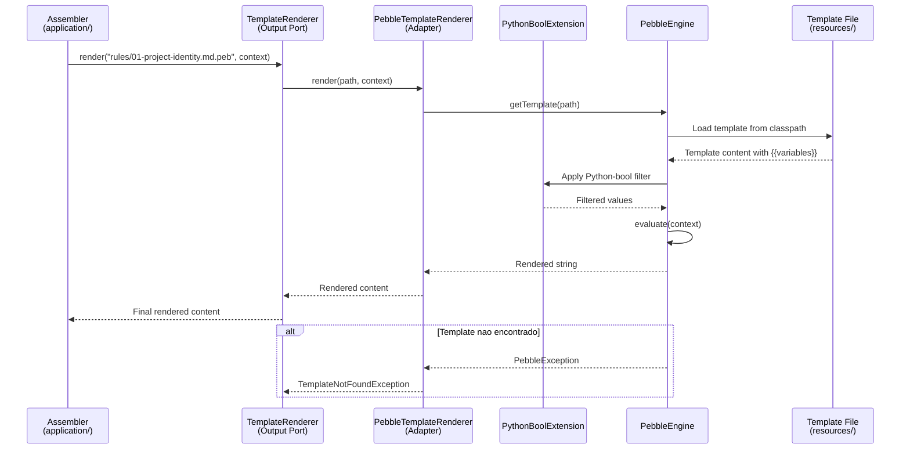

# Historia: Adapter — PebbleTemplateRenderer

**ID:** story-0015-0008
**Chave Jira:** —
**Status:** Concluída

## 1. Dependencias

| Blocked By | Blocks |
| :--- | :--- |
| story-0015-0006 | story-0015-0013, story-0015-0014 |

## 2. Regras Transversais Aplicaveis

| ID | Titulo |
| :--- | :--- |
| RULE-001 | Dependency Rule Estrita |
| RULE-002 | Ports como Contratos |
| RULE-007 | Paridade Funcional Total |
| RULE-008 | Migracao Incremental sem Big Bang |
| RULE-009 | Cobertura de Testes Mantida |
| RULE-010 | Preservacao de Contratos de Template |

## 3. Descricao

Como **Arquiteto de Software**, eu quero extrair o Pebble engine e o filtro Python-bool do pacote `template/` para um Output Adapter `PebbleTemplateRenderer` que implementa `TemplateRenderer`, para que o dominio e os assemblers nao conhecam mais a API do PebbleEngine diretamente e o motor de templates possa ser substituido sem alterar logica de negocio.

### Contexto

O pacote `template/` atual contem 4 classes: o wrapper do PebbleEngine, o filtro Python-bool (que converte booleans Python-style para Pebble), e utilitarios de template. O filtro Python-bool e um detalhe de implementacao do adapter e deve permanecer exclusivamente nesta camada. Os ~470 templates em `src/main/resources/` NAO sao alterados.

### 3.1 PebbleTemplateRenderer

```java
package dev.iadev.infrastructure.adapter.output.template;

import dev.iadev.domain.port.output.TemplateRenderer;
import io.pebbletemplates.pebble.PebbleEngine;
import io.pebbletemplates.pebble.template.PebbleTemplate;
import java.io.StringWriter;
import java.util.Map;

public class PebbleTemplateRenderer implements TemplateRenderer {
    private final PebbleEngine engine;

    public PebbleTemplateRenderer() {
        this.engine = new PebbleEngine.Builder()
            .extension(new PythonBoolExtension())
            .build();
    }

    @Override
    public String render(String templatePath, Map<String, Object> context) {
        PebbleTemplate template = engine.getTemplate(templatePath);
        StringWriter writer = new StringWriter();
        template.evaluate(writer, context);
        return writer.toString();
    }

    @Override
    public boolean templateExists(String templatePath) {
        // Check if template resource exists
    }
}
```

### 3.2 PythonBoolExtension

Mover o filtro Python-bool para dentro do pacote do adapter. E um detalhe de implementacao Pebble, nao uma preocupacao de dominio.

### 3.3 Paridade com Templates Existentes

Todos os ~470 templates devem renderizar identicamente antes e depois da migracao. O golden file parity test e o criterio de aceitacao.

## 3.5 Entrega de Valor

- **Valor Principal:** Motor de templates substituivel sem alterar logica de negocio, eliminando vendor lock-in do PebbleEngine no dominio
- **Metrica de Sucesso:** ~470 templates renderizam identicamente, zero importacoes Pebble fora do adapter, golden files passam
- **Impacto no Negocio:** Permite avaliacao futura de FreeMarker, Mustache, ou outros engines sem risco de regressao no dominio — desbloqueia story-0015-0013 (assemblers) e story-0015-0014 (composition root)

## 4. Definicoes de Qualidade Locais

### DoR Local

- [ ] story-0015-0006 concluida (Domain Services implementados)
- [ ] Interface TemplateRenderer definida (story-0015-0004)
- [ ] Logica de template/ mapeada completamente

### DoD Local

- [ ] PebbleTemplateRenderer criado em infrastructure/adapter/output/template/
- [ ] PythonBoolExtension movido para mesmo pacote
- [ ] Implementa TemplateRenderer corretamente
- [ ] Golden file parity tests passam (todos os ~470 templates)
- [ ] template/ mantido como facade temporario
- [ ] `mvn verify` passa com todos os testes
- [ ] Test plan gerado via `/x-test-plan` antes do inicio da implementacao
- [ ] Todo @GK-N da secao 7 mapeado para >= 1 AT-N na secao 8
- [ ] Cenarios Gherkin ordenados por TPP (degenerate -> happy -> error -> boundary -> edge)
- [ ] Todo AT-N com status GREEN antes de marcar DoD como concluido
- [ ] Commits seguem padrao test-first (teste precede ou acompanha implementacao no git log)

### Global DoD

- **Cobertura:** >= 95% Line, >= 90% Branch
- **Testes Automatizados:** Golden file parity + unit tests
- **TDD Compliance:** Commits test-first, refactoring explicito
- **Backward Compatibility:** Todos os 1961 testes existentes continuam passando
- **Double-Loop TDD:** Acceptance tests derivados dos cenarios Gherkin (outer loop), unit tests guiados por TPP (inner loop)
- **Rastreabilidade:** Todo @GK-N mapeia para >= 1 AT-N, todo AT-N referencia um @GK-N valido

## 5. Contratos de Dados

| Campo | Tipo | Obrigatorio | Descricao |
| :--- | :--- | :--- | :--- |
| `PebbleTemplateRenderer` | Class | Sim | Implements `TemplateRenderer`, encapsulates PebbleEngine |
| `PythonBoolExtension` | Class | Sim | Pebble extension for Python-style boolean conversion |
| `render(String, Map)` | `String` | Sim | Renderiza template com contexto, retorna conteudo |
| `templateExists(String)` | `boolean` | Sim | Verifica existencia de template no classpath |

## 6. Diagramas

### 6.1 Fluxo de Rendering via Adapter



## 7. Criterios de Aceite (Gherkin)

```gherkin
@GK-1
Cenario: Template path vazio (estado degenerado)
  DADO que o PebbleTemplateRenderer esta instanciado
  QUANDO render e chamado com templatePath vazio ""
  ENTAO uma excecao descritiva e lancada
  E a mensagem indica que o path do template e invalido

@GK-2
Cenario: Rendering de template com variaveis (happy path)
  DADO que o PebbleTemplateRenderer esta instanciado
  E o template "test-template.peb" existe no classpath com conteudo "Hello {{name}}"
  QUANDO render("test-template.peb", {"name": "World"}) e chamado
  ENTAO o resultado e "Hello World"

@GK-3
Cenario: Template inexistente retorna excecao (error path)
  DADO que o PebbleTemplateRenderer esta instanciado
  QUANDO render("nonexistent-template.peb", {}) e chamado
  ENTAO uma excecao descritiva e lancada
  E a mensagem contem o nome do template nao encontrado

@GK-4
Cenario: Golden file parity para todos os ~470 templates (boundary)
  DADO que o PebbleTemplateRenderer implementa TemplateRenderer
  E todos os assemblers usam o adapter via Output Port
  QUANDO os golden file tests executam para todos os 8 perfis
  ENTAO todos os arquivos gerados sao byte-a-byte identicos aos golden files esperados
  E zero diferencas sao detectadas

@GK-5
Cenario: Filtro Python-bool funciona identicamente no adapter (edge case)
  DADO que o PythonBoolExtension esta registrado no PebbleEngine
  E um template contem expressao {{ pythonBool(value) }}
  QUANDO render e chamado com value=true
  ENTAO o resultado contem "True" (Python-style, nao "true" Java-style)
  E quando chamado com value=false, resultado contem "False"
```

## 8. Sub-tarefas

### Ciclos TDD

> Sub-tarefas TDD serao populadas apos geracao do test plan via `/x-test-plan`.

### Tarefas nao-TDD

- [ ] [Doc] Documentar estrategia de facade temporario para template/
- [ ] [Arch] Validar que PythonBoolExtension e detalhe de adapter, nao de dominio

### Avaliacao de Risco

- **Risco de Regressao:** Alto — o template engine e usado por TODOS os 23 assemblers. Qualquer mudanca sutil no rendering afeta todos os outputs
- **Estrategia de Rollback:** `git revert`; template/ original continua funcionando
- **Acoplamento Critico:** 23 assemblers usam template rendering; ~470 templates dependem do filtro Python-bool; golden file tests sao o guardiao final

### Migration Checklist

- [ ] Pacotes legados mantidos como facade: Sim — template/ mantido como facade temporario
- [ ] Zero imports proibidos apos migracao parcial
- [ ] Build passa com `mvn verify`
- [ ] Golden file tests passam
- [ ] Coverage thresholds mantidos
