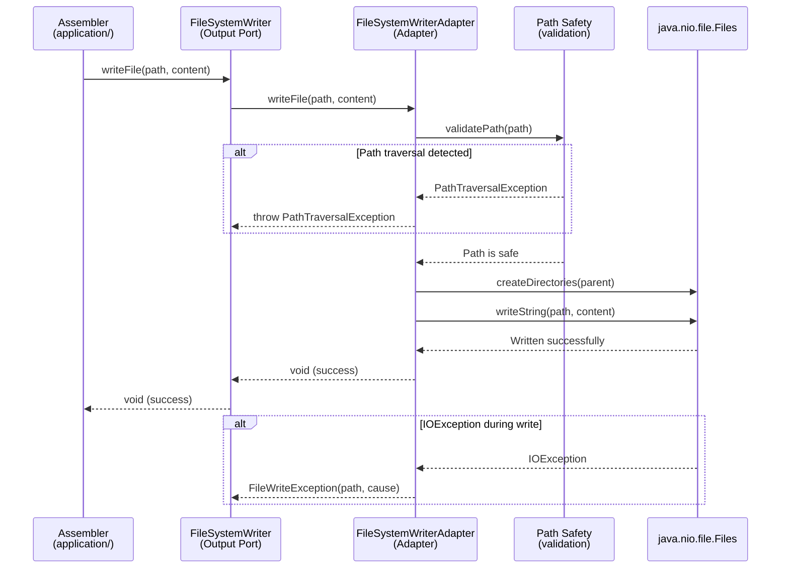

# Historia: Adapter — FileSystemWriterAdapter

**ID:** story-0015-0009
**Chave Jira:** —
**Status:** Concluída

## 1. Dependencias

| Blocked By | Blocks |
| :--- | :--- |
| story-0015-0006 | story-0015-0013, story-0015-0014 |

## 2. Regras Transversais Aplicaveis

| ID | Titulo |
| :--- | :--- |
| RULE-001 | Dependency Rule Estrita |
| RULE-002 | Ports como Contratos |
| RULE-007 | Paridade Funcional Total |
| RULE-008 | Migracao Incremental sem Big Bang |
| RULE-009 | Cobertura de Testes Mantida |

## 3. Descricao

Como **Arquiteto de Software**, eu quero extrair a logica de I/O e path safety do pacote `util/` para um Output Adapter `FileSystemWriterAdapter` que implementa `FileSystemWriter`, para que todas as operacoes de escrita no filesystem estejam centralizadas em um unico adapter testavel e o dominio nunca interaja diretamente com java.io ou java.nio.

### Contexto

O pacote `util/` atual contem 6 classes com funcionalidades de I/O, path safety, e resource discovery. As operacoes de escrita estao atualmente dispersas entre assemblers (que escrevem arquivos diretamente) e utilitarios. Esta historia centraliza todas as operacoes de filesystem em um unico adapter.

### 3.1 FileSystemWriterAdapter

```java
package dev.iadev.infrastructure.adapter.output.filesystem;

import dev.iadev.domain.port.output.FileSystemWriter;
import java.io.IOException;
import java.io.InputStream;
import java.nio.file.*;

public class FileSystemWriterAdapter implements FileSystemWriter {
    @Override
    public void writeFile(Path path, String content) {
        createParentDirectories(path);
        Files.writeString(path, content, StandardOpenOption.CREATE, StandardOpenOption.TRUNCATE_EXISTING);
    }

    @Override
    public void createDirectory(Path path) {
        Files.createDirectories(path);
    }

    @Override
    public boolean exists(Path path) {
        return Files.exists(path);
    }

    @Override
    public void copyResource(String resourcePath, Path destination) {
        try (InputStream is = getClass().getClassLoader().getResourceAsStream(resourcePath)) {
            Files.copy(is, destination, StandardCopyOption.REPLACE_EXISTING);
        }
    }

    private void createParentDirectories(Path path) {
        Path parent = path.getParent();
        if (parent != null) Files.createDirectories(parent);
    }
}
```

### 3.2 Path Safety

Incluir validacao de path traversal (RULE do security baseline):
- Normalize + reject `..` em paths
- Rejeitar symlinks sem opt-in explicito
- Sanitizacao multi-pass de filenames

### 3.3 Consolidacao de Operacoes Dispersas

Identificar e migrar todas as chamadas diretas a `Files.write`, `Files.copy`, `Files.createDirectories` nos assemblers para usar o adapter via Output Port.

## 3.5 Entrega de Valor

- **Valor Principal:** Operacoes de I/O centralizadas e testaveis com filesystem virtual, eliminando escrita direta dispersa em 23 assemblers
- **Metrica de Sucesso:** Zero chamadas diretas a Files.write/copy/createDirectories fora do adapter, path safety validado
- **Impacto no Negocio:** Habilita testes unitarios de assemblers sem filesystem real, reduzindo tempo de execucao de testes e aumentando confiabilidade — desbloqueia story-0015-0013 (assemblers) e story-0015-0014 (composition root)

## 4. Definicoes de Qualidade Locais

### DoR Local

- [ ] story-0015-0006 concluida (Domain Services implementados)
- [ ] Interface FileSystemWriter definida (story-0015-0004)
- [ ] Auditoria de chamadas dispersas a Files.* no codebase

### DoD Local

- [ ] FileSystemWriterAdapter criado em infrastructure/adapter/output/filesystem/
- [ ] Implementa FileSystemWriter com path safety
- [ ] Zero chamadas diretas a Files.write/copy fora de adapters
- [ ] Testes unitarios com filesystem temporario
- [ ] `mvn verify` passa com todos os testes
- [ ] Test plan gerado via `/x-test-plan` antes do inicio da implementacao
- [ ] Todo @GK-N da secao 7 mapeado para >= 1 AT-N na secao 8
- [ ] Cenarios Gherkin ordenados por TPP (degenerate -> happy -> error -> boundary -> edge)
- [ ] Todo AT-N com status GREEN antes de marcar DoD como concluido
- [ ] Commits seguem padrao test-first (teste precede ou acompanha implementacao no git log)

### Global DoD

- **Cobertura:** >= 95% Line, >= 90% Branch
- **Testes Automatizados:** Unit tests com temp dirs + integration tests
- **TDD Compliance:** Commits test-first, refactoring explicito
- **Backward Compatibility:** Todos os 1961 testes existentes continuam passando
- **Double-Loop TDD:** Acceptance tests derivados dos cenarios Gherkin (outer loop), unit tests guiados por TPP (inner loop)
- **Rastreabilidade:** Todo @GK-N mapeia para >= 1 AT-N, todo AT-N referencia um @GK-N valido

## 5. Contratos de Dados

| Campo | Tipo | Obrigatorio | Descricao |
| :--- | :--- | :--- | :--- |
| `FileSystemWriterAdapter` | Class | Sim | Implements `FileSystemWriter`, handles I/O + path safety |
| `writeFile(Path, String)` | `void` | Sim | Cria parent dirs se necessario, escreve conteudo |
| `createDirectory(Path)` | `void` | Sim | Cria diretorio e pais recursivamente |
| `exists(Path)` | `boolean` | Sim | Verifica existencia de arquivo ou diretorio |
| `copyResource(String, Path)` | `void` | Sim | Copia recurso do classpath para destino |

## 6. Diagramas

### 6.1 Fluxo de Escrita via Adapter



## 7. Criterios de Aceite (Gherkin)

```gherkin
@GK-1
Cenario: Escrita em path nulo (estado degenerado)
  DADO que FileSystemWriterAdapter esta instanciado
  QUANDO writeFile e chamado com path nulo
  ENTAO uma NullPointerException ou IllegalArgumentException e lancada
  E nenhum arquivo e criado no filesystem

@GK-2
Cenario: Escrita de arquivo com criacao de diretorios parent (happy path)
  DADO que FileSystemWriterAdapter esta instanciado
  E o diretorio pai /tmp/test/subdir/ nao existe
  QUANDO writeFile(Path.of("/tmp/test/subdir/file.txt"), "conteudo") e chamado
  ENTAO o diretorio /tmp/test/subdir/ e criado
  E o arquivo file.txt contem "conteudo"

@GK-3
Cenario: Path traversal detectado e rejeitado (error path)
  DADO que FileSystemWriterAdapter esta instanciado
  QUANDO writeFile(Path.of("/safe/dir/../../../etc/passwd"), "malicious") e chamado
  ENTAO uma excecao de path traversal e lancada
  E nenhum arquivo e criado fora do diretorio permitido

@GK-4
Cenario: Copia de recurso do classpath para destino (boundary)
  DADO que FileSystemWriterAdapter esta instanciado
  E o recurso "config-templates/setup-config.java-spring.yaml" existe no classpath
  QUANDO copyResource("config-templates/setup-config.java-spring.yaml", destination) e chamado
  ENTAO o arquivo e copiado para destination com conteudo identico ao original

@GK-5
Cenario: Escrita em diretorio sem permissao de escrita (edge case)
  DADO que FileSystemWriterAdapter esta instanciado
  E o diretorio destino nao tem permissao de escrita
  QUANDO writeFile e chamado para esse diretorio
  ENTAO uma excecao descritiva e lancada com o path e a causa (AccessDeniedException)
```

## 8. Sub-tarefas

### Ciclos TDD

> Sub-tarefas TDD serao populadas apos geracao do test plan via `/x-test-plan`.

### Tarefas nao-TDD

- [ ] [Doc] Documentar estrategia de path safety (OWASP guidelines)
- [ ] [Arch] Auditar todas as chamadas diretas a Files.* no codebase

### Avaliacao de Risco

- **Risco de Regressao:** Medio — centralizar I/O pode afetar assemblers que escrevem diretamente. Golden file tests sao o guardiao
- **Estrategia de Rollback:** `git revert`; util/ original continua funcionando
- **Acoplamento Critico:** 23 assemblers usam operacoes de filesystem; util/ contem path safety que deve ser preservado

### Migration Checklist

- [ ] Pacotes legados mantidos como facade: Sim — util/ mantido temporariamente
- [ ] Zero imports proibidos apos migracao parcial
- [ ] Build passa com `mvn verify`
- [ ] Golden file tests passam
- [ ] Coverage thresholds mantidos
