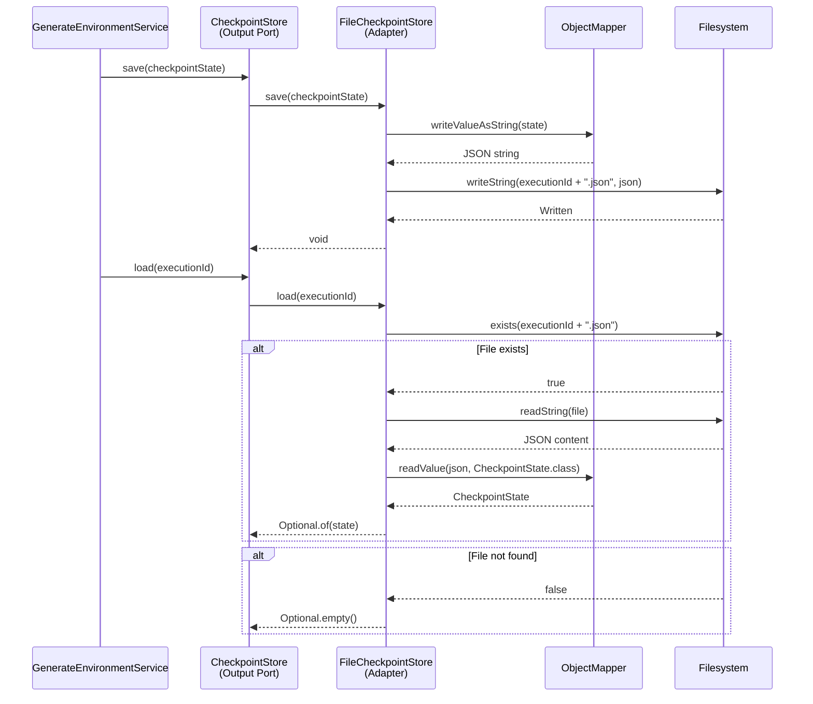

# Historia: Adapter — FileCheckpointStore

**ID:** story-0015-0010
**Chave Jira:** —
**Status:** Concluída

## 1. Dependencias

| Blocked By | Blocks |
| :--- | :--- |
| story-0015-0006 | story-0015-0014 |

## 2. Regras Transversais Aplicaveis

| ID | Titulo |
| :--- | :--- |
| RULE-001 | Dependency Rule Estrita |
| RULE-002 | Ports como Contratos |
| RULE-007 | Paridade Funcional Total |
| RULE-008 | Migracao Incremental sem Big Bang |
| RULE-009 | Cobertura de Testes Mantida |

## 3. Descricao

Como **Arquiteto de Software**, eu quero mover a logica de gerenciamento de checkpoints do pacote `checkpoint/` para um Output Adapter `FileCheckpointStore` que implementa `CheckpointStore`, para que o dominio nao conheca detalhes de persistencia de estado e a estrategia de armazenamento possa ser trocada (ex: banco de dados, cloud storage) sem alterar logica de negocio.

### Contexto

O pacote `checkpoint/` atual contem 9 classes que gerenciam o estado de execucao da geracao de ambientes. Checkpoints permitem retomar geracoes interrompidas. Esta historia extrai a logica de persistencia para o adapter, mantendo o contrato definido na interface `CheckpointStore` (story-0015-0004).

### 3.1 FileCheckpointStore

```java
package dev.iadev.infrastructure.adapter.output.checkpoint;

import dev.iadev.domain.model.CheckpointState;
import dev.iadev.domain.port.output.CheckpointStore;
import com.fasterxml.jackson.databind.ObjectMapper;
import java.nio.file.*;
import java.util.Optional;

public class FileCheckpointStore implements CheckpointStore {
    private final Path checkpointDir;
    private final ObjectMapper objectMapper;

    public FileCheckpointStore(Path checkpointDir) {
        this.checkpointDir = checkpointDir;
        this.objectMapper = new ObjectMapper();
    }

    @Override
    public void save(CheckpointState state) {
        Path file = checkpointDir.resolve(state.executionId() + ".json");
        Files.writeString(file, objectMapper.writeValueAsString(state));
    }

    @Override
    public Optional<CheckpointState> load(String executionId) {
        Path file = checkpointDir.resolve(executionId + ".json");
        if (!Files.exists(file)) return Optional.empty();
        return Optional.of(objectMapper.readValue(Files.readString(file), CheckpointState.class));
    }

    @Override
    public void clear(String executionId) {
        Path file = checkpointDir.resolve(executionId + ".json");
        Files.deleteIfExists(file);
    }
}
```

### 3.2 Migracao das 9 Classes de Checkpoint

As 9 classes do pacote `checkpoint/` devem ser analisadas:
- Classes que sao pura logica de persistencia: mover para o adapter
- Classes que sao modelos de estado: mover para `domain/model/` (se nao estiverem la)
- Classes que sao logica de negocio (decisao de quando salvar checkpoint): manter no dominio

### 3.3 Manter checkpoint/ como Facade Temporario

Manter `checkpoint/` temporariamente como facade ate que todos os callers sejam migrados.

## 3.5 Entrega de Valor

- **Valor Principal:** Persistencia de checkpoints desacoplada do dominio, permitindo troca para banco de dados ou cloud storage sem alterar logica de negocio
- **Metrica de Sucesso:** Checkpoint save/load/clear funcionando via adapter, checkpoint/ como facade, zero mudancas de comportamento
- **Impacto no Negocio:** Habilita estrategias de persistencia alternativas (ex: Redis para ambientes distribuidos) e melhora testabilidade com mocks — desbloqueia story-0015-0014

## 4. Definicoes de Qualidade Locais

### DoR Local

- [ ] story-0015-0006 concluida (Domain Services implementados)
- [ ] Interface CheckpointStore definida (story-0015-0004)
- [ ] 9 classes de checkpoint/ analisadas e classificadas

### DoD Local

- [ ] FileCheckpointStore criado em infrastructure/adapter/output/checkpoint/
- [ ] Implementa CheckpointStore corretamente
- [ ] Testes de integracao com filesystem temporario
- [ ] checkpoint/ mantido como facade temporario
- [ ] `mvn verify` passa com todos os testes
- [ ] Test plan gerado via `/x-test-plan` antes do inicio da implementacao
- [ ] Todo @GK-N da secao 7 mapeado para >= 1 AT-N na secao 8
- [ ] Cenarios Gherkin ordenados por TPP (degenerate -> happy -> error -> boundary -> edge)
- [ ] Todo AT-N com status GREEN antes de marcar DoD como concluido
- [ ] Commits seguem padrao test-first (teste precede ou acompanha implementacao no git log)

### Global DoD

- **Cobertura:** >= 95% Line, >= 90% Branch
- **Testes Automatizados:** Integration tests com temp dirs + unit tests com mocks
- **TDD Compliance:** Commits test-first, refactoring explicito
- **Backward Compatibility:** Todos os 1961 testes existentes continuam passando
- **Double-Loop TDD:** Acceptance tests derivados dos cenarios Gherkin (outer loop), unit tests guiados por TPP (inner loop)
- **Rastreabilidade:** Todo @GK-N mapeia para >= 1 AT-N, todo AT-N referencia um @GK-N valido

## 5. Contratos de Dados

| Campo | Tipo | Obrigatorio | Descricao |
| :--- | :--- | :--- | :--- |
| `FileCheckpointStore` | Class | Sim | Implements `CheckpointStore`, persists to JSON files |
| `save(CheckpointState)` | `void` | Sim | Serializa e salva estado em arquivo JSON |
| `load(String)` | `Optional<CheckpointState>` | Sim | Carrega estado por executionId, Optional.empty() se inexistente |
| `clear(String)` | `void` | Sim | Remove arquivo de checkpoint por executionId |

## 6. Diagramas

### 6.1 Fluxo de Checkpoint via Adapter



## 7. Criterios de Aceite (Gherkin)

```gherkin
@GK-1
Cenario: Load de checkpoint inexistente (estado degenerado)
  DADO que FileCheckpointStore esta instanciado com diretorio temporario
  E nenhum arquivo de checkpoint existe
  QUANDO load("nonexistent-id") e chamado
  ENTAO Optional.empty() e retornado
  E nenhuma excecao e lancada

@GK-2
Cenario: Save e load de checkpoint completo (happy path)
  DADO que FileCheckpointStore esta instanciado com diretorio temporario
  E um CheckpointState valido com executionId "exec-001"
  QUANDO save(state) e chamado
  E load("exec-001") e chamado em seguida
  ENTAO o CheckpointState retornado e identico ao salvo
  E um arquivo "exec-001.json" existe no diretorio de checkpoints

@GK-3
Cenario: Clear remove checkpoint existente (happy path - delete)
  DADO que um checkpoint com executionId "exec-001" foi salvo
  QUANDO clear("exec-001") e chamado
  ENTAO o arquivo "exec-001.json" nao existe mais
  E load("exec-001") retorna Optional.empty()

@GK-4
Cenario: Clear de checkpoint inexistente nao lanca excecao (boundary)
  DADO que nenhum checkpoint com executionId "nonexistent" existe
  QUANDO clear("nonexistent") e chamado
  ENTAO nenhuma excecao e lancada
  E a operacao completa silenciosamente

@GK-5
Cenario: Checkpoint com dados grandes serializado corretamente (edge case)
  DADO que um CheckpointState contem lista de 500+ itens processados
  QUANDO save e chamado seguido de load
  ENTAO o estado restaurado e identico ao original
  E todos os 500+ itens estao presentes na lista desserializada
```

## 8. Sub-tarefas

### Ciclos TDD

> Sub-tarefas TDD serao populadas apos geracao do test plan via `/x-test-plan`.

### Tarefas nao-TDD

- [ ] [Doc] Documentar classificacao das 9 classes de checkpoint/ (persistencia vs modelo vs logica)
- [ ] [Arch] Validar que ObjectMapper e usado apenas dentro do adapter (nao no dominio)

### Avaliacao de Risco

- **Risco de Regressao:** Medio — checkpoint logic afeta retomada de geracoes interrompidas. Testes de integracao sao essenciais
- **Estrategia de Rollback:** `git revert`; checkpoint/ original continua funcionando
- **Acoplamento Critico:** 9 classes em checkpoint/ com interdependencias internas; Jackson ObjectMapper para serializacao JSON

### Migration Checklist

- [ ] Pacotes legados mantidos como facade: Sim — checkpoint/ mantido como facade temporario
- [ ] Zero imports proibidos apos migracao parcial
- [ ] Build passa com `mvn verify`
- [ ] Golden file tests passam
- [ ] Coverage thresholds mantidos
