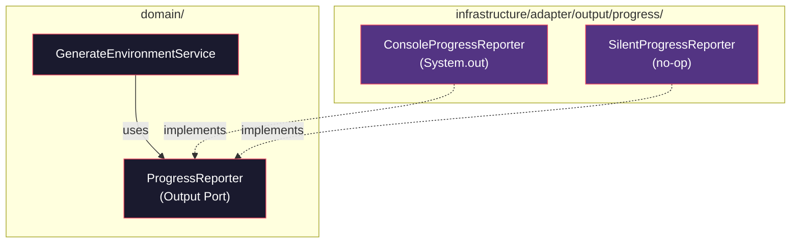

# Historia: Adapter — ConsoleProgressReporter

**ID:** story-0015-0011
**Chave Jira:** —
**Status:** Concluída

## 1. Dependencias

| Blocked By | Blocks |
| :--- | :--- |
| story-0015-0006 | story-0015-0014 |

## 2. Regras Transversais Aplicaveis

| ID | Titulo |
| :--- | :--- |
| RULE-001 | Dependency Rule Estrita |
| RULE-002 | Ports como Contratos |
| RULE-007 | Paridade Funcional Total |
| RULE-008 | Migracao Incremental sem Big Bang |

## 3. Descricao

Como **Arquiteto de Software**, eu quero mover a logica de reporte de progresso do pacote `progress/` para um Output Adapter `ConsoleProgressReporter` que implementa `ProgressReporter`, para que o dominio reporte progresso sem conhecer detalhes de output (console, arquivo, silent) e diferentes estrategias possam ser usadas em contextos como CI/CD, testes, ou modo verboso.

### Contexto

O pacote `progress/` atual contem 3 classes que gerenciam metricas e relatorios de progresso da geracao de ambientes. A saida atualmente e direcionada ao console. Esta historia extrai essa logica para o adapter, permitindo que o dominio chame apenas a interface `ProgressReporter`.

### 3.1 ConsoleProgressReporter

```java
package dev.iadev.infrastructure.adapter.output.progress;

import dev.iadev.domain.port.output.ProgressReporter;

public class ConsoleProgressReporter implements ProgressReporter {
    @Override
    public void reportStart(String taskName, int totalSteps) {
        System.out.printf("[START] %s (%d steps)%n", taskName, totalSteps);
    }

    @Override
    public void reportProgress(String taskName, int currentStep, String message) {
        System.out.printf("[%d] %s: %s%n", currentStep, taskName, message);
    }

    @Override
    public void reportComplete(String taskName) {
        System.out.printf("[DONE] %s%n", taskName);
    }

    @Override
    public void reportError(String taskName, String errorMessage) {
        System.err.printf("[ERROR] %s: %s%n", taskName, errorMessage);
    }
}
```

### 3.2 SilentProgressReporter (para Testes)

Criar uma implementacao `SilentProgressReporter` que nao produz output — util para testes unitarios que nao querem poluir stdout.

### 3.3 Manter progress/ como Facade Temporario

Manter `progress/` temporariamente como facade ate que todos os callers sejam migrados.

## 3.5 Entrega de Valor

- **Valor Principal:** Reporte de progresso substituivel (console, arquivo, silent), melhorando experiencia em CI/CD e testes
- **Metrica de Sucesso:** ConsoleProgressReporter e SilentProgressReporter implementados, progress/ como facade, zero mudancas de comportamento visivel
- **Impacto no Negocio:** Permite integracao futura com barras de progresso ricas (JLine), logging estruturado, ou supressao total em pipelines de CI — desbloqueia story-0015-0014

## 4. Definicoes de Qualidade Locais

### DoR Local

- [ ] story-0015-0006 concluida (Domain Services implementados)
- [ ] Interface ProgressReporter definida (story-0015-0004)
- [ ] 3 classes de progress/ analisadas

### DoD Local

- [ ] ConsoleProgressReporter criado em infrastructure/adapter/output/progress/
- [ ] SilentProgressReporter criado para uso em testes
- [ ] Implementa ProgressReporter corretamente
- [ ] progress/ mantido como facade temporario
- [ ] `mvn verify` passa com todos os testes
- [ ] Test plan gerado via `/x-test-plan` antes do inicio da implementacao
- [ ] Todo @GK-N da secao 7 mapeado para >= 1 AT-N na secao 8
- [ ] Cenarios Gherkin ordenados por TPP (degenerate -> happy -> error -> boundary -> edge)
- [ ] Todo AT-N com status GREEN antes de marcar DoD como concluido
- [ ] Commits seguem padrao test-first (teste precede ou acompanha implementacao no git log)

### Global DoD

- **Cobertura:** >= 95% Line, >= 90% Branch
- **Testes Automatizados:** Unit tests para ambas implementacoes
- **TDD Compliance:** Commits test-first, refactoring explicito
- **Backward Compatibility:** Todos os 1961 testes existentes continuam passando
- **Double-Loop TDD:** Acceptance tests derivados dos cenarios Gherkin (outer loop), unit tests guiados por TPP (inner loop)
- **Rastreabilidade:** Todo @GK-N mapeia para >= 1 AT-N, todo AT-N referencia um @GK-N valido

## 5. Contratos de Dados

| Campo | Tipo | Obrigatorio | Descricao |
| :--- | :--- | :--- | :--- |
| `ConsoleProgressReporter` | Class | Sim | Implements `ProgressReporter`, outputs to System.out/err |
| `SilentProgressReporter` | Class | Sim | Implements `ProgressReporter`, no-op (para testes) |
| `reportStart(String, int)` | `void` | Sim | Anuncia inicio de tarefa com total de steps |
| `reportProgress(String, int, String)` | `void` | Sim | Reporta progresso incremental |
| `reportComplete(String)` | `void` | Sim | Anuncia conclusao de tarefa |
| `reportError(String, String)` | `void` | Sim | Reporta erro com mensagem descritiva |

## 6. Diagramas

### 6.1 Estrategia de Reporter Plugavel



## 7. Criterios de Aceite (Gherkin)

```gherkin
@GK-1
Cenario: SilentProgressReporter nao produz output (estado degenerado)
  DADO que SilentProgressReporter esta instanciado
  QUANDO reportStart, reportProgress, reportComplete, e reportError sao chamados
  ENTAO nenhuma saida e produzida em stdout ou stderr
  E nenhuma excecao e lancada

@GK-2
Cenario: ConsoleProgressReporter formata output corretamente (happy path)
  DADO que ConsoleProgressReporter esta instanciado
  QUANDO reportStart("generate", 10) e chamado
  ENTAO stdout contem "[START] generate (10 steps)"
  E quando reportProgress("generate", 5, "Processing rules") e chamado
  ENTAO stdout contem "[5] generate: Processing rules"
  E quando reportComplete("generate") e chamado
  ENTAO stdout contem "[DONE] generate"

@GK-3
Cenario: reportError direciona para stderr (error path)
  DADO que ConsoleProgressReporter esta instanciado
  QUANDO reportError("generate", "Template not found") e chamado
  ENTAO stderr contem "[ERROR] generate: Template not found"
  E stdout nao contem a mensagem de erro

@GK-4
Cenario: Multiplas tarefas intercaladas (boundary)
  DADO que ConsoleProgressReporter esta instanciado
  QUANDO reportStart("task-a", 5) e reportStart("task-b", 3) sao chamados
  E reportProgress("task-a", 1, "step A1") e reportProgress("task-b", 1, "step B1") sao chamados
  ENTAO cada mensagem contem o taskName correto para rastreabilidade
  E a ordem cronologica e preservada no output

@GK-5
Cenario: Reporter funciona com caracteres especiais em mensagens (edge case)
  DADO que ConsoleProgressReporter esta instanciado
  QUANDO reportProgress("task", 1, "Arquivo: café_résumé.md (100%)") e chamado
  ENTAO stdout contem a mensagem com acentos preservados
  E nenhuma excecao de encoding e lancada
```

## 8. Sub-tarefas

### Ciclos TDD

> Sub-tarefas TDD serao populadas apos geracao do test plan via `/x-test-plan`.

### Tarefas nao-TDD

- [ ] [Doc] Documentar estrategia de facade temporario para progress/
- [ ] [Arch] Avaliar se JLine pode ser integrado ao ConsoleProgressReporter futuramente

### Avaliacao de Risco

- **Risco de Regressao:** Baixo — progress reporting e side-effect puro (output), nao afeta logica de negocio
- **Estrategia de Rollback:** `git revert`; progress/ original continua funcionando
- **Acoplamento Critico:** 3 classes em progress/ com baixo acoplamento; System.out/err usage

### Migration Checklist

- [ ] Pacotes legados mantidos como facade: Sim — progress/ mantido como facade temporario
- [ ] Zero imports proibidos apos migracao parcial
- [ ] Build passa com `mvn verify`
- [ ] Golden file tests passam
- [ ] Coverage thresholds mantidos
