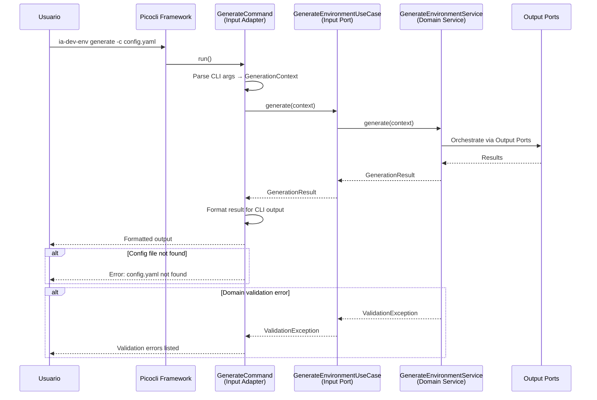

# Historia: Adapter — CLI Input Adapter

**ID:** story-0015-0012
**Chave Jira:** —
**Status:** Concluída

## 1. Dependencias

| Blocked By | Blocks |
| :--- | :--- |
| story-0015-0006 | story-0015-0014 |

## 2. Regras Transversais Aplicaveis

| ID | Titulo |
| :--- | :--- |
| RULE-001 | Dependency Rule Estrita |
| RULE-003 | Use Cases como Ponto de Entrada |
| RULE-005 | Composition Root Unico |
| RULE-007 | Paridade Funcional Total |
| RULE-008 | Migracao Incremental sem Big Bang |

## 3. Descricao

Como **Arquiteto de Software**, eu quero mover os comandos Picocli (GenerateCommand, ValidateCommand) do pacote `cli/` para o Input Adapter em `infrastructure/adapter/input/cli/`, para que os comandos interajam com o dominio exclusivamente via Input Ports e nao importem diretamente classes de `domain/service/`.

### Contexto

O pacote `cli/` atual contem 14 classes incluindo comandos Picocli, handlers de entrada, e logica de formatacao de output. Os comandos atualmente importam classes de `domain/` diretamente, violando RULE-003. Esta historia move os comandos para o adapter e refatora para usar exclusivamente Input Ports.

### 3.1 Migracao dos Comandos Picocli

Mover para `infrastructure/adapter/input/cli/`:
- `GenerateCommand` — invoca `GenerateEnvironmentUseCase`
- `ValidateCommand` — invoca `ValidateConfigUseCase`
- Demais comandos e subcomandos

### 3.2 Refatoracao para Usar Input Ports

Cada comando deve:
1. Receber Input Ports via constructor injection (injetados pelo ApplicationFactory)
2. Converter argumentos CLI em objetos de dominio (DTOs → domain model)
3. Invocar o use case via Input Port
4. Formatar resultado para output CLI

```java
package dev.iadev.infrastructure.adapter.input.cli;

import dev.iadev.domain.port.input.GenerateEnvironmentUseCase;
import dev.iadev.domain.model.GenerationContext;
import dev.iadev.domain.model.GenerationResult;
import picocli.CommandLine.Command;
import picocli.CommandLine.Option;

@Command(name = "generate", description = "Generate AI dev environment")
public class GenerateCommand implements Runnable {
    private final GenerateEnvironmentUseCase generateUseCase;

    public GenerateCommand(GenerateEnvironmentUseCase generateUseCase) {
        this.generateUseCase = generateUseCase;
    }

    @Option(names = {"-c", "--config"}, description = "Config file path")
    private String configPath;

    @Override
    public void run() {
        GenerationContext context = buildContext(configPath);
        GenerationResult result = generateUseCase.generate(context);
        formatOutput(result);
    }
}
```

### 3.3 Anotacoes Picocli Permitidas Apenas no Adapter

Anotacoes Picocli (`@Command`, `@Option`, `@Parameters`) devem existir exclusivamente no adapter CLI. Zero anotacoes Picocli no dominio ou application.

### 3.4 Ativacao da Regra ArchUnit

Ativar a regra `cliShouldOnlyAccessInputPorts()` em `HexagonalArchitectureTest`.

## 3.5 Entrega de Valor

- **Valor Principal:** Comandos CLI desacoplados do dominio, habilitando futura exposicao dos mesmos use cases via REST API, SDK, ou GUI
- **Metrica de Sucesso:** 14 classes migradas para adapter, zero imports de domain/service/ nos comandos, regra ArchUnit ativa
- **Impacto no Negocio:** Valida que o padrao hexagonal suporta multiplos driving adapters — o mesmo dominio pode ser acessado via CLI, API, ou testes de integracao — desbloqueia story-0015-0014

## 4. Definicoes de Qualidade Locais

### DoR Local

- [ ] story-0015-0006 concluida (Domain Services implementados)
- [ ] Input Ports definidos (story-0015-0005)
- [ ] 14 classes de cli/ analisadas e classificadas

### DoD Local

- [ ] Comandos Picocli migrados para infrastructure/adapter/input/cli/
- [ ] Comandos usam exclusivamente Input Ports (zero imports de domain/service/)
- [ ] Regra ArchUnit cliShouldOnlyAccessInputPorts ativa e passando
- [ ] cli/ mantido como facade temporario
- [ ] `mvn verify` passa com todos os testes
- [ ] Test plan gerado via `/x-test-plan` antes do inicio da implementacao
- [ ] Todo @GK-N da secao 7 mapeado para >= 1 AT-N na secao 8
- [ ] Cenarios Gherkin ordenados por TPP (degenerate -> happy -> error -> boundary -> edge)
- [ ] Todo AT-N com status GREEN antes de marcar DoD como concluido
- [ ] Commits seguem padrao test-first (teste precede ou acompanha implementacao no git log)

### Global DoD

- **Cobertura:** >= 95% Line, >= 90% Branch
- **Testes Automatizados:** Testes de CLI + ArchUnit
- **TDD Compliance:** Commits test-first, refactoring explicito
- **Backward Compatibility:** Todos os 1961 testes existentes continuam passando
- **Double-Loop TDD:** Acceptance tests derivados dos cenarios Gherkin (outer loop), unit tests guiados por TPP (inner loop)
- **Rastreabilidade:** Todo @GK-N mapeia para >= 1 AT-N, todo AT-N referencia um @GK-N valido

## 5. Contratos de Dados

| Campo | Tipo | Obrigatorio | Descricao |
| :--- | :--- | :--- | :--- |
| `GenerateCommand` | Class | Sim | @Command Picocli, depends on GenerateEnvironmentUseCase via constructor |
| `ValidateCommand` | Class | Sim | @Command Picocli, depends on ValidateConfigUseCase via constructor |
| Input Port injection | Constructor | Sim | Todos os commands recebem use cases via constructor (injetados por ApplicationFactory) |

## 6. Diagramas

### 6.1 Fluxo CLI → Input Port → Domain Service



## 7. Criterios de Aceite (Gherkin)

```gherkin
@GK-1
Cenario: Comando CLI sem Input Port injetado (estado degenerado)
  DADO que GenerateCommand e instanciado com useCase nulo
  QUANDO run() e chamado
  ENTAO uma NullPointerException ou excecao de validacao e lancada
  E nenhuma operacao de dominio e realizada

@GK-2
Cenario: GenerateCommand invoca use case via Input Port (happy path)
  DADO que GenerateCommand recebe mock de GenerateEnvironmentUseCase
  E argumentos CLI validos sao fornecidos (-c config.yaml)
  QUANDO run() e executado
  ENTAO generateUseCase.generate() e invocado com GenerationContext construido dos argumentos
  E o resultado e formatado e apresentado ao usuario

@GK-3
Cenario: Comando CLI importa domain/service diretamente (error path — ArchUnit)
  DADO que GenerateCommand em infrastructure/adapter/input/cli/ importa domain.service.GenerateEnvironmentService
  QUANDO a regra ArchUnit cliShouldOnlyAccessInputPorts executa
  ENTAO o teste falha indicando a importacao proibida
  E a mensagem indica que CLI deve usar apenas Input Ports

@GK-4
Cenario: ValidateCommand invoca use case corretamente (boundary)
  DADO que ValidateCommand recebe mock de ValidateConfigUseCase
  E argumentos CLI de validacao sao fornecidos
  QUANDO run() e executado
  ENTAO validateUseCase.validate() e invocado com ProjectConfig construido dos argumentos
  E o ValidationResult e formatado e apresentado ao usuario

@GK-5
Cenario: Anotacoes Picocli existem apenas no adapter CLI (edge case)
  DADO que a migracao dos comandos foi concluida
  QUANDO uma busca por @Command, @Option, @Parameters e realizada no codebase
  ENTAO todas as ocorrencias estao em infrastructure/adapter/input/cli/
  E zero ocorrencias existem em domain/ ou application/
```

## 8. Sub-tarefas

### Ciclos TDD

> Sub-tarefas TDD serao populadas apos geracao do test plan via `/x-test-plan`.

### Tarefas nao-TDD

- [ ] [Doc] Documentar mapeamento de comandos CLI para Input Ports
- [ ] [Arch] Ativar regra ArchUnit cliShouldOnlyAccessInputPorts
- [ ] [Arch] Auditar 14 classes de cli/ para classificacao (comando vs handler vs formatacao)

### Avaliacao de Risco

- **Risco de Regressao:** Alto — comandos CLI sao o ponto de entrada principal. Mudancas podem afetar a experiencia do usuario
- **Estrategia de Rollback:** `git revert`; cli/ original continua funcionando como antes
- **Acoplamento Critico:** 14 classes em cli/ com dependencias diretas a domain/; GenerateCommand e o comando mais complexo; Picocli factory pattern para constructor injection

### ArchUnit Snippet (Referencia)

```java
@ArchTest
static final ArchRule cliShouldOnlyAccessInputPorts =
    noClasses().that().resideInAPackage("..infrastructure.adapter.input.cli..")
        .should().dependOnClassesThat()
        .resideInAPackage("..domain.service..")
        .because("CLI adapter deve usar apenas Input Ports, nao Domain Services (RULE-003)");
```

### Migration Checklist

- [ ] Pacotes legados mantidos como facade: Sim — cli/ mantido como facade temporario
- [ ] Zero imports proibidos apos migracao parcial
- [ ] Build passa com `mvn verify`
- [ ] Golden file tests passam
- [ ] Coverage thresholds mantidos
