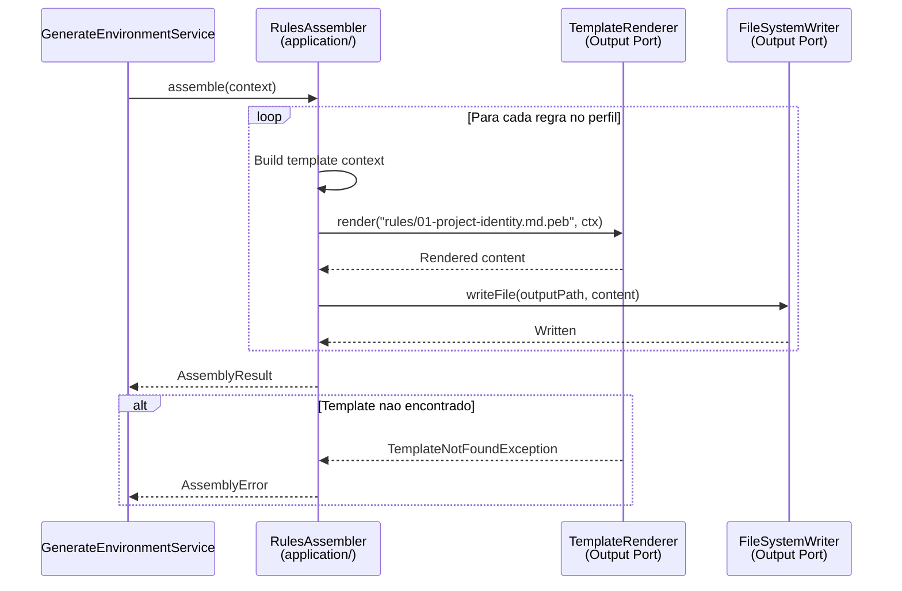
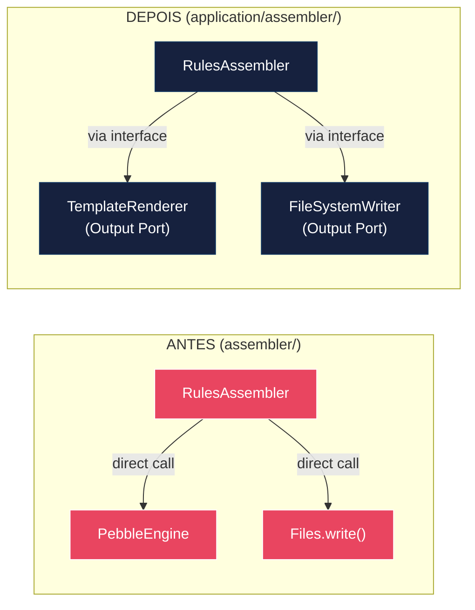

# Historia: Migracao dos 23 Assemblers para application/assembler/

**ID:** story-0015-0013
**Chave Jira:** —
**Status:** Concluída

## 1. Dependencias

| Blocked By | Blocks |
| :--- | :--- |
| story-0015-0008, story-0015-0009 | story-0015-0014 |

## 2. Regras Transversais Aplicaveis

| ID | Titulo |
| :--- | :--- |
| RULE-001 | Dependency Rule Estrita |
| RULE-002 | Ports como Contratos |
| RULE-007 | Paridade Funcional Total |
| RULE-008 | Migracao Incremental sem Big Bang |
| RULE-009 | Cobertura de Testes Mantida |
| RULE-010 | Preservacao de Contratos de Template |

## 3. Descricao

Como **Arquiteto de Software**, eu quero mover os 23 assemblers do pacote `assembler/` para `application/assembler/`, refatorando-os para usar Output Ports (TemplateRenderer, FileSystemWriter) via injecao de dependencia em vez de acessar diretamente Pebble e filesystem, para que a camada de aplicacao orquestre a geracao usando contratos e nunca implemente detalhes de infraestrutura.

### Contexto

Os assemblers sao os orquestradores principais da geracao de boilerplate. Cada assembler e responsavel por um tipo de artefato (rules, skills, agents, hooks, settings, prompts, instructions, etc.) e atualmente:
1. Constroi contexto para templates
2. Chama PebbleEngine diretamente para renderizar templates
3. Escreve resultados no filesystem diretamente

Apos a migracao, cada assembler recebe `TemplateRenderer` e `FileSystemWriter` via constructor injection e delega todas as operacoes de I/O e rendering a esses ports.

### 3.1 Lista de Assemblers (83+ classes)

O pacote `assembler/` contem 83+ classes organizadas em sub-pacotes. Os 23 assemblers principais incluem:
- `RulesAssembler`, `SkillsAssembler`, `AgentsAssembler`
- `HooksAssembler`, `SettingsAssembler`, `ReadmeAssembler`
- `PromptsAssembler`, `InstructionsAssembler`, `McpAssembler`
- E demais assemblers para cada tipo de artefato gerado

### 3.2 Refatoracao para Output Ports

Cada assembler deve:
1. Receber `TemplateRenderer` e `FileSystemWriter` via constructor
2. Substituir chamadas diretas a `PebbleEngine` por `templateRenderer.render()`
3. Substituir chamadas diretas a `Files.write()` por `fileSystemWriter.writeFile()`
4. Manter a mesma logica de orquestracao e construcao de contexto

### 3.3 Preservacao de Comportamento

Os ~470 templates nao sao alterados (RULE-010). O output gerado deve ser byte-a-byte identico. Golden file tests sao o criterio final.

### 3.4 Estrutura de Sub-pacotes

Manter a organizacao interna de sub-pacotes do assembler/ ao mover para application/assembler/. A hierarquia de classes deve ser preservada.

## 3.5 Entrega de Valor

- **Valor Principal:** Assemblers usando contratos (ports) para rendering e escrita, eliminando acoplamento direto a Pebble e filesystem
- **Metrica de Sucesso:** 83+ classes migradas, zero imports de PebbleEngine ou Files.write fora de adapters, golden files identicos
- **Impacto no Negocio:** Assemblers podem ser testados unitariamente com mocks de TemplateRenderer e FileSystemWriter, reduzindo drasticamente tempo de teste e aumentando confiabilidade — desbloqueia story-0015-0014

## 4. Definicoes de Qualidade Locais

### DoR Local

- [ ] story-0015-0008 concluida (PebbleTemplateRenderer disponivel)
- [ ] story-0015-0009 concluida (FileSystemWriterAdapter disponivel)
- [ ] Lista completa de assemblers e suas dependencias de I/O documentada

### DoD Local

- [ ] 83+ classes migradas para application/assembler/
- [ ] Cada assembler recebe TemplateRenderer e FileSystemWriter via constructor
- [ ] Zero chamadas diretas a PebbleEngine fora de adapters
- [ ] Zero chamadas diretas a Files.write/copy fora de adapters
- [ ] Golden file parity tests passam para todos os 8 perfis
- [ ] assembler/ original removido ou mantido como facade
- [ ] `mvn verify` passa com todos os testes
- [ ] Test plan gerado via `/x-test-plan` antes do inicio da implementacao
- [ ] Todo @GK-N da secao 7 mapeado para >= 1 AT-N na secao 8
- [ ] Cenarios Gherkin ordenados por TPP (degenerate -> happy -> error -> boundary -> edge)
- [ ] Todo AT-N com status GREEN antes de marcar DoD como concluido
- [ ] Commits seguem padrao test-first (teste precede ou acompanha implementacao no git log)

### Global DoD

- **Cobertura:** >= 95% Line, >= 90% Branch
- **Testes Automatizados:** Golden file parity + unit tests com mocks de ports
- **TDD Compliance:** Commits test-first, refactoring explicito
- **Backward Compatibility:** Todos os 1961 testes existentes continuam passando
- **Double-Loop TDD:** Acceptance tests derivados dos cenarios Gherkin (outer loop), unit tests guiados por TPP (inner loop)
- **Rastreabilidade:** Todo @GK-N mapeia para >= 1 AT-N, todo AT-N referencia um @GK-N valido

## 5. Contratos de Dados

| Campo | Tipo | Obrigatorio | Descricao |
| :--- | :--- | :--- | :--- |
| `*Assembler` (23 classes) | Class | Sim | Cada assembler recebe TemplateRenderer + FileSystemWriter via constructor |
| Constructor injection | `(TemplateRenderer, FileSystemWriter)` | Sim | Minimo 2 ports injetados; alguns assemblers podem precisar de ports adicionais |
| `assemble(GenerationContext)` | Return type varies | Sim | Metodo principal que orquestra geracao de um tipo de artefato |

## 6. Diagramas

### 6.1 Fluxo de Assembler com Output Ports



### 6.2 Antes vs Depois da Migracao



## 7. Criterios de Aceite (Gherkin)

```gherkin
@GK-1
Cenario: Assembler sem Output Ports injetados (estado degenerado)
  DADO que RulesAssembler e instanciado com TemplateRenderer e FileSystemWriter nulos
  QUANDO assemble() e chamado
  ENTAO uma NullPointerException ou excecao de validacao e lancada
  E nenhum arquivo e gerado

@GK-2
Cenario: Assembler gera artefatos via Output Ports (happy path)
  DADO que RulesAssembler recebe mocks de TemplateRenderer e FileSystemWriter
  E TemplateRenderer.render retorna conteudo renderizado
  QUANDO assemble(context) e chamado com perfil "java-spring"
  ENTAO TemplateRenderer.render e invocado para cada template de regra
  E FileSystemWriter.writeFile e invocado para cada arquivo de saida
  E o resultado indica sucesso

@GK-3
Cenario: Assembler com import direto de PebbleEngine detectado (error path — ArchUnit)
  DADO que um assembler em application/assembler/ importa io.pebbletemplates.pebble.PebbleEngine
  QUANDO a regra ArchUnit de Dependency Rule executa
  ENTAO o teste falha indicando que application/ nao pode importar classes de infraestrutura de templates

@GK-4
Cenario: Golden file parity para todos os 8 perfis apos migracao (boundary)
  DADO que todos os 23 assemblers foram migrados para application/assembler/
  E todos usam Output Ports para rendering e escrita
  QUANDO os golden file tests executam para os 8 perfis
  ENTAO todos os arquivos gerados sao byte-a-byte identicos aos golden files esperados
  E zero diferencas sao detectadas em nenhum dos 8 perfis

@GK-5
Cenario: Assembler com multiplos sub-assemblers migrados corretamente (edge case)
  DADO que SkillsAssembler possui sub-assemblers para knowledge-packs, invocable skills, etc.
  QUANDO todos os sub-assemblers sao migrados para application/assembler/
  ENTAO a hierarquia de sub-pacotes e preservada
  E cada sub-assembler recebe Output Ports via constructor
  E o output gerado e identico ao original
```

## 8. Sub-tarefas

### Ciclos TDD

> Sub-tarefas TDD serao populadas apos geracao do test plan via `/x-test-plan`.

### Tarefas nao-TDD

- [ ] [Doc] Documentar lista completa dos 83+ classes e suas dependencias de I/O
- [ ] [Arch] Auditar cada assembler para chamadas diretas a PebbleEngine e Files.*
- [ ] [Arch] Definir estrategia de injecao (constructor vs factory method)

### Avaliacao de Risco

- **Risco de Regressao:** Alto — 83+ classes com logica complexa de rendering e escrita. Qualquer erro afeta todos os outputs
- **Estrategia de Rollback:** `git revert`; assembler/ original continua funcionando
- **Acoplamento Critico:**
  - 83+ classes com acesso direto a PebbleEngine
  - ~470 templates referenciados pelos assemblers
  - Golden file tests para 8 perfis como guardiao
  - Sub-pacotes com hierarquia que deve ser preservada

### Migration Checklist

- [ ] Pacotes legados mantidos como facade: assembler/ removido ou mantido como facade
- [ ] Zero imports proibidos apos migracao parcial (PebbleEngine, Files.write)
- [ ] Build passa com `mvn verify`
- [ ] Golden file tests passam para todos os 8 perfis
- [ ] Coverage thresholds mantidos
