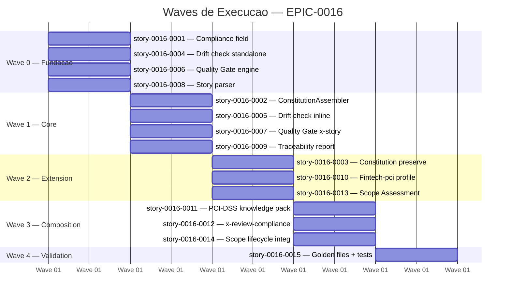
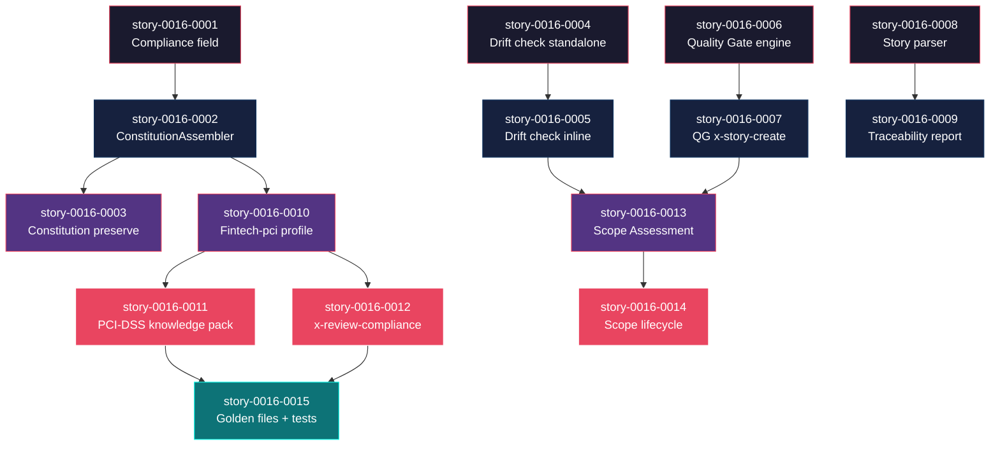

# Mapa de Implementacao — EPIC-0016 (SDD Enhancements)

**Autor:** ia-dev-env
**Data:** 2026-04-03
**Gerado a partir das dependencias BlockedBy/Blocks de cada historia do EPIC-0016.**

---

## 1. Dependency Matrix

| ID | Titulo | Blocked By | Blocks | Wave | Test Plan Status | Status |
| :--- | :--- | :--- | :--- | :--- | :--- | :--- |
| story-0016-0001 | Suporte a campo compliance no modelo de configuracao | -- | story-0016-0002 | 0 | Pending | Concluída |
| story-0016-0004 | Skill x-spec-drift-check modo standalone | -- | story-0016-0005, story-0016-0013 | 0 | Pending | Concluída |
| story-0016-0006 | Motor de scoring do Spec Quality Gate | -- | story-0016-0007, story-0016-0013 | 0 | Pending | Concluída |
| story-0016-0008 | Parser de stories e correlacionador de testes | -- | story-0016-0009 | 0 | Pending | Concluída |
| story-0016-0002 | ConstitutionAssembler e template CONSTITUTION.md | story-0016-0001 | story-0016-0003, story-0016-0010 | 1 | Pending | Concluída |
| story-0016-0005 | Modo inline do x-spec-drift-check no x-dev-lifecycle | story-0016-0004 | story-0016-0013 | 1 | Pending | Concluída |
| story-0016-0007 | Integracao do Quality Gate no x-story-create | story-0016-0006 | story-0016-0013 | 1 | Pending | Concluída |
| story-0016-0009 | Gerador de matriz de rastreabilidade no x-test-run | story-0016-0008 | -- | 1 | Pending | Concluída |
| story-0016-0003 | Preservacao de CONSTITUTION.md na regeneracao | story-0016-0002 | -- | 2 | Pending | Concluída |
| story-0016-0010 | Profile java-spring-fintech-pci base | story-0016-0002 | story-0016-0011, story-0016-0012, story-0016-0015 | 2 | Pending | Concluída |
| story-0016-0013 | Motor de classificacao do Scope Assessment | story-0016-0005, story-0016-0007 | story-0016-0014 | 2 | Pending | Concluída |
| story-0016-0011 | Knowledge pack PCI-DSS com 12 requisitos | story-0016-0010 | story-0016-0015 | 3 | Pending | Pendente |
| story-0016-0012 | Skill x-review-compliance e regras PCI | story-0016-0010 | story-0016-0015 | 3 | Pending | Pendente |
| story-0016-0014 | Integracao do Scope Assessment no x-dev-lifecycle | story-0016-0013 | -- | 3 | Pending | Pendente |
| story-0016-0015 | Golden files e testes de integracao do profile fintech-pci | story-0016-0011, story-0016-0012 | -- | 4 | Pending | Pendente |

> **Nota:** story-0016-0009 e story-0016-0003 sao folhas (sem dependentes). Atrasos nessas stories nao impactam o caminho critico.
> story-0016-0014 tambem e folha mas esta no caminho critico alternativo do Scope Assessment.

---

## 2. Wave Diagram



---

## 3. Fases de Implementacao

> As historias sao agrupadas em fases (waves). Dentro de cada fase, as historias podem ser implementadas **em paralelo**. Uma fase so pode iniciar quando todas as dependencias das fases anteriores estiverem concluidas.

```
+========================================================================+
|          WAVE 0 -- Fundacao (4 paralelas)                              |
|                                                                        |
|  +--------------+  +--------------+  +--------------+  +-----------+  |
|  | story-0001   |  | story-0004   |  | story-0006   |  | story-0008|  |
|  | Compliance   |  | Drift check  |  | Quality Gate |  | Story     |  |
|  | field        |  | standalone   |  | engine       |  | parser    |  |
|  +------+-------+  +------+-------+  +------+-------+  +-----+-----+  |
+=========|================|================|================|===========+
          |                |                |                |
          v                v                v                v
+========================================================================+
|          WAVE 1 -- Core Domain (4 paralelas)                           |
|                                                                        |
|  +--------------+  +--------------+  +--------------+  +-----------+  |
|  | story-0002   |  | story-0005   |  | story-0007   |  | story-0009|  |
|  | Constitution |  | Drift inline |  | QG x-story   |  | Trace     |  |
|  | Assembler    |  | mode         |  | integration  |  | report    |  |
|  +------+-------+  +------+-------+  +------+-------+  +-----------+  |
+=========|================|================|===========================+
          |                |                |
          v                v                v
+========================================================================+
|          WAVE 2 -- Extension (3 paralelas)                             |
|                                                                        |
|  +--------------+  +--------------+  +--------------+                  |
|  | story-0003   |  | story-0010   |  | story-0013   |                  |
|  | Constitution |  | Fintech-pci  |  | Scope Assess |                  |
|  | preserve     |  | profile      |  | engine       |                  |
|  +--------------+  +------+-------+  +------+-------+                  |
+========================|================|==============================+
                         |                |
                         v                v
+========================================================================+
|          WAVE 3 -- Composition (3 paralelas)                           |
|                                                                        |
|  +--------------+  +--------------+  +--------------+                  |
|  | story-0011   |  | story-0012   |  | story-0014   |                  |
|  | PCI-DSS      |  | x-review-    |  | Scope lifecy |                  |
|  | knowledge    |  | compliance   |  | integration  |                  |
|  +------+-------+  +------+-------+  +--------------+                  |
+=========|================|=========================================+
          |                |
          v                v
+========================================================================+
|          WAVE 4 -- Validacao (1 historia)                              |
|                                                                        |
|  +--------------------+                                                |
|  | story-0015         |                                                |
|  | Golden files +     |                                                |
|  | integration tests  |                                                |
|  +--------------------+                                                |
+========================================================================+
```

---

## 4. Caminho Critico

> O caminho critico (a sequencia mais longa de dependencias) determina o tempo minimo de implementacao do projeto.

```
story-0016-0001 --> story-0016-0002 --> story-0016-0010 --> story-0016-0011 --> story-0016-0015
     Wave 0              Wave 1              Wave 2              Wave 3             Wave 4
```

**5 fases no caminho critico, 5 historias na cadeia mais longa.**

O caminho critico percorre o track de compliance (Feature 1 → Feature 5): campo compliance → ConstitutionAssembler → profile fintech-pci → knowledge pack PCI-DSS → golden files. Este e o track mais profundo porque o profile fintech-pci depende do ConstitutionAssembler, e a validacao final (golden files) depende de todos os artefatos PCI-DSS estarem prontos.

Caminho critico alternativo (mesmo comprimento):
```
story-0016-0001 --> story-0016-0002 --> story-0016-0010 --> story-0016-0012 --> story-0016-0015
```
Ambos convergem em story-0016-0015 (golden files), que depende de 0011 E 0012.

---

## 5. Grafo de Dependencias (Mermaid)



---

## 6. Resumo por Fase

| Fase | Historias | Camada | Paralelismo | Pre-requisito |
| :--- | :--- | :--- | :--- | :--- |
| 0 | story-0016-0001, 0004, 0006, 0008 | Foundation | 4 paralelas | -- |
| 1 | story-0016-0002, 0005, 0007, 0009 | Core Domain | 4 paralelas | Wave 0 concluida |
| 2 | story-0016-0003, 0010, 0013 | Extension | 3 paralelas | Wave 1 concluida (parcial — cada story depende de stories especificas) |
| 3 | story-0016-0011, 0012, 0014 | Composition | 3 paralelas | Wave 2 concluida (parcial) |
| 4 | story-0016-0015 | Validation | 1 historia | Wave 3 concluida (0011 + 0012) |

**Total: 15 historias em 5 fases (Waves 0-4).**

> **Nota:** Wave 2 tem dependencias parciais: story-0016-0003 e 0010 dependem apenas de story-0016-0002 (Wave 1), enquanto story-0016-0013 depende de story-0016-0005 e story-0016-0007 (Wave 1). Isso significa que 0003/0010 podem iniciar assim que 0002 terminar, sem esperar 0005/0007.

---

## 7. Detalhamento por Fase

### Wave 0 — Fundacao

| Story | Escopo Principal | Artefatos Chave |
| :--- | :--- | :--- |
| story-0016-0001 | Campo compliance no config YAML | SetupConfig record, ConfigLoader, ContextBuilder |
| story-0016-0004 | Skill x-spec-drift-check standalone | SKILL.md template, StoryParser, CodeScanner, DriftReporter |
| story-0016-0006 | Motor de scoring do Quality Gate | QualityGateEngine, VaguenessDetector, ScenarioScorer |
| story-0016-0008 | Parser de stories e correlacionador de testes | StoryParser, TestCorrelator, TraceabilityEntry |

**Entregas da Wave 0:**

- Campo `compliance` aceito no YAML com backward compatibility
- Skill template x-spec-drift-check criado e funcional em modo standalone
- Motor de scoring isolado com deteccao de linguagem vaga
- Parser de stories e correlacionador de testes funcionais

### Wave 1 — Core Domain

| Story | Escopo Principal | Artefatos Chave |
| :--- | :--- | :--- |
| story-0016-0002 | ConstitutionAssembler + template | ConstitutionAssembler.java, CONSTITUTION.md.peb, golden file |
| story-0016-0005 | Drift check inline mode | Integracao x-dev-lifecycle fase 2, output compacto |
| story-0016-0007 | Quality Gate no x-story-create | Integracao pre-write, --quality-threshold flag, auto-refinement |
| story-0016-0009 | Gerador de matriz de rastreabilidade | --traceability flag, TraceabilityReport, docs/traceability/ |

**Entregas da Wave 1:**

- CONSTITUTION.md gerado condicionalmente (compliance != "none")
- Drift check inline funcional no TDD loop
- Quality Gate bloqueando stories de baixa qualidade
- Matriz de rastreabilidade Markdown gerada pelo x-test-run

### Wave 2 — Extension

| Story | Escopo Principal | Artefatos Chave |
| :--- | :--- | :--- |
| story-0016-0003 | Preservacao de CONSTITUTION.md | --overwrite-constitution flag, logica de skip |
| story-0016-0010 | Profile java-spring-fintech-pci | setup-config YAML, heranca de java-spring, ativacao condicional |
| story-0016-0013 | Motor de classificacao do Scope Assessment | ScopeAssessmentEngine, tiers SIMPLE/STANDARD/COMPLEX |

**Entregas da Wave 2:**

- CONSTITUTION.md preservado em regeneracoes (safe by default)
- 11o profile funcional com todos os artefatos do java-spring + PCI-DSS
- Motor de classificacao adaptativa para stories

### Wave 3 — Composition

| Story | Escopo Principal | Artefatos Chave |
| :--- | :--- | :--- |
| story-0016-0011 | Knowledge pack PCI-DSS | pci-dss-requirements/SKILL.md.peb, 12 requisitos mapeados |
| story-0016-0012 | Skill x-review-compliance | x-review-compliance/SKILL.md.peb, security-pci.md.peb, 20+ checklist |
| story-0016-0014 | Scope Assessment no x-dev-lifecycle | --full-lifecycle flag, fase skip/add, stakeholder review |

**Entregas da Wave 3:**

- Agentes de IA com referencia PCI-DSS completa
- Code reviews automaticos com checklist PCI-DSS
- Lifecycle adaptativo por tier de complexidade

### Wave 4 — Validacao

| Story | Escopo Principal | Artefatos Chave |
| :--- | :--- | :--- |
| story-0016-0015 | Golden files + integration tests | Golden file set fintech-pci, byte-a-byte comparison, non-regression |

**Entregas da Wave 4:**

- Profile fintech-pci validado byte-a-byte
- Non-regression confirmada para todos os 11 profiles
- Suite de testes completa para o epico

---

## 8. Observacoes Estrategicas

### Gargalo Principal

**story-0016-0002 (ConstitutionAssembler)** e o gargalo principal — bloqueia 2 historias diretamente (0003, 0010) e indiretamente 4 historias via 0010 (0011, 0012, 0015). Investir tempo extra na qualidade do template Pebble e na interface do assembler compensa: decisoes de design nesta story propagam para todo o track de compliance. Recomendacao: alocar desenvolvedor senior e fazer pair review do template antes de prosseguir.

### Historias Folha (sem dependentes)

- **story-0016-0003** — Preservacao de CONSTITUTION.md (Wave 2)
- **story-0016-0009** — Gerador de matriz de rastreabilidade (Wave 1)
- **story-0016-0014** — Integracao do Scope Assessment (Wave 3)
- **story-0016-0015** — Golden files + integration tests (Wave 4)

Stories 0003, 0009 e 0014 podem absorver atrasos sem impactar o caminho critico. Sao boas candidatas para desenvolvedores juniores ou streams paralelos. Story 0015 e a convergencia final e nao pode atrasar.

### Otimizacao de Tempo

**Paralelismo maximo:** Wave 0 oferece 4 stories completamente independentes — com 4 desenvolvedores, todas podem iniciar simultaneamente no dia 1. Wave 1 tambem oferece 4 stories paralelas.

**Historias imediatas sem risco:** story-0016-0004 (drift check), story-0016-0006 (quality gate) e story-0016-0008 (parser) sao roots independentes que nao compartilham codigo com nenhuma outra story da Wave 0. Podem iniciar sem coordenacao.

**Alocacao ideal:** 3-4 desenvolvedores alocados ao track de compliance (0001→0002→0010→0011/0012→0015) e 1-2 desenvolvedores ao track de tooling (0004→0005→0013→0014 e 0006→0007).

### Dependencias Cruzadas

O ponto de convergencia principal e **story-0016-0013 (Scope Assessment)**, que depende de dois tracks independentes:
- Track Drift: story-0016-0004 → story-0016-0005
- Track Quality Gate: story-0016-0006 → story-0016-0007

Ambos devem concluir antes de 0013 iniciar. Coordenacao necessaria entre os dois tracks para garantir que interfaces (DriftCheckResult, QualityGateResult) estejam estaveis antes de 0013.

O segundo ponto de convergencia e **story-0016-0015 (Golden files)**, que depende de 0011 E 0012 — ambas paralelas na Wave 3 mas com mesmo pre-requisito (0010).

### Marco de Validacao Arquitetural

**story-0016-0002 (ConstitutionAssembler)** serve como checkpoint arquitetural. Ela valida:
- O padrao de assembler condicional (ativacao por campo do context)
- A integracao de novo assembler no AssemblerPipeline
- O mecanismo de template Pebble para artefatos de governance
- A non-regression dos profiles existentes

Apos esta story, o padrao de "assembler condicional + template + golden file" esta validado e pode ser replicado com confianca para o knowledge pack (0011) e a skill x-review-compliance (0012).

---

## Execution Order

1. **Wave 0** (paralelo): story-0016-0001, story-0016-0004, story-0016-0006, story-0016-0008
2. **Wave 1** (apos Wave 0): story-0016-0002, story-0016-0005, story-0016-0007, story-0016-0009
3. **Wave 2** (apos Wave 1): story-0016-0003, story-0016-0010, story-0016-0013
4. **Wave 3** (apos Wave 2): story-0016-0011, story-0016-0012, story-0016-0014
5. **Wave 4** (apos Wave 3): story-0016-0015
