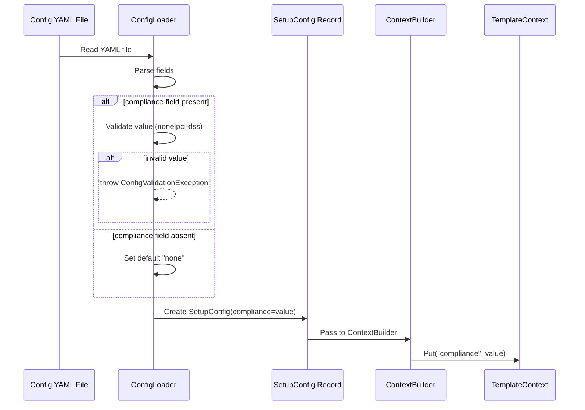

# Historia: Suporte a campo compliance no modelo de configuracao

**ID:** story-0016-0001
**Chave Jira:** —
**Status:** Concluída

## 1. Dependencias

| Blocked By | Blocks |
| :--- | :--- |
| -- | story-0016-0002 |

## 2. Regras Transversais Aplicaveis

| ID | Titulo |
| :--- | :--- |
| RULE-005 | Backward compatibility no config YAML |
| RULE-008 | Cobertura minima JaCoCo |

## 3. Descricao

Como **arquiteto de plataforma**, eu quero que o config YAML suporte um campo `compliance` opcional, para que a geracao de artefatos de governance possa ser ativada condicionalmente por profile ou por configuracao explicita do usuario.

### Contexto

O ia-dev-environment carrega configuracoes de stack profiles a partir de arquivos YAML em `src/main/resources/config-templates/`. Atualmente nao existe campo para indicar requisitos de compliance. Esta story adiciona o campo `compliance` ao schema YAML e ao modelo Java (records), garantindo backward compatibility — configs existentes sem o campo devem continuar funcionando com default `none`.

### 3.1 Campo compliance no YAML

O campo `compliance` deve ser adicionado ao schema de configuracao como campo opcional de nivel raiz:

```yaml
# setup-config.java-spring-fintech-pci.yaml
name: java-spring-fintech-pci
language: java 21
framework: spring-boot 3.2
compliance: pci-dss   # novo campo — valores: none (default), pci-dss
```

Valores validos: `none` (default quando ausente), `pci-dss`. Valores desconhecidos devem gerar erro de validacao com mensagem clara indicando os valores suportados.

### 3.2 Modelo Java (record)

Adicionar campo `compliance` ao record de configuracao existente (`SetupConfig` ou equivalente). O campo deve ser do tipo `String` com default `"none"` quando ausente no YAML. O context builder deve propagar o valor para o template context, disponibilizando-o para templates Pebble via `{{ compliance }}`.

### 3.3 Validacao

Adicionar validacao no config loader: se `compliance` contem valor nao suportado, lancar excecao com mensagem: `"Unsupported compliance value: '<value>'. Supported: none, pci-dss"`.

## 3.5 Entrega de Valor

- **Valor Principal:** Habilita geracao condicional de artefatos de governance para projetos com requisitos regulatorios
- **Metrica de Sucesso:** Profiles existentes continuam funcionando sem alteracao; novo campo aceito e propagado ao template context
- **Impacto no Negocio:** Desbloqueia story-0016-0002 (ConstitutionAssembler) e todo o track de compliance/fintech do epico

## 4. Definicoes de Qualidade Locais

### DoR Local

- [ ] Schema YAML dos profiles existentes documentado e compreendido
- [ ] Record de configuracao atual identificado no codigo-fonte
- [ ] Context builder mapeado (como campos YAML viram variaveis de template)

### DoD Local

- [ ] Campo `compliance` aceito no YAML com values `none` e `pci-dss`
- [ ] Default `none` aplicado quando campo ausente (backward compatible)
- [ ] Validacao rejeita valores desconhecidos com mensagem acionavel
- [ ] Valor propagado ao template context Pebble
- [ ] Todos os 10 profiles existentes continuam passando nos testes
- [ ] Test plan gerado via `/x-test-plan` antes do inicio da implementacao
- [ ] Todo @GK-N da secao 7 mapeado para >= 1 AT-N na secao 8
- [ ] Cenarios Gherkin ordenados por TPP (degenerate -> happy -> error -> boundary)
- [ ] Todo AT-N com status GREEN antes de marcar DoD como concluido
- [ ] Commits seguem padrao test-first (teste precede ou acompanha implementacao no git log)

### Global DoD

- **Cobertura:** >= 95% Line, >= 90% Branch
- **Testes Automatizados:** Unit tests para parsing, validacao e context propagation
- **TDD Compliance:** Commits test-first, refactoring explicito
- **Backward Compatibility:** Todos os 10 profiles existentes passam sem alteracao
- **Double-Loop TDD:** Acceptance tests derivados dos cenarios Gherkin (outer loop), unit tests guiados por TPP (inner loop)
- **Rastreabilidade:** Todo @GK-N mapeia para >= 1 AT-N, todo AT-N referencia um @GK-N valido

## 5. Contratos de Dados

**SetupConfig (record atualizado)**

| Campo | Tipo | Obrigatorio | Descricao |
| :--- | :--- | :--- | :--- |
| `compliance` | String | N (default: `"none"`) | Tipo de compliance regulatorio. Valores: `none`, `pci-dss` |

**TemplateContext (propagacao)**

| Campo | Tipo | Obrigatorio | Descricao |
| :--- | :--- | :--- | :--- |
| `compliance` | String | M (sempre presente no context) | Valor de compliance resolvido (nunca null — default `"none"`) |

## 6. Diagramas

### 6.1 Fluxo de parsing do campo compliance



## 7. Criterios de Aceite (Gherkin)

@GK-1
Cenario: Config YAML sem campo compliance usa default none
  DADO um arquivo setup-config.java-spring.yaml sem o campo `compliance`
  QUANDO o ConfigLoader faz parsing do arquivo
  ENTAO o SetupConfig.compliance() retorna "none"
  E o TemplateContext contem chave "compliance" com valor "none"

@GK-2
Cenario: Config YAML com compliance pci-dss e parseado corretamente
  DADO um arquivo setup-config.yaml com `compliance: pci-dss`
  QUANDO o ConfigLoader faz parsing do arquivo
  ENTAO o SetupConfig.compliance() retorna "pci-dss"
  E o TemplateContext contem chave "compliance" com valor "pci-dss"

@GK-3
Cenario: Config YAML com compliance none e parseado corretamente
  DADO um arquivo setup-config.yaml com `compliance: none`
  QUANDO o ConfigLoader faz parsing do arquivo
  ENTAO o SetupConfig.compliance() retorna "none"

@GK-4
Cenario: Config YAML com valor de compliance invalido gera erro
  DADO um arquivo setup-config.yaml com `compliance: sox`
  QUANDO o ConfigLoader faz parsing do arquivo
  ENTAO uma ConfigValidationException e lancada
  E a mensagem contem "Unsupported compliance value: 'sox'. Supported: none, pci-dss"

@GK-5
Cenario: Profiles existentes continuam funcionando sem campo compliance
  DADO os 10 profiles existentes em config-templates/
  QUANDO cada profile e carregado pelo ConfigLoader
  ENTAO todos sao parseados sem erro
  E todos possuem compliance() == "none"

## 8. Sub-tarefas

### Ciclos TDD

> Sub-tarefas TDD serao populadas apos geracao do test plan via `/x-test-plan`.
> Cada AT-N e UT-N do test plan gerara entradas [TDD] com ciclos RED/GREEN/REFACTOR.

### Tarefas nao-TDD

- [ ] [Doc] Atualizar documentacao do schema YAML com o novo campo compliance
- [ ] [Doc] Adicionar entrada no CHANGELOG.md
