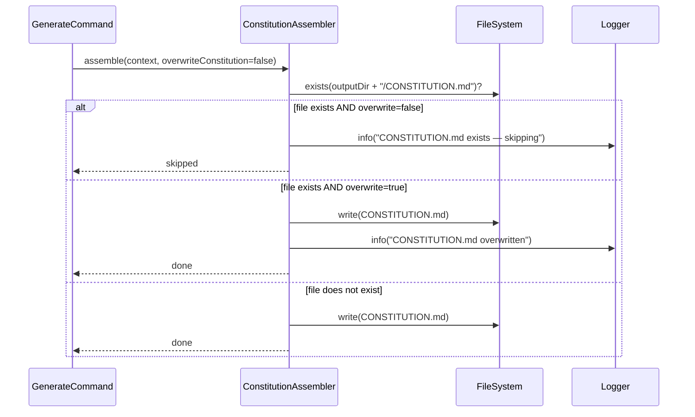

# Historia: Preservacao de CONSTITUTION.md na regeneracao

**ID:** story-0016-0003
**Chave Jira:** —
**Status:** Concluída

## 1. Dependencias

| Blocked By | Blocks |
| :--- | :--- |
| story-0016-0002 | -- |

## 2. Regras Transversais Aplicaveis

| ID | Titulo |
| :--- | :--- |
| RULE-005 | Backward compatibility no config YAML |
| RULE-008 | Cobertura minima JaCoCo |

## 3. Descricao

Como **desenvolvedor de projeto fintech**, eu quero que customizacoes que fiz no CONSTITUTION.md sejam preservadas quando regenero o ambiente com `ia-dev-env generate`, para que nao perca invariants e regras que adicionei manualmente apos a geracao inicial.

### Contexto

Apos a geracao inicial, usuarios podem customizar o CONSTITUTION.md adicionando invariants especificos do projeto. Uma regeneracao com `--force` nao deve sobrescrever essas customizacoes. O CLI deve detectar a existencia do arquivo e pular a geracao, exibindo um aviso. Um novo flag `--overwrite-constitution` deve ser adicionado para permitir regeneracao explicita.

### 3.1 Deteccao de arquivo existente

Antes de renderizar o template, o ConstitutionAssembler deve verificar se `CONSTITUTION.md` ja existe no diretorio de saida. Se existir:
- Exibir mensagem: `"CONSTITUTION.md exists — skipping (use --overwrite-constitution to regenerate)"`
- Nao gerar o arquivo (preservar o existente)
- Continuar o pipeline normalmente (nao falhar)

### 3.2 Flag --overwrite-constitution

Novo flag CLI booleano `--overwrite-constitution` (default: `false`). Quando ativo:
- O ConstitutionAssembler sobrescreve o arquivo existente
- Exibe mensagem: `"CONSTITUTION.md overwritten (--overwrite-constitution active)"`

### 3.3 Interacao com --force

O flag existente `--force` NÃO deve acionar a regeneracao do CONSTITUTION.md. Apenas `--overwrite-constitution` tem esse efeito. Isso e intencional — a Constitution e tratada como artefato de primeira classe que requer consentimento explicito para regeneracao.

## 3.5 Entrega de Valor

- **Valor Principal:** Customizacoes do usuario em CONSTITUTION.md sao preservadas em regeneracoes, evitando perda de trabalho manual
- **Metrica de Sucesso:** Regeneracao com --force preserva CONSTITUTION.md customizado; --overwrite-constitution regenera explicitamente
- **Impacto no Negocio:** Usuarios de compliance confiam que suas regras customizadas nao serao perdidas acidentalmente

## 4. Definicoes de Qualidade Locais

### DoR Local

- [ ] story-0016-0002 concluida (ConstitutionAssembler funcional)
- [ ] Mecanismo de flags CLI existente documentado (como adicionar novos flags)
- [ ] Comportamento atual de --force mapeado

### DoD Local

- [ ] CONSTITUTION.md existente preservado por default na regeneracao
- [ ] Mensagem de skip exibida quando arquivo existe
- [ ] --overwrite-constitution regenera o arquivo
- [ ] --force NAO aciona regeneracao de CONSTITUTION.md
- [ ] Test plan gerado via `/x-test-plan` antes do inicio da implementacao
- [ ] Todo @GK-N da secao 7 mapeado para >= 1 AT-N na secao 8
- [ ] Cenarios Gherkin ordenados por TPP (degenerate -> happy -> error -> boundary)
- [ ] Todo AT-N com status GREEN antes de marcar DoD como concluido
- [ ] Commits seguem padrao test-first (teste precede ou acompanha implementacao no git log)

### Global DoD

- **Cobertura:** >= 95% Line, >= 90% Branch
- **Testes Automatizados:** Unit tests para logica de skip, integration tests para CLI flags
- **TDD Compliance:** Commits test-first, refactoring explicito
- **Backward Compatibility:** --force nao altera comportamento existente
- **Double-Loop TDD:** Acceptance tests derivados dos cenarios Gherkin (outer loop), unit tests guiados por TPP (inner loop)
- **Rastreabilidade:** Todo @GK-N mapeia para >= 1 AT-N, todo AT-N referencia um @GK-N valido

## 5. Contratos de Dados

**CLI Flags (novos)**

| Campo | Tipo | Obrigatorio | Descricao |
| :--- | :--- | :--- | :--- |
| `--overwrite-constitution` | boolean | N (default: false) | Permite regeneracao explicita de CONSTITUTION.md existente |

**ConstitutionAssembler (input adicional)**

| Campo | Tipo | Obrigatorio | Descricao |
| :--- | :--- | :--- | :--- |
| `overwriteConstitution` | boolean | M | Flag indicando se deve sobrescrever arquivo existente |
| `outputDir` | Path | M | Diretorio de saida onde verificar existencia do arquivo |

## 6. Diagramas

### 6.1 Fluxo de decisao de preservacao

## 7. Criterios de Aceite (Gherkin)

@GK-1
Cenario: Diretorio sem CONSTITUTION.md gera o arquivo normalmente
  DADO um diretorio de saida sem CONSTITUTION.md
  E compliance = "pci-dss"
  QUANDO o ConstitutionAssembler e executado sem --overwrite-constitution
  ENTAO o arquivo CONSTITUTION.md e criado no diretorio de saida

@GK-2
Cenario: CONSTITUTION.md existente e preservado por default
  DADO um diretorio de saida com CONSTITUTION.md contendo "RULE-CUSTOM-001: regra do usuario"
  E compliance = "pci-dss"
  QUANDO o ConstitutionAssembler e executado sem --overwrite-constitution
  ENTAO o arquivo CONSTITUTION.md existente NAO e modificado
  E o conteudo ainda contem "RULE-CUSTOM-001: regra do usuario"
  E a mensagem "CONSTITUTION.md exists — skipping (use --overwrite-constitution to regenerate)" e exibida

@GK-3
Cenario: --overwrite-constitution regenera o arquivo
  DADO um diretorio de saida com CONSTITUTION.md customizado
  E compliance = "pci-dss"
  QUANDO o ConstitutionAssembler e executado com --overwrite-constitution
  ENTAO o arquivo CONSTITUTION.md e regenerado a partir do template
  E a mensagem "CONSTITUTION.md overwritten (--overwrite-constitution active)" e exibida

@GK-4
Cenario: --force sem --overwrite-constitution preserva CONSTITUTION.md
  DADO um diretorio de saida com CONSTITUTION.md customizado
  E o comando usa --force mas NAO --overwrite-constitution
  QUANDO a geracao completa e executada
  ENTAO o CONSTITUTION.md existente NAO e modificado
  E demais artefatos sao regenerados normalmente

@GK-5
Cenario: compliance none nao verifica existencia do arquivo
  DADO um diretorio de saida com CONSTITUTION.md de uma geracao anterior
  E compliance = "none"
  QUANDO o ConstitutionAssembler e executado
  ENTAO nenhuma verificacao de existencia e feita
  E nenhuma mensagem de skip e exibida
  E o arquivo existente permanece inalterado

## 8. Sub-tarefas

### Ciclos TDD

> Sub-tarefas TDD serao populadas apos geracao do test plan via `/x-test-plan`.
> Cada AT-N e UT-N do test plan gerara entradas [TDD] com ciclos RED/GREEN/REFACTOR.

### Tarefas nao-TDD

- [ ] [Doc] Documentar flag --overwrite-constitution no help do CLI
- [ ] [Doc] Adicionar nota sobre preservacao de CONSTITUTION.md no README
