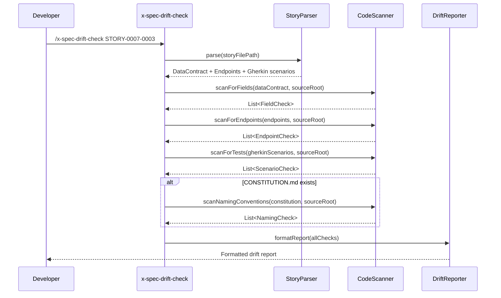

# Historia: Skill x-spec-drift-check modo standalone

**ID:** story-0016-0004
**Chave Jira:** —
**Status:** Concluída

## 1. Dependencias

| Blocked By | Blocks |
| :--- | :--- |
| -- | story-0016-0005, story-0016-0013 |

## 2. Regras Transversais Aplicaveis

| ID | Titulo |
| :--- | :--- |
| RULE-004 | Estrutura padrao de skills |
| RULE-009 | Outputs acionaveis |
| RULE-008 | Cobertura minima JaCoCo |

## 3. Descricao

Como **desenvolvedor**, eu quero executar `/x-spec-drift-check STORY-ID` para detectar divergencias entre a especificacao da story e o codigo implementado, para que eu corrija drifts antes de abrir um PR e reduza retrabalho em code review.

### Contexto

A skill x-spec-drift-check opera como "linter de spec": compara data contracts, Gherkin scenarios e architecture boundaries contra o codigo produzido. No modo standalone (esta story), o usuario invoca manualmente com um STORY-ID. A skill le a story markdown, extrai campos do data contract e endpoints declarados, busca correspondencias no codigo-fonte, e emite relatorio detalhado.

### 3.1 Parsing da story

A skill deve ler o arquivo story-XXXX-YYYY.md e extrair:
- Campos do data contract (secao 5): nome, tipo, obrigatoriedade (M/O)
- Endpoints declarados: metodo HTTP + path (ex: `POST /v1/payments`)
- Scenarios Gherkin (secao 7): IDs @GK-N e titulos
- Referencia a CONSTITUTION.md (se existir no projeto)

### 3.2 Verificacoes de drift

| Tipo | Severidade | Logica de deteccao |
|------|------------|-------------------|
| Field Missing | FAIL | Campo M do data contract nao encontrado em nenhum DTO/Record do codigo |
| Field Type Mismatch | WARN | Campo encontrado mas tipo difere do declarado (ex: BigDecimal vs Double) |
| Endpoint Missing | FAIL | Endpoint declarado nao encontrado em nenhum @RestController/@Path |
| Scenario Uncovered | WARN | @GK-N sem AT correspondente no codigo de testes |
| Naming Violation | WARN | CONSTITUTION.md define naming convention violada no codigo |

### 3.3 Formato de output

Output deve seguir formato itemizado com severidade, conforme RULE-009:
```
=== Spec Drift Check — STORY-XXXX-YYYY ===
Data Contracts:
  ✅ PASS  FieldName (Type, M) → found in ClassName
  ❌ FAIL  FieldName (Type, M) → NOT FOUND
Endpoints:
  ✅ PASS  POST /path → ControllerClass.methodName()
  ❌ FAIL  GET /path → NOT FOUND in any controller
Gherkin Coverage:
  ✅ PASS  @GK-1 "title" → AT-1 found (TestClass)
  ⚠️ WARN  @GK-3 "title" → no AT found
Constitution Compliance:
  ✅ PASS  No violations detected
Summary: N FAIL, M WARN — DRIFT DETECTED / NO DRIFT
```

### 3.4 Exit code

- Exit code 0: nenhum FAIL (apenas PASS e WARN)
- Exit code non-zero: pelo menos 1 FAIL

## 3.5 Entrega de Valor

- **Valor Principal:** Desenvolvedores detectam divergencias spec-codigo antes do PR, reduzindo retrabalho em code review
- **Metrica de Sucesso:** Drift reports gerados com itemizacao precisa; campos ausentes detectados com 100% de recall
- **Impacto no Negocio:** Reduz ciclos de review em projetos com specs detalhadas; base para modo inline (story-0016-0005) e scope assessment (story-0016-0013)

## 4. Definicoes de Qualidade Locais

### DoR Local

- [ ] Estrutura de story markdown (secoes 5 e 7) documentada
- [ ] Padroes de anotacao de endpoints (@RestController, @Path, @GetMapping etc.) identificados
- [ ] Formato de output definido e aprovado

### DoD Local

- [ ] Skill template x-spec-drift-check/SKILL.md criado com frontmatter correto
- [ ] Parsing de data contracts extrai campos com nome, tipo e obrigatoriedade
- [ ] Parsing de endpoints extrai metodo HTTP e path
- [ ] Verificacao Field Missing detecta campos M ausentes como FAIL
- [ ] Verificacao Field Type Mismatch detecta tipos divergentes como WARN
- [ ] Verificacao Endpoint Missing detecta endpoints ausentes como FAIL
- [ ] Verificacao Scenario Uncovered detecta @GK-N sem AT como WARN
- [ ] Output segue formato itemizado com severidade
- [ ] Exit code non-zero quando FAIL presente
- [ ] Test plan gerado via `/x-test-plan` antes do inicio da implementacao
- [ ] Todo @GK-N da secao 7 mapeado para >= 1 AT-N na secao 8
- [ ] Cenarios Gherkin ordenados por TPP (degenerate -> happy -> error -> boundary)
- [ ] Todo AT-N com status GREEN antes de marcar DoD como concluido
- [ ] Commits seguem padrao test-first (teste precede ou acompanha implementacao no git log)

### Global DoD

- **Cobertura:** >= 95% Line, >= 90% Branch
- **Testes Automatizados:** Unit tests para cada tipo de drift, integration test com story+codigo reais
- **TDD Compliance:** Commits test-first, refactoring explicito
- **Backward Compatibility:** Nenhuma skill existente e alterada
- **Double-Loop TDD:** Acceptance tests derivados dos cenarios Gherkin (outer loop), unit tests guiados por TPP (inner loop)
- **Rastreabilidade:** Todo @GK-N mapeia para >= 1 AT-N, todo AT-N referencia um @GK-N valido

## 5. Contratos de Dados

**DriftCheckInput**

| Campo | Tipo | Obrigatorio | Descricao |
| :--- | :--- | :--- | :--- |
| `storyId` | String | M | ID da story a verificar (ex: "STORY-0007-0003") |
| `storyFilePath` | Path | M | Caminho para o arquivo story markdown |
| `sourceRootPath` | Path | M | Raiz do codigo-fonte para busca |
| `constitutionPath` | Path | N | Caminho para CONSTITUTION.md (null se nao existir) |

**DriftCheckResult**

| Campo | Tipo | Obrigatorio | Descricao |
| :--- | :--- | :--- | :--- |
| `storyId` | String | M | ID da story verificada |
| `dataContractChecks` | List&lt;FieldCheck&gt; | M | Resultado de cada campo verificado |
| `endpointChecks` | List&lt;EndpointCheck&gt; | M | Resultado de cada endpoint verificado |
| `gherkinChecks` | List&lt;ScenarioCheck&gt; | M | Resultado de cada @GK-N verificado |
| `constitutionChecks` | List&lt;NamingCheck&gt; | M | Resultado de naming conventions (vazio se sem CONSTITUTION) |
| `failCount` | int | M | Total de FAILs |
| `warnCount` | int | M | Total de WARNs |
| `hasCriticalDrift` | boolean | M | true se failCount > 0 |

**FieldCheck**

| Campo | Tipo | Obrigatorio | Descricao |
| :--- | :--- | :--- | :--- |
| `fieldName` | String | M | Nome do campo do data contract |
| `expectedType` | String | M | Tipo declarado na story |
| `mandatory` | boolean | M | true se M, false se O |
| `status` | enum(PASS, WARN, FAIL) | M | Resultado da verificacao |
| `foundIn` | String | N | Classe onde o campo foi encontrado (null se FAIL) |
| `actualType` | String | N | Tipo encontrado (null se FAIL, preenchido se WARN mismatch) |

## 6. Diagramas

### 6.1 Fluxo de execucao do drift check standalone



## 7. Criterios de Aceite (Gherkin)

@GK-1
Cenario: Story sem data contract gera report vazio para secao Data Contracts
  DADO uma story STORY-TEST-001 sem secao de data contract (secao 5 vazia)
  QUANDO `/x-spec-drift-check STORY-TEST-001` e executado
  ENTAO a secao "Data Contracts" do report indica "No data contract defined"
  E o exit code e 0

@GK-2
Cenario: Campo obrigatorio presente no codigo gera PASS
  DADO a story STORY-TEST-002 com data contract declarando `amount: BigDecimal (M)` em PaymentRequest
  E o codigo contem `PaymentRequestDTO` com campo `amount` do tipo `BigDecimal`
  QUANDO `/x-spec-drift-check STORY-TEST-002` e executado
  ENTAO o report contem "PASS PaymentRequest.amount (BigDecimal, M) -> found in PaymentRequestDTO"

@GK-3
Cenario: Campo obrigatorio ausente no codigo gera FAIL
  DADO a story STORY-TEST-003 com data contract declarando `amount: BigDecimal (M)` em PaymentRequest
  E o codigo contem `PaymentRequestDTO` SEM campo `amount`
  QUANDO `/x-spec-drift-check STORY-TEST-003` e executado
  ENTAO o report contem "FAIL PaymentRequest.amount (BigDecimal, M) -> NOT FOUND"
  E o exit code e non-zero

@GK-4
Cenario: Campo opcional ausente gera WARN nao FAIL
  DADO a story com data contract declarando `processingTime: Long (O)`
  E o codigo nao possui esse campo
  QUANDO `/x-spec-drift-check` e executado
  ENTAO o report contem "WARN processingTime (Long, O) -> field absent (optional)"
  E o exit code e 0

@GK-5
Cenario: Endpoint declarado nao implementado gera FAIL
  DADO a story declarando endpoint `GET /v1/payments/{id}`
  E nenhum controller possui mapping para GET /v1/payments/{id}
  QUANDO `/x-spec-drift-check` e executado
  ENTAO o report contem "FAIL GET /v1/payments/{id} -> NOT FOUND in any controller"
  E o exit code e non-zero

@GK-6
Cenario: Todos os contratos atendidos gera NO DRIFT
  DADO uma story com 3 campos M, 2 endpoints e 4 scenarios
  E o codigo implementa todos os 3 campos, 2 endpoints e tem ATs para os 4 scenarios
  QUANDO `/x-spec-drift-check` e executado
  ENTAO o summary indica "0 FAIL, 0 WARN — NO DRIFT DETECTED"
  E o exit code e 0

## 8. Sub-tarefas

### Ciclos TDD

> Sub-tarefas TDD serao populadas apos geracao do test plan via `/x-test-plan`.
> Cada AT-N e UT-N do test plan gerara entradas [TDD] com ciclos RED/GREEN/REFACTOR.

### Tarefas nao-TDD

- [ ] [Doc] Documentar skill x-spec-drift-check no README de skills
- [ ] [Doc] Adicionar exemplos de uso no SKILL.md
