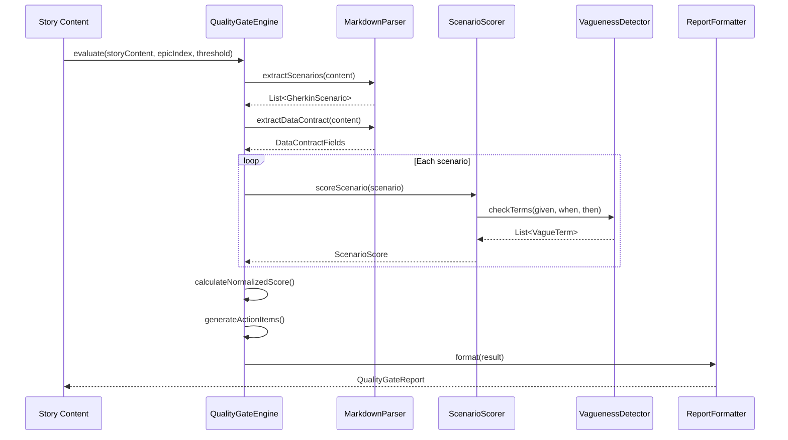

# Historia: Motor de scoring do Spec Quality Gate

**ID:** story-0016-0006
**Chave Jira:** —
**Status:** Concluída

## 1. Dependencias

| Blocked By | Blocks |
| :--- | :--- |
| -- | story-0016-0007, story-0016-0013 |

## 2. Regras Transversais Aplicaveis

| ID | Titulo |
| :--- | :--- |
| RULE-009 | Outputs acionaveis |
| RULE-008 | Cobertura minima JaCoCo |

## 3. Descricao

Como **product owner**, eu quero que stories com scenarios vagos ou data contracts incompletos sejam detectadas automaticamente antes de serem gravadas em disco, para que o tempo de implementacao nao seja desperdicado com specs de baixa qualidade.

### Contexto

O Quality Gate e um motor de scoring que avalia a qualidade de cada story gerada pelo x-story-create. O score maximo e 100 pontos, e stories abaixo de um threshold configuravel (default: 70) nao sao gravadas. Esta story implementa o motor de scoring isoladamente; a integracao no x-story-create e a story-0016-0007.

### 3.1 Criterios de pontuacao

| Criterio | Pontos | Logica |
|----------|--------|--------|
| Given claro (contexto especifico) | 5/scenario | Verifica que Given nao contem termos vagos |
| When com acao unica | 5/scenario | Verifica que When descreve uma acao precisa |
| Then verificavel (nao subjetivo) | 5/scenario | Verifica que Then contem valor concreto, status code ou campo especifico |
| Data contract com >= 1 campo M | 10 | Verifica presenca de pelo menos 1 campo obrigatorio |
| Tipos explicitos em todos campos | 10 | Verifica que nenhum campo tem tipo ausente ou generico ("data", "object") |
| >= 4 scenarios (TPP coverage) | 10 | Conta total de scenarios Gherkin |
| Nenhum scenario com linguagem vaga | 15 | Varredura contra lista de termos proibidos |
| Dependencia existe no epic | 10 | Verifica que IDs em Blocked By existem no indice do epic |

Score maximo: 15 (vagueness) + 10 (contract field M) + 10 (tipos) + 10 (4+ scenarios) + 10 (deps) + N*15 (per-scenario Given+When+Then) normalizado para 100.

> ⚠️ Decision: O score e normalizado para 100 pontos. Scenarios contribuem proporcionalmente: com 4 scenarios perfeitos (4*15=60) + 45 de checks fixos = 105, normalizado para 100. Isso garante que mais scenarios nao inflacionem o score alem de 100.

### 3.2 Deteccao de linguagem vaga

Termos proibidos em scenarios Gherkin (case-insensitive):
- "funciona corretamente", "funciona bem"
- "resultado esperado", "resultado correto"
- "configurado", "configurado corretamente"
- "faz algo", "realiza operacao"
- "o sistema", "o usuario" (sem especificidade de qual sistema/usuario)
- "dados validos", "dados invalidos" (sem especificar quais dados)
- "erro apropriado", "mensagem adequada"

### 3.3 Formato do report de qualidade

```
=== Spec Quality Gate — story-XXXX-YYYY ===
Score: 45/100 (threshold: 70) — REJECTED

Breakdown:
  Scenarios (4): 35/60
    @GK-1: Given ✅ (5) | When ✅ (5) | Then ❌ (0) — "resultado esperado" is non-verifiable
    @GK-2: Given ✅ (5) | When ✅ (5) | Then ✅ (5)
    @GK-3: Given ❌ (0) — "o sistema configurado" is vague | When ✅ (5) | Then ✅ (5)
    @GK-4: Given ✅ (5) | When ❌ (0) — "faz algo" is vague | Then ❌ (0)
  Data Contract: 0/10 — no mandatory fields defined
  Types: 0/10 — 2 fields without explicit type
  Scenario Count: 10/10 — 4 scenarios (>= 4)
  Vagueness: 0/15 — 3 vague terms detected
  Dependencies: 10/10 — all Blocked By IDs exist

Action Items:
  1. @GK-1 Then: "resultado esperado" → specify exact HTTP status, field name, or value
  2. @GK-3 Given: "o sistema configurado" → specify configuration state with concrete values
  3. @GK-4 When: "faz algo" → describe single, specific action
  4. Data contract: add at least 1 mandatory (M) field with explicit type
```

## 3.5 Entrega de Valor

- **Valor Principal:** Stories com scenarios vagos ou data contracts incompletos sao rejeitadas antes de consumir tempo de implementacao
- **Metrica de Sucesso:** Motor de scoring atribui score correto para stories com qualidade variavel; deteccao de termos vagos com zero falsos negativos
- **Impacto no Negocio:** Melhora a qualidade do backlog e reduz retrabalho de refinamento pos-criacao

## 4. Definicoes de Qualidade Locais

### DoR Local

- [ ] Lista de termos vagos proibidos definida e revisada
- [ ] Criterios de pontuacao documentados e aprovados
- [ ] Formato de report definido

### DoD Local

- [ ] Motor de scoring implementado com todos os criterios da tabela
- [ ] Deteccao de linguagem vaga funcional com lista de termos proibidos
- [ ] Report de qualidade gerado com breakdown por scenario
- [ ] Action items acionaveis (indicam o problema especifico e sugestao de correcao)
- [ ] Score normalizado para 100 pontos
- [ ] Test plan gerado via `/x-test-plan` antes do inicio da implementacao
- [ ] Todo @GK-N da secao 7 mapeado para >= 1 AT-N na secao 8
- [ ] Cenarios Gherkin ordenados por TPP (degenerate -> happy -> error -> boundary)
- [ ] Todo AT-N com status GREEN antes de marcar DoD como concluido
- [ ] Commits seguem padrao test-first (teste precede ou acompanha implementacao no git log)

### Global DoD

- **Cobertura:** >= 95% Line, >= 90% Branch
- **Testes Automatizados:** Unit tests para cada criterio de scoring, parameterized tests para termos vagos
- **TDD Compliance:** Commits test-first, refactoring explicito
- **Backward Compatibility:** Nenhuma skill existente alterada (motor isolado)
- **Double-Loop TDD:** Acceptance tests derivados dos cenarios Gherkin (outer loop), unit tests guiados por TPP (inner loop)
- **Rastreabilidade:** Todo @GK-N mapeia para >= 1 AT-N, todo AT-N referencia um @GK-N valido

## 5. Contratos de Dados

**QualityGateInput**

| Campo | Tipo | Obrigatorio | Descricao |
| :--- | :--- | :--- | :--- |
| `storyContent` | String | M | Conteudo markdown da story a avaliar |
| `epicIndexEntries` | List&lt;String&gt; | M | IDs das stories no indice do epic (para validar dependencias) |
| `threshold` | int | M | Score minimo para aprovacao (default: 70) |

**QualityGateResult**

| Campo | Tipo | Obrigatorio | Descricao |
| :--- | :--- | :--- | :--- |
| `score` | int | M | Score normalizado (0-100) |
| `threshold` | int | M | Threshold utilizado |
| `passed` | boolean | M | true se score >= threshold |
| `scenarioScores` | List&lt;ScenarioScore&gt; | M | Score detalhado por scenario |
| `dataContractScore` | int | M | Pontos do data contract (0-10) |
| `typeExplicitnessScore` | int | M | Pontos dos tipos (0-10) |
| `scenarioCountScore` | int | M | Pontos da contagem (0-10) |
| `vaguenessScore` | int | M | Pontos de linguagem (0-15) |
| `dependencyScore` | int | M | Pontos de dependencias (0-10) |
| `actionItems` | List&lt;String&gt; | M | Itens acionaveis para correcao |

**ScenarioScore**

| Campo | Tipo | Obrigatorio | Descricao |
| :--- | :--- | :--- | :--- |
| `scenarioId` | String | M | ID do scenario (@GK-N) |
| `givenScore` | int | M | 0 ou 5 |
| `whenScore` | int | M | 0 ou 5 |
| `thenScore` | int | M | 0 ou 5 |
| `issues` | List&lt;String&gt; | M | Problemas detectados neste scenario |

## 6. Diagramas

### 6.1 Fluxo de avaliacao do Quality Gate



## 7. Criterios de Aceite (Gherkin)

@GK-1
Cenario: Story sem scenarios Gherkin recebe score zero
  DADO uma story sem secao 7 (Criterios de Aceite)
  QUANDO o QualityGateEngine avalia a story
  ENTAO o score e 0
  E o action item indica "No Gherkin scenarios found — minimum 4 required"

@GK-2
Cenario: Story com 4 scenarios perfeitos e data contract completo recebe score 100
  DADO uma story com 4 scenarios sem termos vagos
  E data contract com 2 campos M e tipos explicitos
  E todas as dependencias existem no epic index
  QUANDO o QualityGateEngine avalia a story
  ENTAO o score e 100
  E passed e true
  E actionItems esta vazio

@GK-3
Cenario: Termo vago no Then e detectado e penalizado
  DADO uma story com scenario @GK-1 contendo Then "resultado esperado"
  QUANDO o QualityGateEngine avalia a story
  ENTAO o ScenarioScore de @GK-1 tem thenScore = 0
  E o issue indica "'resultado esperado' is non-verifiable — specify exact value"

@GK-4
Cenario: Data contract sem campo obrigatorio penaliza 10 pontos
  DADO uma story com data contract onde todos os campos sao O (opcionais)
  QUANDO o QualityGateEngine avalia a story
  ENTAO dataContractScore e 0
  E o action item indica "add at least 1 mandatory (M) field"

@GK-5
Cenario: Score abaixo do threshold marca passed como false
  DADO uma story avaliada com score 45
  E threshold = 70
  QUANDO o resultado e verificado
  ENTAO passed e false
  E o report contem "45/100 (threshold: 70) — REJECTED"

@GK-6
Cenario: Threshold customizado de 85 rejeita story com score 78
  DADO uma story avaliada com score 78
  E threshold = 85
  QUANDO o resultado e verificado
  ENTAO passed e false
  E o report contem "78/100 (threshold: 85) — REJECTED"

## 8. Sub-tarefas

### Ciclos TDD

> Sub-tarefas TDD serao populadas apos geracao do test plan via `/x-test-plan`.
> Cada AT-N e UT-N do test plan gerara entradas [TDD] com ciclos RED/GREEN/REFACTOR.

### Tarefas nao-TDD

- [ ] [Doc] Documentar criterios de scoring e termos vagos proibidos
- [ ] [Doc] Adicionar exemplos de reports ao SKILL.md
