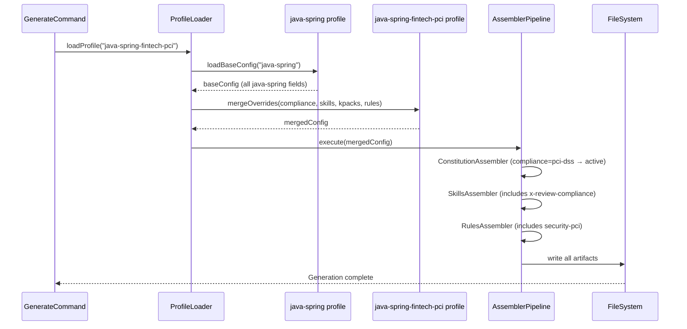

# Historia: Profile java-spring-fintech-pci base

**ID:** story-0016-0010
**Chave Jira:** —
**Status:** Concluída

## 1. Dependencias

| Blocked By | Blocks |
| :--- | :--- |
| story-0016-0002 | story-0016-0011, story-0016-0012, story-0016-0015 |

## 2. Regras Transversais Aplicaveis

| ID | Titulo |
| :--- | :--- |
| RULE-001 | Golden file obrigatorio |
| RULE-002 | Registro de profile em integration tests |
| RULE-003 | Non-regression de profiles existentes |
| RULE-005 | Backward compatibility no config YAML |
| RULE-007 | Compliance no frontmatter |

## 3. Descricao

Como **tech lead de projeto fintech**, eu quero um stack profile `java-spring-fintech-pci` que gere um ambiente completo com governance PCI-DSS pre-configurada, para que meu time inicie o desenvolvimento com todas as guardrails de compliance ativas desde o dia zero.

### Contexto

O ia-dev-environment possui 10 stack profiles. Esta story adiciona o 11o: `java-spring-fintech-pci`, que herda toda a configuracao do `java-spring` e adiciona artefatos de compliance. O profile deve ativar CONSTITUTION.md (via campo `compliance: pci-dss`), ativar skills de compliance, e referenciar knowledge packs PCI-DSS nos agents.

### 3.1 Arquivo de profile YAML

Criar `src/main/resources/config-templates/setup-config.java-spring-fintech-pci.yaml`:
- Herdar todos os campos de `setup-config.java-spring.yaml`
- Adicionar `compliance: pci-dss`
- Adicionar `conditional_skills` incluindo `x-review-compliance` e `x-review-security`
- Adicionar `knowledge_packs` incluindo `pci-dss-requirements`
- Adicionar `additional_rules` incluindo `security-pci`

### 3.2 Heranca de profile

O mecanismo de heranca deve:
- Reusar 100% dos artefatos do java-spring (regras, skills, agents, hooks, settings)
- Adicionar artefatos extras sem modificar os herdados
- CONSTITUTION.md gerado automaticamente (compliance: pci-dss ativa o ConstitutionAssembler)

### 3.3 Skills adicionais ativadas

O profile deve ativar por default (alem das skills do java-spring):
- `x-review-compliance` — checklist PCI-DSS para code review
- `x-review-security` — verificacao de seguranca PCI-especifica

### 3.4 Output esperado

Ao executar `ia-dev-env generate --stack java-spring-fintech-pci`, o output deve conter:
- Todos os artefatos do java-spring (identicos)
- `CONSTITUTION.md` na raiz (PCI-DSS pre-populado)
- `.claude/skills/x-review-compliance/SKILL.md`
- `.claude/skills/knowledge-packs/pci-dss-requirements/SKILL.md`
- `.claude/rules/security-pci.md`

## 3.5 Entrega de Valor

- **Valor Principal:** Projetos fintech Java Spring recebem ambiente pre-configurado com governance PCI-DSS desde o dia zero
- **Metrica de Sucesso:** Profile gera superset completo do java-spring com zero artefatos faltantes; CONSTITUTION.md pre-populado com conteudo PCI-DSS
- **Impacto no Negocio:** Reduz tempo de setup de compliance de semanas para minutos; desbloqueia knowledge pack (0011) e review skill (0012)

## 4. Definicoes de Qualidade Locais

### DoR Local

- [ ] story-0016-0002 concluida (ConstitutionAssembler funcional)
- [ ] Profile java-spring YAML lido e compreendido
- [ ] Mecanismo de heranca/extends de profiles documentado

### DoD Local

- [ ] Arquivo setup-config.java-spring-fintech-pci.yaml criado
- [ ] Todos os artefatos do java-spring gerados identicamente
- [ ] CONSTITUTION.md gerado com conteudo PCI-DSS
- [ ] Skills x-review-compliance e x-review-security listadas como ativas
- [ ] Knowledge pack pci-dss-requirements referenciado nos agents
- [ ] Nenhum dos 10 profiles existentes afetado
- [ ] Test plan gerado via `/x-test-plan` antes do inicio da implementacao
- [ ] Todo @GK-N da secao 7 mapeado para >= 1 AT-N na secao 8
- [ ] Cenarios Gherkin ordenados por TPP (degenerate -> happy -> error -> boundary)
- [ ] Todo AT-N com status GREEN antes de marcar DoD como concluido
- [ ] Commits seguem padrao test-first (teste precede ou acompanha implementacao no git log)

### Global DoD

- **Cobertura:** >= 95% Line, >= 90% Branch
- **Testes Automatizados:** Integration tests para geracao completa do profile
- **TDD Compliance:** Commits test-first, refactoring explicito
- **Backward Compatibility:** 10 profiles existentes inalterados
- **Double-Loop TDD:** Acceptance tests derivados dos cenarios Gherkin (outer loop), unit tests guiados por TPP (inner loop)
- **Rastreabilidade:** Todo @GK-N mapeia para >= 1 AT-N, todo AT-N referencia um @GK-N valido

## 5. Contratos de Dados

**setup-config.java-spring-fintech-pci.yaml (campos adicionais ao java-spring)**

| Campo | Tipo | Obrigatorio | Descricao |
| :--- | :--- | :--- | :--- |
| `compliance` | String | M | Valor: `pci-dss` |
| `conditional_skills` | List&lt;String&gt; | M | Inclui: `x-review-compliance`, `x-review-security` |
| `knowledge_packs` | List&lt;String&gt; | M | Inclui: `pci-dss-requirements` |
| `additional_rules` | List&lt;String&gt; | M | Inclui: `security-pci` |

## 6. Diagramas

### 6.1 Relacao de heranca entre profiles

## 7. Criterios de Aceite (Gherkin)

@GK-1
Cenario: Profile inexistente gera erro claro
  DADO o comando `ia-dev-env generate --stack non-existent-profile`
  QUANDO a geracao e executada
  ENTAO um erro e exibido: "Profile 'non-existent-profile' not found"
  E nenhum arquivo e gerado

@GK-2
Cenario: Profile fintech-pci gera superset do java-spring
  DADO o comando `ia-dev-env generate --stack java-spring-fintech-pci`
  QUANDO a geracao e concluida
  ENTAO todos os artefatos gerados pelo profile java-spring estao presentes
  E CONSTITUTION.md esta presente na raiz do output
  E `.claude/skills/x-review-compliance/SKILL.md` esta presente
  E `.claude/rules/security-pci.md` esta presente

@GK-3
Cenario: CONSTITUTION.md gerado tem conteudo PCI-DSS pre-populado
  DADO o profile java-spring-fintech-pci gerado
  QUANDO o CONSTITUTION.md e inspecionado
  ENTAO contem secao "## Invariants" com regra sobre PAN em logs
  E contem secao "## Security Constraints" com CWE-89 e CWE-312
  E contem secao "## Compliance Requirements" com referencia PCI-DSS

@GK-4
Cenario: Knowledge pack pci-dss-requirements referenciado nos agents
  DADO o profile java-spring-fintech-pci gerado
  QUANDO os agents gerados sao inspecionados
  ENTAO pelo menos um agent referencia `pci-dss-requirements` como knowledge pack

@GK-5
Cenario: Profiles existentes nao sao afetados
  DADO o profile java-spring-fintech-pci registrado
  QUANDO `ia-dev-env generate --stack java-spring` e executado
  ENTAO o output e identico ao anterior (sem CONSTITUTION.md, sem skills PCI)
  E nenhum dos 10 golden files existentes e alterado

## 8. Sub-tarefas

### Ciclos TDD

> Sub-tarefas TDD serao populadas apos geracao do test plan via `/x-test-plan`.
> Cada AT-N e UT-N do test plan gerara entradas [TDD] com ciclos RED/GREEN/REFACTOR.

### Tarefas nao-TDD

- [ ] [Doc] Adicionar profile java-spring-fintech-pci ao README de profiles
- [ ] [Doc] Documentar relacao de heranca com java-spring
