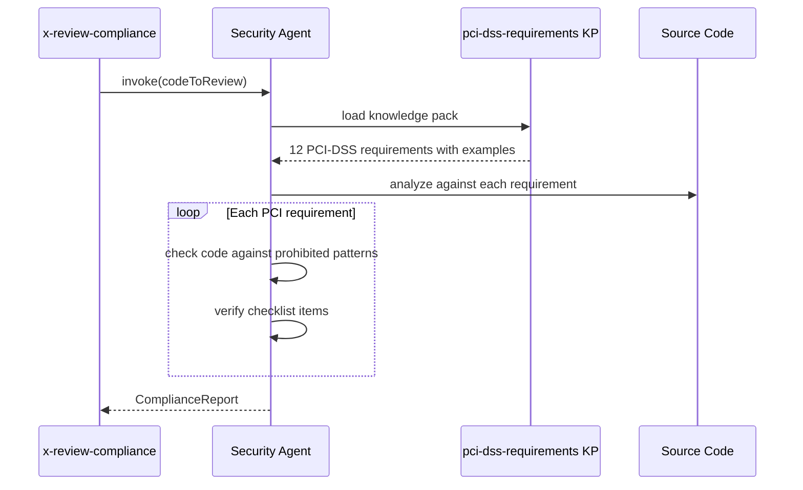

# Historia: Knowledge pack PCI-DSS com 12 requisitos

**ID:** story-0016-0011
**Chave Jira:** —
**Status:** Pendente

## 1. Dependencias

| Blocked By | Blocks |
| :--- | :--- |
| story-0016-0010 | story-0016-0015 |

## 2. Regras Transversais Aplicaveis

| ID | Titulo |
| :--- | :--- |
| RULE-004 | Estrutura padrao de skills |
| RULE-007 | Compliance no frontmatter |
| RULE-010 | Constitution concreta |
| RULE-001 | Golden file obrigatorio |

## 3. Descricao

Como **agente de code review (AI)**, eu quero ter acesso a um knowledge pack com os 12 requisitos PCI-DSS v4.0 mapeados para praticas de codigo Java, para que minhas revisoes identifiquem violacoes de compliance com exemplos concretos.

### Contexto

Knowledge packs sao artefatos internos (user-invocable: false) que agentes de IA carregam como contexto durante operacoes. O knowledge pack `pci-dss-requirements` sera um template Pebble que gera conteudo contextualizado para Java Spring, contendo os 12 requisitos PCI-DSS com exemplos de codigo correto/incorreto e checklists de code review.

### 3.1 Estrutura do knowledge pack

Template em `src/main/resources/skills-templates/knowledge-packs/pci-dss-requirements/SKILL.md.peb`:

```markdown
---
name: pci-dss-requirements
description: PCI-DSS v4.0 requirements mapped to Java code practices
version: 1.0
user-invocable: false
---

## PCI-DSS v4.0 — Requirement N: Title

### O que o requisito exige
[Descricao do requisito em 2-3 sentencas]

### Verificacao em codigo Java
❌ PROIBIDO:
[Exemplo de codigo Java que viola o requisito]

✅ CORRETO:
[Exemplo de codigo Java que atende o requisito]

### O que o code reviewer deve checar
- [ ] Checklist item 1
- [ ] Checklist item 2
```

### 3.2 Requisitos PCI-DSS v4.0 a mapear

Os 12 requisitos principais:
1. Install and Maintain Network Security Controls
2. Apply Secure Configurations to All System Components
3. Protect Stored Account Data
4. Protect Cardholder Data with Strong Cryptography During Transmission
5. Protect All Systems and Networks from Malicious Software
6. Develop and Maintain Secure Systems and Software
7. Restrict Access to System Components and Cardholder Data by Business Need to Know
8. Identify Users and Authenticate Access to System Components
9. Restrict Physical Access to Cardholder Data
10. Log and Monitor All Access to System Components and Cardholder Data
11. Test Security of Systems and Networks Regularly
12. Support Information Security with Organizational Policies and Procedures

Requisitos 9 e 12 sao organizacionais (nao mapeiam diretamente para codigo) — incluir nota explicativa.

### 3.3 Exemplos obrigatorios

Cada requisito mapeavel para codigo DEVE conter:
- Pelo menos 1 exemplo de codigo Java PROIBIDO
- Pelo menos 1 exemplo de codigo Java CORRETO
- Checklist com minimo 2 items verificaveis em code review

## 3.5 Entrega de Valor

- **Valor Principal:** Agentes de IA tem acesso a referencia PCI-DSS contextualizada com exemplos Java, melhorando qualidade de code review automatico
- **Metrica de Sucesso:** 12 requisitos PCI-DSS mapeados; cada requisito com exemplo de codigo correto/incorreto; checklists verificaveis
- **Impacto no Negocio:** Code reviews automaticos detectam violacoes PCI-DSS que revisores humanos podem perder; reduz risco de nao-conformidade

## 4. Definicoes de Qualidade Locais

### DoR Local

- [ ] story-0016-0010 concluida (profile base funcional)
- [ ] PCI-DSS v4.0 requisitos documentados e revisados
- [ ] Exemplos de codigo Java para cada requisito preparados

### DoD Local

- [ ] Template pci-dss-requirements/SKILL.md.peb criado
- [ ] 12 requisitos PCI-DSS mapeados
- [ ] Cada requisito tem >= 1 exemplo de codigo correto e incorreto
- [ ] Cada requisito tem >= 2 items de checklist verificaveis
- [ ] Requisitos 9 e 12 tem nota explicativa sobre escopo organizacional
- [ ] Golden file do knowledge pack criado e validado
- [ ] Test plan gerado via `/x-test-plan` antes do inicio da implementacao
- [ ] Todo @GK-N da secao 7 mapeado para >= 1 AT-N na secao 8
- [ ] Cenarios Gherkin ordenados por TPP (degenerate -> happy -> error -> boundary)
- [ ] Todo AT-N com status GREEN antes de marcar DoD como concluido
- [ ] Commits seguem padrao test-first (teste precede ou acompanha implementacao no git log)

### Global DoD

- **Cobertura:** >= 95% Line, >= 90% Branch
- **Testes Automatizados:** Integration tests para rendering do template; content validation tests
- **TDD Compliance:** Commits test-first, refactoring explicito
- **Backward Compatibility:** Nenhum knowledge pack existente alterado
- **Double-Loop TDD:** Acceptance tests derivados dos cenarios Gherkin (outer loop), unit tests guiados por TPP (inner loop)
- **Rastreabilidade:** Todo @GK-N mapeia para >= 1 AT-N, todo AT-N referencia um @GK-N valido

## 5. Contratos de Dados

**PCI-DSS Knowledge Pack (output renderizado)**

| Campo | Tipo | Obrigatorio | Descricao |
| :--- | :--- | :--- | :--- |
| `name` | String | M | "pci-dss-requirements" |
| `user-invocable` | boolean | M | false |
| `requirements` | 12 secoes | M | Uma secao por requisito PCI-DSS |
| `requirement.description` | String | M | Descricao do requisito (2-3 sentencas) |
| `requirement.prohibitedExample` | String | M | Exemplo de codigo Java proibido |
| `requirement.correctExample` | String | M | Exemplo de codigo Java correto |
| `requirement.checklist` | List&lt;String&gt; | M | Minimo 2 items verificaveis |

## 6. Diagramas

### 6.1 Fluxo de carregamento do knowledge pack por agente



## 7. Criterios de Aceite (Gherkin)

@GK-1
Cenario: Knowledge pack renderizado sem variaveis de template residuais
  DADO o template pci-dss-requirements/SKILL.md.peb
  QUANDO renderizado com context do profile java-spring-fintech-pci
  ENTAO o output NAO contem `{{` ou `}}` ou `{%` (nenhuma variavel Pebble residual)

@GK-2
Cenario: Todos os 12 requisitos PCI-DSS presentes
  DADO o knowledge pack pci-dss-requirements renderizado
  QUANDO o conteudo e analisado
  ENTAO contem 12 secoes "## PCI-DSS v4.0 — Requirement N:"
  E cada secao N corresponde a um requisito de 1 a 12

@GK-3
Cenario: Cada requisito tem exemplo de codigo correto e incorreto
  DADO o knowledge pack pci-dss-requirements renderizado
  QUANDO o requisito 3 (Protect Stored Account Data) e inspecionado
  ENTAO contem bloco "❌ PROIBIDO:" com codigo Java mostrando cleartext storage
  E contem bloco "✅ CORRETO:" com codigo Java usando criptografia

@GK-4
Cenario: Cada requisito tem checklist de code review
  DADO o knowledge pack pci-dss-requirements renderizado
  QUANDO qualquer requisito mapeavel (1-8, 10-11) e inspecionado
  ENTAO contem secao "### O que o code reviewer deve checar"
  E contem pelo menos 2 items `- [ ]` verificaveis

@GK-5
Cenario: Requisitos organizacionais tem nota explicativa
  DADO o knowledge pack pci-dss-requirements renderizado
  QUANDO o requisito 9 (Physical Access) e inspecionado
  ENTAO contem nota: "Este requisito e organizacional e nao mapeia diretamente para codigo"
  E NAO contem exemplos de codigo

## 8. Sub-tarefas

### Ciclos TDD

> Sub-tarefas TDD serao populadas apos geracao do test plan via `/x-test-plan`.
> Cada AT-N e UT-N do test plan gerara entradas [TDD] com ciclos RED/GREEN/REFACTOR.

### Tarefas nao-TDD

- [ ] [Doc] Documentar mapeamento PCI-DSS para codigo Java
- [ ] [Doc] Referenciar knowledge pack no README de skills
