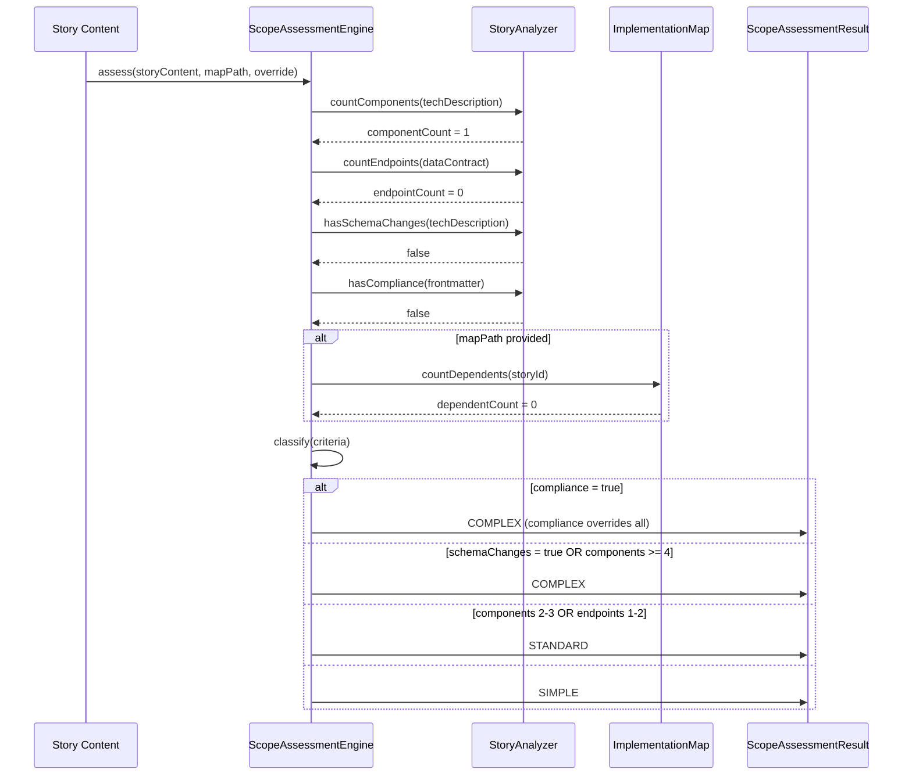

# Historia: Motor de classificacao do Scope Assessment

**ID:** story-0016-0013
**Chave Jira:** —
**Status:** Concluída

## 1. Dependencias

| Blocked By | Blocks |
| :--- | :--- |
| story-0016-0005, story-0016-0007 | story-0016-0014 |

## 2. Regras Transversais Aplicaveis

| ID | Titulo |
| :--- | :--- |
| RULE-004 | Estrutura padrao de skills |
| RULE-009 | Outputs acionaveis |
| RULE-008 | Cobertura minima JaCoCo |

## 3. Descricao

Como **desenvolvedor usando x-dev-lifecycle**, eu quero que a complexidade da minha story seja avaliada automaticamente antes de iniciar o lifecycle, para que stories simples nao executem fases desnecessarias e stories complexas recebam rigor adicional.

### Contexto

O Scope Assessment e um motor de classificacao que analisa a story e categoriza em 3 tiers: SIMPLE, STANDARD, COMPLEX. A classificacao determina quais fases do x-dev-lifecycle serao executadas. Esta story implementa o motor de classificacao isoladamente; a integracao no x-dev-lifecycle e a story-0016-0014.

### 3.1 Criterios de classificacao

O motor analisa:
1. **Componentes afetados**: contados via mentions na tech description (classes, arquivos)
2. **Novos endpoints**: declarados no data contract (POST, GET, PUT, DELETE + path)
3. **Schema changes**: presenca de migration scripts mencionados na story
4. **Dependentes**: numero de stories que dependem desta (do IMPLEMENTATION-MAP)
5. **Compliance**: presenca de `compliance: pci-dss` no frontmatter da story

### 3.2 Tiers

| Tier | Criterio | Comportamento |
|------|----------|--------------|
| SIMPLE | 1 componente, 0 novos endpoints, 0 schema changes, sem compliance | Pula fases de parallel planning (1B, 1C, 1D, 1E) |
| STANDARD | 2-3 componentes OU 1-2 novos endpoints | Executa todas as fases normalmente |
| COMPLEX | 4+ componentes OU schema changes OU compliance requirement | Adiciona fase de stakeholder review apos fase 4 |

### 3.3 Regras de elevacao

- Compliance **sempre** eleva para COMPLEX, independente de outros criterios
- Schema changes **sempre** elevam para pelo menos STANDARD
- Um unico criterio COMPLEX e suficiente para classificar como COMPLEX
- Criterios STANDARD sao aditivos: 2 criterios STANDARD = STANDARD (nao eleva para COMPLEX)

### 3.4 Output do assessment

```
⚡ Scope Assessment: SIMPLE
→ Skipping parallel planning phases (1B-1E)
→ Running: Prepare → Architecture Plan → TDD → Docs → PR
→ Rationale: single component change, no new endpoints, no schema migration
→ Override with --full-lifecycle if needed
```

Para COMPLEX:
```
🔍 Scope Assessment: COMPLEX
→ All phases active + stakeholder review added after phase 4
→ Rationale: compliance requirement detected (pci-dss), 5 components affected
→ Stakeholder review will pause execution for approval before PR creation
```

## 3.5 Entrega de Valor

- **Valor Principal:** Stories simples completam o lifecycle em menos tempo, sem overhead de fases desnecessarias
- **Metrica de Sucesso:** Classificacao correta em >= 95% dos casos; nenhum false negative para COMPLEX (compliance/schema changes nunca classificados como SIMPLE)
- **Impacto no Negocio:** Reduz tempo de lifecycle para stories triviais de ~30 min para ~10 min; garante rigor para stories criticas

## 4. Definicoes de Qualidade Locais

### DoR Local

- [ ] story-0016-0005 concluida (drift check inline funcional)
- [ ] story-0016-0007 concluida (quality gate integrado)
- [ ] Fases do x-dev-lifecycle documentadas (1A-1E, 2, 3, 4, 5, 6)
- [ ] Criterios de classificacao revisados e aprovados

### DoD Local

- [ ] Motor de classificacao implementado com 5 criterios
- [ ] Tier SIMPLE: 1 componente, 0 endpoints, 0 schema, sem compliance
- [ ] Tier STANDARD: 2-3 componentes OU 1-2 endpoints
- [ ] Tier COMPLEX: 4+ componentes OU schema OU compliance
- [ ] Compliance sempre eleva para COMPLEX
- [ ] Output inclui rationale da classificacao
- [ ] Test plan gerado via `/x-test-plan` antes do inicio da implementacao
- [ ] Todo @GK-N da secao 7 mapeado para >= 1 AT-N na secao 8
- [ ] Cenarios Gherkin ordenados por TPP (degenerate -> happy -> error -> boundary)
- [ ] Todo AT-N com status GREEN antes de marcar DoD como concluido
- [ ] Commits seguem padrao test-first (teste precede ou acompanha implementacao no git log)

### Global DoD

- **Cobertura:** >= 95% Line, >= 90% Branch
- **Testes Automatizados:** Parameterized tests para combinacoes de criterios
- **TDD Compliance:** Commits test-first, refactoring explicito
- **Backward Compatibility:** Motor isolado, nenhuma funcionalidade existente alterada
- **Double-Loop TDD:** Acceptance tests derivados dos cenarios Gherkin (outer loop), unit tests guiados por TPP (inner loop)
- **Rastreabilidade:** Todo @GK-N mapeia para >= 1 AT-N, todo AT-N referencia um @GK-N valido

## 5. Contratos de Dados

**ScopeAssessmentInput**

| Campo | Tipo | Obrigatorio | Descricao |
| :--- | :--- | :--- | :--- |
| `storyContent` | String | M | Conteudo markdown da story |
| `implementationMapPath` | Path | N | Caminho para IMPLEMENTATION-MAP.md (para contar dependentes) |
| `fullLifecycleOverride` | boolean | M | Se --full-lifecycle foi passado (default: false) |

**ScopeAssessmentResult**

| Campo | Tipo | Obrigatorio | Descricao |
| :--- | :--- | :--- | :--- |
| `tier` | enum(SIMPLE, STANDARD, COMPLEX) | M | Classificacao da story |
| `componentCount` | int | M | Numero de componentes afetados |
| `newEndpointCount` | int | M | Numero de novos endpoints |
| `hasSchemaChanges` | boolean | M | Se menciona migration scripts |
| `hasCompliance` | boolean | M | Se tem compliance != "none" |
| `dependentCount` | int | M | Numero de stories que dependem desta |
| `rationale` | String | M | Justificativa textual da classificacao |
| `phasesToSkip` | List&lt;String&gt; | M | Fases a serem puladas (vazio para STANDARD/COMPLEX) |
| `additionalPhases` | List&lt;String&gt; | M | Fases extras (ex: "stakeholder-review" para COMPLEX) |

## 6. Diagramas

### 6.1 Fluxo de classificacao do Scope Assessment



## 7. Criterios de Aceite (Gherkin)

@GK-1
Cenario: Story vazia sem tech description classifica como SIMPLE
  DADO uma story com tech description vazia
  E sem data contract
  E sem compliance
  QUANDO o ScopeAssessmentEngine avalia a story
  ENTAO o tier e SIMPLE
  E rationale contem "no components detected"

@GK-2
Cenario: Story com 1 componente e 0 endpoints classifica como SIMPLE
  DADO uma story referenciando 1 arquivo Java na tech description
  E sem novos endpoints no data contract
  E sem migration scripts
  E sem compliance
  QUANDO o ScopeAssessmentEngine avalia a story
  ENTAO o tier e SIMPLE
  E phasesToSkip contem ["1B", "1C", "1D", "1E"]
  E rationale contem "single component change, no new endpoints"

@GK-3
Cenario: Story com 3 componentes classifica como STANDARD
  DADO uma story referenciando 3 arquivos Java (Controller, Service, Repository)
  E 1 novo endpoint POST /payments
  QUANDO o ScopeAssessmentEngine avalia
  ENTAO o tier e STANDARD
  E phasesToSkip esta vazio
  E additionalPhases esta vazio

@GK-4
Cenario: Compliance sempre eleva para COMPLEX
  DADO uma story com 1 componente afetado
  E sem novos endpoints
  E frontmatter com compliance: pci-dss
  QUANDO o ScopeAssessmentEngine avalia
  ENTAO o tier e COMPLEX
  E rationale contem "compliance requirement detected"
  E additionalPhases contem "stakeholder-review"

@GK-5
Cenario: Schema changes elevam para COMPLEX
  DADO uma story com 2 componentes
  E tech description mencionando "migration script" ou "ALTER TABLE"
  QUANDO o ScopeAssessmentEngine avalia
  ENTAO o tier e COMPLEX
  E rationale contem "schema changes detected"

@GK-6
Cenario: 4+ componentes elevam para COMPLEX
  DADO uma story referenciando 5 arquivos Java
  E sem compliance
  E sem schema changes
  QUANDO o ScopeAssessmentEngine avalia
  ENTAO o tier e COMPLEX
  E rationale contem "5 components affected"

## 8. Sub-tarefas

### Ciclos TDD

> Sub-tarefas TDD serao populadas apos geracao do test plan via `/x-test-plan`.
> Cada AT-N e UT-N do test plan gerara entradas [TDD] com ciclos RED/GREEN/REFACTOR.

### Tarefas nao-TDD

- [ ] [Doc] Documentar criterios de classificacao e tiers
- [ ] [Doc] Documentar formato de output do assessment
