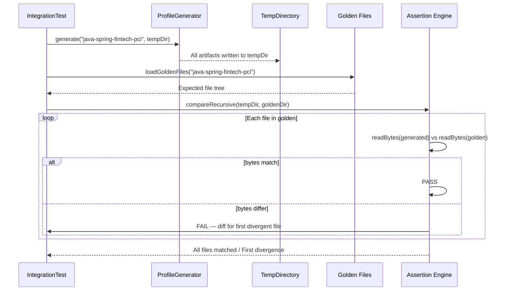

# Historia: Golden files e testes de integracao do profile fintech-pci

**ID:** story-0016-0015
**Chave Jira:** —
**Status:** Pendente

## 1. Dependencias

| Blocked By | Blocks |
| :--- | :--- |
| story-0016-0011, story-0016-0012 | -- |

## 2. Regras Transversais Aplicaveis

| ID | Titulo |
| :--- | :--- |
| RULE-001 | Golden file obrigatorio |
| RULE-002 | Registro de profile em integration tests |
| RULE-003 | Non-regression de profiles existentes |
| RULE-008 | Cobertura minima JaCoCo |

## 3. Descricao

Como **engenheiro de qualidade**, eu quero que o profile `java-spring-fintech-pci` tenha golden files completos e testes de integracao byte-a-byte, para que qualquer regressao nos artefatos gerados seja detectada automaticamente no build.

### Contexto

Cada profile do ia-dev-environment possui golden files em `src/test/resources/golden/{profile-name}/` que sao comparados byte-a-byte com o output gerado. Esta story cria o golden file set completo para o profile fintech-pci e registra os testes de integracao. E a story final do track de compliance, validando que todos os artefatos PCI-DSS sao gerados corretamente.

### 3.1 Golden file set

Gerar e registrar golden files para todos os artefatos do profile fintech-pci:
- Todos os artefatos herdados do java-spring (devem ser identicos)
- `CONSTITUTION.md` (conteudo PCI-DSS)
- `.claude/skills/x-review-compliance/SKILL.md`
- `.claude/skills/knowledge-packs/pci-dss-requirements/SKILL.md`
- `.claude/rules/security-pci.md`

### 3.2 Integration tests

Adicionar ao test suite:
- Teste de geracao completa do profile fintech-pci
- Comparacao byte-a-byte de cada artefato com golden file
- Non-regression: executar geracao dos 10 profiles existentes e verificar que nenhum golden file existente e afetado

### 3.3 Test infra

O teste deve usar o mesmo padrao dos testes de profile existentes:
- Gerar output em diretorio temporario
- Comparar recursivamente com golden files
- Reportar primeiro arquivo divergente com diff de conteudo

## 3.5 Entrega de Valor

- **Valor Principal:** Profile fintech-pci validado byte-a-byte garante que releases nao introduzem regressoes nos artefatos gerados
- **Metrica de Sucesso:** Golden files cobrem 100% dos artefatos do profile; `mvn verify` detecta qualquer divergencia
- **Impacto no Negocio:** Confianca na integridade dos artefatos de compliance em cada release; non-regression para todos os 11 profiles

## 4. Definicoes de Qualidade Locais

### DoR Local

- [ ] story-0016-0010 concluida (profile base funcional)
- [ ] story-0016-0011 concluida (knowledge pack PCI-DSS)
- [ ] story-0016-0012 concluida (skill x-review-compliance e regras)
- [ ] Padrao de golden file tests existente documentado e compreendido

### DoD Local

- [ ] Golden files gerados e commitados em src/test/resources/golden/java-spring-fintech-pci/
- [ ] Integration test de geracao completa do profile implementado
- [ ] Comparacao byte-a-byte implementada para todos os artefatos
- [ ] Non-regression: 10 profiles existentes passam sem alteracao
- [ ] `mvn verify` inclui o novo profile na suite de testes
- [ ] Test plan gerado via `/x-test-plan` antes do inicio da implementacao
- [ ] Todo @GK-N da secao 7 mapeado para >= 1 AT-N na secao 8
- [ ] Cenarios Gherkin ordenados por TPP (degenerate -> happy -> error -> boundary)
- [ ] Todo AT-N com status GREEN antes de marcar DoD como concluido
- [ ] Commits seguem padrao test-first (teste precede ou acompanha implementacao no git log)

### Global DoD

- **Cobertura:** >= 95% Line, >= 90% Branch
- **Testes Automatizados:** Integration tests byte-a-byte para fintech-pci + non-regression para 10 profiles
- **TDD Compliance:** Commits test-first, refactoring explicito
- **Backward Compatibility:** Golden files existentes inalterados
- **Double-Loop TDD:** Acceptance tests derivados dos cenarios Gherkin (outer loop), unit tests guiados por TPP (inner loop)
- **Rastreabilidade:** Todo @GK-N mapeia para >= 1 AT-N, todo AT-N referencia um @GK-N valido

## 5. Contratos de Dados

**Golden File Set (profile fintech-pci)**

| Artefato | Caminho | Descricao |
| :--- | :--- | :--- |
| `CONSTITUTION.md` | `golden/java-spring-fintech-pci/CONSTITUTION.md` | Constitution PCI-DSS pre-populada |
| `x-review-compliance` | `golden/java-spring-fintech-pci/.claude/skills/x-review-compliance/SKILL.md` | Checklist PCI-DSS |
| `pci-dss-requirements` | `golden/java-spring-fintech-pci/.claude/skills/knowledge-packs/pci-dss-requirements/SKILL.md` | Knowledge pack |
| `security-pci.md` | `golden/java-spring-fintech-pci/.claude/rules/security-pci.md` | Regras PCI |
| `(all java-spring files)` | `golden/java-spring-fintech-pci/...` | Artefatos herdados do java-spring |

**TestResult**

| Campo | Tipo | Obrigatorio | Descricao |
| :--- | :--- | :--- | :--- |
| `profileName` | String | M | Nome do profile testado |
| `totalFiles` | int | M | Total de arquivos comparados |
| `matchedFiles` | int | M | Arquivos identicos ao golden file |
| `divergentFiles` | List&lt;String&gt; | M | Arquivos com diferenca (vazio se todos match) |
| `firstDivergence` | String | N | Diff do primeiro arquivo divergente |

## 6. Diagramas

### 6.1 Fluxo de validacao de golden files

## 7. Criterios de Aceite (Gherkin)

@GK-1
Cenario: Profile sem golden file registrado falha no build
  DADO um profile registrado em integration tests sem golden files
  QUANDO `mvn verify` e executado
  ENTAO o build falha com mensagem indicando golden files ausentes

@GK-2
Cenario: Golden file do fintech-pci valida paridade byte-a-byte
  DADO o profile java-spring-fintech-pci com golden files registrados
  QUANDO `mvn verify` e executado
  ENTAO o golden file do profile passa na comparacao byte-a-byte
  E o teste reporta total de arquivos comparados

@GK-3
Cenario: Artefatos PCI-DSS estao presentes no golden file set
  DADO o golden file set do profile fintech-pci
  QUANDO os arquivos sao listados
  ENTAO CONSTITUTION.md esta presente
  E x-review-compliance/SKILL.md esta presente
  E pci-dss-requirements/SKILL.md esta presente
  E security-pci.md esta presente

@GK-4
Cenario: Non-regression dos 10 profiles existentes
  DADO o profile java-spring-fintech-pci adicionado
  QUANDO `mvn verify` e executado
  ENTAO os golden files dos 10 profiles existentes passam sem alteracao
  E nenhum artefato existente e modificado

@GK-5
Cenario: Alteracao em template PCI-DSS detectada como falha
  DADO uma alteracao no template CONSTITUTION.md.peb
  QUANDO `mvn verify` e executado
  ENTAO o golden file de CONSTITUTION.md falha na comparacao
  E o diff mostra a alteracao especifica

## 8. Sub-tarefas

### Ciclos TDD

> Sub-tarefas TDD serao populadas apos geracao do test plan via `/x-test-plan`.
> Cada AT-N e UT-N do test plan gerara entradas [TDD] com ciclos RED/GREEN/REFACTOR.

### Tarefas nao-TDD

- [ ] [Doc] Documentar processo de atualizacao de golden files quando templates mudam
- [ ] [Doc] Adicionar fintech-pci a lista de profiles na documentacao
