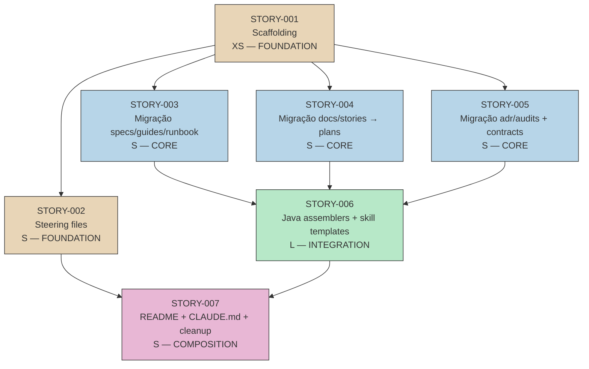

# IMPLEMENTATION MAP — EPIC-0018

---

## 1. DEPENDENCY MATRIX

| Story ID | Blocked By | Blocks | Status |
|---|---|---|---|
| STORY-0018-001 | -- | 002, 003, 004, 005 | Concluída |
| STORY-0018-002 | 001 | 007 | Concluída |
| STORY-0018-003 | 001 | 006 | Concluída |
| STORY-0018-004 | 001 | 006 | Concluída |
| STORY-0018-005 | 001 | 006 | Concluída |
| STORY-0018-006 | 003, 004, 005 | 007 | Concluída |
| STORY-0018-007 | 002, 006 | -- | Concluída |

---

## 2. EXECUTION PHASES

```
PHASE 1 — Sequential (Foundation obrigatória)
└── STORY-0018-001: Scaffolding de diretórios           [XS]

PHASE 2 — Parallel (todas desbloqueadas após 001)
├── STORY-0018-002: Steering files + docs/architecture/  [S]
├── STORY-0018-003: Migração specs, guides, runbook       [S]
├── STORY-0018-004: Migração docs/stories/ -> plans/      [S]
└── STORY-0018-005: Migração adr, audits, contracts       [S]

PHASE 3 — Sequential (aguarda 003, 004, 005)
└── STORY-0018-006: Java assemblers + skill templates    [L]

PHASE 4 — Sequential (aguarda 002, 006)
└── STORY-0018-007: README, CLAUDE.md + cleanup docs/   [S]
```

---

## 3. CRITICAL PATH

```
STORY-0018-001 → STORY-0018-004 → STORY-0018-006 → STORY-0018-007
        XS              S                L                S
```

**Bottleneck primário:** STORY-0018-001 bloqueia tudo — executa primeiro, sem exceção.

**Bottleneck secundário:** STORY-0018-006 (L) é a story mais longa e está no critical path.
Todas as migrações (003, 004, 005) devem estar completas antes de 006 iniciar.

**Paralelismo máximo:** 4 workers simultâneos na Phase 2.

---

## 4. MERMAID DEPENDENCY GRAPH



**Legenda de cores:**
- Bege: FOUNDATION
- Azul: CORE
- Verde: INTEGRATION
- Rosa: COMPOSITION

---

## 5. SIZING SUMMARY

| Fase | Stories | Sizing estimado | Paralelo? |
|---|---|---|---|
| Phase 1 | 1 | XS (~1-2h) | Nao |
| Phase 2 | 4 | XS+S+S+S (~6-10h total, ~3h elapsed com 4 workers) | Sim (4) |
| Phase 3 | 1 | L (~8-16h) | Nao |
| Phase 4 | 1 | S (~2-4h) | Nao |
| **Total** | **7** | **~17-32h total, ~14-25h elapsed** | |

---

## 6. RISK MATRIX

| Risk | Probabilidade | Impacto | Mitigação | Story |
|---|---|---|---|---|
| `mvn verify` quebra após mudanças de path | Media | Alto | Executar baseline antes; testar após cada sub-group de mudanças | 006 |
| Skill templates com paths em contexto diferente (e.g., dentro de code blocks vs. prose) | Media | Medio | Usar search-and-replace criterioso, não cego; revisar cada ocorrência | 006 |
| AssemblerTarget.DOCS precisa de refactor complexo | Baixa | Alto | Avaliar primeiro; se split for necessário, escopo pode crescer | 006 |
| Untracked epics (015-017) perdem conteúdo no move | Baixa | Alto | Usar `mv` (não `git mv`) + `git add` para untracked dirs | 004 |
| docs/ não está vazio quando STORY-007 executa | Baixa | Medio | TASK-001 de 007 verifica antes de deletar; bloqueia se não vazio | 007 |

---

## 7. OBSERVACOES ESTRATEGICAS

1. **STORY-0018-005 (contracts + ADR) não bloqueia 006 diretamente** na maioria dos paths,
   mas a completude das migrações é pré-condição semântica. Se houver urgência, 006 poderia
   iniciar os skill templates enquanto 005 finaliza o scaffolding de contracts/ — mas isso
   não é recomendado.

2. **STORY-0018-006 é a story de maior risco e duração.** Com 61 arquivos e ~265 ocorrências,
   é candidata a decomposição em sub-stories (006a: assemblers Java, 006b: skill templates
   claude, 006c: skill templates github). A decisão de decompor deve ser do agente de
   implementação com base no contexto da sessão.

3. **A ordem dentro da Phase 2 é indiferente** — as 4 stories são independentes entre si
   e não modificam os mesmos arquivos. O agente pode escolher qualquer ordem ou executar
   em paralelo via worktrees.

4. **STORY-0018-002 não bloqueia 006** — os steering files são conteúdo novo, não afetam
   paths no gerador Java. Porém, 002 bloqueia 007 porque o README precisa documentar o
   steering/ com conteúdo real.

5. **Após STORY-0018-006, uma regeneração do CLI** (`ia-dev-env generate`) em projetos
   downstream produzirá skills com os novos paths. Isso está fora do escopo deste épico
   mas deve ser comunicado aos consumidores do CLI.

6. **Smoke tests** (`tests/smoke/`) podem falhar se validam estrutura de diretórios gerada.
   Investigar durante STORY-006 e, se necessário, atualizar assertions. Isso está no
   scope de 006 (testes que referenciam paths de output).
